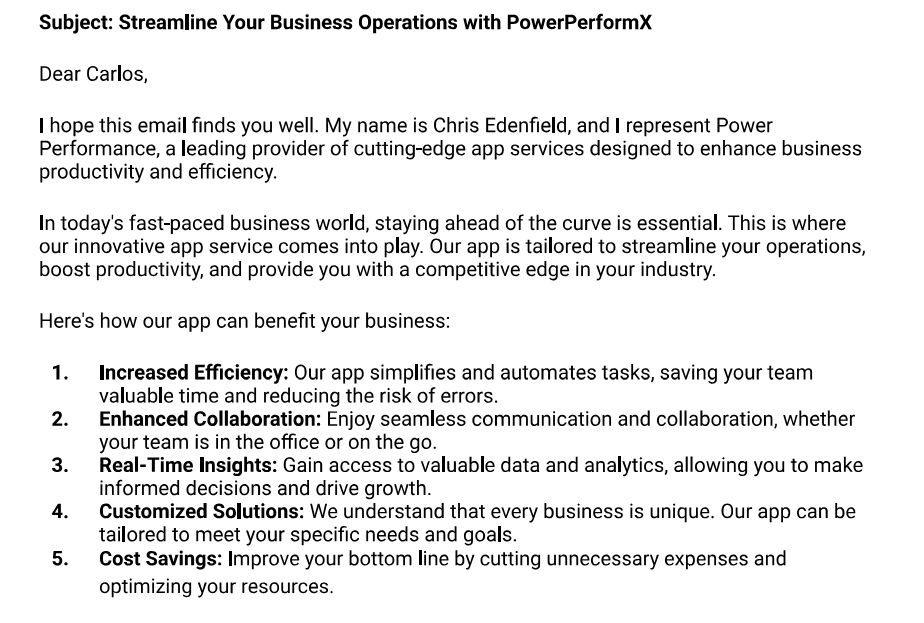

# Curso de Ingles para ventas 

## Clase 1: Vocabulario técnico para ventas de productos y servicios en inglés

DOM= Days On the Market: how many days a. property has been listed on the market

Acre: a unit of measure of land used in the US and UK

Move-in ready - can be immediately occupied, no renovations needed.

As-is: the property is being sold in its current condition - repairs must be made by the buyer.


## Clase 2: Vocabulario común de ventas en inglés

**Vocabulario**
- Service portfolio          🔉 /ˈsɝː.vɪs/ /ˌpɔːrtˈfoʊ.li.oʊ/
- Managed services           🔉 /ˈmæn.ədʒ/ /ˈsɝː.vɪs/
- Service (Level) agreement  🔉 /ˈsɝː.vɪs/ /aˈɡriː.mənt/
- Service level commitment   🔉 /ˈsɝː.vɪs/ /kaˈmɪt.mənt/ -> Compromiso
- Service differentiation    🔉 /ˈsɝː.vɪs/ /ˌdɪf.ə.ren.ʃiˈeɪ.ʃən/ 
- Value-added services       🔉 /ˈvæl.juː ˌæd.ɪd / /ˈsɝː.vɪs/ 
- maintenance                🔉 /ˈmeɪn.tən.əns/
- Capacity                   🔉 /kəˈpæs.ə.t̬i/              
- lease                      🔉 /liːs/ -> Alquiler 
- depreciation               🔉 /dəˌprēSHēˈāSH(ə)n/ 
- resale value               🔉 /ˈriːˌseɪl  ˈvæl.juː/
- Client                     🔉 /ˈklaɪ.ənt/
- lessor                     🔉 /ˈleˌsôr/

## Clase 3:  Dichos y expresiones idiomáticas para ventas en inglés

On the fence: Undecided // I dunno, I'm still on the fence. Can you add anything to the offer to help make up my mind ? => Indeciso 

On the hook: Interested // I've got a client who's on the hook - looks like I might close this deal after all => Interesado 

Ballpark figure: Estimate // You're looking at about 20,000 USD - that's just a ballpark figure,though. If you want an exact number we'd have to look at all of the factors. => Estimación 

Over the moon: Very satisfied // We just close our biggest deal of the year - the boss is going to be over the moon. => Muy Satisfecho 

Hit the (sales) target: Achieve a goal // Last Q was extremely productive. Every member of the sales team hit their sales target and a few even went over it. => Lograr el Ojetivo

Low-hanging fruit: // Low-hanging fruit is gone. All that's left are the tougher prospects. => La fruta madura se acabo 

Barking up the wrong tree // if you are trying to sell me a gas guzzler, you are barking up the wrong tree - I only drive electric vehicles. => Ladrando al arbol equivocado  

get your foot in the door // That first sale I got was small, but it really helped me get my foot in the door => Pon tu pie en la puerta

SME = Small and Medium sized  enterprises 
SMB = Small and Medium sized businesses 
B2C = Business to consumer sales 
B2B = Business

## clase 5: Comisiones y compensación para vendedores en inglés


**Vocabulario**

- Base salary: No adjustments to the base salary are being proposed at the current time. Each salesperson will continue to receive the same base salary as specified in the contract.

- Quarterly bonus: Each quarter the salesperson with the highest gross sales that has also hit his/her target will receive a $500 bonus.

- Sales contest: This contest will reward both individual effort and overall team results and will run for the entire fiscal year. The top prize will be an all-expenses-paid vacation (destination to be determined).

- Other perks: Sales Reps hitting their sales quota for the month will be allowed to choose their work stations; top-sellers will receive a designated parking spot.

- Monetary incentives: a sales contest, a bonus, revenue sharing.
- Non-monetary incentives: a preferred parking spot, choice of work station,
recognition, awards.

- Sales forecast: An estimate of future sales. • Sales growth: The increase in sales (gross, per unit, etc.) over a given period.

- Retraining: Sales reps who fail to meet their sales quota will be required to repeat the company's sales training seminar. Failure to comply with the training may lead to dismissal.

## Clase 6 :Lenguaje técnico para ventas en inglés

```
What does my colleague mean when she says, "I can't even remember the last time I hit a sales target that high."?
What does she mean when she says, "...all of the low-hanging fruit is gone."?
Which phrase do I use to tell my colleague that she should try to do to have the chance to get bigger opportunities in the future?
What do I mean when I tell my colleague, “it might be a good time to polish your pitch..."?
Which phrase does my colleague use to say that she isn't sure whether she likes the new changes or not?
```

## Clase 8: 

**Vocabulario**
-  lead - Dirigir 
-  A prospect
-  A prospective client
-  A potential client 
-  A target - objetivos 
- Touch points
- SQL  =  Sales qualified lead - A potential client who has been properly vetted and who is more likely to commit to a purchase.
- Friendly, professional greeting.
- Introduce yourself - name, position, company.
- State reason for call - be specific.
- Politely request their time.


## Clase 9: Contacta a un cliente por correo electrónico en inglés 

## ejemplo para escribir un correo por internet 

```

Subject: Streamline Your Business Operations with PowerPerformX

**Dear** Carlos,
*I* hope this email finds you well. My name is Chris Edenfield, and I represent Power Performance, a leading provider of cutting-edge app services designed to enhance business productivity and efficiency.
In today's fast-paced business world, staying ahead of the curve is essential. This is where our innovative app service comes into play. Our app is tailored to streamline your operations, boost productivity, and provide you with a competitive edge in your industry.

```
**Here's how our app can benefit your business:**
- Increased Efficiency: Our app simplifies and automates tasks, saving your team valuable time and reducing the risk of errors.

- Enhanced Collaboration: Enjoy seamless communication and collaboration, whether your team is in the office or on the go.

- Real-Time Insights: Gain access to valuable data and analytics, allowing you to make informed decisions and drive growth.

- Customized Solutions: We understand that every business is unique. Our app can be tailored to meet your specific needs and goals.

- Cost Savings: Improve your bottom line by cutting unnecessary expenses and optimizing your resources.




## Clase 10: Comprende y aclara las necesidades de un cliente en inglés

1.- Put another way team work efficiency and communication is needed.
2.- Oh I see clients aren’t happy
3.- Did I get that right? Disruptions are affecting badly.
4.-So what you’re saying is resilience and adaptability needed for the changes.
5.- If I unsderstand you correctly a new software needs to be implemented.

**Tips Evaluation you speech:** 
Modal verbs
- Could... you tell me exactly what the problem is? . 
- Would... you mind telling me what the issue is?
- Can... I ask how long this has been a problem for you?


## Corte 

What is the purpose of a discovery call?
To understand the client's needs, challenges, and problems.
2.
What are touch points?
Interactions with clients or prospects that help develop relationships
3.
What type of questions are useful to initiate a discovery call?
Open-ended questions

## Clase 11 - 12 - 13  Vocabulario para abrir un discurso de ventas en inglés

Elevator pitch
"This is who I am and what I do!"

## Example 

Opening a pitch
Instructions: Read the elevator pitches below and identify which techniques are used in each one. You will find an answer key on the following page, which also includes the answers to the sales pitches you saw in the class.

## Elevator pitch #1
"Hi, I'm Chris, and I'm passionate about helping businesses succeed. With over ten years of experience in crafting solutions for businesses, I've honed my skills to deliver real results. I believe in the power of building lasting relationships and providing customized solutions. My mission is to connect you with the perfect service that allows you to do what you do best. I'd love to have a conversation and see how we can work together to achieve your goals and drive your success. In fact, let me tell you about one of our success stories..."
Techniques used:

## Elevator pitch #2
"Hello, I'm Chris, and I work in cybersecurity. Did you know that cyberattacks have increased by a staggering 600% in the last year alone? It's a harsh reality of the digital age. My mission is to protect businesses like yours from these threats. Let's discuss how we can safeguard your sensitive data and keep your operations running smoothly in this ever-changing landscape."
Techniques used:

## Clase 14: Mas Vocabulario para abrir un discurso de 


1. Refer
2. Apply now/Sign up now / Register now
3. Request
4. schedule a follow-up
5. Subscribe
6. Book or Schedule
7. Register/Sign up
8. sign up now; Don't wait


## Clase 15: Habla de problemas y necesidades de servicios en inglés


1. Work out: Resolver un problema a través del pensamiento o el cálculo. Ejemplo: "I can't work out this math problem."

2. Figure out: Entender o resolver algo. Ejemplo: "I need to figure out how to fix this."

3. Sort out: Resolver un problema o situación. Ejemplo: "We need to sort out our communication issues."

4. Clear up: Resolver un malentendido o una confusión. Ejemplo: "Can you clear up this confusion?"

5. Iron out: Resolver pequeños problemas o detalles en un proyecto o plan. Ejemplo: "We need to iron out the details before we can proceed."

6. Get around: Encontrar una manera de superar o evitar un problema. Ejemplo: "We need to get around this obstacle."

## Clase 16: Habla de características de productos en inglés


**Why Choose PPX?**
- Efficiency and Productivity: Streamline your customer relations tasks and free up time to focus on what you do best.

- Enhanced Customer Experience: Deliver exceptional service by staying connected and responsive to your customers' needs.

- Data-Driven Decision Making: Make informed decisions based on real-time analytics and customer feedback.

- Customization: Tailor PPX to fit your business needs, ensuring it aligns perfectly with your objectives.

- Scalability: Grow your customer base confidently, knowing that PPX will adapt to your business's expansion.

- Join the ranks of businesses that have revolutionized their customer relations with PPX. It's not just an app; it's a strategic tool designed to foster loyalty, drive growth, and ensure your customers keep coming back. Your success begins with PPX. Try it today!

## Clase 18: Frases útiles para negociar en inglés 


**Opening**
- I appreciate the opportunity to work together.
- Thank you for giving me the chance to work with you.
- We're looking to find a win-win situation.
- I'm hopeful that we can reach a deal that both
parties are happy with.

**Avoid Being Pushy**
- How many units are you going to buy?
- You need to act quickly in order to get the best deal!
- You should buy in bulk - you get a better unit price.


**Less Pushy**
- What would you like to include in your first order?
- We can move on this when the time is right for you.
- We offer bulk rates if you'd like a lower unit price.

**Avoid Declarative statements*
**Making concessions ==>> Hacer concesiones**
- What would you need in order to make this work? • We'd be willing to come down a bit on the price if... => ¿Qué necesitarías para que esto funcione? • Estaríamos dispuestos a bajar un poco el precio si...

- We can't move on price but we'd be open to making adjustments on terms. => No podemos cambiar el precio, pero estaríamos abiertos a hacer ajustes en los términos.

- "If you can commit to a longer contract, I will be able to offer you better terms."
- "I would give you an even better deal, if you could commit to a 5-year contract."


**Responding to counteroffers**
- What if we included...
- What would you say if I threw in...

**Declining an offer**
- I'm sorry, we can't go that low.
- I can't offer that price for that quantity, but I can... 
- I'm afraid I can't go any lower on the price.

## Clase 19: Habla de porcentajes, grandes cantidades y divisas en inglés

Unit price
• The price for a single item or unit of the product.
• Paying the unit price will cost you more in the long


Bulk purchase
• Buying a large quantity of a product in one order, usually at a discount.
• You save more money in the long run with bulk purchases.

Wholesale price == Precio al por mayor
• the price offered to retailers or resellers
• A gross == en Bruto 


Key acronym
• MOQ = Minimum Order Quantity
• The minimum quantity a customer must purchase to qualify for a particular price or deal.
• JIT inventory = Just-In-Time inventory 
• A strategy that involves minimal inventory levels, usually requiring precise quantity planning.
• APA = Annual Purchase Agreement
• A contract in which the buyer agrees to purchase a specified quantity of products or services over a year.

- Dollar 🔉 Dau.llar -> EEUU
- Pound  🔉 Pa.und -> Libra -> UK  
- Yen    🔉 I.en   -> Yenes -> Japon  
- Euro   🔉 I.o.ru -> Europa   
- Rupee  🔉 Ru.pi  -> India 
- Ruble  🔉 Ru.bol -> 
- Peso   🔉 Pei.so  -> 
- Yuan/Renminbi -> I.uan / re.men.bi  -> Chinos


## Clase 20 : Habla de tasas, gastos de envío, formas de pago y opciones de financiación en inglés

Invoice terminology
• Seller information 
• Buyer information
• Invoice number 
• Invoice date
• Terms of payment 
• Due date -> Fecha vencimiento  

Invoice
• A document detailing terms and conditions of a sale.

Payment terms
• Cash on delivery (COD)
• Cash in advance (CIA)
• Shipping and handling (S&H)
• Failed to read text from the image, please try again!
• Cash or card

## Clase 21: Da manejo a objeciones en inglés


 


