# Curso Profesional de Scrum
*Profesor:Gerardo Romero*

## Clase 1: ¿Qué son las metodologías ágiles?

> Las metodologías ágiles son una filosofía de trabajo que facilita el proceso de creación y entrega de valor continuo en proyectos de desarrollo de software.

**¿Qué es Agile?**
 - El principio de Agile se basa en la habilidad para crear productos que responden a las necesidades 
 - Se basa resolver problemas específicos de un cliente, tomando en cuenta un escenario particular: 
   si las necesidades o los requerimientos del cliente, el negocio o el mercado cambian, el producto se adapta.

> Es la  capacidad de adaptación al cambio y la entrega de valor constante forman parte de los principios de las metodologías ágiles.

**Marcos de trabajo y metodologías ágiles**
Estos son algunos de los marcos de trabajo ágiles más conocidos:

- Kanban
- XtremeProgramming
- Scrum

**Por su parte, existen metodologías que se adaptan a estos marcos de trabajo agile, pero no son exclusivas del entorno ágil. Algunas de ellas son:**

- Pair to pair programming
- Test Driven Development (TDD)
- Características de las metodologías ágiles

**La metodología agile tiene que ver con una mentalidad acerca del desarrollo de software, la cual está fundamentada en el Manifiesto Ágil (2001):**

- Agile se centra en las personas y en sus interacciones antes que en los procesos y las herramientas.
- La colaboración con el cliente está por encima de acuerdos y negociaciones.
- Lo importante es que el software funcione, más allá de las documentaciones y reportes.
- La capacidad para responder al cambio prima sobre un plan definido y concreto.

**Diferencias entre el desarrollo ágil y el desarrollo tradicional**
> Frente a las prácticas de desarrollo tradicionales, el desarrollo ágil plantea tres enfoques claves:

**Grupos de trabajo**
- Equipos de trabajo pequeños
- Tiempos de iteración cortos (dos semanas)
**Requerimientos**
- Definición de una lista de requerimientos
- División de los requerimientos en listas más pequeñas para trabajar durante cada iteración
- Objetivos de desarrollo claros
**Generación de valor**
- Al trabajar mediante iteraciones cortas es posible hacer entregas paulatinas y constantes, 
por lo cual es más factible realizar ajustes, en caso de que sean necesarios y el cliente percibe 
más fácilmente el valor generado.

**Valores de Scrum**
- Compromiso. Define que el equipo se compromete al 100% en el objetivo. No solo en el proyecto, sino en cada iteración.
- Coraje. No importa la tarea, cualquier integrante del equipo está en capacidad de llevarla a cabo.
- Enfoque. Cada integrante está enfocado en cumplir el objetivo planteado.
- Apertura. Los involucrados en el proyecto están dispuestos a escuchar aportes u observaciones que se realicen durante el proceso.
- Respeto. Todas las personas hacen parte de un mismo equipo. Por ello, el trato y la buena comunicación son importantes.

## El manifiesto Agile:

- El cliente Primero. -> Entrega continua de software.
- Aceptar cambios. -> Dan ventaja competitiva.
- Iteración rápida. -> Entregas cada 2 semanas a 2 meses.
- Trabajo estrecho con los responsables del negocio.
- Individuos motivados. -> Darles entorno y apoyo. Dejar que ejecuten.
- Comunicación cara a cara del equipo. -> más eficiente
- Software funcionando es la medida de progreso
- Desarrollo sostenible. -> Ritmo constante de forma indefinida.
- Atención a la excelencia técnica y buen diseño.
- Simplicidad. -> El arte de maximizar el trabajo no realizado.
- Lo mejor surge de equipos auto-organizados.
- Ajuste y perfección. -> Intervalos regulares sobre como ser más efectivo.

> [manifesto](https://agilemanifesto.org/iso/es/manifesto.html)

**12 principios ágiles**

1. Satisfacción al cliente. La prioridad es satisfacer al cliente mediante la entrega temprana y continua de software con valor.
2. Cambios. Los cambios son bienvenidos en cualquier etapa del proyecto. Los procesos ágiles aprovechan el cambio para adaptarse a las necesidades del negocio y para proporcionar ventaja competitiva al cliente.
3. Software funcional. Entrega de software funcional en un periodo corto (entre dos semanas y dos meses).
4. Colaboración. Los responsables del negocio y los desarrolladores trabajan juntos durante todo el proyecto. La colaboración facilita la comunicación del equipo de trabajo con el cliente y esto también beneficia al usuario final del producto.
5. Individuos motivados. El éxito de los proyectos está determinado, en gran medida, por individuos que se sienten motivados. Se debe garantizar un buen entorno de trabajo y dar al equipo independencia para tomar decisiones y ejecutar las actividades relacionadas con el proyecto.
6. Comunicación cara a cara. Es el método más eficiente y efectivo de comunicar información al equipo.
7. Progreso. El software funcionando es la principal medida de progreso.
8. Desarrollo sostenible. El ritmo de desarrollo debe ser constante a lo largo de las iteraciones.
9. Mejora continua. Está determinada por la excelencia técnica y el buen diseño a lo largo del proceso, en cada una de las iteraciones, el equipo puede identificar fácilmente qué hizo bien y qué puede mejorar.
10. Simplicidad. El arte de maximizar la cantidad de trabajo no realizado es esencial. Se deben contemplar requerimientos bien definidos y un alcance claro para aprovechar al máximo los resultados de las tareas ejecutadas.
11. Autoorganización. Las mejores arquitecturas, requisitos y diseños emergen de equipos autoorganizados.
12. Autoevaluación. El equipo tiene la capacidad de ajustar y perfeccionar su comportamiento.

[Slides](./info/slides-scrum.pdf) 
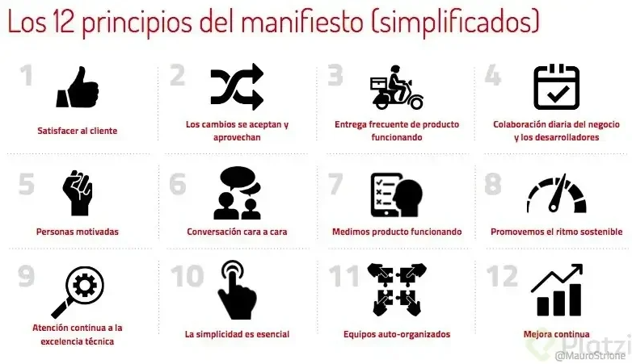 


## Clase 4: ¿Qué son las metodologías ágiles?

**Componentes de Scrum**
- El Equipo: Es un equipo auto-organizado y multifuncional. Existen 3 roles definidos:
- Product Owner: Responsable de maximizar el producto. Es la cara del cliente dentro al equipo.
- Scrum Master: Responsable de promover y apoyar el scrum.
- Development Team: Profesionales que realizan el trabajo de entregar un incremento de producto “Terminado”.
- Eventos de Scrum: Existen eventos predefinidos con el fin de crear regularidad y minimizar la necesidad de reuniones no definidas en scrum.

- Sprint: Es el corazón de Scrum donde se crea un incremento del producto. 
    > Son iteraciones de un proceso delimitado en un periodo de tiempo, donde el equipo trabaja un incremento del producto El sprint tiene elementos claves:
	- Sprint Planning: Ceremonia para definir qué se hará durante el sprint.
	- Daily stand-up(Scrum diario): Reunión diaria de todo el equipo de desarrollo.
	- Sprint review: Es donde se muestra el incremento desarrollado durante el sprint.
- Retrospectiva: Es el proceso donde el equipo va a analizar y se va a auto-evaluar de que se hizo bien y que se puede mejorar, para tener un proceso de mejora continua.

**Artefactos de Scrum**
-  Representan trabajo o valor en diversas forma que son útiles para proporcionar transparencia y oportunidades para a inspección y adaptación. 
> Los artefactos son:
1.- Product Backlog (Lista de producto): Es una lista ordenada de todo lo que se conoce que es necesario en el producto.
2.- Sprint Backlog  (Lista de pendientes del sprint): Es un pequeño conjunto del product backlog que se va a trabajar en un sprint determinado.

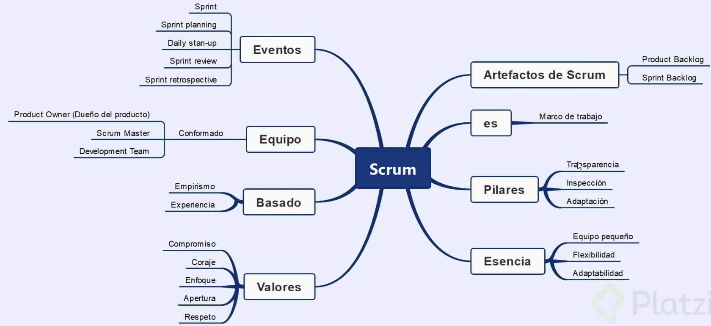

## Clase 5 - 6: El equipo de Scrum y sus roles
**Caracteristicas**
- Equipo Scrum -> Esta diseñado para optimizar la felxibilidad, creatividad y la productividad
- Equipo Scrum -> Entregar productos de manera iteractiva e incremental. 
- Equipo Scrum -> Minimixar la dependencia externas. 

> Nota: 

Entendí muy bien el concepto de Daily Scrum, pero cuál es la forma correcta de hacerlo? 

- 1. ¿Cuál ha sido mi aporte desde el último Daily Scrum para ayudar al equipo a cumplir el objetivo?  ->  `Qué hice ayer?`
- 2. ¿Cuál va a hacer mi aporte a partir de hoy para ayudar al equipo a cumplir el objetivo del equipo? ->  `Qué hare hoy?`
- 3. ¿Qué tipo de barreras estoy teniendo o voy a tener para cumplir el objetivo del equipo? -> `¿Qué cosas están bloqueando mi trabajo?` en su idioma `Cual es mi stoper`


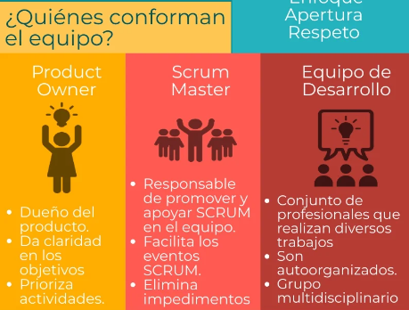

## Clase 7: Qué hace el Product Owner o Dueño del Producto

> Product Owner/dueño de producto: El unico encargado de la lista del producto, decide que se va a trabajar primero, encargado de despejar dudas al equipo de desarrollo de como el cliente desea el producto de forma detallada.

- Capacidad de explicar en que consiste cada funcionalidad
- Decide en que orden se van a realizar los diferentes desarrollos o funcionalidades.
- Dar claridad en los objetivos del desarrollo.
- Saber cuales tareas sean realizado y cuales faltan, y mostrar hacia donde van.
- Asegurar que el equipo de desarrollo conoce los elementos de la lista del producto.

> Nota
<hr>

`Las decisiones de este rol van a ser reflejadas en el contenido y la priorización de la lista del producto. La decisión del Product Owner siempre se debe de respetar porque es la única persona autorizada en modificar la lista del producto.`


`Nadie puede forzar al equipo de desarrollo a que trabaje en otras actividades que no sean la prioridad establecida por el Product Owner o con base en un conjunto diferente de requisitos.`


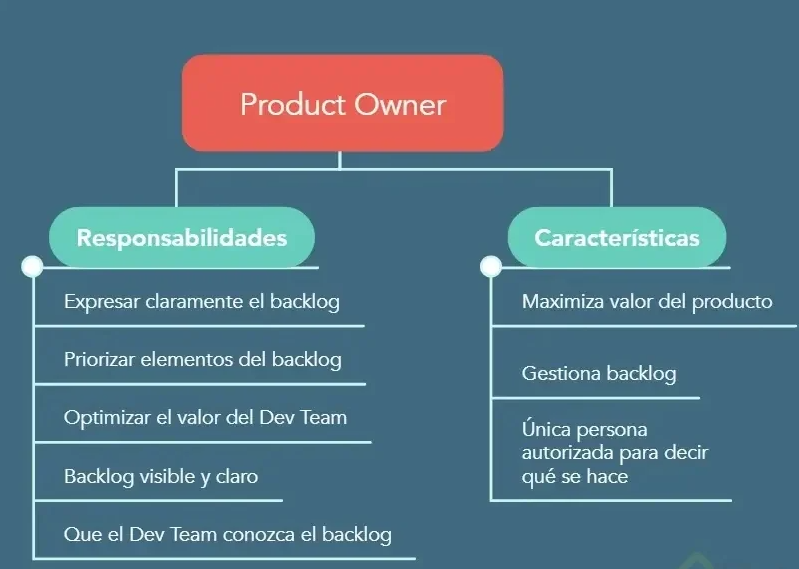

## Clase 8: El rol del Scrum Master

> El Scrum Master es el responsable de promover y apoyar scrum dentro del equipo, ayudando a todos a entender la teoría, práctica, reglas y valores de Scrum. Si hay algo que no se está haciendo bien debe decirnos “podemos mejorar”.


**Es un líder que está al servicio del equipo scrum, y es el encargado de ayudar a entender a los externos al equipo scrum cuando deben interactuar con el equipo.**

**¿Cómo ayuda el SM al PO?**

- Asegurar que los objetivos y el alcance sean entendidos por todo el equipo scrum, que todos entiendan en el planning qué se va a trabajar.

**Entender y practicar la agilidad.**

- Facilitar los eventos de scrum según se requiera o necesite, planeación de lugar, fecha, hora, recursos, que cuando el equipo llegue a la sala esté todo lo que el equipo necesite.

**¿Cómo ayuda el SM al equipo de desarollo?**

- Guiar al equipo de desarrollo para que sea autoorganizado, darle liderezgo a alguien para que resuelvan cualquier duda o inconveniente.
- Ayudar al equipo de desarrollo a crear productos de alto valor, asegurándose que los objetivos durante el sprint sean entendidos.
- Eliminar impedimentos para el progreso del equipo de desarrollo.

**¿Cómo ayuda el SM a la organización?**

- Liderar y guiar a la organización a la adopción de Scrum.
- Trabajar en conjunto con otros SMs para incrementar la efectividad de la aplicación de Scrum en la organización.

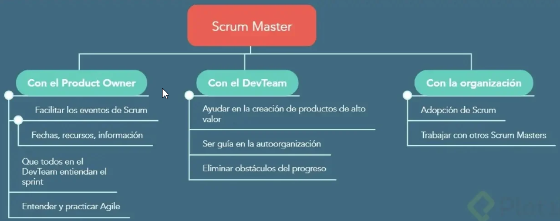

## Clase 9: Equipo de desarrollo en Scrum

> El equipo de desarrollo en Scrum es el conjunto de profesionales que se encarga de crear y entregar producto terminado, el cual se pueda poner en producción al final de cada sprint. De esta forma, el desarrollo es incremental.

**La organización es la encargada de estructurar y empoderar a lo s equipos de desarrollo para que estos organicen y gestionen su propio trabajo.**

**Características del equipo de desarrollo**
- El equipo de desarrollo en Scrum tiene las siguientes características:
	- **Autoorganizado.** Sabe cómo y qué va a desarrollar durante el sprint. Se autogestiona en términos de roles y actividades internas.
	- **Multifuncional.** Es un grupo multidisciplinario capaz de realizar cualquier actividad, si cuenta con las personas indicadas para la ejecución de las diferentes tareas.
	- **No tiene títulos.** Es decir, no hay jerarquía y todos se deben tratar por igual, con respeto y buscando el consenso para sacar lo mejor de las diferentes habilidades individuales.
  	- **No hay subequipos.** No existen grupos dentro del equipo de desarrollo. Las actividades y responsabilidades se asignan por igual.
	- **No se modifica el equipo de desarrollo hasta terminar el sprint.** Esto con el fin de no afectar el desarrollo de las actividades planeadas.

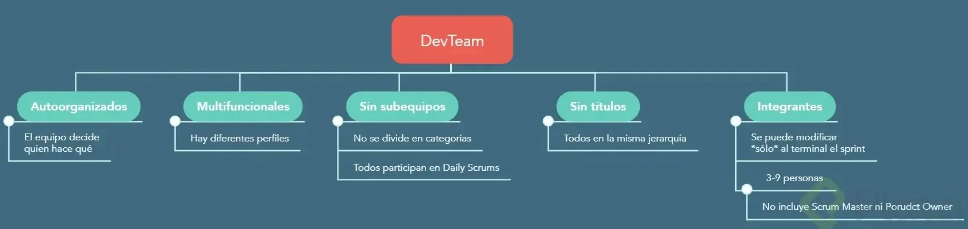

## Clase 10: Qué es el Backlog, las Épicas y las Historias de Usuario

La lista de producto o PRODUCT BACKLOG es la **lista ordenada de todo lo que se requiere implementar en el producto** y es la única fuente de requisitos para cualquier cambio o mejora a realizarse sobre el producto. 

El product backlog se considera un cuerpo vivo ya que está en completo cambio y en proceso de nuevas definiciones.

El PRODUCT BACKLOG se compone de **HISTORIAS DE USUARIO** que deben poderse completar en **1 sprint**, sin embargo, si una funcionalidad o requisito es **demasiado extenso** se puede crear una **ÉPICA** las cuales son actividades que requieren más de 1 sprint para su culminación. De está manera **1 Épica se compone de varias historias de usuario**


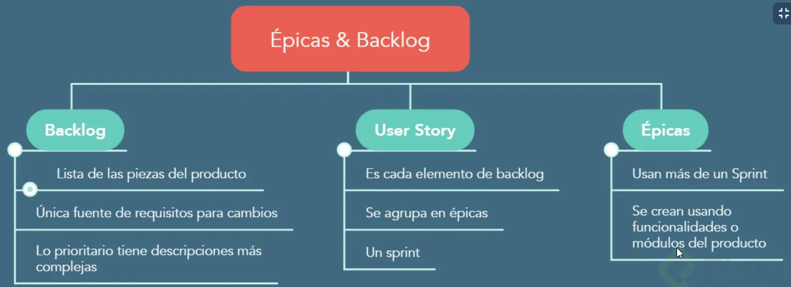

## Clase 11: ¿Cómo crear Historias de Usuario?

> Las Historias de Usuario son los elementos más específicos de la lista de producto y contienen la visión del usuario sobre la funcionalidad esperada del producto. No se deben confundir las Historias de Usuario con requerimientos, en ellas se referencia lo que el usuario quiere o espera del producto terminado.


**Componentes de una Historia de Usuario**

- Título. Permite conocer rápidamente de qué se trata la historia y por ello debe ser concreta y clara.
- Descripción. Contiene información sobre cómo se deben ejecutar las tareas, puede incluir componentes técnicos, especificar el tipo de diseño, el lugar donde se van a almacenar las tareas o el flujo de arquitectura que se debe seguir. En resumen, contempla una definición más específica para completar la historia.
- Puntos. Los puntos de una Historia de Usuario representan el esfuerzo que le va a tomar al equipo de desarrollo completar las actividades de la historia.
- Criterio de aceptación. A través de él se definen los requisitos que la historia debe cumplir para que esté completa.

**Cómo debe ser una buena Historia de Usuario INVEST**
- I - Independiente. No debe depender de otra Historia de Usuario. Si es así, debe marcarse con tiempo y no se debe empezar a trabajar hasta que se complete su dependencia.

- N - Negociable. Si el equipo encuentra que la historia es muy grande para completarla durante el sprint, se puede negociar con el Product Owner para dividirla en historias más pequeñas.

- V - Valiosa. Debe entregar valor al cliente, debe hacer algo por la funcionalidad o el producto.

- E - Estimable. Se debe poder estimar el esfuerzo para completar la historia.

- S - Small (pequeña). Debe ser lo suficientemente pequeña para cumplir una funcionalidad

- T - Testeable (comprobable). Se debe verificar que la historia se completó a través de los criterios de aceptación y de la definición de completado.


>Nota
<hr>
- Las historias de usuarios no son requerimientos 
- Cualquiera puede escribir historias de usuario
- Es responsabilidad del **Product Owner asegurarse de que exista una Product Backlog actualizado y priorizado** de historias de usuario ágiles, pero eso no significa que el Product Owner es quien los escribe.
- ¿Quién puede agregar historias de usuario a los distintos backlogs? “Cualquier miembro del equipo”
- Las tres Cs Card, Conversacion, Confirmación para definir una historia de usuario 

## Clase 12 :Cómo estimar Historias de Usuario

**Para estimar Historias de Usuario en un proyecto Scrum se deben tener en cuenta 4 elementos:**

- Complejidad de la historia. Junto con el equipo se debe definir qué tan difícil es implementar la historia.

- Cantidad de trabajo requerido. Representa el esfuerzo que debe invertir el equipo para llevar a cabo la historia.

- Conocimientos necesarios. Habilidades técnicas, de diseño y de negocio, entre otras, para completar la historia.

- Incertidumbre. Acciones que se requieren para ejecutar la Historia de Usuario, aunque no se tenga claro el tiempo o esfuerzo real.

**El proceso de estimación de las Historias de Usuario se hace a través de puntos. Estos puntos no están relacionadas con una escala de medición, no representan horas o días de trabajo, sino un estimado empírico con base en la experiencia del equipo.**

**Qué es el póker de planeación o planning poker**
> El planning poker es una herramienta que sirve para que el equipo de un proyecto Scrum participe en la estimación de las Historias de Usuario.

**Existen cartas físicas de planning poker pero, en caso de no tenerlas, también se puede hacer uso de aplicaciones como Scrum Poker Cards, disponible en PlayStore.**

**Los puntos para hacer la estimación se pueden establecer tomando como referencia diferentes escalas:**

- Una de las más usadas es Fibonacci modificada (1, 2, 3, 4, 8, 13, 20, 40, 100, ∞ y ? → representa incertidumbre)

- 2X (1, 2, 4, 8, 16, 32)

>Nota: 
<hr>
- La idea de usar estas escalas en lugar de números consecutivos es minimizar el tiempo que se puede perder en discusiones triviales o que no permitan dar continuidad al proyecto.
- Al final del proceso de estimación, se obtendrá el valor total de puntos de todas las Historias de Usuario y eso va a reflejar:
- Velocidad. Es el total de puntos de las historias de usuario completadas por el equipo durante un sprint.
- Capacidad. Total de historias de usuario que se pueden completar en un sprint futuro.
- Durante el primer sprint es posible identificar la velocidad del equipo y con base en los resultados, será más fácil estimar los próximos sprints.

```
Sumatoria de la estimación de:
- Subtareas
- Trabajo administrativo (del código, las personas, documentos, gestión, etc.)
- Documentación
- Investigación o aprendizaje
- Fase de análisis
- Fase de desarrollo
- Fase de pruebas
- Fase de correcciones
- Soporte
- Imprevistos o emergencias
- Reuniones y comunicación
- Revisión de código
- Sumarle un 20% del total, en caso de
```

## Clase 13 : ¿Cómo empezar? Prioridades y Backlog del Sprint
**El Backlog del Sprint** 
- (lista de pendientes del Sprint) es un subconjunto de la lista del producto y contiene todos los elementos que serán desarrollados durante el Sprint.
- De estos elementos dependerá el incremento a desarrollar y los objetivos del Sprint.

**Representación de la lista de pendientes del sprint**
El Backlog del Sprint dependerá de las diferentes etapas de desarrollo. En él se incluye el flujo de proceso para cada Historia de Usuario, según el estatus en el que se encuentre:

**Este sistema se puede gestionar en un espacio físico como una pizarra, pero también a través de herramientas digitales como Trello (gratuito) o Jira (de pago).**

**Características del Backlog del Sprint**

- Contemplar un plan lo suficientemente detallado para que todo el equipo esté en capacidad de comprenderlo en los daily stand-ups (Scrum diario).
- Asegurar que todas las personas que participan en el Scrum diario tengan conocimiento del Spring Backlog.
- El dueño del Backlog del Sprint es el equipo de desarrollo, por lo tanto, tiene potestad sobre esta lista para aceptar o no que se agreguen elementos al Sprint Backlog.
- Si un elemento se vuelve innecesario a mitad de un sprint se puede sacar de la lista de pendientes.
- El Product Owner podrá dialogar con el equipo de desarrollo para bajar la prioridad de una historia o incluso eliminarla.

**Cómo se definen las prioridades del Backlog del Sprint VURE**

- Valor para el cliente. Enfocarse en historias que generen más valor al producto.
- Urgencia. Por ejemplo, cuando una historia tiene una fecha para que se pueda utilizar o integrar al sistema.
- Riesgo / Oportunidad. Definir el impacto que la realización de una historia podría tener en el avance del proyecto o en la ejecución de nuevas historias.
- Esfuerzo. Qué tanto esfuerzo se requiere por parte del equipo para ejecutar la historia.

- 
- [Plantillas](./info/plantillas_inicio_spring_2023.xlsx)
- [scrum-ejemplo](https://trello.com/b/2SFC7g8G/scrum-ejemplo)

## Clase 14: Cómo medir el avance de un proyecto Scrum


**3 gráficas para medir las Historias de Usuario**
Las siguientes 3 gráficas facilitan el proceso de medición del avance de un proyecto Scrum, tomando como base los puntos de las Historias de Usuario:

- Gráfica de trabajo pendiente o Bourn Down Chart 🚀
>Este tipo de gráfica está enfocada en el sprint y hace visible el trabajo pendiente durante del desarrollo de un proyecto. Además, permite identificar la velocidad con la cual se están alcanzando los objetivos propuestos y si el equipo puede cumplir con el total de las actividades estimadas. 


- Gráfica de trabajo Bourn Up Chart 💚
>Esta gráfica permite ver el trabajo que se ha completado durante el Sprint. Se marca una línea adicional (de color amarillo) la cual representa el ideal de puntos que se deben completar o el objetivo al que se quiere llegar.

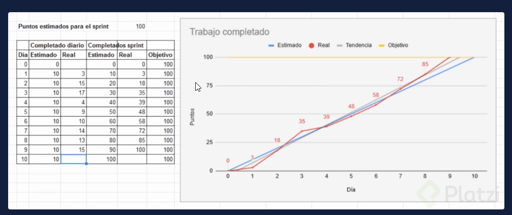

- Gráfica de flujo acumulado 😇 💚
>En esta gráfica no se refleja el día a día del Sprint, sino que incluye el histórico de los Sprints anteriores.

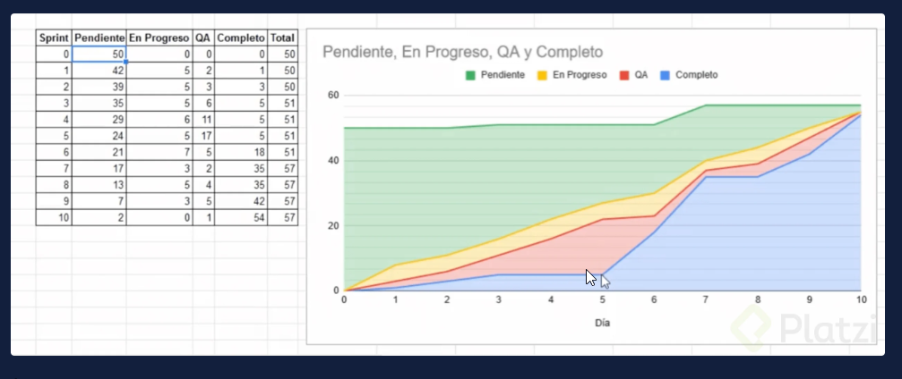

## Clase 15: Qué es el Sprint en un proyecto Scrum

**El Sprint es el corazón de Scrum**. 
- Es un periodo determinado en el que se crea un incremento del producto. Puede durar entre 1 y 4 semanas (lo más común son 2 semanas), sin embargo, una vez se establezca la frecuencia del Sprint, esta siempre será la misma.

**Características del Sprint**
- Cada sprint debe tener un objetivo claro.
- Cualquier cambio dentro del Sprint debe ser negociado entre el equipo de desarrollo y el Product Owner.
- Si los objetivos del Sprint quedan obsoletos, este podría ser cancelado. Aunque esto es poco común, solo el Product Owner tiene la autoridad para cancelar un Sprint.

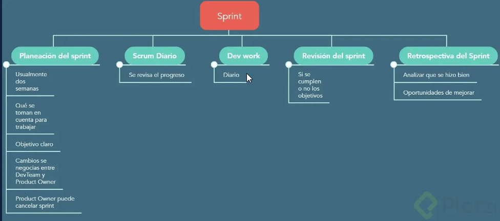

**Cuál es el ritmo del sprint**
- Planeación del sprint. Allí se analiza qué se va a trabajar y qué se va a tomar en cuenta para ello.
- Scrum diario. Ocurre todos los días del Sprint para discutir el progreso hacia los objetivos.
- Trabajo de desarrollo. Va ocurriendo todos los días.
- Revisión del Sprint. Es la sesión donde se evalúa si se cumplen o no los objetivos.
- Retrospectiva del Sprint. En esta sesión el equipo analiza qué tan bien lo ha hecho y qué puede mejorar. Las mejoras identificadas se aplicarán en el siguiente Sprint.

**El ciclo de Scrum**

- Planeaciòn del sprint
- Scrum diario
- Trabajo de desarrollo
- Revisiòn del sprint
- Retrospectiva del Sprint


> Los sprints son iteraciones de un proceso delimitado en un periodo de tiempo, donde el equipo trabaja un incremento del producto. Normalmente la duración es de entre 1 y 4 semanas, teniendo todos la misma duración.

**Durante cada Sprint, se producen los siguientes eventos:**

- Sprint Planning: El equipo se reúne para definir qué se hará durante el sprint.
Daily stand-up (Scrum diario): Reunión diaria de no más de 15 minutos, donde todo el equipo de desarrollo donde se comenta como va el proceso para cumplir los objetivos del sprint.
- Sprint review: Ocurre al final del sprint, es donde se muestra o revisa el incremento desarrollado durante el sprint para determinar si se cumplió o no con los objetivos.
- Retrospectiva: Es el proceso donde el equipo va a analizar y auto-evaluar qué se hizo bien y qué se puede mejorar, de esa forma se logra un proceso de mejora continua.
Todos los sprints deben de tener un objetivo claro para que el equipo de desarrollo sepa desde el comienzo para qué se está trabajando.

``` 
En caso de que se necesiten cambiar los objetivos del sprint, debe existir una negociación entre el equipo de desarrollo y el product owner para decidir en conjunto que cambios se harán.

También existe la posibilidad (casi nunca sucede) de que un sprint se cancele, esto puede darse a causa de que los objetivos quedan obsoletos. En este caso, el product owner es el único que puede decidir cancelar el sprint.
```

## Clase 16: Qué es el Sprint Planning


**El Sprint Planning**
Ss la ceremonia de Scrum en la que se definen las Historias de Usuario que se van a desarrollar durante el Sprint. 

El Scrum Master es el encargado de organizar la sesión y en ella debe estar presente todo el equipo de Scrum:

- Scrum Master
- Product Owner
- Equipo de desarrollo
- Características del Sprint Planning

> Nota
<hr>
- No debe durar no mas de 8 horas 
- No mas de 4 semanas  
- Debe estar en un salon amplio
- Se debe velar que esten los recursos (Pizarron, spotic)

**Características**

**Duración del Sprint Planner**
El Sprint Planning no debe durar más de 8 horas para sprints de 4 semanas. Normalmente, esta ceremonia puede tomar 1 hora para un sprint de 2 semanas.

**Funciones del Scrum Master en el Sprint Planning**
- El Scrum Master es el encargado de organizar esta ceremonia. 
- Se debe llevar a cabo en un lugar adecuado y que sea lo suficientemente espacioso para el equipo, puede incluir un pizarrón o la tecnología necesaria para llevar a cabo una videoconferencia con el cliente.
- El Scrum Master debe asegurarse de que todo lo necesario para la sesión esté disponible y funcione correctamente.

**Acuerdos del Sprint Planning**
- Nadie puede responder correos, llamadas o mensajes. 
- Todo el equipo debe estar concentrado en el Sprint Planning y todos deben participar en el desarrollo de las actividades.

**Objetivos del Sprint Planning**
Es importante que durante la sesión de planeación del Sprint se respondan las siguientes preguntas:

**¿Qué puede entregarse al final del sprint?**

- Se trabajan los elementos más prioritarios de la Lista del Producto.
- Se discute el objetivo a lograr en el Sprint.
- Se necesita identificar la capacidad del equipo y conocer la velocidad de la última iteración.

**¿Cómo se logrará hacer este trabajo?**

- Se analizan los elementos de la Lista de Producto seleccionados para el Sprint y se mueven a la Lista de Pendientes del Sprint.
- Durante este proceso, se realiza la estimación de esfuerzo.
- El Product Owner se encarga de aclarar cualquier duda con respecto a una Historia de Usuario o algún elemento del Backlog.
-Puede haber invitados que aporten valor a la discusión de las funcionalidades (cliente, usuario final).

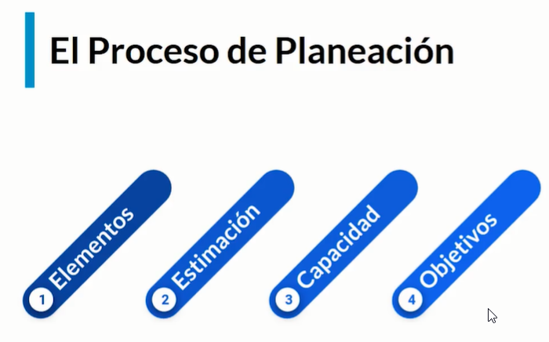
**Ejemplo planeación**
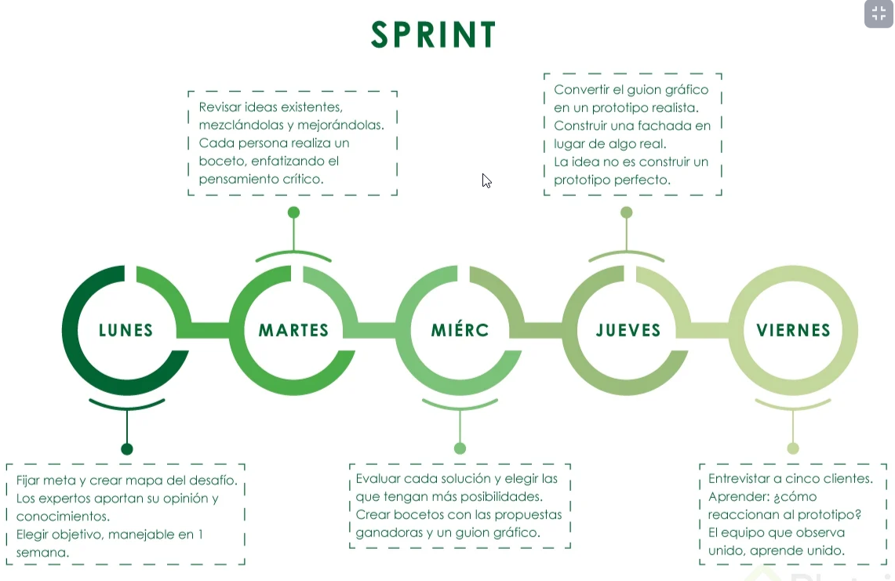


## Clase 17: Daily stand-up. Seguimiento de un proyecto Scrum

> El Daily stand-up es una reunión diaria de no más de 15 minutos en la cual participa únicamente el equipo de desarrollo y donde se planifican las siguientes 24 horas de trabajo.

- Esta sesión se lleva a cabo de pie con la finalidad de ser muy concretos y evitar que se extienda.

- El Scrum Master es responsable de organizar la reunión, de preferencia a la misma hora y lugar para crear la costumbre. Otras personas pueden estar presentes, como el Product Owner, pero solo como observadores, sin participar.

Cómo hacer una Daily stand-up
Esta sesión de seguimiento diario del proyecto permite optimizar la colaboración entre los integrantes del equipo. En ella se exponen los avances, la planeación y los posibles obstáculos de cada integrante del equipo de una forma concreta.

**Para ello, se deben formular 3 preguntas:**
- ¿Qué hice ayer?
- ¿Qué haré hoy?
- ¿Tengo algún impedimento?

La información que se comparte en una Daily stand-up debe estar enfocada exclusivamente a los objetivos del sprint.

El Scrum Master es responsable de asegurar que no haya impedimentos para que el equipo de desarrollo cumpla su objetivo.

Si se requieren más detalles sobre lo discutido, el equipo puede decidir que se lleve a cabo una reunión.

**Beneficios del Daily Stand-Up**
- Mejora la comunicación del equipo de Scrum, gracias a las 3 preguntas que se responden (¿qué hice ayer?, ¿qué hice hoy?, ¿tengo algún impedimento?).
- Hace posible conocer y medir el progreso para cumplir el objetivo del Sprint.
- Ayuda a identificar rápidamente problemas o inconvenientes que pueden frenar el avance del equipo de desarrollo.

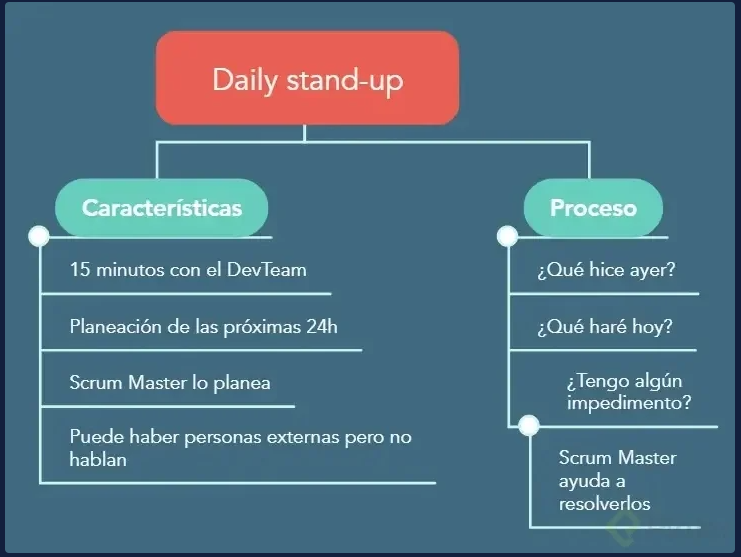


## Clase 18: Cómo refinar Historias de Usuario

**Por qué es importante refinar Historias de Usuario**
- El objetivo de la sesión de refinamiento de Historias de Usuario es tomar las funcionalidades que se van a trabajar en el siguiente sprint y detectar dudas o posibles impedimentos, antes de comenzar el sprint.

- En un proyecto de Scrum es necesario ver al futuro inmediato en el proceso de desarrollo. - Dentro de los procesos de Scrum siempre debería haber en el Backlog funcionalidades listas para implementar.

- La función del Product Owner es analizar y definir qué se va a trabajar en el próximo Sprint y para ello es importante refinar las historias y asegurarse de que tengan la información precisa para que se trabajen desde el primer día del Sprint.

**Características del proceso de refinamiento de Historias de Usuario**
- Se recomienda llevar a cabo al menos una sesión para refinar las Historias de Usuario durante el Sprint.
- En esta sesión de refinamiento el Product Owner siempre debe estar presente.
- El Scrum Master es el encargado de organizar la ceremonia de refinamiento.
- Pueden participar los miembros del equipo de desarrollo. Sin embargo, no es necesario que todos ellos estén presentes.

## Clase 19: Sprint Review y Retrospectiva del Sprint

**Qué es la Revisión del Sprint (Sprint Review)**
- Esta ceremonia de Revisión del Sprint se lleva a cabo el último día del Sprint. 
- Allí se muestran al cliente los avances de la iteración, el software que se ha desarrollado y su funcionamiento. 
- No necesariamente tiene que ser una sesión, pueden ser varias reuniones.

**Características de la Revisión del Sprint**
- La transparencia es importante. 
- Esta reunión está enfocada en la comunicación con el cliente, es informal y abierta al diálogo, no es una sesión de seguimiento.
- Es facilitada por el Scrum Master y no debe durar más de cuatro horas para Sprints de un mes. - Para sprints más cortos, se podría llevar a cabo en menos tiempo.
- Al final de la revisión se tendrá una lista de producto actualizada.
- La clave es mostrar el producto desarrollado al cliente, no hacer énfasis en presentaciones.
- Después del Sprint Review se lleva a cabo una sesión de Retrospectiva, donde el equipo de Scrum analiza las oportunidades de mejora.

**Qué es la Restrospectiva (Retro)**
- La Retrospectiva es una reunión interna en la que solo participa el equipo de Scrum. Es facilitada por el Scrum Master y el cliente no está presente.
- Esta ceremonia se lleva a cabo en un ambiente más relajado y el equipo puede expresar libremente lo que piensa y dar feedback acerca de situaciones particulares.

**Características de la Retrospectiva**
- Es una reunión positiva y productiva.
- No es una sesión para buscar culpas.
- No debe durar más de tres horas para un sprint de un mes. 
- Para Sprints de 2 semanas puede durar entre 15 min. a 30 min.
  
**Elementos que se discuten en la Retrospectiva:**
- Herramientas. Evaluar si se tiene todo lo necesario para cumplir el objetivo.
- Relaciones. Identificar si la comunicación es fluidas o hay problemas.
- Personas. Analizar cómo es la interacción entre los integrantes del equipo.
- Procesos. Determinar si los procesos se ajustan al desarrollo óptimo que se espera dentro del equipo.

**Se sugiere que se respondan las siguientes preguntas:**
- ¿Qué hicimos bien?
- ¿Qué no hicimos tan bien?
- ¿Qué podemos mejorar?
- Con base en las respuestas a estas preguntas se identifican los elementos más importantes, se buscan soluciones y se crea un plan de acción para aplicar las mejoras.

## Clase 20: Escalabilidad de equipos
> Scrums of Scrums es una reunión donde frecuentemente se encuentran miembros de todos los equipos y que permite coordinar esfuerzos entre los distintos equipos de la organización.

- En esta reunión solo participa uno de cada equipo.

## Clase 21: Qué son las comunidades de práctica

> Las comunidades de práctica son grupos de personas que comparten un interés o una pasión por algo que hacen y aprenden a hacerlo mejor a medida que van interactuando.

**3 elementos de las comunidades de práctica**
- Dominio, qué nos gusta.
- Práctica, cómo lo compartimos y cómo lo practicamos
- Comunidad, a quién más le interesa.