# Curso Scrum Master 
*Profesor:Andrés Salcedo*
> Desarrolla los conocimientos y habilidades necesarias para liderar la adopción del marco de trabajo Scrum en cualquier equipo, comprendiendo las responsabilidades del Scrum Master, entendiendo cómo funciona Scrum y la razón de cada uno de sus eventos, roles y artefactos. Aprender a reconocer los diferentes sombreros del Scrum Master e identificar cuándo usar cada uno para hacer intervenciones efectivas.
>

```
Creadores de Scrumm 
Fue creado por Jeff Sutherland y Ken Schwaber y presentado por primera vez en la OOPSLA en 1995.
```

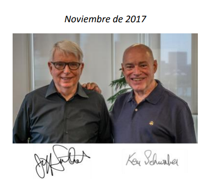

**Enlace**
- Guia de Scrum Basica [Guia](../info/2020-Scrum-Guide-Spanish-Latin-South-American.pdf)

## Clase 1-2: ¿Qué hace un Scrum Master?

> El Scrum Master es responsable de aplicar este marco de trabajo como se define en la Guía de Scrum. 

- Lo hace ayudando a todos a comprender tanto la teoría y la práctica dentro del Scrum Team como de la organización.


**El scrum master tiene distintos roles:**

- **Facilitador** 
  -	No es quine agenda reuniones, es quien asiste en conversaciones a los integrantes para que se tengan conversaciones efectivas y produtivas. 
  - El facilitador busca herramientas para lograr una comunicación eficiente en pro de lograr el desarrollo del producto.

- **Entrenador**
  - Ayuda a los integrantes a entender la metodología, facilitar el aprendiaje de los integrantes. 
  - Se debe tener una alta comprensión de el tipo de aprendizaje de cada persona y adaptar las estrategias en pro del crecimiento de todo el equipo. 
  - Este rol se da generalmente en las etapas iniciales, ya que el equipo no debe depender del Scrum Master, sino que este debe entrenar al equipo para ser independiente y trabajar de forma óptima co la metodología.

- **Mentor** 
  - Implica experiencia y práctica, cada día trae nuevas experiencias y aprendizajes, el Scrum Master debe tomar estas situaciones y desarrollar un rol de guía en el equipo, este rol es utiliado a través de todo el ciclo.

- **Coach** 
  - Asiste a los integrantes del equipo en su ruta de aprendizaje, el papel es de guía, el equipo debe desarrollar autosuficiencia en pro de encontrar un camino para la autogestión y la multifuncionalidad.

- **Consultor** 
  - En la industria existen muchas prácticas que complementan la metodología Scrum.
  - Está hecha incompleta apropśito para lograr un complemento que se adpate a las necesidades de cada equipo. 
  - Este rol se enfoca en hacer uso de las herramientas que permitan estos objetivos.
  


```
Un Scrum Master es un líder al servicio del Scrum Team. No es policía, dictador, jefe, ni repartidor de trabajo.
```

**Enlace**
- Guia de Scrum Basica [Guia](../info/2020-Scrum-Guide-Spanish-Latin-South-American.pdf)

## Clase 3: Scrum desde la perspectiva del Scrum Master

**Características**
- Debemos partir de la base que Scrum es un marco de trabajo 
- No una metodología como tal. 
- Dentro de las metodologías agiles encontraremos varios marcos de trabajo entre ellos Scrum. 
- Scrum es un marco de trabajo para el desarrollo y mantenimiento de productos en contextos complejos o de alta incertidumbre. 
- Se basa en los pilares de Inspección, Adaptación y Transparencia.
⁣

**Scrum está compuesto por:**

- 3 Responsabilidades (Scrum Master, Product Owner y Dev Team).
- 5 Eventos (Sprint, Sprint Planning, Daily Scrum, Sprint Review, Sprint Retrospective)
- 3 Artefactos (Product Backlog, Sprint Backlog, Increment)

**Cada artefacto contiene un compromiso.⁣**
**Artefactos⁣ / Compromisos**
- Product Backlog - Compromiso: Objetivo del Producto⁣⁣
- Sprint Backlog - Compromiso: Objetivo del Sprint⁣⁣
- Increment - Compromiso: Definición de Terminado

**Mapa Mental**
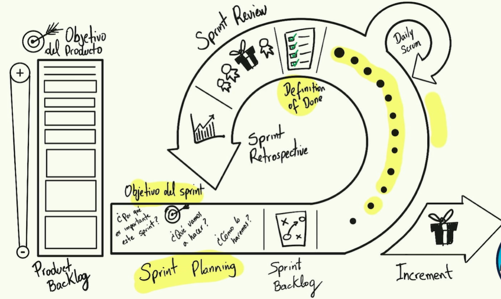

## Clase 4: MAC en producto [Modelo Acdaptactivo Control]

**Transparencia**

- El product backlog debe ser transparente para todos.
- El incremento se revisan en el sprint review, se debe saber que hicimos a lo largo del sprint (a nivel producto).

**Inspección**

- La Sprint Review no se debe presentar con diapositivas, se debe inspeccionar el incremento del producto, el cliente debe interactuar con el producto que se ha llegado a construir en el sprint.

**Adaptación**

- Cuando el cliente interactua con el producto nos puede dar un feedback directo 
- (ej: me funciona, me sirve, no es lo que esperaba, me gustaría cambiar esto, etc) o bien, indirecto (detectar lenguaje corporal, el comportamiento que el cliente tiene al interactuar con el producto). 
- Debemos notar irregularidades para mejorar y transmitir mejor el mensaje del producto.
- Esta adaptación ocurre en la siguiente sprint Planning. 
- Debemos planear que vamos a hacer de cara al siguiente sprint para mejorar nuestro incremento de producto.


**Nota**
- Las Sprint Review no se debe mostrar diapositivas 
- Una buena Sprint Review el cliente interactua con el producto
- 

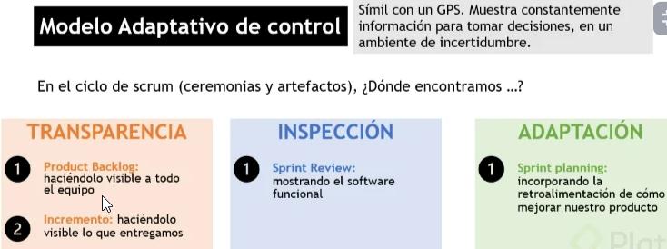

## Clase 5: MAC en producto [MAC en proceso]

**Nota**
- Inspeccion sin adaptacion no sirve de nada.
- Sprint Backlog: Transparencia
- Definitions of Done: Transparencia,
- Sprint Retrospectiva: !important
- La ceremonia Retrospectiva es considerada una de las mas importantes porque se aplica la Inspección y Adaptación
- Se debe buscar la mejora continua y esta se debe validar en la retro
- Los elementos de retropectiva se debe alcanzar una adaptación 

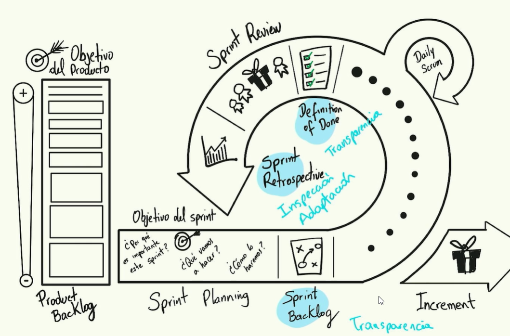

## Clase 6: MAC en producto [MAC en prgreso]

> El proposito de la Daily no es realizarla por que dice en la guia, el proposito es alinear al equipo en funcion del goal del sprint, sincronizarlo en funcion del objetivo.

> Atras quedaron las preguntas, que hiciste, que haras, bloqueantes. la nueva forma es definir si la estrategia nos permite acercarnos cada vez mas al cierre del sprint

**Proposito**
 - Debe ser transparente
 - Debe ser Adaptable 
 - Se debe poder inspeccionar 

**Nota** 
- Mas que la tres preguntas que hice, que hare hoy, si tengo un stoper 
- Se debe ir mas alla de validar dicha información preguntarse si lograremos la meta 
- **Transparencia:** Qué hice ayer, Cuáles son los impedimentos
- **Inspección:** Que tan cerca estamos de cumplir con el objetivo del Sprint
- **Adaptación:** Si se necesita o no cambiar lo que se definió en el Sprint Backlog
- En la Guia de Scrumm actualizada ya no salen las tres preuntas. 
- Las Daily ahora son para validar si estamos llegando al Objetivo del spring.

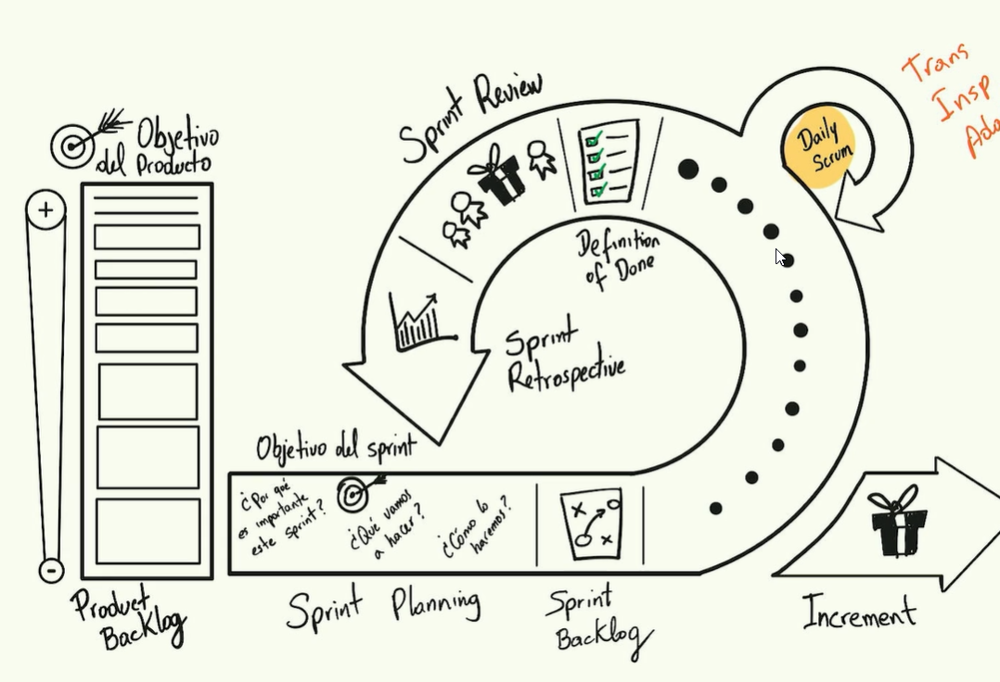


## Clase 7: Servicio al Product Owner


> Nuestra misión es apoyar al Owner y Stakeholders en conjunto crear una vision del producto y refinar la lista de objetivos. 

**Características**
- Ayuda a encontrar técnicas para obtener una definición efectiva de objetivos del producto y la gestión del Product Backlog. Para esto existen herramientas como el Product Vision Board. 
- La idea es encontrar una visión del producto.
- Ayuda al Scrum Team a comprender la necesidad de tener elementos del Product Backlog claros y concisos.
- Ayuda a generar flujos de comunicación entre los diferentes Stakeholders.
- Ayuda a establecer una planificación **empírica** de productos para un entorno complejo.
- Facilita la colaboración de los interesados según se solicite o necesite. - Facilitar no es sinónimo de llevar a cabo o hacer el mismo las actividades.

**Podemos usar este artefacto**
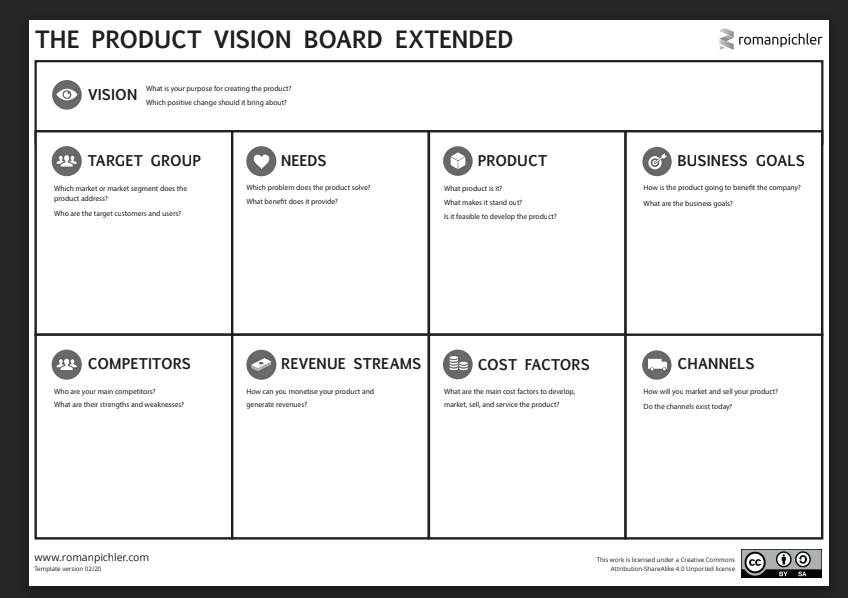

> “El Scrum Master está siempre al servicio del equipo”

**Notas**
- Como hacer el artefacto -> Esta en English ->  https://www.youtube.com/watch?v=rtbWVxYEgNA 
- Tu como Scrum Master debes saber a donde llegar, saber tus limites para que el equipo asuma el rol de autodisciplinado y autogestion. 


## Clase 8: Servicio al Scrum Team

**Características**
- Guia al equipo a ser autogestionado y multifuncional
- Tener foco en la entrega de valor Evitar la multitarea
- Ayudarlos a ser altamente productivos y cuidar la calidad.
- Procurar la eliminacion de impedimentos para el progrso del Scrum Team
- Asegurarse de los tiempos y de las ceremonias 

**Artefactos**
- Podemos usar la matriz Rambo para validar habilidades y ventnas de  mejoras del equipo. [Rambo Descarga Aqui](../02_Curso_Scrum_Master/info/Matriz%20Rambo.pdf)

**Notas**
- Evitar la multitarea, proteger al equipo scrum para evitar la distracción, todo esto es para que no se salga del objetivo
- El Scrum Master no siempre tiene el poder de quitar el impedimiento, Aqui se tiene que usar la diplomacia para llegar acuerdos y poder limpiar o despejar el camino. 
- El Scrum Master no tiene poder es un agente Staff, tiene comunicación con todos pero no tiene autoridad 
- Debemos leer  esto para comprender que no debe existir un Rambo o un Talento que el solo apague los indencios o resuelva rapido las incidencias
 -> https://andressalcedo.com/blog/forma-equipos-multifuncionales/
- Scrum PLoP es una wiki o enciclopedia colaborativa de la comunidad The Scrum Patterns Community, que contiene diferentes patrones organizacionales que se pueden combinar con Scrum para resolver algunos desafíos o mejorar los resultados en contextos específicos.⁣⁣

**¿CÓMO DESARROLLAR EQUIPOS DE ALTO RENDIMIENTO?**
- Formación (Forming): se agrupa por primera vez un conjunto de personas, donde cada uno muestra su mejor comportamiento. Las personas tienen alta dependencia del líder que los guíe. Se respeta la estructura jerárquica y se evitan los conflictos. En esta etapa se consiguen buenos resultados, pero pueden ser mucho mejores.
- Tormenta (Storming): emergen diferencias y conflictos entre las personas del equipo. Aflora la verdadera personalidad y los malos hábitos de cada uno. Distintos puntos de vista e ideas compiten entre sí. El modelo de liderazgo se cuestiona, incluso se pueden presentar luchas internas por el poder. En esta etapa el rendimiento del equipo cae, la falta de progreso se hace evidente.
- Calma (Norming): las personas del equipo llegan a acuerdos y empiezan a resolver sus discrepancias. Se alcanza una visión compartida. Se reconocen las fortalezas de los otros y se respetan las diferencias. El rendimiento empieza a mejorar.
- Desempeño (Performing): las personas del equipo trabajan como un equipo de alto rendimiento, se maximiza la colaboración, el respeto y compromiso. El trabajo se hace más fluido, el equipo obtiene los mejores resultados.
Retiro (Adjourning): Se acerca el final del equipo, crece la incertidumbre sobre el futuro. El rendimiento de las personas disminuye. Por esta razón es mejor tener equipos estables que perduren en el tiempo.


> Si el Resultado del Equipo no es bueno, es porque el desafio al que se esta enfrentando el Equipo supera la capacidad para responder ese desafio

```
Resultado = capacidad - desafío
```

## Clase 9: Servicio a la Organización

**Características**

- Planificar y asesorar implementaciones de Scrum dentro de la organización.
- Ayudar a comprender y aplicar con un enfoque empírico para el trabajo complejo. (Conocer los principios de la agilidad).
- Eliminar barreras entre los Stakeholders. y el equipo scrum, y unificar esfuerzos.
- El Scrum Master debe construir esas relaciones dentro de la organización.
construir una red de colaboración.
- Buscar quiénes son esos innovadores, que pueden apoyar su labor como agente de cambio.

```
Resultado = Relaciones.
```
**Notas**
- Curva de sifusión de Royer -> Nos permite diferenciar como se organiza el personal en una empresa. 
- Herramientas  para liderar -> https://leanchange.org/

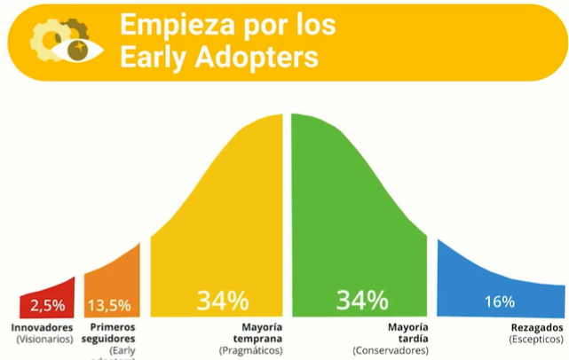

**Lean Change Management**
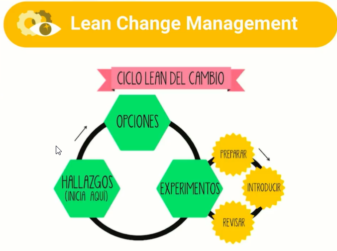


- Trabajar la gestion del cambio a partir de experimientos. 
- 

## Clase 10: Facilitación de Sprint Planning

**Características**
- Estructura de un buen Planning, Es una forma pero no la unica 
  - Paso 1:  Actividad de Check-in: Permite roper el hielo con el equipo para que esten concentrados , no mas de 5 min.
  - Paso 2: Acordar el objetivo del Sprint: Que el Product Owner explique el objetivo del sprint
  - Paso 3: Presentación de las prioridades: El Product Owner presenta la lista de prioridades que se van a atacar de mayor valor a menor valor
  - Paso 4: Definir compromisos del Sprint: El developer team definen los compromisos que van a asumir en el sprint. El compromiso va de los que genera mas valor en lugar de los mas facil de desarrollar
  - Paso 5: Refinar prioridades y estimar: Refinamiento del backlog
  - Paso 6: Conversación estratégica.: El developer team acuerdan de que forman van a trabajar las actividades que acaban de comprometer, esto deriva en el sprint backlog
  - Paso 7: Feedback y cierre: Cerrar la reunion teniendo en cuenta que pueden mejorar para el siguiente sprint planning

**Notas**
- PO debe presentar prioridades de la lista  de mayor valor a menor valor. 
- Aqui no pesa la voz de un desarrollador senior, es trabajo en equipo 
- Se define el compromiso, el error que se comente es no hacer lo mas facil primero y lo mas dificil despues 
- Recuerda se debe pesar el mayor valor para que lo developer puedan deasrrollar
- Si en la Spring Planing hay que detallar o aterrizar muchas ideas se vuelva tediosa. hace que unas personas le tenga fastidio a este tipo de eventos
- 

## Clase 12: Facilitación de la Daily Scrum


**Daily Scrum**
> “El propósito de la Daily Scrum es inspeccionar el progreso hacia el Objetivo del Sprint y adaptar el Sprint Backlog según sea necesario, ajustando el trabajo planificado entrante” Scrume Guide


**Características**
- Evento diario
- Maximo 15 min
- El objetivo es centrarse en el progreso del Sprint y produzca un plan viable para el siguiente daily
- Los developer llevan la conversacion
- Equipos pequeños de no mas de 10 integrantes
- Algunas estructuras pueden ser la tradicional (Qué hice ayer? ¿Qué voy a hacer hoy?
- ¿Qué impedimentos he tenido?) sin embargo simpre hay que centrarte en el como vamos con el progreso del sprint

**Nota**
- Existen equipos que hacen este espacio interdiario o lo hacen semanal o no lo habilitan a diario, con la excusa de que las reuniones duran mucho y no les deja avanzar. (Esto es un antipratron)
- “Un antipatron es que esperan al daily para comentar algún impedimento"
- Los Stoper fuertes se deben levantar la mano al mero momento para revisar y atacar de manera mas temprana
- Las Dailys es un espacio tactico se informa lo necesario no es para rendir cuentas en caso que algo sea grabe se realiza una reunión con los expertos para negociar, adaptar ó prevenir algun retraso para alcanzar la meta
- Las Daily no es un evento de seguimiento, no es para controlar el trabajo de las personas.
- Recuerda es un espacio propio del team de desarrollo 
- Generan un antipatron donde se alejan de las Dailys o muestran información que no compete o sea utíl para la reunión
- El Scrum master se preocupa para que el espacio sea efectivo, en caso el scrum master facilita otras reuniones para aclarar dudas o la posibilidad de resolver stoper.


## Clase 13: Facilitación de Sprint Retrospective


**Preparar el escenario**
- 📊 Preparar datos (identificar los problemas a resolver)
- 🔍 Indagar (identificar las causas raíz)
- 🤔 Decidir qué hacer (con las oportunidades de mejora)
- 🤝Cerrar la retrospectiva

**Notas**
- Preparar datos-> Uso efectivo del tiempo 
- Preparar datos-> El PO Es importante que este en el retro
- Preparar datos-> Analisis de datos para poder detectar las mejoras 
- Preparar datos-> El Scrum Master es ejemplo de efectividad y agilidad 
- Preparar datos-> Si eres juez y facilitador se le hace dificil encontrar la solución 

- Indagar -> Es nencesario crear un espacio para poder econtrar la situación clara para poder encontrar la oportunidad de mejora
- Indagar -> Ayuda a tacar la causa raíz 
- Indagar -> Entramos a elegir que accionables podemos resolver, ojo pocos es mas, así que debemos tener un número considerable de accionables concretos, es rocomendable tener un backlog de accionables 
- Indagar -> Los accionables no es responsabilidad del Scrum Master, debe estar repartido  en todo el equipo scrum

- Decidir qué hacer -> Avanzamos al cierre una vez que sepamos que hacer 

- Cerrar -> Podemos usar metaforas visuales 
- Cerrar -> Podemos usar herramientas para generar la retro -> https://miro.com/es/


**Herramientas**
- https://miro.com/es/
- https://easyretro.io
- https://mural.co
- https://timboretro.com
- https://retromat.org/es


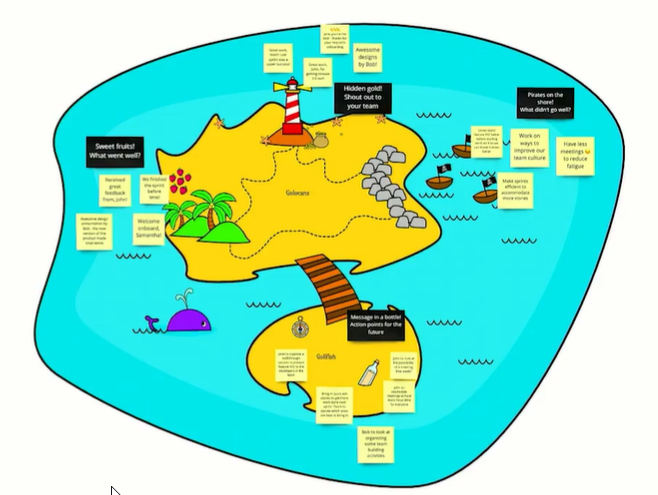


## Clase 14 : Anti patrones de Scrum


> Para tener un Modelo Adaptativo de Control en nuestro trabajo, necesitamos pasar los por lo nieveles A nivel de producto, A nivel de proceso, A nivel de pprogreso


**Transparencia de producto**

- En el Product Backlog
- En el Incremento del Producto

**¿Cómo está la transparencia del producto?**

- ¿Es el Product Backlog visible y accesible por todos los miembros dentro de la organización? ¿o es un artefacto que está oculto por el Product Owner y nadie sabe qué es lo que hay allí?
- Puede que el Product Backlog sea accesible pero ¿es fácil de interpretar?
- ¿Tenemos un documento con todas las ideas que tiene el Product Owner en su cabeza pero esos criterios de priorización y valor no son accesibles o no son entendibles?
- Cada vez que aparece el Incremento ¿es visible por todos los miembros de la organización, incluyendo a los Stakeholders?

**Inspección de producto**

**En la Sprint Review**
- ¿Esto se está dando? ¿ocurre una inspección del producto en la Sprint Review?

- Si esto no está sucediendo, aquí tenemos un anti-patron, quiere decir que la Sprint Review no está funcionando y teneos que intervenirla.
- Tenemos que buscar qué de lo que se esta haciendo en la Sprint Review no esta aportando a esa inspección y eliminarlo, así como entender por qué no se esta dando la inspección de producto en el equipo.
- A veces es por simple desconocimiento o porque se viene del paradigma anterior de comando y control, donde el foco está en presentar informes, métricas, etc.
- A veces la solución entra a ser mas bien a partir del sombrero del entrenador, como Scrum Master le explicamos al equipo sobre el valor de la - Sprint Review y la necesidad de hacer inspección del producto.

**Adaptación de producto**

**En la Sprint Planning**
¿Está ocurriendo? ¿Esa información que recogimos en la Sprint Review está sirviendo para algo?

- Pasa mucho y es un anti-patrón cuando no hay adaptación de producto a pesar que tenemos información suficiente de inspección proveniente de la Sprint Review y a pesar que nos está demostrando que el camino que estamos siguiendo con el producto no es el que deberíamos seguir.
  
- Si el feedback del cliente nos esta dando luz sobre que el producto no esta funcionando, deberíamos cambiar algunas características, pero en la Sprint Planning las prioridades del backlog no están cambiando, entonces el producto no se está adaptando.

- En algunas empresas los equipos introducen Scrum a lo que ya venían haciendo con la forma de trabajo tradicional y tienen proyectos con un alcance ya establecido, por lo que les cuesta cambiar ese alcance a partir del feedback proveniente de la inspección de producto.

- En ese caso, analizar si tiene sentido usar Scrum para un proceso lineal, donde sirve el Modelo Predictivo de Control o si bien se está trabajando en un contexto de incertidumbre, donde deberíamos respetar el Modelo Adaptativo de Control de Scrum y permitir la adaptación. En ese caso, ponernos el sombrero de consultor y enseñar a la organización las virtudes de Scrum en ese contexto.


**Transparencia de proceso**

- En el Sprint Backlog
- En el Definition of Done
- ¿Existen, son visibles y accesibles? ¿Son lo suficientemente claros?

**Inspección y adaptación de proceso**

- En la Sprint Retrospective
- ¿Está ocurriendo inspección y adaptación del proceso?

- Es muy fácil hacerlo muy mal, porque las personas inclusive pueden hacer todas las técnicas de facilitación y todos los ejercicios pero no hay mejora del equipo.
- En ese caso puede ser que no sale a la luz la causa raíz, tal vez se están mencionando problemas muy genéricos y no se está bajando de nivel para llegar al nivel de detalle.
- No es suficiente con parecer que estamos haciendo inspección y adaptación, tiene que haber mejora real.


**Transparencia, inspección y adaptación de progreso**

- En la Daily Scrum
- La Daily Scrum funciona por si sola como un Modelo Adaptativo de Control que nos permite navegar en la incertidumbre del Sprint.

- Si llegamos al final de Sprint y el equipo no esta cumpliendo sus objetivos, entonces hay anti-patrones en la Daily Scrum y no esta funcionando el MAC en progreso.

- Puede ser la transparencia: el Scrum Master debe analizar si están saliendo a la luz todos los elementos que tienen que salir para que podamos adaptar la forma de trabajo a tiempo de forma que no comprometamos el objetivo del Sprint.

- Puede ser la inspección: ¿Están saliendo a la luz esos datos pero nadie está haciendo nada con eso? ¿Alguien los esta analizando? Muchas veces en la daily algunas personas son muy transparentes y comparten los bloqueos que tienen, pero esperan que alguien se los resuelva o quedan en la conversación y se pierden en el día a día.
- ¿Hay adaptación? Si nos estamos dando cuenta que algo no esta funcionando, estamos teniendo algún tipo de bloqueo o que la estrategia inicial no esta funcionando y no hacemos nada para corregirlo, nos estaremos volviendo cómplices de un resultado final no exitoso del Sprint.
- Todas las personas, en especial en este caso los developers, son responsables del resultado final del Sprint y si alguien esta alzando la mano y los demás no hacen nada para adaptar la estrategia, estamos teniendo un problema de adaptación y ademas un anti-patron a la hora de colaboración del equipo.
- Toda esta teoría sobre los anti-patrones no solo sirve para entender en forma mas profunda todos los elementos sino como una herramienta para analizar la salud de la implementación del equipo Scrum.

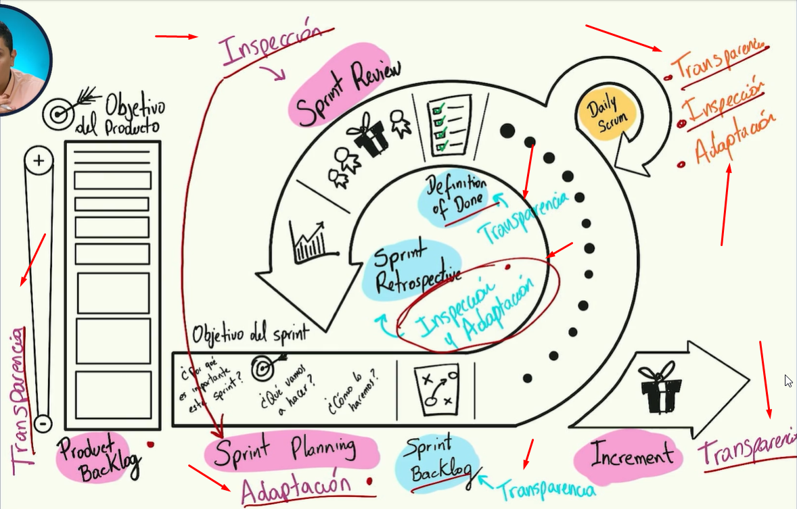

## Clase  15: Preguntas frecuentes

**Preguntas Frecuentes**
> No tenemos Scrum Master, ¿Cualquiera puede serlo?
- R. Segun la guia de scrum, cualquiera puede ocupar esta responsabilidad solo hay que tener en consideracion que cuente con las habilidades de facilitador.

> ¿El Scrum Master puede desarrollar o tomar tareas del Sprint?
- R. No ya que puede comprometer el sprint

> ¿El Scrum Master y Product Owner pueden ser la misma persona?

- R. Segun la guia de scrum SI, sin embargo no puedes cubrir ambas responsabilidades al mismo tiempo ya que se puede perder la armonia y equilibrio del equipo.

> ¿El Sprint puede tener diferentes duraciones?

- R. No es recomendable, puede generar indisciplina en el Developer Team, modificar las estadísticas del Srpint.

> ¿Qué hacer si surgen nuevas prioridades dentro del Sprint?

- R. Si se pueden agregar nuevas prioridades pero no se debe de comprometer al sprint. Este tipo de comportaminetos nos estan mandando Alertas sobre planning del sprint (Scrum Master / Podruct Owner).

> Si el equipo termina los compromisos del Sprint antes de tiempo,¿Se adelantan los eventos?

- R. Se puede continuar con algunas actividades segun su prioridad peo este tipo de comportamiento nos esta diciendo que el Developer Team puedo haber sobre estimado las actividades.

## 16  ¿Cómo certificarse?

**Aprender Glosario**
- https://www.scrum.org/Resources/Scrum-Glossary


**Página Oficial**
- https://www.scrum.org/pathway/scrum-master
- https://www.scrumalliance.org/
- https://www.scrum.org/


> Un Scrum Master se desarrolla experimentando, practicando, aprendiendo, siendo ejemplo de agilidad.


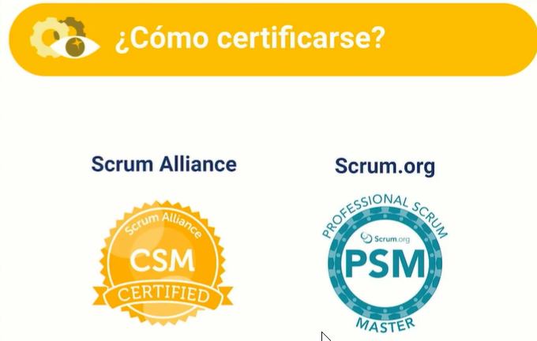
