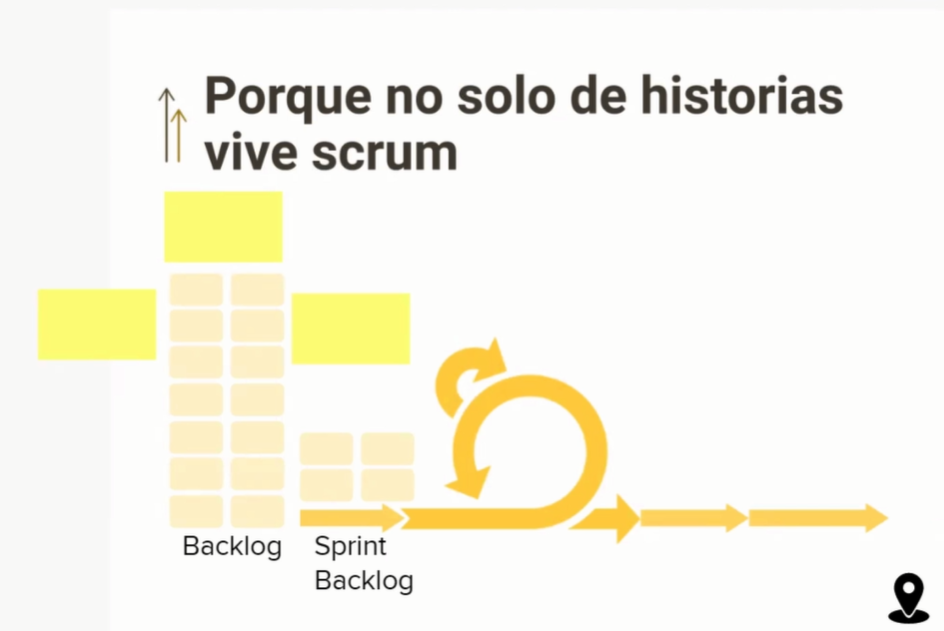
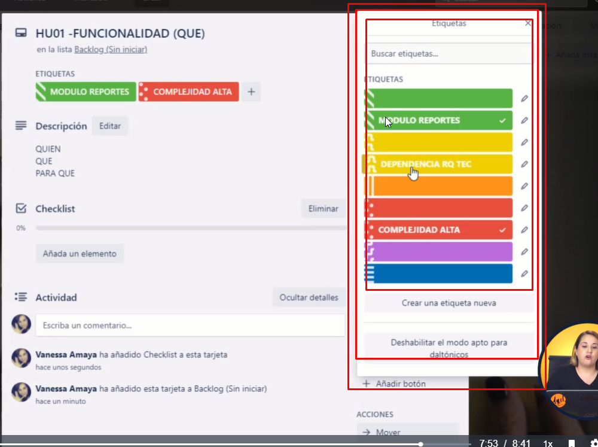

# Curso de Historias de Usuario en Scrum 
*Profesor:Vanessa Amaya*
> Desarrolla los conocimientos y habilidades necesarias para liderar la adopción del marco de trabajo Scrum en cualquier equipo, comprendiendo las responsabilidades del Scrum Master, entendiendo cómo funciona Scrum y la razón de cada uno de sus eventos, roles y artefactos. Aprender a reconocer los diferentes sombreros del Scrum Master e identificar cuándo usar cada uno para hacer intervenciones efectivas.
>


## Clase 1: ¿Qué es una Historia de Usuario (HU)?

> La HU describe de manera simple una funcionalidad que se necesita tener en el software.

**Características**
- Se cuenta desde la perspectiva de la persona que va a utilizar esta funcionalidad.
- Esto es importante porque *el software es de personas para personas*
- No se nos debe olvidar que trabajamos para un usuario final.
- Muchas veces se confunde al cliente (persona que solicita la funcionalidad) con usuario final.
- SCRUM no tiene prácticas, es solo un contenedor de practicas.
- Las HU se originaron en el marco de trabajo XP (Exteme Programming).
- En XP, las HU son unidades de funcionalidad visibles para el cliente.

**Aplicar las HU bajo el concepto de XP permite:**
- Construir funcionalidades pequeñas. Lo que disminuye la complejidad del proyecto.
- “Divide y vencerás”.
- XP nos dice que no solo es redactar, sino conversar al rededor de las historias.

**Notas**
- El software es de personas para personas
- Es un artefacto muy utíl para los procesos Agiles
- Es mas simple que un documento de Requerimientos
- Se debe romper el paradigma de generar documentos extensos y dificiles de leer 
- Enlace -> https://scrum.mx/informate/historias-de-usuario

```
Como cliente
Quiero retirar dinero del cajero automático
Para poder evitar ir al banco a hacer una cola
```

## Clase 2: Estructura de las Historias de Usuarios

- Usuario (Quién): Como usuario admin quiero eliminar comentarios 
- Funcionalidad (Qué): Agregar o eliminar comentarios desde el admin
- Beneficio (Para qué): Interfaz mas limpia para los usuarios sin comentarios no deseados
- Criterios de aceptación: condiciones de calidad a la funcionalidad. son las guias para poder crear lo que se esta esperando.

**Notas**
- En la practica funciona mejor si condensas todo en una sola frase:
```
Como admin quiero poder eliminar los comentarios con menos likes para mantener la plataforma con una interfaz limpia y que resalte los comentarios.

Criterio de aceptación: Es posible eliminar los comentarios con menos de 15 de likes.
```
- El propósito del Daily Scrum es inspeccionar el progreso hacia el Objetivo Sprint y adaptar el Sprint
Backlog según sea necesario, ajustando el próximo trabajo planeado.

- Enlaces -> https://scrum.mx/informate/historias-de-usuario

##  Clase 3: ¿Por qué fracasan los esfuerzos de implementar Historias de Usuario?

>Falla por que falla la simplicidad 

**Notas**
- Cuando hablamos de historias de usuarios debemos hablar en bajo nivel
- Se debe usar la descripción de funcionalidad
- La falla comun es que hablan de forma Modular es decir describen todo en una sola historia de usuario, esto se le denomina Epicas
- Otra falla es No tenemos claro para que hacemos lo que hacemos
- Tiene que describir una sola funcionalidad 
- No hay que subestimar el Quien
- Scrum no son sólo historias de usuario
- Podemos usar este modelo   [Modelo](../03_CursoHistoriasUsuarioScrum/info/historia-de-usuario_Modelo.pdf)
- Podemos usar este ejemplo  [Modelo](../03_CursoHistoriasUsuarioScrum/info/historia-de-usuario_Ejemplo.pdf)




## Clase 4: Estrategias para poder habilitar HUs de manera efectiva

**4 Pasrtes importantes:**
- 1er -> Entendimiento del problema ó entender el origen -> Porque nos piden el sistema
- 2do -> Objetivos del Negocio   -> Nuestro trabajo de cada dia afecta el negocio.
- 3er -> Requerimientos Técnicos -> Se desea saber lo necesario para poder desarrllar nuestro producto.     
- 4to -> Requerimientos de transición -> elementos que necesitamos saber para poder consolidar el desarrollo final de nuestro producto, es evitar que todo funciona en mi máquina. 

**Propiesdades INVEST**
- Independent: La HU debe estar lo mas independizada posible. Muchas funcionalidades = HU épica. 
- Negotiable: Poder descartar historias conforme vamos avanzando en los sprints una no es tan valiosa. Poder negociar → quitar y también priorizar cuales son las más importantes.
- Valuable: Cuando queda claro y entendido el para qué, nos permite saber que una historia es valiosa y saber cual es su beneficio.
- Estimable: Para que algo sea estimable, el equipo o la persona que hará realidad esa funcionalidad tiene que poder decir cuanto tiempo o esfuerzo considera que le demandará. Si por el contrario no es capaz de estimar cuanto tiempo/esfuerzo le pueda tomar, significa que esa historia no es estimable y le falta claridad y reforzar entendimiento de la HU y refinarla.
- Small: Se procura que sea pequeña porque es importante darle peso al entendimiento y la conversación, no a la especificación. Lo hacemos pequeño para provocar conversaciones que alimenten el contexto.
- Testable: Hacerla comprobable, cuando los criterios de aceptación existen y entonces se verifica si esa HU se está haciendo correcta o incorrectamente.


**Nota**
- Cuidado con todo URGE es un sistoma que nada es importante 
- Toda HU debe tener una historia valiosa 
- Esto es para enternos colaborativos, debemos darle voz y voto a todos los colaboradores
- Deben ser historias pequeñas, para poder ser entendible y facil de diregir 
- El Scrumm te dice el qué; pero NO el como!!!

## Clase 5: ¿Qué es un Backlog en Scrum?
> “Es una lista emergente y ordenada de lo que se necesita para mejorar el producto”.
**Características**
- Backlog = Pila de producto = Lista Emergente
- SCRUM = Agilidad = Entornos de incertidumbre
- Priorizar a función de peso o valor 
- Planear en que spring vamos hacer que historia
- Por lo general se usan herramientas digitales como tableros 
- Recuerda que Scrum no tiene practicas propias 
- Usa Etiquetas en tus herramientas para poder indentificar que parte del modulos estas trabajando

**Herramientas**
- Trello  -> https://trello.com/
- Asana   -> https://asana.com/
- Monday  -> https://monday.com/
- Jira    -> https://www.atlassian.com/ 
- ClickUP -> https://clickup.com/

**Ejemplo**





## Clase 6: ¿Cómo se refinan los elementos de trabajo del Backlog?


**Notas**
- Recuerda que refinar es mejorar el entendimiento. 
- Recuerda que NO siempre lo primero que redactas es lo primero que se pueda entender
- Apoyate en tu equipo puedan leer las HUs y estas puedan ser entendibles 
- Rrooming en English  -> Aseo 
- Esta actividad es iteractiva e incremental 
- Historias refinadas pueden pasar a desarrollo 
- Si una historia no entiende una HUs hay que refinar 
- Es importante ganar tiempo al tiempo 
- Las historias que estan en **Spring Backlog** no se tocan es decir no se pueden refinar al menos que si exista una duda 
- Las historias que estan en **Producto Backlog** Si las podemos refinar
- El Product Owner se encarga de refinar, tiene como responsabilidad principal, pero se debe apoyar con su equipo de trabajo para que lo que quisiste decir esta plasmado. 


## Clase 7: ¿Cómo hacemos Historias de Usuario a partir listas de requerimientos?

**Notas**
- La importancia de poner las historias con su contexto para minimizar los errores y tener una visión conjunta de lo que se va a realizar
- Ayudar dar dimensiones al cliente, ayuda a sensibilizar y explicar el esfuerzo para lograr desarrollar el producto. 
- Necesitamos dar dimensiones y mas categorias al desarrollo si no tenemos algo claro, provocamos re-trabajos. 
- Siempre el primer Paso es tener la lista de funcionalidades
- Error número 1, es tomar esa lista de funcionalidades y dar un tiempo y costo del producto 
- Recuerda tener toda la dimensiones claras, para que puedas identificar complegidad y atacarlas. 


**Forma de validar Hus**


## Clase 8: Criterios de aceptación en las Historias de Usuario


**3 recomendaciones de expectativas para crear los criterios:**

- Preguntarse: ¿Qué es importante que probemos? Que es importante que nos enfoquemos, que podría salir mal y que es importante que cuidemos → Las respuestas se dan de manera colaborativa.
- Preguntar/se ¿Qué es lo que nos preocupa?: Ayuda a identificar riesgos o amenazas. Suele derivar en criterios de aceptación para agregar a nuestras historias.
- Preguntar: Qué más necesita saber el equipo? → En colaboración, conocer la experiencia de los colaboradores. Aquí también suele dar hincapié a hacer refinamiento.

**Notas**
- Son condiciones para la calidad. La calidad tiene mucho que ver con la expectativa, mucho con los detalles.
- El diablo esta en los detalles. 
- Cuando te pasen historias de usuarias es importante conversarlas 
```
1 - Preguntarse: ¿Qué es importante que probemos?
2 - En colaboración con equipo:
¿Qué podría ser mal?
¿Qué cuidamos?
¿Qué te preocupa?
¿Qué más necesita saber el equipo?
3 - En colaboración: conocer la experiencia de los colaboradores.
```
- Preguntar a los clientes  -> ¿Qué les preocupa Señor cliente de esta funcionalidad?
- Preguntar al Equipo       -> ¿Qué les preocupa equipo de esta funcionalidad?


## Clase 9: ¿Cómo se priorizan las Historias de Usuario?

**Notas**
- Priorizar no es decir que todo urge
- Sino entender cada una de las partes de la solución y poder decir cual aporta más en este momento, cuál puede esperar y cual no estaría aportando. 
- Es importante hacer la priorización de manera colaborativa.
- Recuerda que el eje principal de la agilidad es entrega frecuente de valor al usuario final 
- Siempre tener prioridades de valor organizandolo en categorias 
- La matriz nos ayuda a tener un tablero visual para priorizar

**Categorizando al Valor que aporta:**

- Aportación al negocio: Categorizar en función a lo que aporta. 
  - Ej: Monetario, reducción de tiempo o costo, integración con algun otro tipo de tecnología.
- Aportación al usuario: Mejorar la interfaz, funcionalidad que premia al usuario.
- Tener en cuenta también la Complejidad Técnica.

**En el tablero de Kanban se realiza la priorización por etiquetas o por el orden en el que están colocadas las historias, siendo las primeras en este caso las más primordiales.**


**Matriz**
- Debemos validar que aporte es valioso usando la herramienta de matriz parecido al análisis FODA
- Validar cual aporta mas y cual aporta menos 
- Debemos ver tecnicamente que tan complejo son las funcionalidades para que el equipo técnico pueda validar y decidir. 
- Complejidad y factibilidad técnica


## clase 10: Primeros Pasos para habilitar Historias de Usuario

**Notas**
- Baja tu nivel de lenguaje técnico a tu audiencia para no generar choque al cambio
- Recuerda existen Dos paradigmas *Entornos Predictivos* y *Entornos Agiles*
- Negociación y redacción es vital como habilidad -> Pule tus habilidades
- Cambia tu forma de conversar cambia tu forma de gestionar.  
- Incluir a tu lenguaje el Valor, la Calidad, la factibilidad Técnica
- Bajale dos a tu Ego y enciende tu luz interior 
- Una gran cucharada de empatia
- Timebox -> una herramienta agil  
- Recuerda que aprendemos cuando prácticamos 
  
**Identifica Barreras en tu Equipo/Empresa:**
  - Resistencia al contexto en partes.
    Costumbre de los Casos de Uso.

**Identifica Barreras en ti:**
   - Conocimiento: Identificar que otra cosa necesitamos saber o conocer para sentirnos mas seguro para proponer el cambio dentro del equipo.
  - Habilidades: La negociación y la comunicación. También la redacción.

**Recomendaciones generales:**
  - Cambia la forma de conversar - Cambia la forma de gestionar: Incluir el VALOR, CALIDAD y FACTIBILIDAD(negocio y técnica).
  - Escucha con más atención y pregunta más: Hacer escucha activa y atrevernos a preguntar.
  - Trabaja por Timebox: Dedicar tiempo a la creación del primer backlog (Análisis).
  

  > Dejo mi Plantilla para iniciar algun proyecto -> https://trello.com/b/iAnohNyb/plantilla-001
