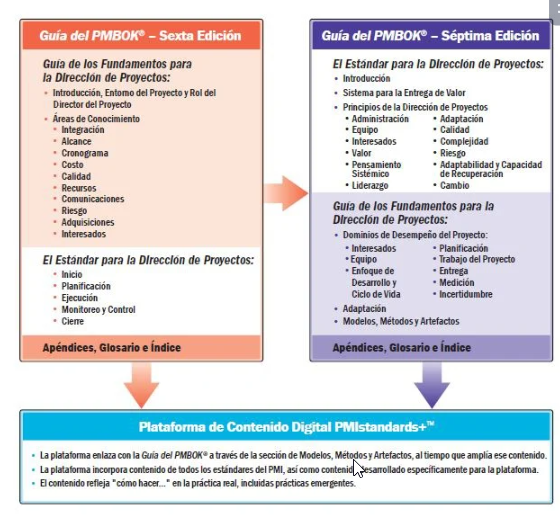
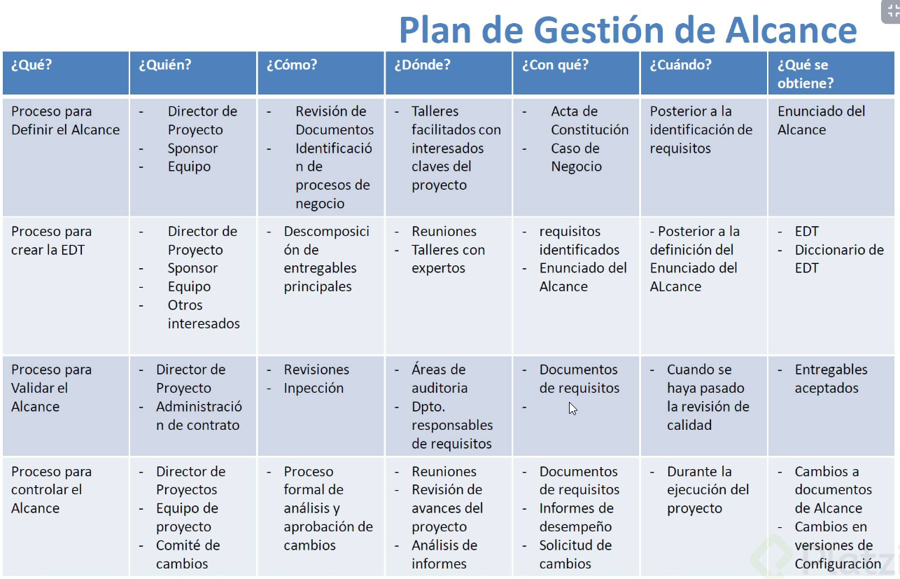
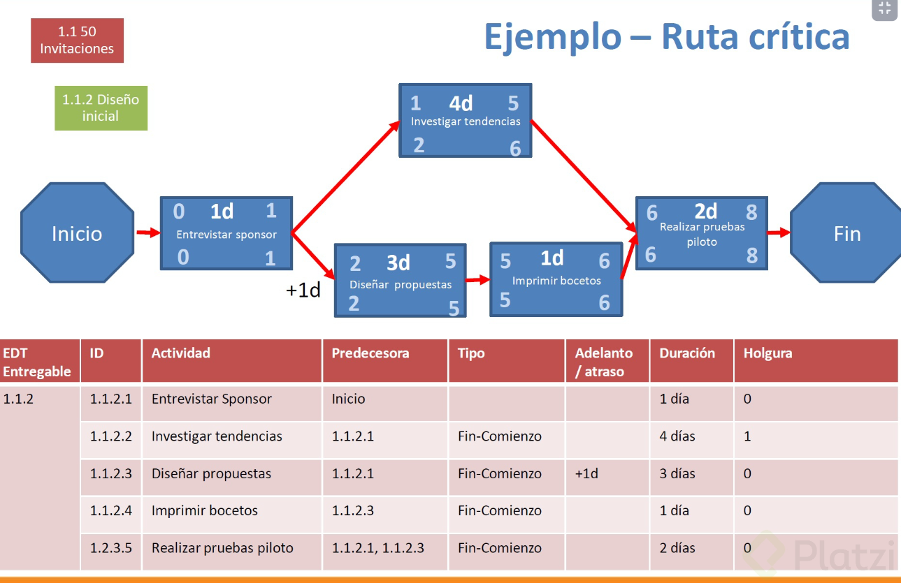
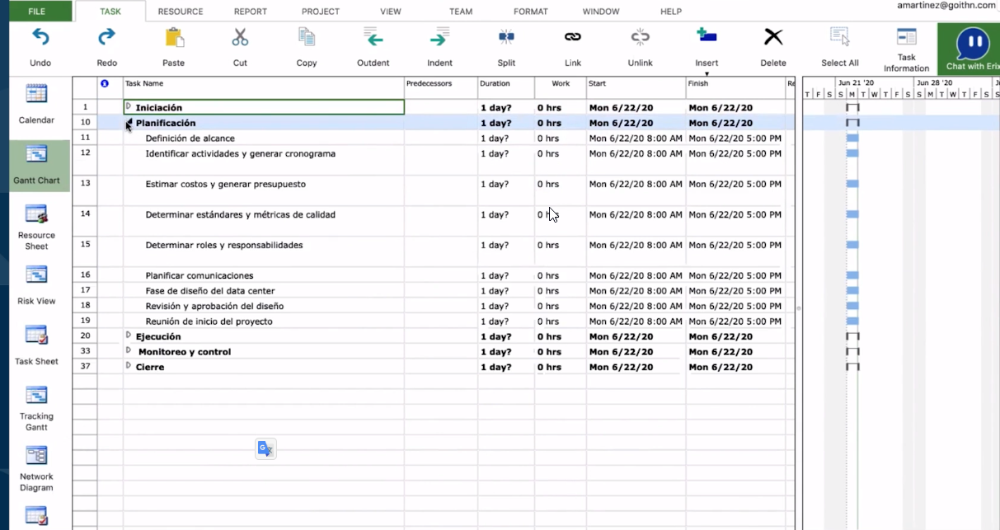
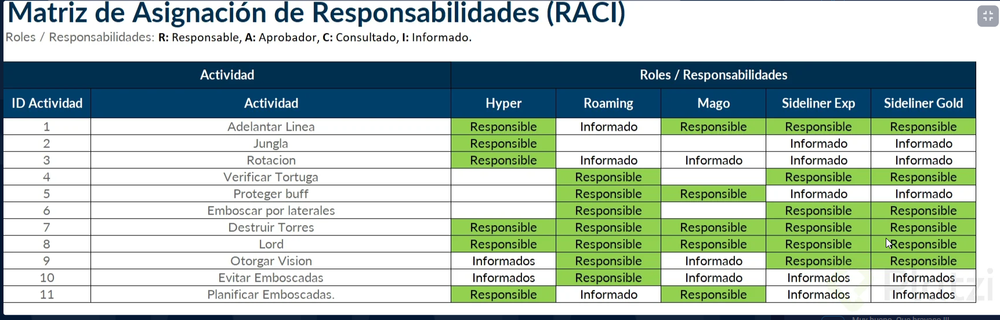
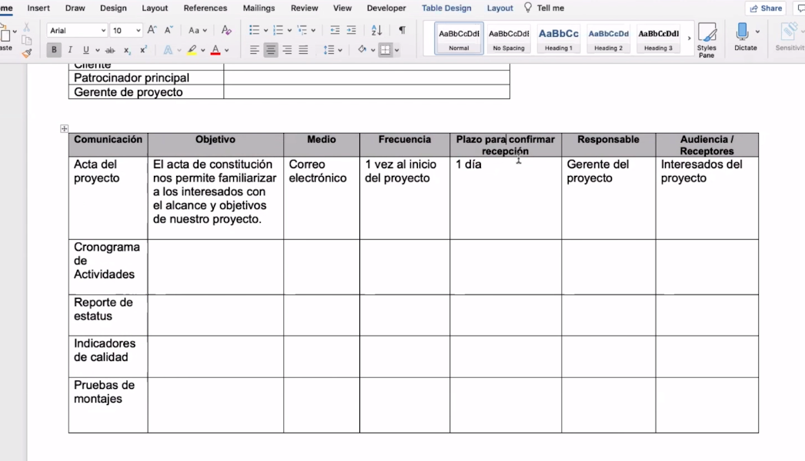
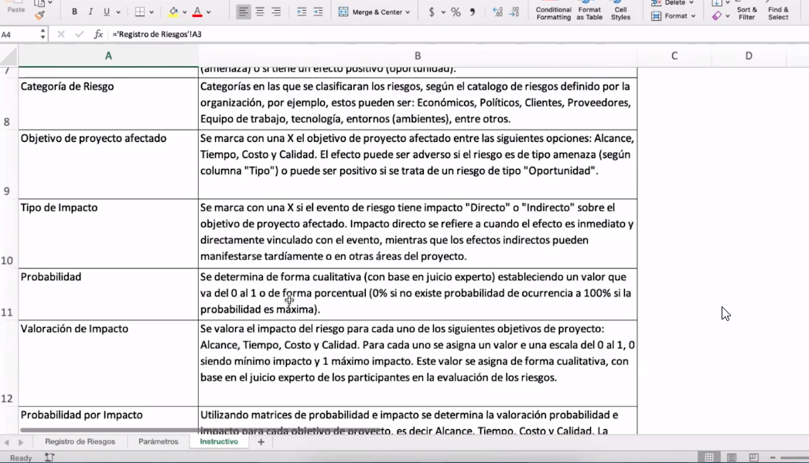
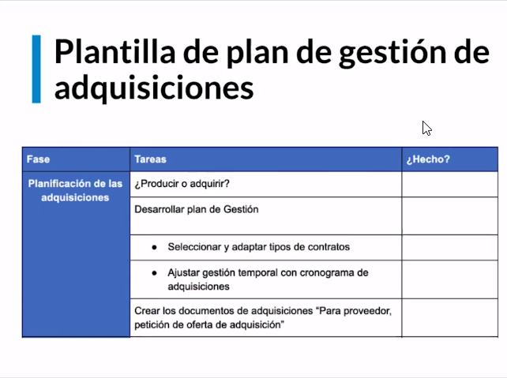
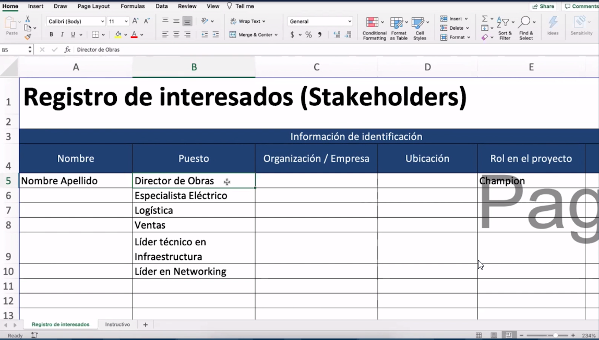

# Curso de Project Management con PMBOK 
*Andrea Martínez*
> Administra proyectos de manera exitosa con PMBOK, la guía estándar internacional publicada por el Project Management Institute (PMI). Aumenta las probabilidades de éxito aplicando los conceptos y actividades clave de las 5 etapas de un proyecto. Adapta la guía PMBOK de acuerdo con tus necesidades y optimiza tus habilidades como administrador de proyectos con Platzi.
>


## Clase 1: ¿En qué consiste la gestión de proyectos?

> “Un proyecto de un esfuerzo temporal que se lleva a cabo para crear un producto, servicio o resultado único”. - PMBOK Guide, PMI

**Etapas de un proyecto**

- Iniciacion
- Planificacion
- Ejecucion
- Monitoreo y control
- Cierre

**Áreas de conocimiento**

- Gestión de la integración del proyecto
- Gestión de los costos del proyecto
- Gestión de las comunicaciones del proyecto
- Gestión del alcance del proyecto
- Gestión de la calidad del proyecto
- Gestión de los riesgos del proyecto
- Gestión de los interesados del proyecto
- Gestión del tiempo del proyecto
- Gestión de los recursos humanos del proyecto
- Gestión de las adquisiciones del proyecto

**Habilidades deseadas**
- Sociales y Humanas
- Áreas de conocimiento 
- Pensamiento Crítico y resolución de problemas 



**Enlaces**
- [Guia](./info/dispositivas_0001.pdf)


## Clase 2: Fases o etapas de un proyecto

1.- INICIACIÓN: Estudiar la factibilidad del proyecto y estimar los tiempos para llevarlo a cabo en su totalidad.Implica 2 documentos: Documento del caso(Justifica la necesidad del Proyecto y beneficios del resultado) y Estudio de Factibilidad(Evaluar metas, crono-gramas y costos).
2.- PLANIFICACIÓN: Pasos a seguir(Plan de seguimiento y control), quienes ejecutaran, tiempos correspondientes y costo de cada actividad.*
3.- EJECUCIÓN: Poner en marcha etapa 1 y 2.
4.- SEGUIMIENTO Y CONTROL: Supervisar el progreso con el propósito de corregir lo necesario en el camino.
5.- CIERRE: Entrega de resultados a cliente y comunicado a todas las partes interesadas.


## Clase 3: Gestión de integración de un proyecto

> Cuando iniciamos una integración de proyecto debemos pensar en el equilibrio que deseamos tener con las etapas del proyecto. 

**Ejemplo**
- Si deseamos tener el estimado de costos, tenemos que definir quien van  a participar si quitas un elemento este impacta al cronograma. 
- 

**Características**
- Tenemos muchas herramientas para integrar estas son: 
	- Acta de Constitución contiene: Se requiere una planificación de alto nivel. 
		- Lista Interesados
		- Requisitos a Alto Nivel
		- Alcance.
		- Objetivos y Criteros de Exito.
		- Riesgos.
	- Solicitudes de Cambio (Debe existir un comite de cambios)
		- Acciones correctivas
		- Acciones Preventivas
		- Control integrado de cambios
		- Comité de cambios.
	- Proceso para realizar cambios
		1.- Obtener la aprobación del cliente
		2.- Evaluar el impacto.
		3.- Identificar las opciones.
		4.- Evaluación interna donde aprueba o no la solicitud.
		5.- Ajustar plan.
		6.- Gestion expectativas
		
[solicitud-de-cambios](./info/solicitud-de-cambios_.docx)		
		
## Clase 4: ¿Cómo gestionar cambios durante la fase de ejecución?		

**Etapas del documento control de cambios**

1.- Sección: Datos de la solicitud de cambio
	- ID de solicitud de cambio
	- Solicitante de cambio
	- Área del solicitante
	- Patrocinador del proyecto
	- Gerente del proyecto
2.- Sección: Categoria de cambio
	- Alcance
	- Cronograma
	- Costos
	- Calidad
	- Recursos
	- Otro
3.- Sección: Causa / Origen del cambio
	- Solicitante del cliente
	- Reparación de defecto
	- Acción correctiva
	- Acción preventiva
	- Otros
4.- Sección: Descripción de la propuesta de cambio
5.- Sección: Justificación de la propuesta de cambio
6.- Seccion: Impacto de la línea base
	- Alcance
	- Cronograma
	- Costo
	- Calidad
	
## Clase 5: Gestión de alcance

> Muy bien descrita la gestión del Alcance, aunque la plantilla es del Project Charter, para la gestión del alcance es necesario saber conceptos como EDT o Estructura de Desglose de Trabajo, trabajo, entregables.



- ALCANCE: Es la suma de productos, servicios y resultados a ser proporcionados como un proyecto.
- EDT: Es una descomposición jerárquica del alcance total del trabajo a ser realizado por el equipo de proyecto para cumplir con los objetivos del proyecto y crear los entregables requeridos.
- TRABAJO: Esfuerzo sostenido físico o mental, o ejercicio de habilidades para superar los obstáculos y alcanzar un objetivo. Comúnmente utilizado para referirse a una actividad específica, a un deber, función o tarea que a menudo es una parte o fase de una misión mayor, o algo producido o logrado por el esfuerzo, o el uso de habilidades. En este contexto, el trabajo se refiere a los productos de trabajo o de los productos que son el resultado del esfuerzo y no el esfuerzo en sí.
- PAQUETE DE TRABAJO: Es un entregable o un componente de trabajo del proyecto en el nivel más bajo de cada rama de la estructura de desglose del trabajo. El paquete de trabajo incluye las actividades e hitos necesarios para completar el componente de trabajo o entregable.
- ENTREGABLE: Cualquier producto, resultado o capacidad de prestar un servicio único y verificable que debe producirse para terminar un proceso, una fase o un proyecto. También hace referencia a un entregable externo que está sujeto a aprobación del sponsor o cliente.

**GESTIÓN DEL ALCANCE SEGÚN PMBOK**

[plantilla-acta-de-proyecto](./info/plantilla-acta-de-proyecto_b.docx)


## Clase 6: Gestión de tiempo

**Concepto**
- Para complementos de la Ruta crítica, hay dos maneras para analizar, 
- la mas facil es por medio de Ms Project, donde ya te calcula la ruta crítica, que provee la duración total mínima del proyecto 
- y la fecha más temprana de finalización en donde siempre la actividad finalizará antes que su sucesora comience. 

**Existen varias estimaciones como:**
- ANÁLOGA: Usa los valores de parámetros, tales como alcance, costo, duración o complejidad de proyectos previos (datos históricos), para estimar
el proyecto actual. 
- El resultado podría ser impreciso y se requieren datos de proyectos similares.
- PARAMÉTRICA: Usa una relación estadística entre la información histórica y otras variables necesarias para calcular un estimado para el parámetro de cada actividad. Se aplica un algoritmo para la estimación.

**BASADA EN TRES VALORES:**
- Realista  ™     = Duración de la actividad, con recursos asignados, disponibilidad y productividad realista.
- Optimista (to)= Basado en el escenario más optimista
- Pesimista (tp)= Basado en el escenarios más pesimista

**Ejemplo**


## Clase 7: Desarrollando un cronograma

Para aquellos que no tienen Microsoft Project y solo quieren ver el archivo les dejo esta liga donde podrán hacerlo.
Solo descarguen el archivo .mpp de la sección de archivos de clase y ábranlo desde la web.
https://www.projectplan365.com/projectviewernow/tViews.aspx



## Clase 8: Desarrollando un cronograma

**Formula ROI** 
- ROI Retorno de inversion 
- Formula = (Ganancia – Inversión) / Inversión
- Si el resultado es menor a 0, la inversión tiene retorno negativo; es decir, la empresa no obtuvo utilidades. 
- Caso contrario, el retorno es positivo, por lo tanto, hay utilidades.

**Entradas para estimar los costos:**

- Primer paso
	- El plan de gestión de costos
	- La línea base de alcance
	- Cronograma del proyecto
	- Plan de gestión de los recursos humanos
	- Registros de riesgos

- Segundo paso:
	- Determinar el presupuesto:
	- Determinar las tarifas de costos
	- Análisis de reserva
	- Costo de calidad

- Controlar los costos:
	- Informes de avance
	- Análisis de reserva de contingencias
	- Medición del valor ganado
	

## Clase 9: Determinando el presupuesto
	
> Clase Practica 
	
**Ejemplo* 


**Material**
[Ruta cronograma](./info/plantilla-presupuesto-de-un-proyecto_.xlsx)

## Clase 10: Determinando el presupuesto
	
**Concepto**
> Es el Grado en que cumples con los requisitos de un proyecto. 

**Impacto de una baja calidad**
- Costos incrementados
- Menores ganancias
- Baja motivación
- Baja satisfacción de cliente
- Riesgos incremantados
- Reproceso
- Retrasos en cronograma

**Planificar la calidad.** 
- Identificar todos los requisitos, std y practicas de la org. o industria relevantes para la calidad del proyecto, y luego planificar como cumplir con tales std y requisitos de calidad.

** Herramientas de calidad** 
- Diagrama causa-efecto
- Diagrama de flujo
- Hoja de chequeo
- Diagrama de Pareto
- Histograma
- Diagrama de control
- Diagrama de dispersión

**Resumen**
- Se asegura la calidad mientras se realiza el trabajo del proyecto. 
- Monitorear continuamente por medio de Auditorias y análisis de procesos.	


## Clase 11 Gestión de los recursos humanos

**Gestión de los recursos humanos:**
• Determina qué recursos necesitas.
• Confirmas su disponibilidad.
• Roles y responsabilidades claramente asignados.
• Generar informes de desempeño y opciones de recompensas.
**Tipos de equipos**
• Dedicado: FULL TIME
• Medio tiempo: PART TIME o participe de MULTIPLES proyectos a la vez.
• Sociedad: Cuando multiples organizaciones trabajan en un proyecto.
• Virtual: Trabajo con personas de manera remota.
**Etapas de formación y desarrollo del equipo**
• Formación
• Turbulencia
• Normalización
• Desempeño
• Disolución
**Gestión de conflictos**
• Colaborar
• Consentir
• Eludir
• Suavizar
• Forzar

## Clase 12 Matriz de responsabilidades



[Matriz de responsabilidades](./info/plantilla-matriz-raci.xlsx)


## Clase 13: Gestión de las comunicaciones

**Tipos de comunicación.**

- Formal escrita: Problemas complejos.
- Formal verbal: Presentaciones o discursos.
- Informal escrita: Correo electrónico, notas manuscritas, mensajes de texto.
- Informal verbal: Reuniones y conversaciones.


**Técnicas**

- Siempre cuando se envía un mensaje escrito verlo desde los ojos de un niño, para ver si es claro, evitar tecnicismos o lenguaje que no permita una claridad.
- Comunicar siempre de forma transparente no solo las cosas buenas sino también las situaciones que ocurren y cómo las soluciona el equipo.
- Mantener un boletín dei información de avance del proyecto con los Sponsor y Líderes del grupo


```
Comunicación efectiva
7% Palabras
38% Tono de voz
55% lenguaje corporal
```

## Clase 14: Elaborando un plan de comunicaciones 



[plan de comunicaciones](./info/plantilla-plan-de-comunicaciones_.docx)

```
Para mantener actualizados a todos los miembros del equipo, suelo como product owner, realizar SCRUM y apoyarme de sistemas de inforamación para la gestión de proyectos que me permiten alternativas de comunicación, monitoreo y control de la actividades. Algunas de las que uso diariamente son: Sinnaps y Discord
```

## Clas 15: Gestión de riesgos

**Concepto**
> Se identifican y gestionan desde el inicio y se monitorean constantemente.
> Riesgo: suceso probable que ocurran que afecte el proyecto. Puede existir incertidumbre de acuerdo al conocimiento que se tenga.

**Pasos para Gestionar riesgos:**

- Planificar la Gestion de los Riesgos
- Identificar los riesgos
- Realizar el análisis cualitativo
- Realizar el análisis cuantitativo
- Planificar la respuesta a los riesgos
- Controlar los riesgos.

**Categorias de riesgos:**
- Externos: ambientales, de gobierno, mercado, etc.
- Internos: cambios en tiempo, alcance, experiencia.
- Técnicos: cambios tecnologicos
- Imprevisibles: cosas que no se lograron identificar

**Estrategias de respuesta a riesgos:**
- Evitar
- Mitigar
- Transferir

## clase 16: Elaborando un plan de respuesta a riesgos




[plan de comunicaciones](./info/plantilla-registro-de-riesgos.xlsx)

```
Puedes identificar riesgos en cualquier etapa del proyecto, no siempre identificaras todos los riesgos en la etapa de planeación y no siempre será posible definir el plan de acción en el momento en que identifiques el riesgo.
```


## Clase 17: Gestión de adquisiciones

**GESTIÓN DE ADQUISICIONES**
> Es un proceso formal para obtener bienes o servicios.

**Documentos de adquisición:**
• Solicitud de propuesta RFP
• Invitación a licitación IFB
• Solicitud de cotización RFQ

**Proceso:**
- Planificar
- Eferctuar
- Controlar
- Cerrar

**Tipos de enunciados:**

• Desempeño
• Funcional
• Diseño

**Categorías de contratos**

• Precio fijo FP
• Tiempo y materiales T&M
• Costos Reembolsables CR

**Conceptos importantes:**

• Criterios de selección de proveedores
• Solicitud de cambios
• Acuerdo de confidencialidad
• Carta de intención
• Vinculo legal.

## Clase 18: Elaborando un plan de gestión de adquisiciones



[plan de comunicaciones](./info/plantilla-plan-de-gestion-de-adquisiciones.docx)

```
La gestión de adquisiciones se encarga el área financiera o el área de compras y servicios en una empresa, en coordinación con el PMP.

Así es, el coordinador del proyecto revisa que recursos necesita y se los envía al área financiera, comercial, o el área de compras para que se encarguen de las adquisiciones.
```

## Clase 19: Gestión de interesados de un proyecto

**Proceso de gestión de interesados**

1.- Identificarlos a todos (Personas que se ven impactados de una u otra forma)
2.- Determinar sus requerimientos, expectativas e intereses. (Pueden tener diferentes niveles de requerimientos, determinar lo mínimo que deben comunicarles y que es lo mínimo esperando en ellos)
3.- Determinar su nivel de influencia.
4.- Planificar comunicaciones.
4.- Gestionar sus expectativas, influencia y compromiso. (Los objetivos o entregables deben ser comprendidos por los interesados)
5.- Comunicarte con ellos y controlar las comunicaciones.



[interesados de un proyecto](./info/plantilla-registro-de-interesados.xlsx)

```
Considero que el gerente debe estar en constante comunicaicon con ellos para conocer las expectativas del grupo de interes, los requisitos casi siempre estan en la planeacion debido a que al crear un Proyecto su fin es solucionar un problema que afecta a tu grupo de interes

Talves este equivocado.

En mi opinión, una vez que identificas a los interesados y les comunicas el objetivo del proyecto mediante alguna reunión, ellos te darán retroalimentación de lo que esperan del proyecto, sus requisitos, etc.
```
