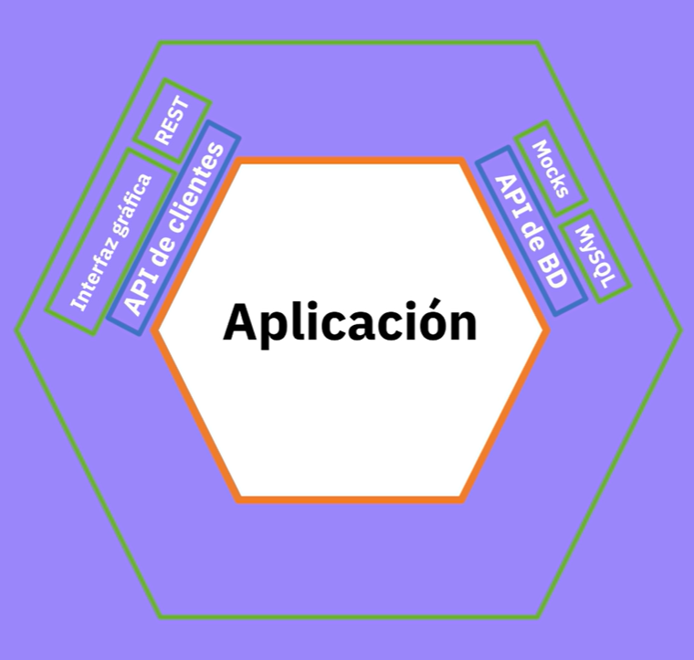
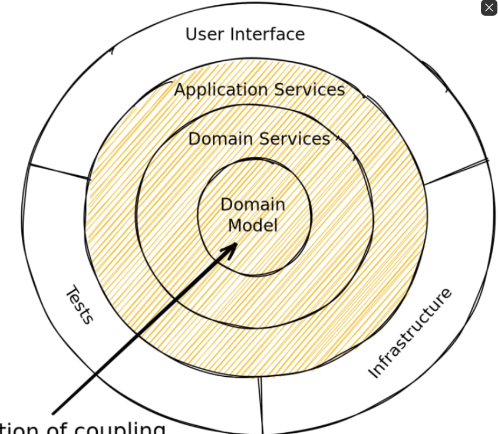
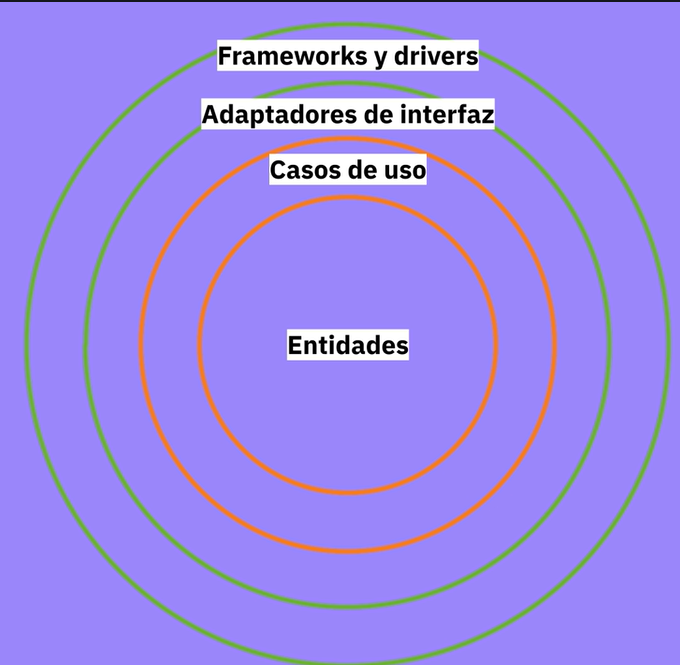
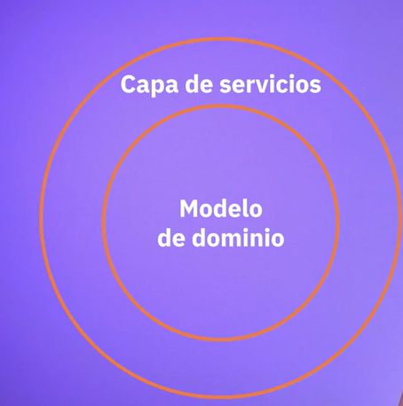
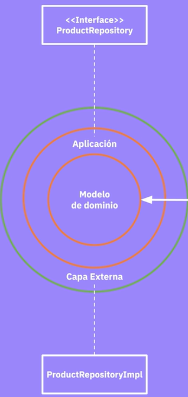
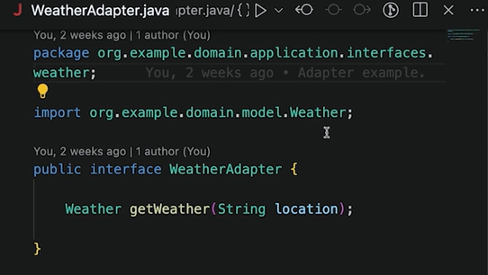
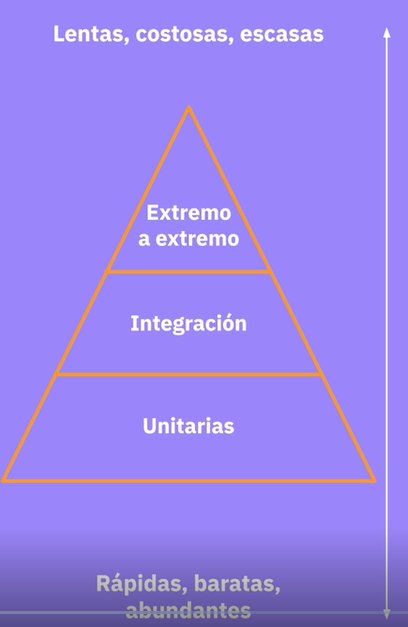

# Curso de Arquitecturas Limpias para Desarrollo de Software 

## Clase 1: Presentacion
Profesor: Manuel Zapata

## Clase 2:¿Qué son las arquitecturas limpias? 

> Habitaulmente las arquitecturas se organizan en tres capas puede tener menos pero es la mas común:  
- Presentacion
- Dominio
- Acceso a datos

> La mas usada arquitecturas MVC 
- Vista       -> Interfaces mas que todo el front para presentar los datos e interación con el usuario 
- Controlador -> son los pies de tu aplicación aqui se controla se realiza el pase de los datos
- Modelo      -> la sección logica e interación con la base de datos 


**Desventajas de estas capas convencionales**
- Sin embargo tenemos muchas limitaciones por su desarrollo centrado en la base de datos 
- La lógica de negocio depende totalmente de la persistencia.
- Si hay otras integraciones, no queda claro donde tienen que ir.
- La lógica de negocio a veces empieza a filtrarse.

> Ante estas desventajas nacen las arquitecturas limpias 

##  Clase 3: Características comunes de arquitecturas limpias


**Características**
- El Dominio como elemento central -> Son los elementos que hacen árte del core del negocio. 
```
En una arquitectura limpia, el dominio y la lógica de negocio son el corazón de la aplicación. 

Esto significa que todas las funcionalidades de la aplicación giran en torno a las reglas de negocio, que se 
encuentran en el centro de la arquitectura. 

Esto permite a los desarrolladores enfocarse en las reglas de negocio, que son las partes más críticas y valiosas de la aplicación
```

- El dominio no depende de elementos externos. -> Consideramos elementos externos las interfaces y la base de datos ya que no afectan a nuestro dominio. 
```
Generalmente se refiere a la lógica de negocio de la aplicación, que son las reglas y comportamientos que definen cómo opera tu aplicación o sistema.

Cuando se dice que “El dominio no depende de elementos externos”, significa que la lógica de negocio de la aplicación no debe depender de detalles de infraestructura 
como la base de datos, la interfaz de usuario, los servicios de red, entre otros.

Se podría cambiar la base de datos de MySQL a PostgreSQL, cambiar la interfaz de usuario de una interfaz gráfica a una interfaz de línea de comandos, 
o cambiar tu protocolo de red de HTTP a WebSocket, y ninguna de estas modificaciones debería requerir que cambies la lógica de negocio de tu aplicación.
```
- Las dependencias se invierten -> Esto quiere decir que la capa mas externa va depender del dominio, aquí hay que imaginare que las capas con círculos y cada circulo exterior va depender del círculo mas interno que este es el dominio. 
```
 las dependencias inversas permiten que el código sea más modular y más fácil de mantener y desarrollar. 
 La lógica de negocio no depende directamente de las implementaciones de base de datos o de otros servicios. 
 En su lugar, estos servicios se conectan a la lógica de negocio a través de interfaces o abstracciones, lo que facilita el 
 cambio de una implementación por otra sin afectar la lógica de negocio.
```
- Facilitan las pruebas (Testability). -> Al tener el dominio separada de la capa externa nos permite aislar y realizar testing mas eficiente 

```
Dado que la lógica de negocio no está entrelazada con la lógica de la infraestructura 
(como la UI, la base de datos, etc.), es más fácil de probar. 
se pueden crear pruebas para la lógica de negocio sin tener que preocuparte por los detalles de la implementación de la infraestructura.
```

## Clase 4: Cuándo aplicar y cuándo ignorar este tipo de arquitecturas

**Cuando Aplicar**
- Cuando tienes un sistema necesita cambios en el tiempo sostenible  
- Constante mantenimiento (Aplicaciones con dinero ó salud)
- Testeabilidad. -> como que es difícil encontrar sistemas donde no sea muy necesario testear, dado que para desarrollar lo hacemos en base a requerimientos de un negocio y eso lo tenemos que validar.
- Múltiples integraciones (aislar el dominio de integraciones).
- Flexibilidad para cambiar implementación -> aquí me genera la duda sobre la diferencia con Mantenibilidad, me parece que estaría incluido en mantenibilidad (Open Close principle)

**Cuando ignorar arquitecturas limpias**
- Sistemas sencillos ( ej: CRUD)
- PoC (Pruebas de concepto)
- Bajo #Número de integraciones ( ej: solo bd). -> Aquí también puede ser muy similar a sistemas sencillos.


## Clase 5: Principios de diseño


```
S : Principio de Única Responsabilidad.
Un módulo debería tener una sola razón para cambiar.

O : Principio de Abierto Cerrado.
Un módulo debería estar abierto a extensiones y cerrado a modificaciones.
Solución: Generar una clase Padre que puedan instancias hijos para poder ejecutar diferentes metodo ejemplo un 
if($ciudad = Bogota){
	ejecutar::alarmar()
}else if($ciudad = Buenos Aires){
	ejecutar::alarmar()
}else if($ciudad == Caracas){
	ejecutar::alarmar()
}

L : Principio de Sustitución de Liskov.
Las clases derivadas deben poder sustituirse por sus clases base.

I : Principio de Segregación de la Interfaz
Haz interfaces que sean específicas para un tipo de cliente

D : Principio de Inversión de Dependencias
Los módulos de alto nivel no deberían depender de los módulos de bajo nivel.
 Bajo Nivel -> Base de datos e interfaz 
 Alto Nivel -> Dominio
```

## Clase 6; Arquitectura Hexagonal

**Esta arquitectura está compuesta por:**

- Aplicación: Es la capa de negocio diseñada como un hexágono.
- Puertos: Son aquellos puentes hacia la aplicación.
- Adaptador: Realizan la conversión de algo externo hacia lo que la aplicación entiende, es decir, será el ajuste hacia algo que el puerto pueda entender.
- Regla de la dependencia: Los elementos externos tienen conocimiento de lo que hay hacia dentro (en la aplicación), pero nunca al revés, la aplicación no tiene conocimiento de estos adaptadores que se están construyendo alrededor de la aplicación.
- Actos primarios: Son aquellos adaptadores que son capaces de iniciar interacciones en el sistema, por ejemplo una interfaz gráfica o un API Rest que se comunican con una API de clientes y ésta finalmente es quien interactúan con la aplicación.
- Actores secundarios: Son aquellos adaptadores que son de alguna forma notificados de acciones que ocurren en la aplicación. Son parte del flujo.

¿Por qué un hexágono?
Para dar espacio para insertar los puertos y adaptadores que sean necesarios.

**Ejemplo**
- Adaptador ->  puede ser una interfaz gráfica.(Navegación de usuario) 
- Adaptador -> api BD -> Mysql 

 

## clase 7: Arquitectura Cebolla

**Arquitectura Cebolla**
- Modelo de dominio: Es la capa que se encuentra más al interior de la cebolla. Se tienen las entidades que modela el problema y éstas no están relacionadas con la persistencia. Sólo tiene dependencia de sí mismo, nunca de las capas que lo están rodeando. Se denomina “modelo de objetos”, “capa de dominio” o “entidades de dominio”.
- Servicios de dominio: Contiene reglas del negocio, pero un elemento fundamental es que habrán interfaces que van a representar repositorios para acceder a los datos. Se van a definir las interfaces pero no se van a implementar. Se denomina “servicio de objetos” o “capa de repositorio”.
- Servicios de aplicación: Lógica de la aplicación puede estar repartida entre los servicios de aplicación y servicios de dominio. Se denomina “capa de servicios”.

**Esto se denomina el núcleo del sistema.**

1.- Capa externa: Rodea al núcleo del sistema y esa pueden estar:
2.- Pruebas: Unitarias, de integración y ayudar a testear que todo esté funcionando correctamente.
3.- Interfaz gráfica: Es algo que puede cambiar con el tiempo.
4.- Infraestructura: Se tienen elementos como acceder a un sistema de archivos, aplicaciones de terceros e integraciones varias.

**Esta capa externa rodea al dominio.**

**Datos adicionales:**
- Propuesta por Jeffrey Palermo en 2008.
- Arquitectura conocida principalmente en el ecosistema .NET.

 


## clase 8: Clean Architecture


*Se divide en capaz**

- Entidades: Capa central, son reglas de negocio que aplican a nivel empresarial y que son comunes a múltiples aplicaciones.
- Casos de uso: Reglas de negocio más específicas de la aplicación.
- Adaptadores de interfaz: Son el puente entre elementos muy específicos o detalles hacia lo que entendemos en el core de nuestra aplicación, principalmente en los casos de uso y las entidades.
- Frameworks y drivers: Detalles puntuales del sistema, tales como la base de datos, la web, sistema de archivos y todo lo que ocurre allí será convertidor por la capa previa para que pueda ser utilizada por los casos de uso y las entidades.

*Datos adicionales:**

- Fue descrita por Robert Martin en 2012.
- Se apoya en las ideas de la arquitectura hexagonal, cebolla y otras.
- El mayor reto que tiene es que presenta huecos en su implementación, por lo que se busca tener una apreciación por parte de diferentes arquitectos de software para llevarla a cabo.

**Ventajas**
- Hay vacios en la arquitecrura por lo que el experto lo llena con previa experiencia 



## Clase 9: Ejemplos del mundo real

## **Caso Netflix**
> Necesitaban crear una arquitectura que les permitiría trabajar con datos de múltiples fuentes y para ello crearon una arquitectura que denominaron “hexagonal” compuesta por los siguientes elementos:

**Elementos en el dominio:**
- Entidades.
- Repositorios.
- Interactors.

**Elementos en la capa externa:**
- Fuentes de datos (data sources).
- Capa de transporte.
- Se dieron cuenta que tenían unas dependencias inestables y que estaban sujetas a cambios.

## Caso Makrwatch
Tenían una arquitectura de 3 capas que no daba lugar a múltiples integraciones, por lo que optaron por construir una nueva aplicación con arquitectura limpia compuesta por los siguientes elementos:

- Entidades.
- Servicios.
- Infraestructura (Plataforma, redes sociales, mensajería, REST).

**Un ejemplo de proyecto que usa arquitectura limpia tiene la siguiente estructura de directorios:**

- main
- domain
- services
- interfaces
- entities
- common
- infraestructure
- rest
- messaging
- test
- unit
- integration

**¿De que le ha servido a esta startup construir arquitecturas limpias?**
- Proteger la lógica de negocio de cambios en las integraciones.
- Probar más fácil la lógica de negocio.
- Crear buenos hábitos en el equipo de desarrollo.


## Clase 10 : Conclusiones

- Hay que tomarlas como un punto de partida y adaptarlas a tu situación.
- El número de capaz depende de ti, tanto en el dominio como en la capa externa.
- La regla de la dependencia es sagrada.
- Los nombres de las arquitecturas y capas suelen usarse de forma arbitraria.
- La arquitectura que se llevará a cabo en el curso tiene los siguientes componentes:
	- Modelo del dominio.
	- Aplicación.
	- Capa externa.

> “La arquitectura es acerca de las cosas importantes. Sean las que sean”. Ralph Johnson.


## Clase 11: Detalles sobre el dominio

 > Es dominio es la razon del ser del sistemaEl dominio es la razón de ser del sistema.

 **Tiene varios nombres:**

- Lógica de negocio.
- Lógica de dominio.
- Negocio.

**Reglas Básicas**
- El dominio es el elemento central. Hay que cuidarlo mucho.
- Cuando hablamos del dominio, nos referimos a la lógica del negocio.
- Siempre va de afuera hacia adentro
- No hay que vulnerar al dominio
- El dominio es simple y sencillo es tu modelo no debes exponer o conumir nada 
- El dominio NO NO CAMBIA 
- Retornar datos o fragmento de código ejemplo return "<span>Hola mundo</span>"
- Debemos mantener fuera del dominio elementos cambiantes que no corresponden a la lógica (el tipo de aplicación, hardware)

**Podemos organizar el dominio con la ayuda de**
- Script de Transacción
- Modelo de Dominio
- Capa de Servicios (complementa muy bien al modelo de dominio)
- Casos de uso
- CQRS


“El dominio involucra lo que debe hacer el negocio, haya o no sistemas de información”.

## Clase 12: Organizando el dominio con un script de transacción

> Este script de transacción organiza la lógica en procedimientos. Cada procedimiento maneja una única solicitud de la capa externa.

**¿Cuándo usar script de transacción?**
- Aplicaciones con poca lógica de negocio.
- Problemas simples.

**Problemas del script de transacción**
- Se vuelve difícil de mantener cuando la lógica crece.
- Lleva a código duplicado.
- No aprovecha la programación orientada a objetos.

## Clase 13: Inversión de Control (IoC)

> Un objeto o programa cede el control a alguien más.

**Inyección de Dependencias (DI)**
- Es una forma de implementar inversión de control. 
- Es una técnica donde a un objeto le proveen las dependencias que necesita.

**Formas de hacer inyección de depencias**
- Por constructor.
- Por setter.
- Por método.
- Por interfaz.

**En pocas Palabras**
- Es una interfaz 

## Clase 14: Modelo de dominio

> Es una representación en objetos del dominio, que incluye comportamiento y datos de manera simultánea y no anémicos (con datos pero sin comportamiento y viceversa).


¿Qué puede incluir un modelo de dominio?

- Entidades.
- Objetos de valor.
- Herencia.
- Relaciones.
- Patrones de diseño.

**Recordar**
- **Modelo de dominio ≠ Modelo de base de datos**

## clase 15: Capa de Servicios

> Ofrece una fachada para consumir facilmente el modelo y de dominio y coordinar la respuesta.

- Practicamente es encapsular el uso del dominio 




## clase 16: Casos de Uso -> Forma Parte de la Capa Dominio

> Contiene reglas de negocio específicas de la aplicación. Coordinan el flujo de datos desde y hacia el modelo de dominio.

**Ventajas**
- Nos ayudan cordinar el flujo de datos desde la capa externa hacia la capa del dominio 
- Se usa una clase por cada implementación
- Se suele implementar una clase por caso de uso.
- Nota: Los casos de uso se suelen encontrar con los sufijos Interactor, Service o CommandHandler.
- Nos da una organización muy especifica tetniendo ventaja de modificar o actualizar en un solo lugar 
- Se usa Dto 


## Clase 17:  CQRS -> Forma Parte de la Capa Dominio

> CQRS -> Command Query Reponsability Segregation

Se divide en comandos y consultas.

**Comandos** 

- Escritura.
- Cambian el estado.

**Consultas**

- Lectura.
- Retornan resultados.

**Esta idea se puede aplicar a varios niveles:**

- Métodos.
- Clases.
- Servicios.
- Bases de datos.


## Clase 18: Acceso a Datos -> 

**¿Qué sentido tiene sacar la base de datos a la infraestructura?**
- MIgrar de base de datos NO es la mejor razón.
- Las razones para realizar este procedimiento son:
 - No es tu única fuente de datos. 
 - Puedes llegar a tener diversas fuentes como:
	- Bases de datos legacy (Utilizadas en otras aplicaciones en un esquema organizacional).
	- Archivos (formato JSON, XML o TXT).
	- Sistemas de terceros, por ejemplo CRM.
	- Motores de búsqueda, por ejemplo Algolia o Elasticsearch.
	- Necesitas probar bien. 
	- Esto significaría tener una base de datos o tener dichas fuentes de datos a la mano para poder realizar las pruebas.
	
## Clase 19: Patrón Repository

**¿Cómo separar el dominio del acceso a datos?**
> Una forma es usando el patrón Repository, el cual ofrece una fachada que da la apariencia de estar usando colecciones y esconde los detalles específicos sobre el funcionamiento de la persistencia.

> La interfaz hace parte de la capa de la aplicación, mientras que la implementación hace parte de la capa externa.

**Ejemplo:**

Se tiene una interfaz denominada ProductRepository, la cual define la firma de los métodos:

 - add(Product)
 - findById(int)
 - remove(Product)

 Se tiene una clase que implementa la interfaz ProductRepository y es denominada ProductoRepositoryImpl, la cual tiene la implementación de cada uno de los métodos mencionados con anterioridad:

 - add(Product)
 - findById(int)
 - remove(Product)

> De esta forma se podría crear una nueva clase que implemente esa interfaz y pueda realizar operaciones de lectura o escritura de diferentes fuentes de datos, sin tener el dominio atado a una implementación en específico, que es básicamente lo que se busca en un arquitectura limpia.



## Clase 20: Aplicaciones web y APIs


**Hacen parte de la capa externa.**

> Errores a evitar:
- Poner lógica de negocio en la vista.
- Poner lógica de negocio en los controladores.

## Clase 21: Integraciones y patrón Adapter

**Ejemplos comunes**
1.- Envío de mensajes.	
	- Correos electrónicos.
	- Mensajes de texto.
	- Notificaciones push (web o móvil).
	- Mensajes de chat (WhatsApp o Telegram).
2.- Escritura y lectura de archivos.
	- Disco.
	- Almacenamiento de objetos.
	- Servidor FTP.

3.- Comunicación con otros servicios.
	- Colas de mensajería.
	- REST.
	- Llamado de procedimientos remotos (RPC).


**Patrones de diseño**
- Son soluciones recurrentes a un problema de diseño.

**Patrón Adapter**
- Convierte la interfaz de una clase en otra interfaz que el cliente espera. 
- Permite que objetos con interfaces incompatibles trabajen juntos.
- Cumple la función de un intermediario 


**Ejemplo:**

- Se tiene una clase Client que utiliza la interfaz GestorArchivo, la cual tiene la firma del siguiente método:
	- guardar(ruta, contenido)

- Se crea una nueva interfaz denominada AdaptadorS3 la cual tiene la firma del mismo método:
	- guardar(ruta, contenido)

- Se crea una clase S3 que implementa la intefaz AdaptadorS3 con la implementación del método:
	- put()

- Dicho método contiene la implementación propia para guardar o actualizar archivos en S3.
- De esta forma cuando el dominio utilice la interfaz GestorArchivo estará accediendo a una interfaz genérica sin preocuparse por la implementación de la misma, que es básicamente lo que se busca en una arquitectura limpia.

**Ejemplo**



## Clase 22: Pruebas

> Una característica principal de las arquitecturas limpias es la facilidad de probar (testability), ya que tienen separada la lógica de negocio de la capa externa,

Hay que tener en cuenta que existe una pirámide de pruebas que podemos abarcar en toda una aplicación:

- Unitarias: Ubicadas en la parte inferior, las cuales son rápidas, baratas y abundantes.
- Integración: Ubicadas en la parte media, las cuales no son tan rápidas, consumen más recursos y no suelen ser tan abundantes.
- Extremo a extremo: Ubicas en la parte superior, las cuales son lentas, costosas y escasas.

> Nota: Las pruebas sobre el modelo de dominio deberían ser unitarias, porque éste modelo sólo depende de sí mismo, gracias a que las dependencias van de afuera hacia adentro.



## Clase 23:Dobles de prueba (pruebas de integración)

> Pruebas de integración
- Son pruebas que se pueden aplicar sobre la capa de aplicación donde se tienen en cuenta los siguientes componentes:

1.- Sistema bajo prueba (SBP), por ejemplo el dominio.
2.- Componente del que se depende (CDD), por ejemplo la base de datos y sistemas de terceros.

**Problemas con el CDD**
- Acceso lento.
- Control del resultado.
- Efectos colaterales.
- Disponibilidad en ambiente.
- Acceso costoso.

**Doble de prueba**
- Es un objeto que se instala en lugar del objeto real con la intención de ejecutar la prueba, por ejemplo mocks y stubs.
- mocks y stubs. -> es un objeto que voy a configurar por el objeto real 


1.
Un desarrollador decidió poner parte de la lógica de negocio en una aplicación de escritorio. ¿Cuál es la principal limitación de esta decisión?
Reutilización. Otras partes del sistema no podrán usar fácilmente esa lógica.
2.
¿Cuál de los siguientes NO se considera un elemento externo en una arquitectura limpia?
Dominio
3.
¿Qué significa el Principio de Abierto Cerrado en SOLID?
Un módulo debería estar abierto a extensiones y cerrado a modificaciones.
4.
Laravel es un framework de desarrollo web para PHP. ¿A qué capa pertenece y por qué?
Capa externa. La lógica de negocio debe ser independiente del framework que se utilice.
5.
Un sistema tiene un disparador (scheduler) que se ejecuta automáticamente todos los días a las 5 PM para enviar correos electrónicos. En una arquitectura hexagonal, ese disparador se consideraría:
Un actor secundario. La aplicación será siempre el actor primario del sistema.
Un componente de la capa de aplicación, ya que está relacionado con la funcionalidad principal del sistema.
Parte del modelo de dominio, ya que es responsable de una tarea específica dentro del sistema.
REPASAR CLASE
6.
¿En qué arquitectura limpia de referencia el dominio se modela a través de casos de uso y entidades?

Clean Architecture
7.
La regla de la dependencia implica que la capa externa depende del dominio y no al revés. Esto es fundamental en una arquitectura limpia. ¿Por qué?

Todas las opciones son correctas
8.
Una de las siguientes opciones es FALSA respecto al dominio en una arquitectura limpia
El dominio puede retornar datos formateados para una interfaz gráfica específica.

9.
¿Cuál de las siguientes formas de implementar el dominio permite organizarlo usando procedimientos?
Script de transacción

10.
¿Cuál es la diferencia entre inversión de control e inyección de dependencias?
Inyección de dependencias es una forma de inversión de control.
11.
¿Cuál es la gran ventaja del modelo de dominio sobre el script de transacción?
Aprovecha múltiples beneficios de la programación orientada a objetos, como los datos, el comportamiento, las relaciones, entre otros.
12.
¿Cuál es el número ideal de capas en el dominio?
Depende del problema. No existe un número correcto.

13.
Supón que trabajas en un sistema de un hospital que gestiona historias médicas de los pacientes. Tienes un requerimiento para consultar la historia de un paciente con un doctor en particular. De acuerdo a la nomenclatura del curso (modelo de dominio, aplicación, capa externa), ¿dónde van la interfaz y la implementación del repositorio?
La interfaz se ubicaría en la capa de aplicación y la implementación en la capa externa.

14.
Supón que trabajas en un sistema de un hospital que gestiona historias médicas de los pacientes. Tienes un requerimiento para enviar un reporte via FTP a un servicio gubernamental. De acuerdo a la nomenclatura del curso (modelo de dominio, aplicación, capa externa), ¿dónde van la interfaz y la implementación del adaptador?
La interfaz se ubicaría en la capa de aplicación y la implementación en la capa externa.
15.
En el caso de Netflix usando arquitecturas limpias, se menciona que lograron cambiar rápidamente un repositorio que interactuaba usando JSON a uno que utilizaba GraphQL. ¿Qué principio SOLID se ve directamente aplicado en esta situación?
Principio de Abierto Cerrado. El sistema se extendió para acceder al API en GraphQL, sin tener que modificar la implementación existente.
16.
Una capa de servicios interactuando con un modelo de dominio se asemeja a uno de los siguientes patrones de diseño.
Adapter. La capa de servicios adapta las solicitudes de la capa externa al modelo de dominio.
Strategy. La capa de servicios implementa distintos algoritmos (estrategias) para interactuar con el modelo de dominio.
REPASAR CLASE

17.
En el contexto de una arquitectura limpia, ¿qué beneficio se obtiene al mantener la base de datos en la capa externa?
Permite acceder a múltiples fuentes de datos, como bases de datos de legado o sistemas de terceros.
18.
En el contexto de una arquitectura limpia, ¿qué práctica se recomienda evitar al implementar una aplicación web?
Colocar lógica de negocio en la capa de presentación o en los controladores.
19.
¿Cuál de las siguientes afirmaciones relacionadas con pruebas es correcta?
La testabilidad es una característica clave de las arquitecturas limpias.

20.
¿Cuál de las siguientes afirmaciones describe correctamente los dobles de prueba?
Los dobles de prueba son objetos que se instalan en lugar del objeto real con la intención de ejecutar la prueba.

21.- Una de las siguientes es una diferencia entre una arquitectura limpia y la arquitectura de 3 capas
Todas las opciones son correctas..
El uso de la inyección de dependencias.
REPASAR CLASE

22.- En una arquitectura cebolla, ¿qué capa se encuentra en el centro?
Modelo de dominio

23.-¿En qué lenguajes de programación se puede implementar una arquitectura limpia?
En cualquiera, mientras tenga orientación a objetos

24.-En el curso se menciona que una arquitectura limpia no es muy útil en sistemas de vida corta, como una prueba de concepto o un producto mínimo viable. ¿A qué se debe esto?

**Todas las opciones son correctas.**
	- El esfuerzo adicional de implementar una nueva funcionalidad puede ir en contra de la agilidad que se requiere en sistemas de vida corta.
    - Uno de los fuertes de estas arquitecturas es la mantenibilidad, y ese tipo de sistemas no la requieren.
	- La complejidad de una arquitectura limpia puede ser demasiado en caso de que el sistema a implementar sea muy sencillo.
25.-¿Cuál de las siguientes afirmaciones describe correctamente el propósito de los casos de uso en la organización del dominio en una arquitectura limpia?
Los casos de uso coordinan el flujo de datos desde y hacia el modelo de dominio, implementando reglas de negocio específicas de la aplicación.

26.-¿Cuál de las siguientes afirmaciones es verdadera acerca de la aplicación de CQRS (Command Query Responsibility Segregation) en la organización de la lógica de negocio?
CQRS propone un único modelo que maneja tanto comandos como consultas, simplificando la interacción con la base de datos.

27.-¿Cuál de los siguientes desafíos es común al implementar una arquitectura limpia en un proyecto?
Mantener un equilibrio adecuado de responsabilidades entre la capa de aplicación y el modelo de dominio.


