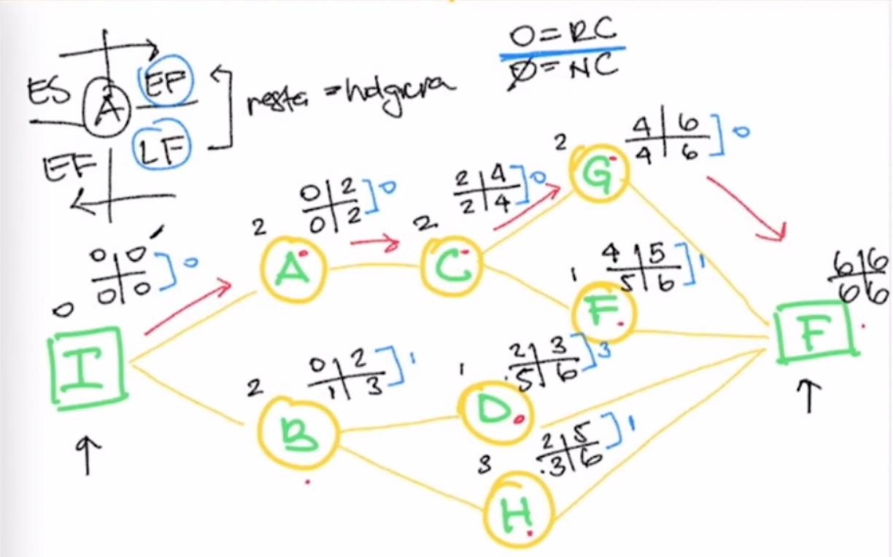
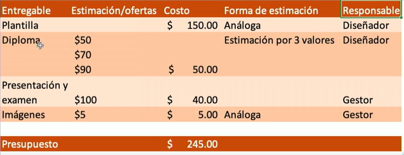
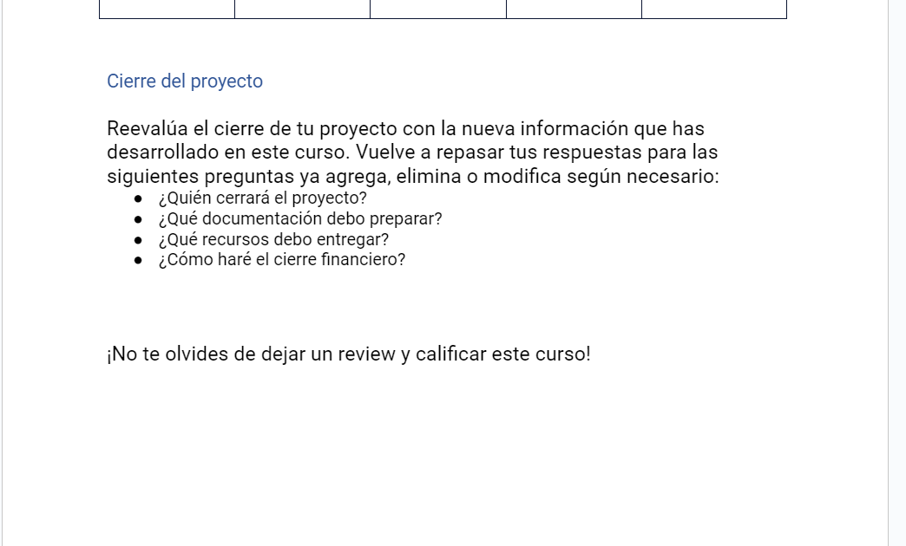

# Curso Práctico de Project Management
```
Profesora: Isabella Arévalo
Aprende a administrar proyectos exitosos de forma práctica y conviértete en un Project Manager profesional.
```


## Clase 1 y 2 y 3: 

## Clase 4:Desarrollo del EDT 
 
**EDT (Estructura de desglose de trabajo)**
> Consiste en realizar un desglose de los componentes del proyecto en orden jerárquico, para luego a su vez hacer un desglose de esos componentes en actividades que puedan ser asignadas: 
- controladas 
- calendarizadas 
- medidas
- costeadas 
 
 
**Beneficios de realizar la EDT**

- Visualizar el trabajo interno o externo: Al conocer las tareas se puede definir cuales entregables se deben realizar por tu equipo, y cuales les pertenecen a otros equipos de trabajo
- Evitar cambios no controlados: Al tener un EDT bien definido evitamos tener que agregar cambios al proyecto por falta de entendimiento del alcance o entregables necesarios.
- Entender el trabajo en etapas tempranas: Nos permite tener claridad del alcance del proyecto (productos, servicios y resultados).
- Entender áreas desconocidas: Al hacer un EDT podemos tener feedback de un experto en áreas que podemos desconocer. esto nos permite saber que se debe reforzar, investigar o aprender para el desarrollo del proyecto.
- Define el Alcance del proyecto: Nos permite entender que esta dentro de las limitaciones del proyecto y que no. Una forma facil de presentar el alcance a todos los interesados.
- Ayuda al equipo a entender el proyecto: permite clarificar y definir el alcance con todos los integrantes del equipo para evitar confusiones o diferentes formas de realizar el proyecto.
- Mejora la planeación: Al tener el EDT se facilita la tarea de definir las actividades del proyecto, por ende se facilita la identificación de presupuesto, duración y recursos necesarios.

**Ejmeplo EDT**
- [EDT_Ejemplo_Proyecto_Final_PPM](./info/EDT_Ejemplo_Proyecto_Final_PPM.docx)
- [El diccionario de la EDT](./info/EldiccionariodelaEDT.pdf)


## Clase 5: Entrevista: ¿Cómo se gestiona efectivamente un equipo de trabajo?

¿Cómo se gestiona efectivamente un equipo de trabajo?
- Determinar líderes de equipos.
- Talento multidisciplinario orientado a una meta clara.
- Tener claro que se espera de cada persona.
- Asignar responsabilidades y empoderar.
- Comunicación y confianza

**Notas**
- Se hacen equipos de trabajo y no todo se rola por el lider ya que en equipos de trabajo se enfocan en una meta y gracias a sus diferentes disciplinas podran lograr terminar el proyecto 
- Dividir responsabilidades pero que tampoco que desee depender de un solo colaborador 
- Se debe buscar y armar un buen equipo y si hay falta requisitos buscar la capacitación constante. 

## Clase 6: Desarrollo del cronograma

**Cronograma**
- Herramienta gráfica que presenta un detalle de las actividades que se deben desarrollar en los tiempos establecidos, al momento que se emprende un proyecto.
- Es posible que se realicen cambios a medida que se ejecuta.

**Si usas Notion este tip te puede ayudar**

> Hay un tipo de vista llamado timeline en donde puedes visualizar fechas con datos que pertenecen a una tabla. Yo uso un tipo de cronograma con esta vista para organizar mis cursos que hago en Platzi.

## Clase 7: Desarrollo de la ruta crítica

**Ruta Crítica (CPM)**
- Critical Path Method - determinará las actividades indispensables para que nuestro proyecto concluya según lo planificado.

**Contribuye a:**

- Tener claras actividades críticas
- Priorizar estas actividades
- Enfocar los esfuerzos
- Tomar decisiones
- Calcular la CPM
- Definir actividades
- Establecer relación y dependencia entre actividades
- Crear diagrama de red
- Estimar duración de cada tarea
- Calcular la ruta crítica (cada fecha de inicio/finalización de cada tarea para incluirlo dentro del diagrama)
- Calcular la holgura (flexibilidad de cada tarea para ejecutarse)

## Clase 8: Cálculo de la ruta crítica

**Los pasos para crear una ruta critica son:**

1.- Obtenemos las actividades que definimos en la EDT. Les asignamos una letra a cada una y luego las ordenamos.

2.- Colocamos una columna a la par para decir cual es la predecesora de cada actividad y otra columna para colocar el tiempo que nos llevara cada una.

- **La idea del diagrama es colocar las actividades y asignarles a cada una las siguientes datos:**
	- (ES) Early Start – The earliest time that an activity can start, es la fecha más temprana en que se puede comenzar una tarea basándose en las tareas precedentes y su duración. Es decir, es la fecha más temprana en que una tarea puede iniciarse sin retrasar el inicio de las tareas siguientes. El ES se calcula sumando la duración de las tareas precedentes a la tarea en cuestión.
	- (EF) Early Finish – The latest time than an activity can start, es la fecha más temprana en que se puede finalizar una tarea basándose en las tareas precedentes y su duración. Es decir, es la fecha más temprana en que una tarea puede completarse sin retrasar el inicio de las tareas siguientes. El EF se calcula sumando la duración de las tareas precedentes a la tarea en cuestión y restando 1 día (o la duración de la tarea, lo que sea menor).
	- (LS) Late Start – The earliest time that an activity can finish,  es la fecha más tardía en que se puede finalizar una tarea sin retrasar la fecha de finalización del proyecto. El LF se calcula restando la duración de la tarea en cuestión de la fecha de finalización del proyecto (conocida como fecha objetivo o fecha límite).
	- (LF) Late Finish – The latest time that an activity can finish, es la fecha más tardía en que se puede comenzar una tarea sin retrasar la fecha de finalización del proyecto. El LS se calcula restando la duración de la tarea en cuestión de la fecha de finalización del proyecto y sumando 1 día (o la duración de la tarea, lo que sea menor).

- **Los inicios se suman y los finales se suman. Para calcular la holgura se resta el LF - EF H = LF - EF**
- **Si la holgura es cero es una ruta critica Si no es igual a cero entonces no es una ruta critica La actividad inicial siempre tiene un tiempo cero.
3.- Unimos las actividades por orden del inicio al fin.
4.- Junto a cada actividad se coloca la cantidad del tiempo y una cruz:
	1.- En la parte superior izquierda colocamos el valor del tiempo de su predecesor
	2.- En la parte superior derecha colocamos la suma del tiempo de su predecesor mas el tiempo de la propia actividad.
	3.- Para el final colocamos el numero mas grande de sus predecesores y como EF colocamos el mismo numero. El EF y el LF también tendrán el mismo valor.
	4.-Comenzamos del final para la izquierda colocando en el LF de los predecesores del final el valor de este.
	5.- Para el EF restamos el valor del LF menos el tiempo de la actividad.
	6.- Conforme vayamos retrocediendo tomamos el valor más bajo del EF de sus actividades posteriores.
5.- Obtenemos la holgura de todas las actividades
6.- Seguimos la ruta donde nuestra holgura haya sido cero para saber la ruta critica.

**Ejemplo para Calcular Ruta Critica** 
- 

## Clase 9: Estimación de costos

**Maneras de hacerlo**
- Juicio de expertos: Experiencia de otras personas que ejecutaron proyectos similares al nuestro.
- Estimación análoga: Experiencia de otro proyecto (elementos como cotizaciones o revisión del reporte final )
- Estimación por tres valores: Rango aproximado del costo de una actividad:
- Optimista: Costo con valor bajo.
- Pesimista: Costo con valor alto.
- Deseable: Encontra balance.
- Análisis de reserva: Estimado para imprevistos (cambios de valores proveedores.. etc)

**Enlace**
- PERT es muy útil cuando se estima por tres valores https://todopmp.com/ejemplo-estimacion-pert-multiples-actividades/


## Clase 10: Errores comunes al estimar costos
1.- No actualizar costos unitarios de proveedores (variabilidad)
2.- No ser específicos con una actividad y costos (elementos que se quedaron sin incluir).
3.- Falta de garantía de precios con proveedores.

## Clase 11 :Presupuesto

- Presupuesto El presupuesto es una estimación del costo que conllevará realizar un proyecto.
- Los periodos pueden variar: mensual, trimestral, semestral, anual. Es común empezar con el anual y de ahí ir partir con el resto.
- Presupuestos habituales* 
	- Operativo: Ingresos y gastos de todo el proyecto. 
	- Flujo de caja: Efectivo que se maneja en el proyecto. 
	- Ventas: Estimación de ventas. 
	- Gastos: Gastos planeados. Ingresos.
	- Columnas de excel: Entregable - Estimación de costo - Costo Real


**Presupuestos habituales**
- Operativo: Ingresos y gastos de todo el proyecto.
- Flujo de caja: Efectivo que se maneja en el proyecto.
- Ventas: Estimación de ventas.
- Gastos: Gastos planeados.
- Ingresos.



## Clase 12 :Identificación de crisis

> Son incertidumbres que no se pueden diagnosticar, que nos afecta la situación de nuestro proyecto. 

**Como logramos mitigar estas crisis**
- Podemos realizar una lista de posibles eventualidades o riesgos 
- luego que se tenga la lista de posibles riesgos eminentes debemos priorizar cuál puede suceder
- luego idea una estrategia para solventar la situación 

**Nota** 
- No tenemos la habilidad de pronosticar desastres, lo mejor es tener planes alternos para estar preparados
- sis existe una cirsis es un riesgo que no se mitigó 
- Las crisis se pueden generar en cualquier momento la idea es tener la habilidad de resolver y minimixar la crisis 
- Durante una crisis es buena recomendación sentarse a respirar 
- tener mentes frias y realizar una brainstorm!!  


## Clase 13: Historia animada: La batalla de Dunkerque 


**La batalla de Dunkerque y la Operación Dynamo**
> Algunas lecciones que podemos extraer de esta historia y su relación con Planes de Contingencia, son las siguientes:

- Lección 1: La importancia de tener planes de contingencia en caso de emergencias.
- Lección 2: La necesidad de contar con una estrategia clara y bien coordinada en situaciones de crisis.
- Lección 3: La importancia de la cooperación entre diferentes entidades y organizaciones para alcanzar objetivos comunes.
- Lección 4: La necesidad de tener un sistema de comunicación claro y eficiente para mantener informados a todos los involucrados.
- Lección 5: La importancia de la planificación y preparación para poder responder rápidamente y con efectividad en situaciones de riesgo.
- Lección 6: La necesidad de contar con líderes y figuras de autoridad que puedan tomar decisiones rápidas y efectivas en situaciones de crisis.
- Lección 7: La importancia de la resiliencia y la capacidad de adaptación en situaciones de crisis para lograr los objetivos de mitigación de riesgos.
- Lección 8: La necesidad de adaptarse y ajustar los planes de contingencia a medida que evoluciona la situación de riesgo.
- Lección 9: La importancia de contar con recursos adecuados y suficientes para llevar a cabo la estrategia de mitigación de riesgos, como por ejemplo, barcos, equipo de transporte, alimentos y suministros médicos.
- Lección 10: La necesidad de tomar en cuenta a todas las partes involucradas en la situación de riesgo y sus necesidades, en este caso, incluyendo a los civiles y refugiados que podrían estar atrapados en la zona de riesgo.

## Clase 14: Entrevista: ¿Cómo anticipar y controlar una crisis?

**¿Cómo anticipas y controlas una crisis en un proyecto?**

F: Respirar. Tener una lluvia de ideas con el equipo y pensar en frío las soluciones a los problemas.
M: Proactividad y creatividad para la resolución de problemas.
H: Saber que siempre habrá crisis en un proyecto y desarrollar la fortaleza que te permita sentirte seguro para poder llevar a cabo el proyecto manejando la crisis.

## Clase 15: Cierre de un proyecto

1.- Como se ejecutó el cronograma
2.- se cumplió con el presupuesto
3.- si mitigar las crisis o riesgo
4.- control de factores durante la ejecución
5.- cierre contractual con los proveedores y un cierre administrativos.
6.- transferir el resultado




----------------------------------------------31/10/2023-------------------------------------


Resumen
1.
EDT quiere decir
Estructura de desglose del trabajo
2.
Componentes de un cronograma
Todas son correctas
3.
La ruta crítica nos ayuda a saber
El tiempo más corto y eficiente para llevar a cabo un proyecto
4.
Sabemos que encontramos la ruta crítica cuando la holgura es igual a
0
5.
El cálculo de la ruta crítica se hace con
Una sumatoria hacia delante y resta atrás
6.
Cuando la holgura no es igual a 0 esto significa que
No es una actividad crítica
7.
Este tipo de técnica de estimación de costos toma a consideración la experiencia de otros proyectos
Estimación análoga
8.
Este tipo de estimación considera distintos escenarios
Estimación por tres valores
9.
Esto puede llevar a cometer un error en la estimación de costos
Falta de actualización de precios unitarios
10.
Este NO es un periodo del presupuesto
Diario
11.
Este es un presupuesto habitual
Todas las opciones son correctas
12.
Una crisis se da por factores
Externos
13.
Nos ayudan a ejecutar futuros proyectos de mejor manera
Lecciones aprendidas