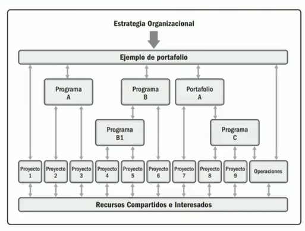
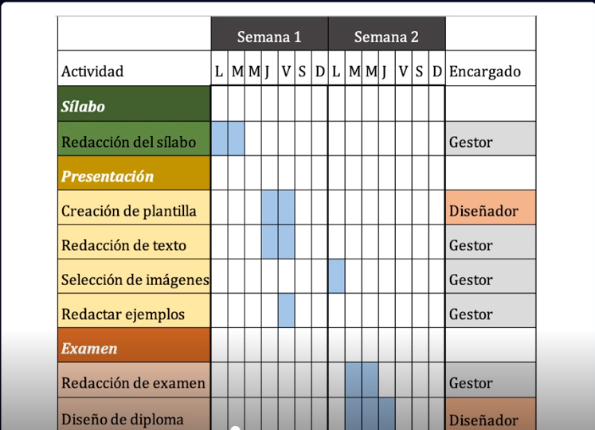
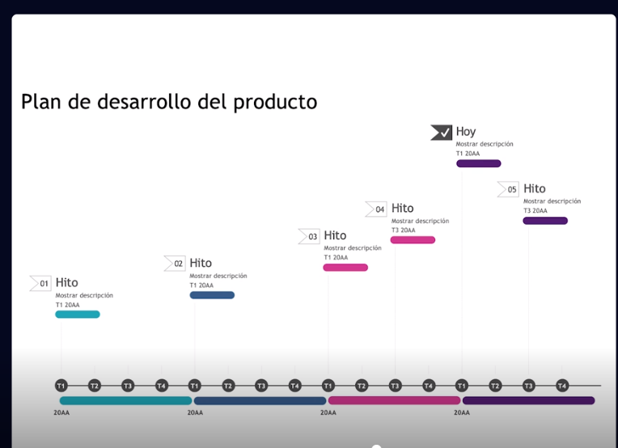
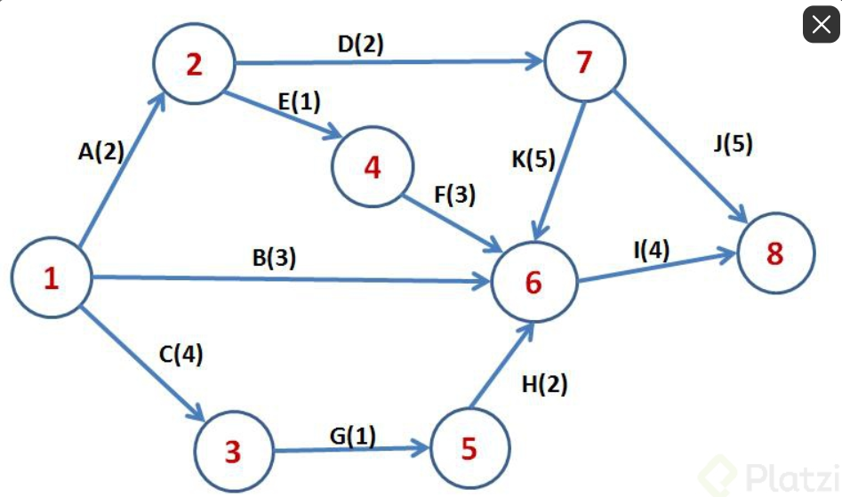
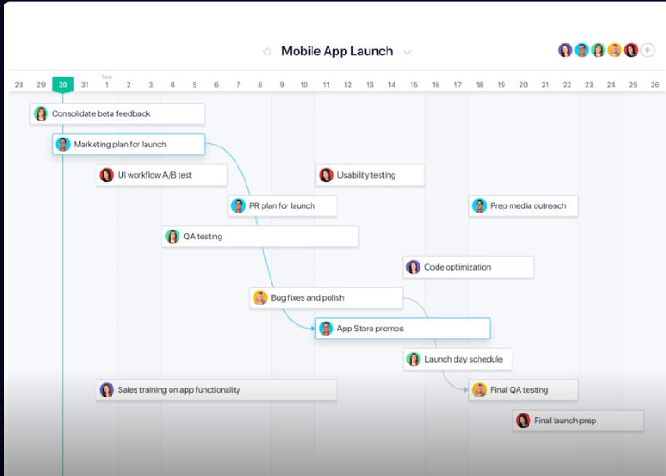
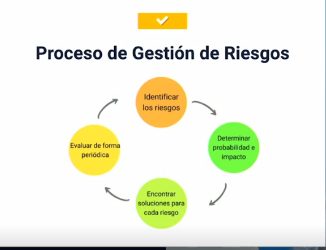

# Curso de Fundamentos de Project Management

## clase 1: Introducción de tu profesora

```
Profesora: Isabella Arévalo
Conoce qué es un proyecto y cuáles son sus elementos. Comprende las fases del ciclo de cualquier proyecto: Inicio, planificación, ejecución, control y cierre. Aprende las bases para gestionar proyectos exitosamente
```

## Clase 2: ¿Qué aprenderás sobre project management?

**Algunas cosas que este curso pretende que aprendamos:**

- Elementos básicos del Project Management (PM)
- Ciclos del PM
- Control de presupuestos
- Estimación de costos

## Clase 3: ¿Qué es un proyecto?

> Un proyecto es un esfuerzo temporal con objetivos específicos.

- Debe tener un alcance definible, objetivos claros, una fecha de inicio y finalización operativa
- Debe estar vinculado a las esperanzas estratégicas de negocio para el futuro de su empresa.


**Tipos de proyecto:**

- Proyectos Lucrativos o Económicos: buscan como resultado un beneficio económico.
- Proyectos sociales: Pueden ser públicos o privados pero con carácter social.


**El Gestor de Proyectos** 
- También conocido como director, coordinador, gerente de proyectos o Project Manager, 
- Es la persona encargada de dirigir, gestionar y controlar un proyecto desde su etapa inicial hasta su cierre. 
- Los proyectos tienen dos escalas: pequeña escala (personal) y de mayor complejidad (como los que se ejecutan en el trabajo).


## Clase 4: Elementos de un proyecto

- **Finalidad**: Razón por la cual quiero crear un proyecto. ¿Por qué significa algo para mi? ¿Qué quiero lograr?
- **Beneficiarios**: Los que se veran beneficiadas de mi proyecto. A donde me quiero dirigir, es social o proyecto personal donde me puedo beneficiar.
- **Producto/Servicio**: Viene con el resultado de nuestra ejecución. No debemos confundirlo como resultado final.
- **Actividades**: Todo proyecto se divide en tareas o etapas. Deben tener un orden logico para que el proyecto evolucione correctamente. No todas las tareas son importantes, por lo cual hay que jerarquizarla.
- **Calendario**: Fechas y plazos de desarrollo para cada tarea. El calendario puede ser flexible.
- **Recursos**: Son materiales y humanos. En materiales, contamos con todo lo tangible para crear el producto/servicio y los humanos son todos los que contamos con su ayuda para poder crear el producto/servicio.
- **Presupuesto**: Es la financiación del proyecto. Hay que ser especifico al establecer los gastos y costos por tarea y por actividad.
- **Resultado**: Es la culminación del proyecto y de sus distintos ciclos o fases. Hay que evaluar si culminamos con eficiencia cada fase o ciclo.

## Clase 5: Proyectos, programas y portafolio

- *Los proyectos*: son esfuerzos temporales con resultados especificos
- *Los programas*: son la sumatoria de proyectos de una misma tematica.
- *Los portafolios*: es la sumatoria de todos los programas pero estos no tienen porque tener una relación entre sí.

**Ejemplo**
 
 
 
## Clase 6: Ciclos de un proyecto

Ciclos de un proyecto
1. Inicio del proyecto:
	- Se desarrollan 2 documentos, que serán evaluados por un comité de toma de decisiones que lo aprueban
		- Caso de negocio: se especifica la necesidad de realizar este proyecto
		- Estudio de factibilidad: se determina que si con los recursos, el tiempo y el financiamiento es posible realizar el proyecto en tiempo y forma y de manera satisfactoria

2. Planificación:
	- Aquí se crea un plan sólido que va a proveer respuestas que surgirán en la etapa de ejecución, aquí se platínica, se crea claridad y se traza un camino a seguir

3. Ejecución:
	- Se pone en práctica la planificación se debe asignar los recursos y velar porque cada parte del proyecto este realizando lo que le toca en tiempo y forma

4. Supervisión y control:
	- Es necesario que desde la planificación se cree un plan de supervisión de cada uno de los entregables o de los procesos que estés ejecutando, es importante anticipar cualquier riesgo o crisis que podamos afrontar y solucionarla en el momento

5. Cierre:
	- Comunicar el cierre, hacer retrospectiva y crear un documento donde plasmemos las lecciones aprendidas con el fin de mejorar.
	
	
## Clase 7: Integrantes de un proyecto

- Patrocinador (Sponsor): 
	- "El patrocinador es un alto directivo o ejecutivo, normalmente en la parte superior del organigrama. 
	- Los patrocinadores corporativos incluyen el nivel de director y superior"
- Comité de dirección: 
	- es un comité que proporciona orientación y dirección a un proyecto. 
	- El comité de dirección suele incluir al director del proyecto y a las principales partes interesadas, como los patrocinadores o los clientes. 
	- Otras funciones del equipo pueden ser las de expertos en la materia, representantes de departamentos o divisiones clave y otras personas con conocimientos o experiencia relevantes.
- Director del proyecto: 
	- Al documentar todo, desde cómo tratar las solicitudes de cambio hasta determinar la progresión del rendimiento de los equipos, los gestores de proyectos se aseguran de que todo, desde los plazos hasta la asignación de recursos, se cuide adecuadamente.
- Equipo de proyecto: 
	- Organización creada específicamente para cada nuevo proyecto, su objetivo es diseñar documentos de especificación y crear registros detallados sobre diferentes aspectos.
- Las partes interesadas: 
	- en el proyecto son aquellas personas o grupos que tienen un interés personal en el resultado del proyecto. 
	- Pueden verse afectados por el proyecto positiva o negativamente, y pueden tener recursos (dinero, mano de obra, etc.) para contribuir al éxito o al fracaso del proyecto.
- Los usuarios: 
	- son las personas que en última instancia se beneficiarán del resultado del proyecto. 
	- Pueden ser beneficiarios directos (por ejemplo, cuando se implanta un nuevo sistema), o indirectos (por ejemplo, cuando se implanta un nuevo producto).


	
## Clase 8: El alcance del proyecto

> Define qué es el proyecto, qué hará y cómo se hará. También incluye un calendario y un presupuesto.

> El alcance lo desarrolla el director del proyecto junto con las partes interesadas y lo aprueba el cliente o patrocinador.


**ALCANCE **

- Limites de lo que se hará en el proyecto
- Que incluye y que no hacer en el proyecto
- Descripción detallada del servicio
- Realizar una Reunión para ver estos puntos

**QUE PREGUNTAS SE TIENEN QUE DESARROLLAR PARA HACER EL ALCANCE **

- Que es el proyecto ?
- Por que esta sucediendo ?
- Que lograra ?
- Quien lo aprueba ?
- Como se completara el proyecto ? ( Enfoque +fases + tareas )
- Que se producirá ( resultado )
- Cuando se entregara ? ( entregables y proyecto en general )
- Cuanto costara el proyecto ? ( pago de empleados y costo de recursos como materiales )
- Que incluirá y no hacer en el proyecto ( cuales serán nuestros responsabilidades )


# Gestión y ciclos

## Clase 9: La importancia del tiempo

- Definir actividades: Cuales son y determinar si estas tienen tareas (y cuales)
- Secuenciar actividades: Determinar si una actividad debe finalizar para que otra pueda iniciar y determinar si alguna puede iniciar sin necesidad de que otra finalice.
- Definir los recursos: Con qué contamos (personal, materia prima, financiación)
- Duración: Cuándo inician y cuando finalizan las actividades (sea realista).
- Frecuencia de las actividades: ¿Repetitiva? ¿Única?
- Responsables: ¿A quién preguntar por resultados y/o progreso de cada actividad?
- Control: Cómo se solicitará el avance, como se medirá si se ejecutó en tiempo y forma, que mejoras a realizar.
- Desarrollo del cronograma: Elaborarlo con la info anterior.

## Clase 10: Cómo controlar el tiempo

> Es importante destacar cuales son aquellos aspectos que nos pueden alterar el control del tiempo que llevamos dentro del proyectos, estos pueden ser:

- Comunicación ineficaz dentro del equipo
- Cuando no se establecen objetivos claros de lo que se quiere alcanzar.
- Interrupciones, cuellos de botella, visitas inesperadas
- Mal manejo de las herramientas
- Escaza planificación de una actividad
- Insuficiente delegación de tareas

**Herramientas para controlar el tiempo:**
- Diagrama de Gantt
 

- Cronograma de hitos
 

- Diagrama de Pert
 
- Cronograma de trabajo
 
 
 ## Clase 11 - 12 -13 : La conquista del Polo Sur - Aprendizaje de la conquista del Polo
 
 
**Noruega (factores de éxito)**
- Líder apasionado por conquistar lugares recónditos. Había tenido experiencia previa de lo que le esperaba en el polo sur.
- Equipo multidisciplinario.
- Salió 4 días antes.
- Eligió la ruta más corta (no la más fácil).
- Hizo cambios en el camino.
- Trineos tirados por 52 perros esquimales.


**Inglaterra (factores de fracaso)**
- Capitán sin experiencia similares.
- No llevó un equipo preparado.
- Salieron días después.
- No fue flexible y por eso su expedición se alargó.
- Equipo mixto de perros y ponis siberianos que tuvieron que ser sacrificados.
- Llegaron 34 días después.
- Se agotaron sus recursos.
- Fallecieron de regreso al campamento.


- Factores claves preliminares:
	- Objetivo claro.
	- Conocimiento previo del entorno.

- Factores claves de planificación:
	- Observación y previsión de riesgos.
	- Selección del equipo de trabajo adecuado.
	- Control y adaptación del tiempo.
	- Evaluación de dificultad y selección previa de la ruta.

- Factores claves durante la ejecución:
	- Ajustes de la planificación según los retos presentados.
	- Gestión adecuada de los recursos.
    - Hacerlo simple es mejor que complejo 
 

## Clase 14 : ¿Qué son los recursos y los costos?
 
> ¿Qué son los recursos? Es todo aquello que se necesita para ejecutar una tarea o un proyecto.

**Tipos de Recursos:**

- Físicos: instalaciones, oficinas, terrenos, maquinaria, etc.
- Humanos: Personal con el que contamos para ejecutar el proyecto.
- Información confidencial: Metodologías, patentes registradas, etc.
- Relaciones y contactos: vínculos y contactos fuera del proyecto que nos pueden ayudar con la ejecución.
- Financieros: dinero que tenemos para ejecutar el proyecto.


**Costos** 

- Todos aquellos gastos en los que se incurre para realizar una tarea, un trabajo o un proyecto determinado. 
- Estos están estrechamente relacionados en la producción o servicio resultado del proyecto, así que no todos los gastos del proyecto son un costo, sino aquellos que están estrechamente vinculados con el producto o servicio.


## Clase 15-16: Dinámica para diferenciar costos vs. gastos

**Gastos**
Nota: No estan relacionados con el resultado final 
- La energía es un Gasto.
- Los Honorarios del equipo de trabajo, son Gastos que están contemplados en los recursos de las actividades del proyecto. 4.El móvil, es un Gasto, es un articulo utilizado pero no genera retorno de inversión o no afecta el producto final.
- Los insumos de Producción, son Costos, ya que afecta el resultado final para la elaboración del producto o servicio generado.


**Costo**
Nota: Tiene un retorno de inversion 
Nota: Los recursos utilizados con la producción del producto o servicio resultante  

- Empaquetado, es un costo, ya que hace parte de la línea e producción del producto final.
- compra de materiales para elaboración del producto 

##  clase 17: Identificación de riesgos


**¿Que es un riesgo?**
- Los riesgos en proyectos son los eventos o condiciones inciertas que, en caso de ocurrir, tiene un efecto positivo o negativo sobre los objetos de un proyecto.

**Proceso de Gestion de Riesgos**

- Identificar los riesgos.
- Determinar probabilidad e impacto.
- Encontrar soluciones para cada riesgo.
- Evaluar de forma periódica.

**5 errores comunes que podrían presentar un riesgo en el futuro**

- Escasez de recursos.
- Bajo desempeño.
- Falta de claridad.
- Costos elevados.
- Factor de tiempo.

 
 
 
 ##  clase 18 - 19: Gestión de crisis
 
 
> Interrupción en la normalidad, un evento imprevisto que podría tener un efecto negativo en el proyecto, su producción, su reputación o los intereses de los interesados.

**¿Qué puede provocar una crisis?**
- Ataques al proyecto
- Accidentes
- Daños premeditados
**¿Cómo afronto una crisis?**
- Detección de señales.
- Preparación y prevención.
- Gestión o comunicación.
- Contención o control.
- Recuperación.
- Aprendizaje.

**Herramientas**
- Matrices de Riesgos 


## clase 20: Cierre de un proyecto

**¿Qué hacer?**
- Confirmar que el trabajo se haya cumplido como se esperaba
- Verificar que las compras se hayan hecho de manera exitosa
- Realizar el cierre financiero
- Transferencia del producto o servicio final
- Obtener feedback
- Realizar y completar el informe final
- Lecciones aprendidas
- Archivar información (aprendizaje para el futuro)
- Entrega de activos (informe escrito con fechas)
- Liberar el equipo (físico y personal)
**tipos de Cierre**
- Contractual: donde vamos a finalizar nuestra relaciones con proveedores o personal técnico que ya no necesitemos.
- Administrativo: Usualmente es realizado por la empresa dueña del proyecto y no por el equipo que ejecutó el proyecto.


Resumen
1.
El esfuerzo que aplicamos a los proyectos es:
Temporal
2.
Es el elemento central de un proyecto
Proyecto o Servicio
3.
Este es usualmente controlado por un director o vicepresidente
Portafolios
4.
Este lo conforman proyectos que no están relacionados entre sí
Portafolios
5.
En este ciclo se mide la viabilidad de un proyecto
Inicio

6.
Es la tercera etapa del ciclo de un proyecto
Ejecución
7.
Es quien utilizará el producto o servicio resultado del proyecto
Usuario
8.
El alcance te ayudará a:
Establecer qué harás y qué no harás en el proyecto
9.
NO debes definir esto dentro del cálculo del tiempo:
Viabilidad del proyecto
10.
Esta herramienta me puede ayudar a controlar el tiempo
Diagrama de PERT
11.
Roald Amundsen logró conquistar el Polo Sur por su...
Todas las anteriores 
12.
¿Cuál fue un aprendizaje de la conquista del Polo Sur?
Ser flexible con tu planificación

13.
Los costos se deben de establecer en la etapa de:
Inicio

14.
Los riesgos pueden suceder por:
Todas son correctas
15.
Es conocido como la interrupción de la normalidad
Crisis
16.
El cierre del proyecto lo hace
El Project Manager

