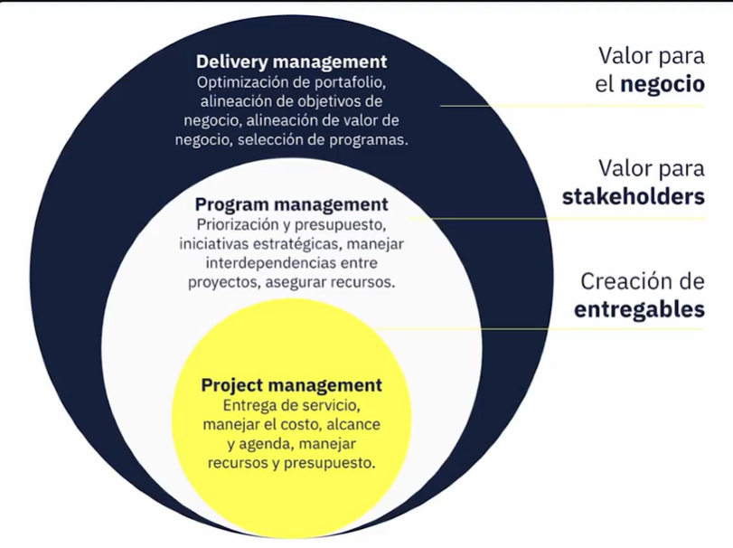
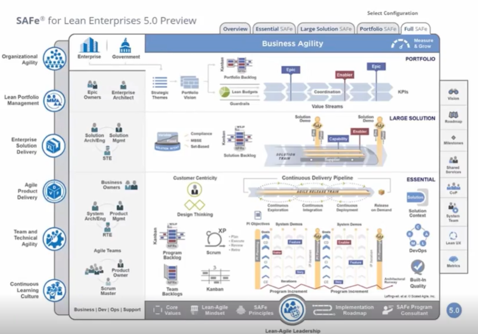

# Curso de Agile Delivery Management: Proyectos Enfocados en Resultados

```
Alexis Acuña:  
```

## Clase 1: 
Bienvenida 


## Clase 2:

> Agile Delivery Manager ADM = Es el proceso de ¿Qué construir? + ¿Cómo construirlo? 
- Las ideas por sí solas no tienen ningún valor, lograr aterrizarlas tiene la importancia de ello. 
- Los ADM determinan como se debe hacer el aterrizaje de estas ideas.

**¿Qué no es ADM?

- No es ser un dictador, es ser un facilitador, junta a las personas y las hace más
- No requiere de horario
- No es un rol definido, es un rol que cambia constantemente
- No es un trabajo repetitivo, todos los días se aprende algo nuevo

**¿Qué es Agile Delivery Manager?**

- Es el proceso que junta que vamos a construir, con él como. ¿Qué es ser ADM?
- Facilitador
- Disciplina dinámica ¿Que no es ADM?
- Dictador
- No es un horario fijo
- No es un rol definido
- No es un trabajo aislado
- Trabajo repetitivo

**¿Cómo alineamos a tantas personas, a que tengan un común denominador?**

- Conocimiento básico de las diferentes áreas
- Empatía
- Agile delivery Framework

## Clase 3: Diferencias entre Delivery Management, Project Management y Program Management


## Delivery Management
- Maneja los portafolios que es el conjuntos de programas 	 
## Project Management
- Maneja los programas que es el conjuntos de proyectos 

## Program Management

- Maneja los proyectos 




## Clase 4: ¿Qué es un Agile Delivery Framework (ADF)?

**¿Qué es?**
- Un marco ágil se puede definir como un enfoque específico de desarrollo de software basado en la filosofía ágil (articulada en el Manifiesto Ágil ) 
- Los Framework más populares o usados (Kanban, Scrum, SAFE, Lean ) 
- Puede referirse a cualquiera de estos marcos como metodologías o incluso procesos. 
- El ADF tiene que adaptarse al crecimiento de las startup utilizando versiones avanzadas como Safe o de lean ADF deben promover cultura de colaboración y cultura de adaptación, 
- Los frameworks deben ser iterativos e incrementales, en cada iteración damos un valor al valor inicial con el que iniciamos e identificamos frameworks son marcos de referencia, 
- Los parámetros,variables, criterios,  pueden hacernos éxitosos ó dañar la ejecución


**Nota**
- NO EXISTE UN FRAMEWORK que RESUELVA O SIRVA PARA TODOS LOS PROYECTOS. 

**Framework** 


| Framework | Concepto  | Ventajas  | Desventajas  |
|----------|----------|----------|----------|
| Kanban  | Un marco de gestión de proyectos basado en el flujo de trabajo que utiliza tableros para visualizar el progreso del proyecto.   |  Flexibilidad                  | Adaptabilidad   |
| Scrum   | Un marco de gestión de proyectos ágil que utiliza sprints para dividir el proyecto en entregas incrementales.                   | Foco en el valor del producto  |Adaptabilidad  |
| SAFE    | Un marco de gestión de proyectos ágil que combina Scrum con prácticas de ingeniería tradicionales                               | Adaptabilidad                  |Mejora continua  |
| Lean    | Un enfoque de gestión de proyectos que se centra en la eliminación de desperdicios y la mejora continua.                        | Eficiencia                     |Mejora continua   |
| XP      | Un marco de desarrollo de software ágil que se centra en la calidad, la simplicidad y la colaboración                           | Calidad                        |Simplicidad  |


| Framework | Ejemplo | 
|----------|----------|
| Kanban   |    |
| Scrum    |    |
| SAFE     |    |

## Clase 5: Elementos clave de un ADF: personas, procesos y métricas


**Los pilares del software funcional que tiene como base el ADF son: las personas, procesos y herramientas; métricas**

**Personas**
- Personas e interacciones y la manera en la que se comunican. 
- Es importante definir la estructura organizacional. 
- Claridad de roles y responsabilidades: saber quién es y como se involucra en el equipo. 
- El Stakeholder(Interesada) management, el manejo de las personas ajenas al núcleo del equipo, como manejar las expectativas de todas las personas que no hacen parte integral del equipo de desarrollo. 
- El tiempo y la confianza lo es todo: requiere de tiempo, de prueba y error, generar confianza en el equipo.
- https://fourweekmba.com/es/modelo-tuckmans-de-desarrollo-de-grupos/

**Procesos**
- Los procesos y herramientas son esenciales. 
- Usar herramientas que agreguen valor, que el equipo va a usar y les servirá, no forzar herramientas que no aportan. 
- No usar muchas herramientas: reducir y simplificar los procesos y herramientas.
- https://www.softwaretestinghelp.com/agile-project-management-tools/

**métricas**
-  Cualitativa y Cuantitativa 
- Métricas de un ADF: cómo y cuando usarlas
- Usa todas las métricas que quieras 
- Úsalas como indicadores para mostrar que el software está funcionando, en momentos críticos como indicadores de mejora, no como elementos únicos en la toma de decisiones.
- La clave de toda metrica es que el usuario este contento. Ejemplo -> Una metrica es medir la cantidad de usuarios activos. 
- https://businessmap.io/es/agiles/metodologia-agile/metrics 

## Clase 6: Comunicación eficaz en la implementación de un ADF

**Comunicación eficaz debe ser:**
- Frecuente
- Transparente
- Inclusiva

**La comunicación en equipo debe ser:**
- Transparente
- Respetuosa
- Simple
- Tener coraje
- Feedback

**Contratiempos cuando nos comunicamos de manera no eficaz:**
- Mal uso del tiempo: El tiempo cuesta
- No tener una sola fuente de verdad.

**Notas**
- La mala comunicación cuesta dinero en los proyectos 
- Combinar las Daily 2 Diarias X P2P y 3 Diarias P.TEXTual 
- es difícil hablar la clave siempre es el hablar claro, ser respetuoso, tener coraje para decir la cagué, retroalimentación para mejorar 
- A los programadores no les gustan las reuniones
- No hay una única fuente de verdad, así que ten una sola fuente de verdad, un solo Jira, un Solo tablero, Etc.   
- Lo mas importante es como se colabora y como se comunican 

## Clase 7: Agile Delivery Management a escala


> La implementación de marcos de entrega ágiles o ADFs, es fundamental para las empresas de software. 
- Las ayudan a ser más eficientes, productivas y a responder mejor a las cambiantes necesidades del mercado y de las partes interesadas (stakeholders); 
- Sin embargo implementar ADFs puede ser una tarea complicada, especialmente para las empresas que nunca lo han hecho antes o para las que están experimentando un crecimiento explosivo.

**Recuerda**
- La implementación de marcos de entrega ágiles == ADFs => Agile Delivery Frameworks

**Pasos**
- Paso 1: Identificar la necesidad de Agile Delivery Frameworks.

```
El ADM:
Evaluará los procesos de desarrollo de software y el ciclo de vida actuales. Identificará los puntos débiles y las ineficiencias.
Determinará cómo un ADF puede ayudar a la organización a superar estos retos. Por ejemplo, una empresa puede descubrir que su proceso de desarrollo de software tarda demasiado en entregar software funcional, carece de colaboración y comunicación, y no es capaz de adaptarse.

Este paso crea un sentido de urgencia y justifica el cambio.

```
- Paso 2: Definir metas y objetivos
``` 
Una vez que un ADM ha identificado la necesidad de implementar un ADF, debe definir sus metas y objetivos.

Esto significa:
a) Identificar lo que quieren lograr implementando Agile Delivery Frameworks
b) Definir qué métricas utilizarán para medir el éxito.

Por ejemplo, una empresa puede querer aumentar su capacidad de planificación, mejorar la calidad del código, y aumentar la satisfacción del cliente. Las metas y objetivos permiten al ADM y a las partes interesadas crear un plan de trabajo y comunicarlo a todos los implicados.

``` 

- Paso 3: Elegir el ADF adecuado

``` 
El siguiente paso es elegir el marco de entrega ágil adecuado para su empresa, programa o para sus proyectos. 
Hay varios Agile Delivery Frameworks para elegir, incluyendo: Scrum, Kanban, SAFe, Lean y Extreme Programming. 
Cada marco tiene su propio conjunto de principios, prácticas y herramientas. 
Las empresas deben elegir el marco que mejor se adapte a sus metas, objetivos y cultura empresarial. 
Por ejemplo, Scrum es un ADF popular ideal para equipos que necesitan entregar software de valor de manera rápida y eficazmente; 
Kanban es una gran opción para equipos que necesitan gestionar flujos de trabajo y optimizar sus procesos.
```
- Paso 4: Desarrollar un Agile Delivery Plan

```
Una vez que el equipo elige un ADF, debe desarrollar un Plan de Entrega Ágil.
Esto significa definir:

1. un plan sobre cómo implementará el marco.
2. quién será responsable de qué.
3. qué herramientas y procesos utilizarán.
4. qué métricas definirán el éxito.

Por ejemplo, puede que necesiten definir la estructura de su equipo, sus funciones y responsabilidades, crear un backlog, establecer una cadencia de sprints y celebrar reuniones periódicas (daily’s, revisiones de sprints y retrospectivas).
```

- Paso 5: Implementar el ADF
```
Esto significa poner en marcha el plan y entrenar continuamente a los miembros del equipo en los principios y prácticas del marco. 
Se recomienda probar el ADF en uno o dos equipos en forma de prueba piloto. 
Pilotar el ADF ayuda a identificar obstáculos y mejorar futuras planificaciones antes de implementarlo en varios equipos. 
En este paso, los DMs también definen las herramientas y procesos para respaldar el marco. 

Ejemplos incluyen herramientas como Jira o Trello para gestionar el backlog, agendar y llevar diversas ceremonias (reuniones pre-establecidas) y retrospectivas periódicas para supervisar el progreso.
```
- Paso 6: Supervisar y evaluar el ADF
```
En este paso se mide el progreso con respecto a las metas y objetivos definidos en el paso dos, identificar áreas de mejora y realizar ajustes al marco según sea necesario. 
Por ejemplo, las empresas pueden tener que ajustar su cadencia de sprints o redefinir sus funciones y responsabilidades si no están funcionando con eficacia. 
Al supervisar y evaluar el ADF, el DM puede apoyar a los equipos a mejorar continuamente los procesos y ofrecer más valor a los clientes / usuarios finales.
```
- Paso 7: Garantizar el buy-in de los stakeholders
```
Este es un paso continuo. 
La implementación de ADFs requiere la colaboración de todas las partes interesadas. 
Esto significa conseguir que todos estén de acuerdo con el cambio y comprendan las ventajas de los ADF, así como los posibles contratiempos. 
Las partes interesadas son desarrolladores, clientes, socios e inversores. 
Es muy común que miembros de equipos se resisten al cambio porque se sienten cómodos con sus procesos actuales, a los clientes puede preocuparles la calidad del producto, a los socios puede preocuparles el impacto de los cambios en su negocio y a los inversores puede preocuparles el coste y el riesgo de nuevos procesos.

Para conseguir la aceptación de las partes interesadas, los DMs deben abordar sus preocupaciones y demostrar las ventajas de los ADFs. 
Las métricas y la constante y transparente comunicación son las mejores maneras de “ganarse la confianza” de los stakeholders detractores o indecisos.
```
- Paso 8: Proporcionar formación y apoyo continuo
```
Durante la implementación y una vez implantado el ADF, los DM deben proporcionar formación y apoyo continuo a los equipos. 
Esto significa impartir formación continua sobre los principios y prácticas del marco, prestar apoyo a las herramientas y procesos, y ofrecer formación y tutoría a los equipos. 
La formación y el apoyo continuos ayudan a los equipos a mejorar continuamente y a generar “ownership” del marco en sí. 
Cuando el individuo habla, el colectivo escucha. Por ejemplo, se pueden impartir cursos sobre cómo utilizar nuevas herramientas y procesos, o cómo colaborar más eficazmente con los miembros del equipo. 
El coaching y la tutoría pueden ayudar a los equipos a identificar áreas de mejora y desarrollar estrategias para superar los retos. 
Este paso es un proceso colectivo, lo puede llevar a cabo un rol definido como el del Scrum Master o el Agile Coach, o puede ser un colaborador individual “evangelizando” los beneficios del ADF.
```
- Paso 9: Ampliar los marcos de entrega ágiles - escala continua
```
A medida que una empresa crece, es importante escalar los ADFs para satisfacer las cambiantes necesidades del negocio. 
Ampliar los marcos ágiles de entrega significa adaptar el marco para que funcione en varios equipos, departamentos y zonas geográficas. 
Esto puede lograrse implementando un marco ágil empresarial, que proporciona un conjunto común de principios, prácticas, y herramientas en toda la organización. 

Por ejemplo, SAFe (Scaled Agile Framework) es un marco ágil empresarial que proporciona un lenguaje común, una visión compartida, y un enfoque coherente para la entrega ágil en toda la empresa. 
(SAFe cuenta con Tren de Liberación Ágil (ART) - la principal construcción de entrega de valor en SAFe. 
El Tren de Liberación Ágil es un equipo auto-organizado de larga duración de Equipos Ágiles, una organización virtual (5 a 12 equipos) que planifica, compromete y ejecuta juntos).
```
- Paso 10. Medir y comunicar el éxito Medir y comunicar el éxito

```
El último paso es importante medir y comunicar el éxito del marco de entrega ágil de manera recurrente. 
Esto significa medir el progreso con respecto a las metas y objetivos definidos en el paso dos y comunicar los resultados a las partes interesadas. 
Esta comunicación regular ayuda a reforzar los beneficios de los ADFs y a mantener el compromiso de las partes interesadas. 
También ayuda a identificar áreas de mejora y oportunidades para ampliar los ADFs en toda la organización.

En conclusión, implementar ADFs es esencial para que las empresas de software sean más eficientes, productivas y receptivas al cambio: a las cambiantes necesidades del mercado, a los cambios internos de una empresa en crecimiento, y a los cambios que pidan los clientes. Al seguir un enfoque paso a paso, las empresas pueden identificar la necesidad de marcos de entrega ágiles, definir metas y objetivos, elegir el marco adecuado, desarrollar un plan, implementar el marco, supervisar y evaluar el marco, obtener la aceptación de las partes interesadas, proporcionar capacitación y apoyo continuos, ampliar los ADFs y medir y comunicar el éxito. De este modo, las empresas pueden mejorar continuamente sus procesos, ofrecer mejores productos a sus clientes y alcanzar el éxito empresarial, a medida que estas crecen.
```

## Clase 8: Rol del Delivery Manager (DM) en transformaciones ágiles
- Adopción de prácticas de agilidad = 
   - Analizar como esta el equipo frente a los frameworks ágiles 
   - Prueba piloto con el framework que hayamos escogido.

- Proceso de entrega = 
   - Entregar lo que se tiene que entregar, en tiempo, forma y la calidad que el cliente quiere.

- Equipo = 
   - Manejar el equipo y como sus interacciones pueden afectar el rendimiento del proyecto, también se incluyen métricas de desempeño

- Stakeholders = 
   - Definir el canal de comunicación y ser puente con todas las partes interesadas.

- Riesgos = 
  - Gestionar los riesgos dentro de la ejecución de un proyecto, el DM los ayuda a resolver.

- Métricas = 
  - Cuales métricas son las que pueden ayudar al equipo a mejorar o tener métricas que me puedan dar un input para tomar acción.

**Notas**
- Se recomienda revisar cada CV para validar fortaleas y oportunidades de mejora 
- hay que iterar y reaplizar pruebas piloto para aprender en que somos buenos y en que podemos mejorar 
- Preguntar a los integrantes si han tenido vacaciones para validar los tiempos reales del proyecto o entre proyectos. 
- No se deben comunicar los Stakeholders con los tecnicos para no generar problemas de comunicación 
- saber que hacer con las metricas 

> Fuente Yoshua Nicolai López Díaz
> Ajuste y mejora su servilleta 

## Clase 9: Herramientas para Delivery Managers

**Gestión:**
 - JIRA              -> Es para el equipo de Técnico -- es resolver el `Como`
 - Microsoft Project -> Es para el equipo de Gestión    -- es resolver el `Que`  

**Colaboración**
- Slack   -> Enviar mensajes de texto  
- Teams   -> Video llamadas
- Zoom    -> Video llamadas

**Data**
- PowerBi
- Tableau
- Looker -> Investigar 

**Notas**
- No existen una navaja suiza para resolver los problemas 
- Evita enviar mensajes directos si va a afectar al grupo. 
- Se recomienda encender la cámara 
- Cuando usamos mensajes y cuando usamos llamadas, si lo que vas a escribir algo pregúntate algo es mejor en una llamada o texto, recuerda menos es más. 
- En llamadas preguntar podemos tener esta conversación escrita 

## Clase 10: El camino profesional de un Delivery Manager


**¡Muchos caminos llevan a ser DM!**

- De PM, TL, BA, PO, lo que sea a DM


**¿Qué dominar?**

- Metodologías Ágiles  -> Estudiar los Framework Agile, Foros 
- Certificaciones      -> Certificacion Scrum, ISos
- Gestión de proyectos -> Tener experiencia en la gestión de proyectos 
- Liderazgo            -> Gestión de  talento, gestión de herramientas  
- Mejora continua      -> Compromiso, realizar la mejora continua. 
- Networking           -> Hablar con los demas establecer contactos, acumulen Nos, para lograr un SI 

## Examen 

Resumen
1.
Trabajar como Delivery Manager te permite:
Todas las respuestas son correctas
2.
Para convertir ideas en valor, un Delivery Manager hace uso de:
Un Agile Delivery Framework
3.
La gestión de un Delivery Manager se enfoca en:
En la entrega y ejecución de uno o varios proyectos, o programas de software enfocado en la entrega de valor.
4.
¿Cuál es el mejor Agile Delivery Framework?
Se utilizan distintos según las necesidades y contexto específico del proyecto y de la organización
5.
Los tres fundamentos de un Agile Delivery Framework son:
Personas, procesos y herramientas, y métricas
6.
Un Delivery Manager debe de comunicarse exclusivamente utilizando:
Todas con discreción
7.
¿Cuál es el ADF más reconocido por permitir escala continua?
SAFe
8.
Identificar y mitigar riesgos no es importante para un DM porque:
Si es importante. Los DMs son responsables de garantizar que el equipo entregue valor y para eso requiere identificar, mitigar y asegurar la resolución de riesgos.
9.
La mejor herramienta que tiene un DM a su disposición es:
No hay una que lo haga todo, es ideal consultar con su equipo y probar cual se adecua mejor a las necesidades de los proyectos

10.
La única manera de convertirte en un Delivery Manager es:
Hay muchas maneras. Experiencia con metodologías Ágiles, gestión de proyectos, y liderazgo; son elementos críticos.


