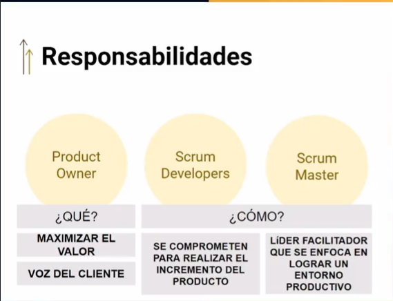

# Curso de Fundamentos de Product Owner


# Clase 1: Scrum desde la perspectiva del Product Owner
 
 
**Roles de Scrum:**

- Product Owner ordena el trabajo
- El equipo de Scrum lo convierte en realidad
- El Scrum Master fomenta un entorno para que todos revisen los resultados del producto
- No solo depende del Scrum Master, la sinergia con los product Owner también es importante.

**Escencia desde la perspectiva del Product Owner**

- Empirismo: 
	- nos basamos en hechos para tomar decisiones, considerando que se realizan en entornos de alta incertidumbre, 
	- así que se adaptan a los cambios, así que me voy basando en lo que voy descubriendo y sucediendo.
- Pensamiento Lean: 
	- Pensamiento Ligero 
	- no ponerle más complejidad, cómo aligerar el trabajo y evitar el desperdicio, 
	- el más grande desperdicio es el tiempo por falta de claridad de los objetivos
  
- Enfoque Iterativo: 
	- trabajar en plazos cortos, sprint (incrementos de valor)
- Enfoque Incremental: 
	- los incrementos de valor al unirse incrementan el producto.
	
	
## Clase 2: Responsabilidades del Product Owner

- Desarrollar y comunicar explícitamente el objetivo del producto: 
	- hacer que el equipo comprenda hacia dónde vamos. 
	- Que es la función u objetivo que el producto debe alcanzar. 
	- Este es un objetivo a largo plazo.
- Crear y comunicar con claridad los elementos de trabajo: 
	- este es un objetivo a corto plazo, es bajar a detalle las especificaciones de lo que necesitamos hacer a traves de los sprints. 
	- El “como se hace?” es problema de los scrum developers.
- Asegurarse de que el trabajo pendiente sea: 
	- transparente, visible y comprendido: No vale comunicarse con el equipo con documentos sino que es mas bien hablando.



## Clase 3: Empoderamiento del rol de Product Owner

	
**Bases del Product Owner**
- Necesitas conocimiento del negocio
- Necesitas conocimiento del comprador y usuario final
- Necesitas conocimiento del producto
- Necesitas conocimiento de administración de proyecto

**Habilidades del Product Owner**
- Negociación
- Adquirir grandes cantidades de información y transmitirlo de forma sencilla al equipo
- Facilitador
- Influencia
- Comunicación

**Herramientas:**
- Colaborativas
- Visual Thinking	

## Clase 4: Desafíos principales

**Los desafíos principales a los que se enfrenta el Product Owner tienen que ver con:**

- La Cultura Empresarial 
	- Resultados
	- Prácticas 
	- Principios
	- Aprendizajes

- La Cultura Ágil 
  - Hacer o Orientación a las entregas o Empirismo basado en hechos o Prácticas adaptadas al equipo 
  - Ser o Transparencia en la información 
	- Confianza en la comunicación  
	- Colaboración en el equipo 
	- Valores que son acuerdos de comportamiento 
	- Principios también son acuerdos de comportamiento 

**Nota**
- Hacer entregas frecuentes al corto plazo es sumar mayor valor 


## Clase 5:  Comparativa con otras responsabilidades

**Roles**
- Product Manager
	- Crean estartegias para construir productos:
    - Planifica el producto 
	- Ejecuta las acciones para realizar el prodycyos 
	- lanza la puesta en producción el producto. 
	- Dentro de un equipo puede fungir con la responsabilidad de product owner  
	
	
	
- Product Owner 
	-  Gestiona el Backlog 
    - Hace parte activa de l equipo SCRUM 
	- Define y socializa las historias de usuarios
	- Interlocutor entre cliente y equipo SCRUM 
	- Acepta los entregables de cada sprint
    - Puede tomar decisiones de sobre definiciones del producto  	

- Business Analyst 
	- Ayuda a identificar y definir las soluciones 
    - Máximiza el valor de entrega 
    - Facilita el entendimiento 
    - Se  confunde con un product ownnwe 
    - No priorizan esto es del product owner  
    - Generan información 	


## Clase 6: Principios para uso de tableros digitales

Entender que el trabajar de un tablero digital, es entender que se trabaja en una concepción de columnas de estado, es decir que se deben mover los elementos de trabajo conforme a los estados que van teniendo, tiene una transición que va de lo que se está acostumbrado a concebir y reportar los avances por porcentajes en una visión orientada a actividades, a un cambiarse por entregables que se van moviendo en estados. Cuando en ágil se habla de entrega de valor frecuente al cliente, se refiere a valor completo, no sirve reportar que se tiene un 90% de avance si aún no se puede entregar. Cuando se cambia a un tablero digital, el porcentaje de avance no existe como tal.

Las columnas base que trae la agilidad son: -Sin Iniciar: backlog o pila de producto. -En proceso: cuando el entregable se empieza a hacer realidad. -Terminado: cuando se ha terminado con el entregable.

Algo importante es establecer los acuerdos para pasar un elemento de trabajo de una columna a otra. Cuando se establecen los acuerdos, se pueden establecer criterios importantes para cuidar la calidad y cuidar que lo que se este avanzando se este realizando de la manera correcto.

Aunque Sin Iniciar, En proceso y Terminado son las tres columnas base, se pueden agregar otras columnas. Es importante tener claro que los elementos de trabajo del tablero se mueven en una sola dirección, es decir no se regresan, van solo hace adelante y se cuida que el estado se cumpla para ir al otro. Pueden existir casos extraordinarios de regresar elementos, pero eso es un síntoma de que un acuerdo no se cumplió o algo no quedo claro en el esquema de trabajo.

El Product Owner debe cuidar que el trabajo siempre este visible y claro.

```
Columnas en Nuestros tableros

- Open (Product Backlog)
- ToDo (Sprint Backlog)
- Doing
- Review
- Done
- Close
```

## clase 7: Trabajo en equipo con Scrum Masters y Scrum Developers

**Los 4 valores que salen en el manifiesto ágil:**

- 🤝 Individuos e interacciones sobre procesos y herramientas.
- 📲 Software funcionando sobre documentación extensiva.
- ↔️ Comunicación con el cliente sobre negociación contractual.
- 💥 Respuesta ante el cambio en lugar de seguir un plan.

**Enlace**
- https://agilemanifesto.org/iso/es/principles.html


## clase 8: Disciplinas relacionadas

- Design Thinking – Práctica enfocada en el usuario final para lograr el MVP, logrando un backlog enriquecido.

- Análisis de Negocio – Disciplina relacionada con entender el problema o la oportunidad, es un conjunto amplio de acciones.

- Facilitación Gráfica – Generación de diagramas para facilitar la comprensión de algún tema y enriquecer la comunicación; este recurso es muy útil para abstraer y retener ideas y conceptos. (Cuando se establece al final de una reunión se denomina registro gráfico)

- Estructuras Liberadoras – Es un conjunto diseñado para liberar comunicaciones poderosas, a través de dinámicas de comunicación para liberar y hacer que los equipos sean más productivos y clarificar el entendimiento.

## Clase 9: Principios de Agile Business Analysis

- Ayudar a ver el todo: 
	- Si le damos una visión amplia y total de qué es lo que se necesita. 
	- Las personas programan distinto si saben realmente cual es el objetivo global. 
- Piensa como cliente - beneficiario: 
	- Los esfuerzos se tienen que encaminar en aquel que use el software ya que de esta forma se obtienen los retornos de dinero. 
- Analizar para determinar qué es valioso: 
	- Acércate a la realidad usando ejemplos: Cuando se dan ejemplos se fortalece el conocimiento. 
	- Entiende que es factible: Esta la factibilidad del negocio, y de la factibiliad técnica. 
	- Es el entendimiento de qué es realmente lo posible. 
	- En el plan todo es factible y posible, pero en la práctica no. 
- Estimula la colaboración y la mejora continua: 
	- La colaboración entre todas las partes. 
	- Evitar el desperdicio: Del lado del PO los desperdicios se generan generalmente a partir de los malos entendidos, o fallos de comunicación.
	
**Recueda**
- El metodo cascada lo usamos cuando desarrollamos algo que es predictivo 
- El metodo Agil lo usamos cuando tenemos incertidumbre
- No burocratizar la información: quiere decir dar el mismo contexto de negocio. 
- Evitar el desperdicio -> tu sabes los retrasos por malos entendidos, o una especificación no quedo clara -> como se resuelve es con buena comunicación y los principios disciplinas 

## Clase 10:Preguntas frecuentes

- El product owner y el scrum master pueden ser la misma persona? NO! 
	- No pueden ser la misma persona. Esto es porque el enfoque de cada responsabilidad es muy distinto. 
	- Una misma persona tiene conocimientos y habilidades distintas. 
	- Si se pueden ayudar entre ellos y saber qué es lo que hace el otro para poderse complementar mejor. 

- El PO puede delegar su trabajo a alguien más? 
	- Si, puede delegar el trabajo pero no puede transferir una responsabilidad. 
	- Lo vimos por ejemplo con el data analyst. 
	
- El PO puede ser del equipo de tecnología? Depende. 
	- Puede ser que también sea de tecnología pero no siempre se da, Los perfiles más frecuentes son del área de negocios. 
	- Una persona sola no puede saber de todo.
	
## Clase 11: ¿Qué sigue después? 
- Seguir con las rutas 
- cambia tu paradigma con respecto a la pleanecion y a la información 
- cambiar a la planeacion colaborativa -> podemos ser mas ceteros para poder planear -> es darle voz y voto a los involucrados  
- aprender a mejorar la dimensión del trabajo para lograr alcanzar el objetivo 


Resumen
1.
¿Cuál es la esencia de Scrum en la que el Product Owner puede usar para analizar y decidir en función de los hechos que se van descubriendo en los proyectos?
Enfoque incremental
Pensamiento Lean
REPASAR CLASE
2.
¿Cuál es la responsabilidad más importante del Product Owner?
Ser la voz del cliente.
3.
¿El Product Owner es el cliente?
No. Es la voz del cliente. Esta voz se alimenta de otras voces incluídos análisis de consumidor y mercado.
4.
¿El Product Owner desarrolla y comunica explícitamente el objetivo del Producto?
Verdadero
5.
¿Desde qué puntos de vista se analizan los desafíos principales del Product Owner?
Desde la Cultura empresarial y la Cultura ágil.
6.
¿El Product Owner es un Business Analyst?
Sí, desde el punto de vista de la disciplina de BA. La diferencia esencial es que el PO prioriza y el BA dimensiona.
7.
¿Cuál es la disciplina que puede ayudar a Product Owners a empatizar con el usuario y diseñar en función a sus necesidades y problemáticas?
Design Thinking
8.
¿Cuál es la disciplina que ayuda a Product Owners a entender las problemáticas, definir alternativas de priorización, gestionar el backlog, entre otras?
Análisis de Negocio
9.
¿Cuál es el método que puede ayudar a Product Owners a contar con apoyos visuales para mejorar la interpretación y entendimiento de todos los miembros del equipo?
Facilitación gráfica
10.
¿Qué podría ayudar a Product Owners a mejorar las interacciones entre los miembros del equipo, aumentando la participación y el potencial de todos?
Estructuras Liberadoras