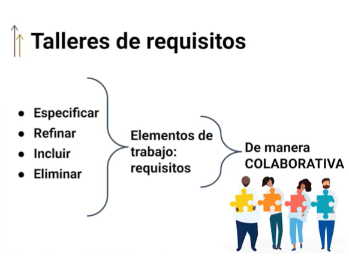
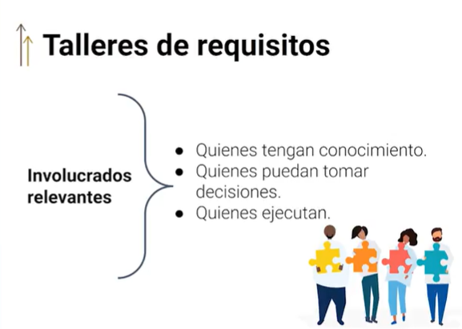
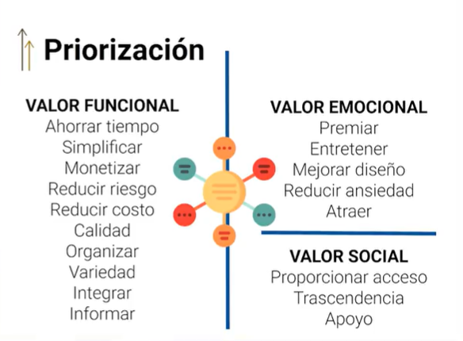
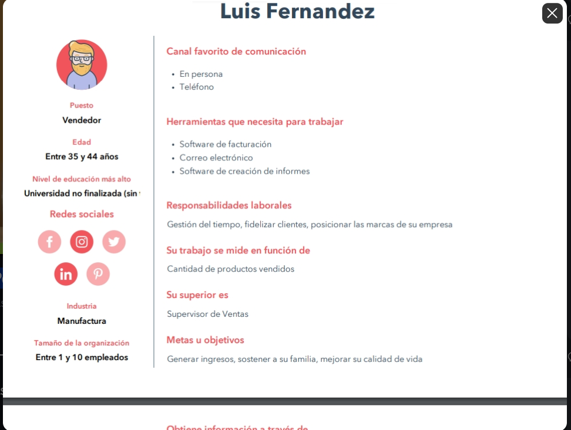
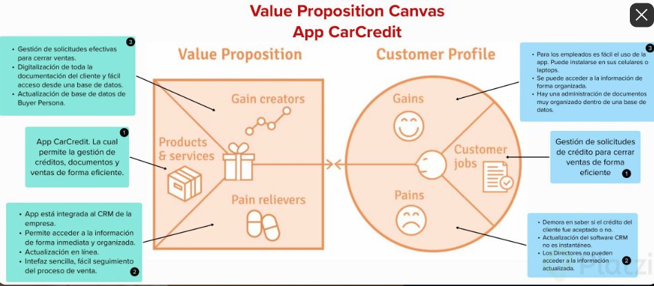
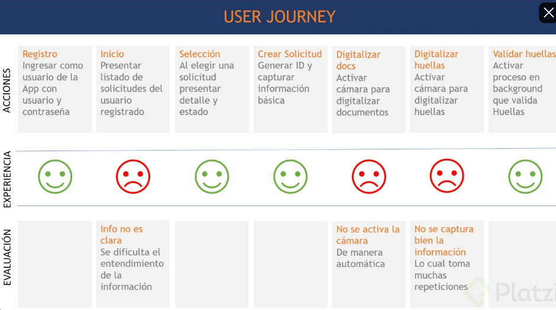

# Curso de Herramientas y Frameworks Intermedias para Product Owners

## Clase 1: Historia de Usuario 

> Historia de Usuario: 
- Es una manera simple de describir una característica que espera nuestro usuario (Viene des Extreme programing)

**Primera regla a considerar cuando haces historias de usuario:**
- Es tener un solo qué es decir una sola funcionalidad.
- Estructura más popular: 
	- Usuario 
	- Funcionalidad 
	- Objetivo
- Tiene que quedar claro el para que se requiere la funcionalidad

**Segunda regla a considerar:**
- Tiene que incluir criterios de aceptación. 

## Clase 2: Esquematización de elementos de trabajo

**Notas**
- No podemos depender de especificaciones escritas 
- El Product Owners tiene la responsabilidad de trasmitir que es lo que se tiene que hacer. 
- Nos podemos apoyar con el apoyo visual 
- Existe una tecnica -> Pensamiento visual (visual thinking): Es una de las herramientas mas importantes de nuestros dias
- Los mapas mentales abstraen a través de las ideas principales de manera grafica y simple las esencias de lo que queramos transmitir

**Tus herramientas **
- Se puede explicar las HU entonces como:
- Idea central = épica
- idea/concepto = HU
- sub concepto = tareas a desarrollar para alcanzar ese MVP

**Herramienta para crear** 
- jamboard 
- sketchboard

## Clase 3: Descomposición

**Notas**
- Técnica que viene de un conjunto de disciplinas relacionadas con el análisis de negocio
- El analisis te permite entender el problema de negocio que tu producto quiere solucionar y proponer alternativas, definir el alcance y poder hacer consideraciones de todos los recursos que tiene la empresa
- Scrum es un contenedor de tecnicas practicas que no tiene tecnicas propias, te dice que pero no como
- La descomposición funcional te puede ayudar siendo un mapa de lo que vamos a contruir

**Herramienta** 
- drawio

## Clase 4: Prototipado como medio de especificación

**Notas**
- Podemos usar herramienta electronicas para realizar el prototipado 
- Actualmente podemos usar los Frameworks visuales para hacer interfaces no funcionales pero si visuales 
- Si el problema es complejo podemos pre diseñar de una manera asi decirlo
- "Un prototipo dice más que mil reuniones"

**Documento HU**
- [Documento](./info/PlantillaHistoriasUsuario.pdf) 

## Clase 5: Estimación colaborativa

**Notas**
- Podemos estimar por entregables y esfuerzo e ir ponderando ese esfuerzo 
- Llamase esfuerzo como tareas mínimas y máximas 
- Siempre hay que hacer que el "que" y el "como" quede claro
 

**Herramientas** 
- Poker Estimation
- RICE estimation
- MoSCoW Analysis
- Kano Model
- Opportunity model
- Cost of Delay
- Size t-shirt

## Clase 6:  Talleres de requisitos

**Teoria**

**Ejemplo Taller Requisitos**
- Taller de requisitos 0. 
- Romper el hielo (3 mins)
- Todos al aquí y al ahora: objetivo de la reunión y presentación de agenda(3 mins)
- Presentación de la HU a refinar: lidera PO, compartir visión (5 mins)
- Intervención de usuarios: visión, contexto (5 mis)
- Preguntas del equipo para detallar requisito (10 mins)
- Conversación detalles técnicos del equipo Dev (10 mins)
- Lectura final de la HU, aprobación
- Cierre
- Tiempo total de la sesión: 30 minutos

## Clase 7: Priorización de elementos de trabajo

**Notas**
- La priorización de los elementos de trabajos es una responsabilidad del Product owner. 
- Para esto se necesita:
	- Conocer el negocio
	- Dimensionar la necesidad y que genera valor al producto (responder a la pregunta para que)
	- Extraer las ideas del equipo
- Evitar el Sindrome todo urge 

## Clase 8: Principios de orientación al usuario

**Notas**
- Nunca debemos olvidar para quién trabajamos realmente. 

**Existen dos clases de clientes:**
- Cliente solicitante.
- Cliente Usuario Final. (Éstos son los más importantes)
- Customer Centricity

**Las decisiones y acciones se evalúan desde el impacto a los clientes.**
- Técnica para orientarse al usuario
- Es pensar en tu usuario final como rol, como persona: el comprador, el supervisor, etc. Finalmente, el rol que esta persona vaya a ejecutar dentro de la aplicación (servicio o producto) y generar frases como: . “Te pido ayuda para…”

**La técnica para orientación al usuario "Te pido ayuda para..."** 
	- Se refiere a la forma en que un usuario puede solicitar ayuda o asistencia de manera efectiva y clara a un agente de soporte o servicio al cliente. 
	- En este caso, ésta práctica sirve mucho cuando se efectúa desde el interior del Scrum Team.

**La técnica implica que el usuario comience su solicitud de ayuda con la frase "Te pido ayuda para..."** 
	- Seguido de una descripción detallada del problema o pregunta que tenga. 
	- Esta técnica ayuda a enfocar la solicitud en el problema específico que el usuario necesita resolver, lo que puede hacer que sea más fácil 
	- Para el Scrum Team proporcionar una solución o respuesta precisa y oportuna.
	- Además, esta técnica puede ayudar a gestionar el tiempo, ya que el Product Owner junto con su equipo, 
	- puede entender rápidamente cuál es la necesidad del usuario y ofrecer la solución adecuada en lugar de tener que hacer preguntas adicionales para aclarar el problema.

## Clase 9: Técnica de Buyer Persona

**Notas**
- La técnica de "buyer (ba.i.er) personas" generalmente se utiliza en la etapa de "Definición de Requisitos"
- Del proceso de desarrollo, que es una parte fundamental del enfoque Scrum. 
- En esta etapa, el equipo identifica y comprende las necesidades, objetivos y características de los usuarios finales del producto o sistema que se va a desarrollar.
- Una vez que se han creado las buyer personas, el equipo Scrum puede utilizar esta información para tomar decisiones informadas sobre la funcionalidad y el diseño del producto. 
- Esto contribuye a asegurarse de que el producto final esté alineado con las necesidades y expectativas de los usuarios finales, lo que es esencial para el éxito del proyecto.

## Clase 10: Técnica de Value Proposition Canvas

> La técnica de **Value Proposition Canvas** es una herramienta utilizada para diseñar propuestas de valor 
centradas en el cliente. 

**Consiste en una plantilla que se divide en dos partes:** 
- Perfil del Cliente -> Se identifican los trabajos, los problemas y las necesidades del cliente, así como su perfil demográfico y psicográfico
- Propuesta de Valor -> se describe cómo la empresa o el producto satisfacen las necesidades del cliente, a través de los productos o servicios que se ofrecen, los beneficios que se brindan y la forma en que se diferencian de la competencia. 

## Clase 11: Técnica User Journey

**La técnica User Journey (o "viaje del usuario")** 
- Es una herramienta utilizada en diseño de experiencia de usuario (UX) 
- marketing para visualizar y comprender la experiencia que tiene un usuario al interactuar con un producto o servicio. 
- Consiste en crear un mapa que muestra las acciones y emociones que experimenta el usuario a lo largo de su interacción con el producto o servicio, desde el primer contacto hasta la conclusión de su uso. 
- Este mapa ayuda a identificar oportunidades de mejora en la experiencia del usuario y a diseñar soluciones que aborden sus necesidades y deseos de manera efectiva.

## Clase 12: Examen 

Resumen
1.
¿Qué es una Historia de Usuario?
Es una descripción simple de una característica esperada, contada desde la perspectiva de la persona que va a usar esa capacidad.

2.
¿Por qué le sirve a un Product Owner aprender técnicas de esquematización del trabajo?
Para poder usar técnicas complementarias que apoyen al entendimiento de todos los miembros del equipo.

3.
¿Para qué sirve la descomposición funcional?
Para identificar en forma de organigrama a todos los involucrados que estarán trabajando en las funcionalidades.
Para representar gráficamente la perspectiva general de los aspectos relevantes del comercio con el objetivo de mejorar la eficacia y efectividad de su operación.
REPASAR CLASE

4.
Los prototipos visuales son exclusivos de los equipos de UX / UI
Falso

5.
¿Qué se debe de considerar para la Estimación Colaborativa?
Considerar los escenarios más probables relacionados a la complejidad. Hablar de factibilidad. Considerar sesgos.

6.
¿Qué características deben de tener los invitados a un taller de requisitos?
Quienes tengan conocimiento. Quienes puedan tomar decisiones. Quienes ejecutan.

7.
¿Cuál es la pregunta más importante para determinar el valor de un elemento de trabajo y así poderlo priorizar mejor?
¿Para qué?

8.
El valor es categorizable. Es decir, podemos poner categorías a cada elemento según su valor y priorizar las categorías.
Verdadero

9.
En un proyecto de software ágil el eje principal son los criterios orientados a:
Las necesidades de los usuarios finales y objetivos de negocio.

10.
Usamos la técnica de Buyer Persona para:
Tener presente los usuarios para quienes trabajamos. se diseña se crea se prioriza

11.
¿Para qué usamos el User Journey?
Para representar gráficamente de una manera simple, las decisiones y acciones más importantes así como las emociones que les puede provocar los pasos esenciales dentro de la aplicación.

12.
¿Qué evitamos al usar la técnica de Value Proposition Canvas?
Evita llevar a cabo una propuesta de valor sin primero tener en cuenta al cliente.