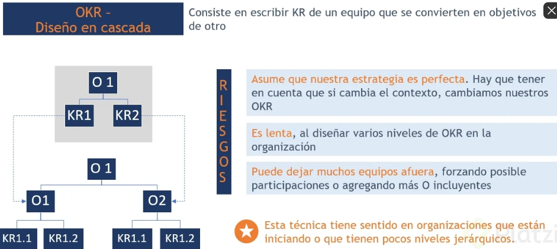

# Curso Avanzado de OKRs para Managers

## Clase 1: 

**En este curso conocerás**
- ¿Qué pasa cuando estamos en una organización con múltiples equipos? 
- ¿Cuáles son mis responsabilidades como manager en esta metodología? 
- ¿Qué hacer cuando tenemos múltiples niveles de jerarquía en la organización y equipos dentro de equipos?

## Clase 2: 

**Es una metodología llamada OKRs (o.ki.ars):**
- Metodología utilizada por personas, equipos o grandes organizaciones 
- para la definición de objetivos cuantitativos y para el seguimiento de su cumplimiento.
- Su finalidad es crear alineación entre los miembros y equipos de una organización asegurando que todos estén yendo en la misma dirección con prioridades claras y a un ritmo constante.

- Ayudan a las empresas a mantenerse enfocadas en los proyectos o iniciativas que tendrán el máximo impacto.
- Optan por un enfoque ágil con ciclos cortos donde las empresas pueden adaptarse y responder acorde a los cambios en el mundo.
- Permiten reducir fuertemente el tiempo de los ciclos de definición de objetivos.
- Un OKR se puede leer como "voy a lograr este objetivo medido por estos Key Results"
- OBJETIVO: Descirpción cualitativa, breve e inspiradora de lo que se quiere lograr (debe ser motivador y desafiante) KEY RESULTS: Son una lista de metricas que se usan para medir el progreso hacia la completitud del objetivo.
- Para cada objetivo se suele tener entre 2 y 5 Key Results (deben ser cuantitativos y facilmente medibles) SIN MEDICIÓN NO SE TIENE UNA META REAL
- Podemos tener en tres 3 y 5 KR por objetivo.

**Ventajas de los OKRs**

- ENFOQUE. Ayudana las empresas a mantenerse enfocadas en lo más importante para maximizar el impacto
- ÁGILES. En vez de establecer ciclos de planeación anual y estática, los OKRs son ágiles, con ciclos cortos y adaptables al cambio.
- SIMPLICIDAD. Son fáciles de crear y entender, para que el tiempo se enfoque en cumplir los objetivos y no en establecerlos.
- TRANSPARENCIA. Son públicos y de libre acceso para todos los equipos
- CADENCIA. Plantea distintas cadencias: estratégica (anual), táctica (trimestral), operativa (semanal)
- OBJETIVOS BIDIRECCIONALES. En lugar de ser verticales, todo el equipo participa en proponerlos

- Estructura de los OKRs Objetivo: Debe ser una descripción desafiante, cualitativo, breve e inspiradora de lo que queremos lograr el Key Result es una métrica

##  Clase 3:  Requisitos previos 

**Tips** 
- Para implementar este framework de trabajo se deben de dar unas condiciones que se convierten en los pilares sobre los cuales se apoya esta metodología:

1.- Confianza.
	- Los OKRs no son para command and control.
	- Sirve para redireccionar los esfuerzos de los colaboradores hacia los objetivos, confiando en que ellos van a lograrlo.
2.- Equipos Empoderados.
	- Funciona solo con equipos empoderados. Es decir que tienen la capacidad y autonomía de decidir como llegar a los objetivos deseados.
3.- Misión y Visión.
	- Deben de ser clara y representar la estrategia del negocio.
	- La misión permite establecer la base del plan de negocios y construir estrategias coherentes que sirven como base a cualquier decisión u objetivo a futuro.
	- La Visión permite definir el camino que se debe de seguir para alcanzar las metas propuestas.
4.- Apoyo de la Dirección.
	- Los líderes se encargan de participar de la definición de los objetivos de alto nivel y empoderar a los equipos a trabajar con esta metodología.
	- No lo deben de ver como otra tarea de management
	
## Clase 4: GESTIÓN DEL CAMBIO: ADKAR -> etapas de maduración del proceso del cambio 

A->Awareness -> a.wour.nes -> conciencia 
D->Desire    -> disaire  -> Deseo 
K->Knowledge -> nou.legs  -> conocimiento 
A->Ability   ->  a.bei.li.ty  -> Habilidad 
R->Reinforcement -> Rien.for.ment -> reforzamiento

**Pasos**

- Awareness: 
	- Comunicar el cambio a toda la empresa y explicar los motivos del porque el cambio.
- Desire: 
	- Se refiere a generar el deseo en el equipo para soportar el cambio. 
	- (Empoderar a los equipos y comprometerlos con los cambios y objetivos).
- Knowledge: 
	- Conocimiento necesario para efectuar el cambio. 
	- (Realizar talleres con los equipos para explicar los fundamentos de la metodología).
	- Realizar distintos talleres 
	
- Ability: 
	- Habilidad de implementar los nuevos skills e identificar las barreras y soluciones posibles durante la implementación.

- Reinforcement(Refuerzo): 
	- Busqueda de la mejora continua en la implementación de la metodología.
	- Seguimiento semanal a traves de reuniones retroperxtiva 
	- Mejora continua 
	
## Clase 5: Diseño de OKRs - Cascada

**Que**
- Consiste en escribir KR de un equipo que se convierten en objetivos de otro. 
- Esta técnica es implementada en organizaciones que estan iniciando o que tienen pocos niveles 
- Es una técnica con riesgo 

## Clase 6: Diseño de OKRs - Alineación 

En los OKRs por alineación los equipos tienen que respetar la intención de los OKRs de la organización o equipos superiores y trabajar en un modelo bottom up para la definición de cada uno de los equipos. Esto conlleva a un empoderamiento de los equipos para que definan sus objetivos de forma proactiva, y con ello, aumenta su responsabilidad y accountability. En resumen, las principales diferencias entre los OKRs en cascada y los OKRs por alineación son:

- Cascada: es un modelo top-down, donde los objetivos y KRs son definidos por la cima del organigrama y desplegados hacia abajo.

- Alineación: tiene una primera instancia top-down, pero luego se trabaja en un modelo bottom-up para definir los objetivos de cada equipo.

**Notas** 
- Los OKrs va ser nuestra brujula durante un periodo 
- Menos Okrs es mas 
- si no lo podemos medir facilmente no es un OKI viable 
- En la alineación, los equipos tienen un mayor empoderamiento para definir sus objetivos de forma proactiva y aumenta su responsabilidad y accountability.
- Compartir resultados mensuales 

## Clase 7:  KRs orientados a resultados 

**Nota** 
- estamos midiendo resultados o midiendo esfuerzo 
- Estan los OKIs enfocados en objetivo o en los medios 

- KR basados en actividades (Ejecutar camapa, crear un nuevo modulo, crear una update) verbos  -> lanzar, desarrollar, definir 
- KR basados en valores o resultados miden el resultado del equipo (Mantener resultados, Alcanzar dicho valor )  verbos -> Mantener, alcanzar  
- Lo Okis no pueden ser basados en mero cumplimiento de tareas 
- Debe existir un equilibrio entre actividades y resultados, Exito no es marcar un checklist es dar un impacto 
- Enfocate en el destino y no en el como 
- Que esperamos que cambie si este proyecto es exitoso 

## Clase 8: Check In 

Es importante hacer el seguimiento a los OKR’s planteados, para el exito de los mismos.

- Se puede usar la reunion de Check In semanal para verificación de avance. 
	- Cortas y enfocadas 
	- No es buscar culpables 
	- solo es validar donde estamos y a donde vamos 
	- si eres el Manager debes ser el moredador es escuchar y estan atento a los detalles 
- Esta reunion no es para buscar culpables.
- El manager debe facilitar el encuentro. Debe ser el moderador.

Requisito fundamental: el responsable de cada KR’s debe tener los valores actualizados y el estado de las iniciativas. .

**Framework para llevar la reunion:** 
- Cual es el progreso de los KR’s desde la ultima reunion?. (numerico)
- Que tan confiado estas para alcanzar la meta del KR’s?
- Los impedimentos que vemos.
- Que iniciativas se estan ejecutando, para lograr los Objetivos 

**Las 3 dimensiones que necesitamos saber sobre cada iniciativa son:**
- Estatus de alto nivel.
- Impacto de la iniciativa sobre el KR
- El nivel de confianza para el cumplimiento de los KR’s
- Preguntar al Owner los impedimentos para seguir avanzando.

## Clase 9: Recomendaciones del Check In

**Notas**
- No acapares la conversación. Genera discusion.
- No busques culpables, si no soluciones.
- Es una buena estrategia que se valide semanalmente 
- Es mejor pasar la lista de los Okrs a los miembros del equipo ya que se hacen responsables y no es buena idea asignarlo a dedo  

**Cadencia Semanal.**
Es importante la frecuencia de la reunion de Check In, ya que necesitamos la mayor cantidad de momentos de control que nos permite detectar tendencias en la evolución de los KR’s . "Si simplemente midiendo resolviéramos los problemas, comprar una balanza nos haría bajar de peso."

