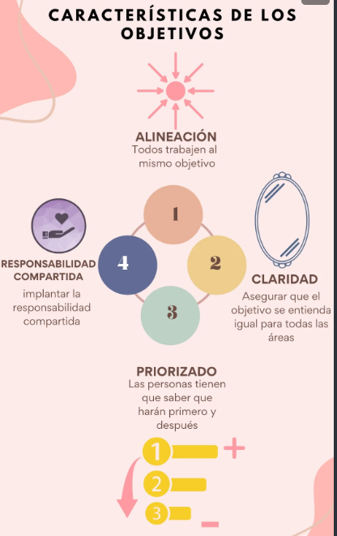
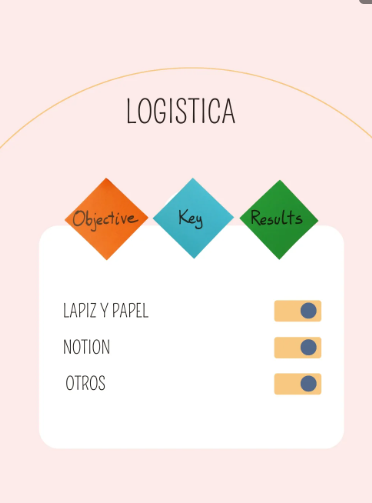

# Curso de OKRs

## Clase 1: Introducción al Curso

El libro "Mide lo que importa", 
- es un libro escrito por John Doerr, 
- presenta una metodología llamada OKR (Objectives and Key Results) 
- que ha sido utilizada por empresas como Google y Intel para establecer metas y medir su progreso, y destaca la importancia 
- de la transparencia, el liderazgo y la adaptabilidad en su implementación. 

**Ventajas**
- La importancia de establecer objetivos: Establecer objetivos es fundamental para el éxito de una organización, ya que permite enfocar los esfuerzos y recursos en las áreas más importantes.
- La metodología OKR: La metodología OKR se basa en establecer objetivos específicos y medibles, y definir los resultados clave que indicarán el progreso hacia esos objetivos.
- La importancia de la transparencia: En la metodología OKR, ya que permite que todos los miembros de una organización conozcan los objetivos y resultados clave de cada equipo y puedan trabajar en conjunto hacia las metas comunes.
- El papel del liderazgo: El liderazgo es clave para el éxito de la metodología OKR, ya que los líderes deben establecer objetivos claros, comunicarlos efectivamente y motivar a su equipo para lograrlos.
- La adaptabilidad: La metodología OKR debe ser adaptable a cada organización y contexto, y que debe ser evaluada y ajustada regularmente para asegurarse de que siga siendo efectiva.
- En los OKR, los objetivos son declaraciones claras y concisas de lo que una organización o equipo quiere lograr en un período de tiempo

## Clase 2: Impacto

**Concepto**

- OKR (Objectives and Key Results) es una técnica de gestión de objetivos que ayuda a las organizaciones a establecer objetivos claros y medibles
- Medir el progreso hacia su logro. 
- Se basa en el establecimiento de objetivos desafiantes pero alcanzables 
- Definición de indicadores clave de desempeño para medir el progreso hacia esos objetivos. 

- Los OKR se establecen en cascada, lo que significa que los objetivos más altos de la organización se desglosan en objetivos más específicos y mensurables para cada equipo y persona dentro de la organización. 
- Los OKR se utilizan comúnmente en organizaciones ágiles y de tecnología, y son una forma efectiva de alinear los objetivos de los empleados con los objetivos de la organización en general.

**Primer Paso:**
- Definir objetivos de Orden mas importante hasta el menos mas importante 
- Se hace en cascada 

## Clase 3: Expectativas 
**Genera tus Objetivos** 
De manera alineada, clara, refinada y Responsabilidad compartida.

**Características de los OKR:**
- Alineación: Todos tenemos que estar de acuerdo en lo que queremos lograr y cuales son las prioridades.
- Claridad: Todos debemos tener claro como lograr nuestros objetivos
- Priorización: Las personas tienen que saber que harán primero y despues. 
- Responsabilidad Compartida: Implantar la responsabilidad Compartida

## Clase 4: Logística (Vamos a la practica)

**Nota**
- Se clono una plantilla en Notion para trabajarlo -> https://www.notion.so/OKRs-Sample-ea1ff88171aa4db38645dc33bd41ae1b

## Clase 5: Requisitos

**Notas**
- No podemos tomar una hoja en blanco e iniciar los objetivos 
- Debemos tener la mision, vision y valores 

## Clase 6: Qué es un objetivo

**Qué**
- son los deseos de los líderes que nos indican, hacia donde quieren propulsar la empresa durante una ventana de tiempo determinada, que aunque ambiciosos son realistas. 

**TIPS PARA ESTRUCTURAR LOS OBJETIVOS**

- 🔎 Descripciones: objetivo simple y claro, una frase máximo dos.

- 📝 Lenguaje Sencillo: cualquier persona lo puede entender.

- 🎯 Comenzar con un verbo: indica acción.

- 💪 Retantes e inspiradores: la motivación está implícita.

- ⏳ Claros y específicos: para un tiempo determinado y aclararlos las veces que sea necesario.

**Objetivos podemos usar la metodología SMART.**

- Specific (Especifico)
- Measurable (Medible)
- Achievable (Alcanzable)
- Realistc (Realista)
- Time (Tiempo)

## Clase 7: Qué son los Key Results

**Key Results**
- Cómo vamos a medir el objetivo? 
- Qué significa el objetivo que hemos puesto? 
- Manera de saber que estamos acercándonos a conseguirlo.
- OKIAR son cuantitativos 
- Tienen que ser medibles asi sean sugetivos 
- Okiar siempre van en positivo
- Siempre saber que hacer 
- Icrementar el performance 
- Es mejor incrementar que reducir 
- cUANTOS okiaR  van por objetivo minimo 2 o 3 por objetivos 

**Qué son los Key Results? 
- Valor objetivo y medible que nos indica el progreso hacia el objetivo.

**👇Valor** 
- Siempre son un número.

**Objetivo** 
- No se trata de una opinión o sentimiento, que no puede ser validado y medible. Incluso en el caso de medir el NPS (Net Promoter Score), aún siendo una opinión de las personas, sin embargo, pasa por un proceso estadístico estudiado, no está abierto a la interpretación subjetiva, sino objetiva.

**Medible** 
- Debe haber una forma de darle seguimiento.

**Nos indica el progreso hacia el que están vinculados** 
- El resultado de cada uno de los Key results nos permite obtener un valor medible y objetivo con que trabajar y optimizar para lograr nuestro objetivo final.

**Un Key result siempre tiene mínimo 3 valores. 👇**
- Valor inicial - Dónde estábamos cuando determinamos implementar un cambio
- Valor actual - Dónde estamos hoy que ya estamos midiendo, esta es el valor que buscamos se mantenga entre un 60 y un 80% de logro.
- Valor objetivo - A dónde queremos llegar.

## Clase 8: Medición de Key Results

**Notas**
- Si no logras okiar en dos semanas es que ese OKIar esta mal planteado
- Si puse un KR que en 2 semanas no puede ser medido está mal establecido
- Saber que tan probable es de conseguirlo

**Los valores:**
- Por debajo del 30%, estaba mal planteado y casi imposible de conseguir
- Entre el 30% y 70% está mas o menos pero podría mejorar
- Entre el 70% y 100% está perfectamente establecido

- Formato puesto; nada de argot técnicos, simple y claro 
- Ejemplo, ayudar al departamento de TI → Debo preguntar ¿ayudarlo a qué?
- Verbos malos -> ayudar, asistir, acompañar, compartir,  son ambiguos para el OKIAR,
- Debemos hacernos preguntas de ayuda Para qué, con que proposito 

## Clase 9: KPI vs KR

**Un KPI (key performance indicator)** 
- Es como una regla que mide qué tan bien está funcionando algo. 
- Imagina que estás jugando al fútbol y quieres saber qué tan bueno eres. 
- Un KPI podría ser cuántos goles marcas en un partido. 
- Ese número es un indicador clave de qué tan bien estás jugando.

**Los KR (key results)** 
- Son como pequeños objetivos que te ayudan a alcanzar tu meta principal. 
- Si tu meta es ser un mejor jugador de fútbol (KPI), los KR podrían ser practicar tiros a puerta todos los días, mejorar tu resistencia o aprender nuevas tácticas.

Entonces, en resumen, el KPI es la gran medida general de qué tan bien estás haciendo las cosas, mientras que los KR son los pequeños pasos específicos que tomas para mejorar esos resultados. Es como tener un marcador general (KPI) y pequeñas metas (KR) que te acercan a ganar el juego.

## Clase 10: 

Iniciativas 
- Proyectos que contribuyen a los KR Las suelen definir las personas que las van a hacer Tienen que seguir 3 Pilares: 
    - Valores : Preguntarse si dichos objetivos van con los valores de la empresa, Es Etico ? 
    - Compromiso: Dejar al equipo pueda proponer para que se genere compromiso Valores: ¿Estas iniciativas siguen tus valores? 
    - Prioridad: ¿Cómo sabemos cual de los proyectos es lo más importante? En el sistema de OKR es más importante tener todos los objetivos a la mitad que todos al 100% → en el formato que los proyectos estén en color amarillo envés que verde

 ## Clase 11: Roles y Responsabilidades

 Para cada KR se necesita un responsable: 
 - Alguien que sirva de enlace para conocer el grado del progreso, alguien que aclare las dudas, alguien que se le notifique cualquier cambio.

**Roles:**

- Dirección: encargada de hacer en gran medida las estrategias, sin embargo, los Jefes Intermedios también apoyan en este proceso. 
- Jefes Intermedios: Encargados de elaborar los Objetivos (junto con la dirección para que estén alineados con la estrategia) y los KR (junto con los equipos, para ir designando los responsables). 
- Equipos: Se encargan de elaborar las iniciativas para colaborar en el alcance de los KR sin embargo, estas iniciativas también son monitoreadas por los jefes intermedios.

Nota: Es fundamental que la información se transmita en los 3 niveles (de arriba a abajo y de abajo para arriba), no saltarse a nadie.

