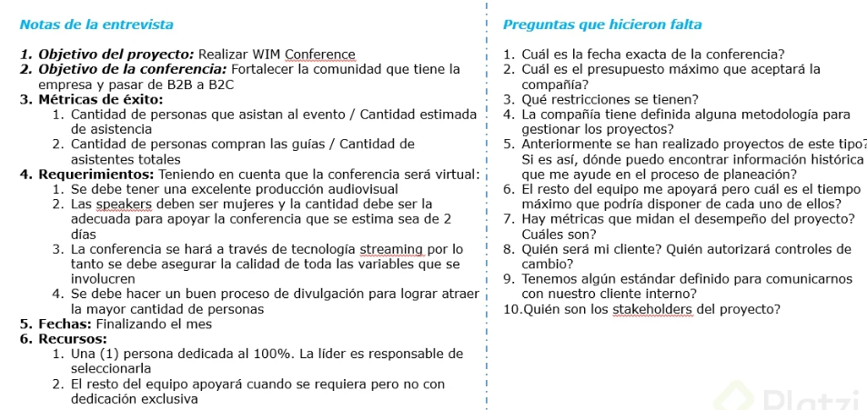
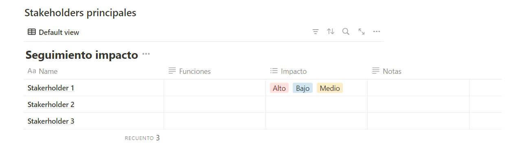
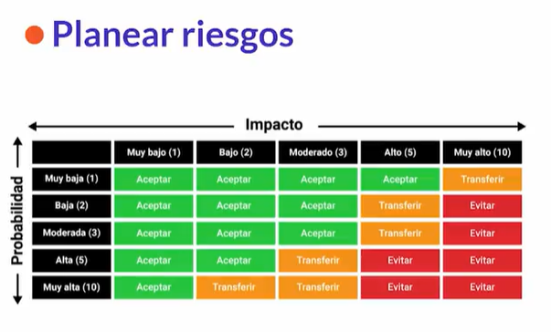

# CursoGestionPlanificarDefinirIdentificarRiesgosProyecto

## Clase 1: ¿Planificar según tu perfil?

- [Notation - Template]('https://www.notion.so/PLANTILLA-DE-PROYECTO-6ca1d24ab93645f4a8e12bcdd1b3b86e')

**Que es un proyecto**
> Es un esfuerzo que se logra con ideas bien planeadas con el proposito de tener un resultado acertados partiendo de un inicio y fin. 


**Identificar problemas**
- Problema a solucionar, de Tecnología, Procesos, estructura organizativa o perfiles del personal. 

**Soluciones:* 
- Cuantificar los beneficios
- Estimar costos
- Evaluar la factibilidad
- Identificar riesgos potenciales 

**Posible solución definitiva**
- Determinar la solución más viable a partir de la evaluación de factores como costos, riesgos, beneficios, etc. 

**Plan de implementación**: 
- se deben presentar los siguientes puntos de validación 
    - Inicio
    - Planificación
    - Ejecución
    - Cierre

## Clase 2: Planificar un proyecto

**Concepto**
- Es pensar de manera estructurada y con base en el tiempo disponible
- Al plenea se deben responder las siguientes preguntas: ¿cómo?, ¿cuándo?, ¿quiénes?, ¿por qué?
- Es asignar responsables 
- Definir metricas para validar si el proyecto cumpler con los objetivos 

**Caracteristicas**
- Stakeholders es el apoyo para planear ya que nos daran los suministros necesarios para iniciar. 
- Un plan debe ser claro y fácil de hacer Sostenible en el tiempo Ajustada al contexto
- Se deben tener los elementos necesarios para poder planificar: 
    - Objetivos 
        - ¿Qué quieres lograr, qué aporta, por qué es importante?
    - Plazo
        - ¿Cuánto tiempo tienes para conseguir ese resultado único?
    - Alcance
        - ¿Qué incluye y qué no incluye tu proyecto?
    - Costos
        - ¿Cuánto vale el proyecto?
- En los proyectos hay Entradas y Salidas.
    - Entradas:
        - Objetivos: Misión, estrategia
        - Requerimiento: ¿Qué se espera del proyecto?
        - Recursos: Tiempo, dinero y/o personas
    - Salidas: 
        - Son los resultados de la planificación, estas pueden ser una acta, documento, etc.


**Material**
- [Ejemplo Planificar -template](../info/Example_Planificación_Women_in_Marketing_Conf.pdf)

## Clase 3: Caso de estudio: análisis del proyecto
**Pasos**
> Por ser una clase practica debemos imaginar un proyecto 
- Paso 1: Primero debemos leer los antecedentes correos, archivos resumenes, para luego tener el contexto del alcance. 
- Paso 2: iniciamos la bateria de preguntas para aterrizar mejor el plan 
- Paso 3: Durante la entrevista debemos enfocarnos en aclarar las dudas de tu previo analisis. 
- Pas 4: Ya con esta  fisrt picture, podras empezar a planear 

**Material**
- 

## Clase 4: Iniciar con un proyecto o actividad
**Pasos**
> Por ser una clase practica debemos imaginar un proyecto 

- Paso 1: ya con los suministros iniciamos a plasmar y generar el plan podemos usar ciertos formatos muchas empresas ya tienen este formato menbretado pero en caso especiales podemos generar nuestro propio formato con base a las reglas básicas para una planificación.

- Paso 2: Definir los objetivos 
- Paso 3: cada objetivo tiene un conjuntos de requerimientos 
- Paso 4: Alcance del proyecto. 
- Paso 5: Definir Equipo de trabajo y responsables Podemos usar el metodo DACI -> Deici -> Es una metodologia que divide un equipo en una pequeña jerarquia :
    - Driver: Es la persona responsable de validar que todo se este cumpliendo a la medidad y de ayudar que todo pueda avanzar y quitar los obtaculos que impida el avance. [PM]
    - Approver:(aˈpruː.vɚ/) Es la persona responsable de validar la calidad del servicio, producto ó evento [QA]
    - Contributor:(/kanˈtrɪb.jə.t̬ɚ/) Es la persona encargada de ejecutar el proyecto de construir los pilares y funcionalidades del proyecto [Back, Front, Analyst, Write] 
    - Informed: Es la persona que hay que mantener informadas [Po, stakeholders]
- Paso 6: Definir Tiempo, calendarrios
- Paso 7: Definir stakeholders personas interesadas 
- Paso 8: Riesgo
- Paso 9: Costos 


**Material**
- [Notation - Template]('https://grandiose-rainbow-ab3.notion.site/PLANTILLA-DE-PROYECTO-97311fa0b0284dd2adab9a090cfb8720')
- [Notation - Template]('https://www.notion.so/PLANTILLA-DE-PROYECTO-6ca1d24ab93645f4a8e12bcdd1b3b86e')


## Clase 5: Planificación: Gestión de stakeholders
**Conceptos**

> takeholders: 

- Son las personas interesadas e impactadas por el proyecto.
- ¿Cómo identificarlos? Preguntarse Si cumplen cualquiera de las siguientes condiciones: 
    - El proyecto lo impacta de alguna manera 
    - Si necesitas algo de esta persona en el proyecto Hay stakeholders directamente involucrados en la ejecución y otros que no. 
    - Es importante identificar y planificar lo que se viene con los stakeholders para su gestión durante la ejecución, porque son una variable que puede afectar el proyecto, así como el proyecto los puede afectar a ellos. 
    - La clave está en la comunicación, mantenerlos informados. La comunicación con los stakeholders debe ser clara, transparente, amable y empática.

**Comunicación con stakeholders**
- Clara: Tener reuniones asyncronas que permita validar el avance 
- Transparente: Se debe indicar lo bueno y lo malo del avance del proyecto esto genera confianza y sinergia
- Amable: Empatia es la clave del exito se debe solicitar, resaltar, enfatizar algun detalle de manera respetuosa. Tener un ambiente cordial.   


**Material**
- Ejemplo para iniciar una conversación con el posible stakeholders
``` 
Espero te encuentres bien, te escribo porque considero que podemos hacer un gran equipo y estoy abierta a escucharte y a entender como es tu dinámica de trabajo para llevar las cosas de mejor forma. Los equipos se apoyan, se sustentan entre sí y se tienen confianza, espero que poco a poco construyamos esa confianza y llevemos a cabo las tareas de la manera más objetiva. Por ultimo reitero que la comunicación es pilar fundamental, si necesitas que lleguemos a acuerdos podemos conversarlo sin problema. Saludos
``` 
- 


## Clase 6: Planificación: tiempo
**Conceptos**

**¿Por qué planificar el tiempo?** 
- Para cumplir plazos 
- Para no dedicar mucho tiempo a algo que no da resultados. 

**¿Cómo planificar el tiempo?** 
- Con alguna herramienta que nos permita planificar tiempos: 
    - Notion 
    - Clickup 
    - Jira
    - Monday 
 
**Un cronograma**
- Es una herramienta estructurada por actividades para hacer seguimiento a lo que está pasando a través de los siguientes componentes:
 - Duración: tiempo de ejecución de una tarea o actividad
 - Responsable: la persona encargada de una actividad
 - Entregable: resultado de una actividad 
 - Estado: situación actual de cada actividad, se debe mantener actualizado el estado de cada actividad: abierta, en progreso, en revisión, cerrada. 
 
 **Nota** 
 - En la planificación todas las tareas se colocan en estado abierto y debemos asignarle cada uno de sus componentes.
 
 ## Clase 7: Planificación: riesgos
 
**Concepto**
- Los riesgos ¿Qué significa identificar los riesgos de tu proyecto? 
- Saber qué puede representar un obstáculo para lo que estamos haciendo
- También identificar qué hacer si esto sucede, para que en el momento que ocurra sepamos cómo proceder 
- Evitar el  bloqueo por un imprevisto. 

 **Matriz de identificación de riesgos** 
 - La matriz nos dice lo que debemos hacer con los riesgos
 - Los aceptamos, no hay que hacer nada solo aceptarlos.
 - Los transferimos, los podemos delegar, otra persona puede estar pendiente de esto.
 - Los evitamos, son los que debemos accionar para que no ocurran, ya que si ocurren tendría consecuencias negativas en el proyecto
 

**Material**
- 

## Clase 8: Errores comunes

**Parálisis por análisis**

- Dedicar más tiempo de lo necesario a la planeación
- La planificación no es la parte más imporante de un proyecto, aunque es un factor que si determina el éxito del mismo.
- Lo que se tiene que hacer en un proyecto es Ejecutar (manos a la obra) y la planificación es un direccionamiento.
- Dar vuelta a lo que debes hacer y no empiezas a hacer.
- Puede pasar que te paralices si no hay cambios (ya sea por tropiezos obstáculos)

**Como evitarlo**

- Definir el alcance muy bien
- Delimita el tiempo acorde a la circunstancia del proyecto.
- Lo importante es saltar a la siguiente fase (ejecución).

**Cambios sin control**
- No se previó cambios, ya sea en el alcance, ejecución, en los responsables.
- Lo primero que debes hacer es comunicar a los stakeholder para decirles como vas a abordar los procesos cambios (que se admite cambiar y que no).
- Comunica cuando inicias algo que no tiene reversas. (delimita)

**Alcance sin claridad**

- No se realizo las preguntas necesarias
- El cliente no tiene claro lo que espera el proyecto.

**Se puede mitigar**
- Presentar escenarios similares a que se puede llegar de acuerdo a los casos que se presentan.
- Presentar ejemplos de ser posible.
- Comunicar el alcance, lo que se va a lograr con el proyecto.

**Notas**
- Parálisis por exceso de planificación
- Exceso de cambios sin control
- No tener Claridad en el alcance

## Clase 9: 

**Resumen** 
- La importancia de la planificación 
- Liderzago 

**Material**
- [Lider](../info/lectura-liderazgo_-lo-que-hacen-los-grandes-lideres_be001f6b-b286-465f-9d17-9920aa3d04ee.pdf)

Resumen
Resumen
1.
Trabajas en una startup de 20 integrantes desde hace un año y recientemente se incorporó una persona nueva llamada Luisa para ayudarte en la ejecución del proyecto más grande que tiene tu compañía con un cliente externo llamado Gugolt. Luisa es muy proactiva, pero aún no conoce las dinámicas, los procesos a profundidad, ni el camino de conversación que llevas con tu cliente que te ha especificado qué espera de las entregas de manera muy detallada. Tú necesitas que Luisa se incorpore al proyecto de manera urgente, pues ya hay trabajo retrasado y necesitas cumplir con varias entregas parciales que tienes para las próximas semanas. Luisa comienza a trabajar y a cumplir con los tiempos, pero notas que Gugolt no está totalmente satisfecho con los resultados de los entregables. Después de un tiempo largo, la cantidad de retroalimentación y cambios que te piden se vuelven insostenibles, tanto que te ves obligada a hacer un alto en el camino y pensar en qué fallaste. ¿Cuál de las siguientes afirmaciones se acerca más a la conclusión a la que pudiste llegar después de tu reflexión?
Es tu deber como director(a) de proyectos asegurarte que las personas que se incorporan a los procesos tengan la información necesaria para llevar a cabo las actividades. Deberás hacer una adecuada planificación y una mejor identificación de los riesgos cuando haya cambios.
2.
Una planificación adecuada es aquella que incluye tanto nivel de detalle que elimina la incertidumbre tanto del cliente como del equipo de trabajo. Desde el principio, todos cuentan con las actividades diarias asignadas y no deja lugar a cambios.
Falso
3.
Ramiro y Luis nunca saben hasta dónde van sus responsabilidades en los proyectos. Ambos quieren ser los directores del proyecto aunque ninguno lo sea de manera nominal o contractual (la estructura de la organización lo permite y hasta ahora han tenido resultados positivos). Los proyectos que hacen juntos han sido un éxito por el nivel de satisfacción que tiene el cliente; Ramiro ha sido indispensable por su alto nivel de atención al detalle y Luis tiene una excelente relación con los stakeholders. Ambos aman trabajar en proyectos de Marketing (área actual de trabajo). Sin embargo, internamente, ambos quieren crear las tareas de Click Up al equipo, ambos quieren ejecutar cada entregable y hacer la presentación final con el cliente, creando conflictos sutiles, pero incómodos. En las próximas semanas iniciará un proyecto con Nick Bank y a ti, como su líder, te gustaría probar alternativas diferentes. Entonces, ¿qué propondrías?

Usar un modelo de asignación de responsabilidades como DACI
4.
El PMI es la organización más grande a nivel mundial dedicada al estudio de buenas prácticas, procesos y procedimientos para la dirección de proyectos. Dentro de sus manuales, entregan excelentes lineamientos para llevar a feliz término los proyectos recopilados por un gran número de profesionales con amplia experiencia. Tú tienes esto claro, pero no sabes si lo que instruyen es lo más adecuado para ti, como futura(o) director de proyectos. De las siguientes afirmaciones, ¿cuál es la que va más acorde a tu responsabilidad como futura persona encargada de dirigir proyectos?

Decidir aprender sobre los lineamientos dados por el PMI, entendiendo que no siempre se ajustarán a la realidad de tus proyectos, pero que te dará conocimiento sólido para adaptar sus métodos a las necesidades particulares de tus futuros proyectos.
5.
El 100% de las veces que has trabajado con Mariana, tu compañera de equipo en el área de finanzas, ella entrega los informes tarde (aunque de excelente calidad). El CEO de la startup para la que trabajan está en proceso de levantar inversión para su serie A y necesita que tu área entregue un informe de estado financiero muy robusto en exactamente una semana, un par de horas antes de tener su reunión con el inversionista más interesado. Tu líder te pide que hagas un análisis de los riesgos de la situación para que todo salga perfecto y que le recomiendes las acciones más pertinentes para evitar problemas. En tu labor de identificación de riesgos, obviamente, incluyes un posible retraso en el informe y le dices a tu jefe que éste es un riesgo que debe:
Evitar, pues tiene una muy alta probabilidad de ocurrencia y un muy alto impacto. Podría significar no tener el informe listo
6.
Hasta que no tengas todas las variables controladas durante la fase de planificación de un proyecto (el 100% de actividades definidas, el 100% de certeza de que todo se cumplirá en tiempos, el 100% de métricas definidas y contratos con proveedores previstos) no arrancarás su ejecución. Es mejor un proyecto bien planeado aunque deje poco tiempo para la ejecución.
Falso
7.
Uno de los errores más frecuentes en el proceso de planificación de proyectos, NO es:
Planificar según la disponibilidad de tiempo del equipo
8.
Un ejemplo de liderazgo es:
Juliana es organizada, crítica, autónoma y lógica. Ella resalta las cualidades de Carlos y valora su trabajo, pero lo retroalimenta de manera sincera y asertiva cuando comete errores. Direcciona con firmeza, y tiene en cuenta las opiniones de su equipo de trabajo. Sustenta sus decisiones y abre espacio a discusiones siempre que sea pertinente.
9.
No tienes que ser Director de Proyectos para aplicar diferentes estrategias que te permitan organizar las actividades de tu quehacer profesional y aplicar buenas prácticas de metodologías para la planificación de tareas
Verdadero