## Curso de Análisis de Datos para la Gestión de Proyectos

## Clase 1: Visión general del curso


**¿Por qué los proyectos fallan?**
- Objetivos pocos claros
- Planificación casi nula
- No se hace seguimiento
- Control débil
- Inadecuado administración de los riesgos
- Otros

**Análisis de datos**
- Objetivo: "Mejorar el desempeño"
- ¿Cómo? : "Comparar lo planificado con lo real".

**En ejecución..**
- Recursos, me permiten completar las tareas.
- Registrar datos del progreso
- De la calidad de los datos dependerá la validez y la efectividad del análisis.

**Monitoreo y Control**

- Buscar datos y convertirlos en información a través de análisis.
- Project Management Institute PMI > La forma de llevar a cabo los proyectos tiene un alineamiento estandarizado a nivel mundial.

**Herramientas de Análisis de Datos**
- Método de valor ganado
- Análisis Histograma
- El diagrama de control
- El Análisis Causa Raíz
- Diagrama de Dispersión
- Matriz probabilidad Impacto

**Herramienta**
-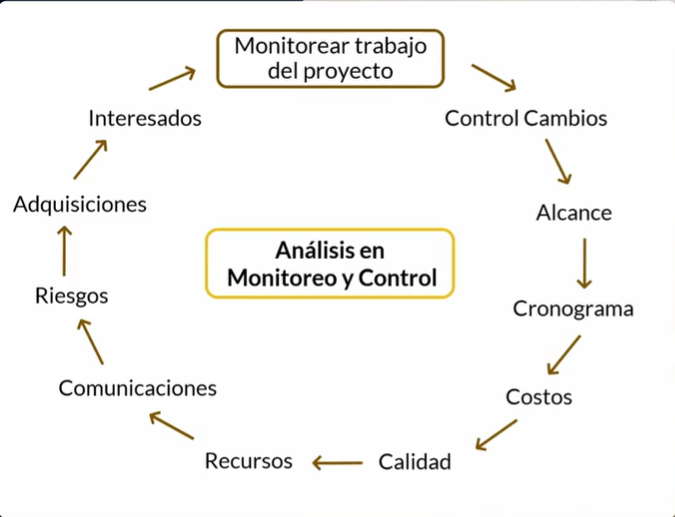
- Las acciones a tiempo te ayudan a tener un mayor valor y menor costo. 

## Clase 2 ¿Qué es la gerencia de proyectos?

Es la aplicación de conocomientos, habilidades, herramientas y tecnicas a las actividades de un proyecto para satisfacer los requerimientos del mismo. 


**Habilidades de un Director de Proyectos**
- Personas: habilidad de dirigir equipo. 
- Entorno del negocio: Conexion proyectos y estrategia 
- Procesos: Aspecto tencicos para dirigir. 

**Un gerente de proyectos debe saber de muchas áreas** 
- cronogramas
- costos
- recursos
- tratar con el cliente
- riesgos
- contratos 

## Clase 3: Ciclos de vida de un proyecto

1.- Predictivo:
    - Cierra la mayor parte de los requisitos al principio
    - Avanza por fases secuenciales
    - Entrega el producto final
    - Metodologias cascada y metodo clásico.  
2.- Adaptativo:
    - Iterativo: Scrum & Agil 
        - Alcance se determina inicialmente 
        - Tiempo y costo se modifican periodicamente 
        - Actividades se repiten
    - Incremental: 
        - Entregables: Serie de iteraciciones que añaden funcionalidad dentro de tiempo determinado. 
        - Incrementos: van aladiendo funcionalidad al producto. 
    - Agil:
        - Alcance: definido y aprobado antes del comienzo de iteración.
        - Las actividades se repiten hasta que este correcto
        - Se denominan ciclos de vida agiles u orientados al cambio. 


**Herramienta**
-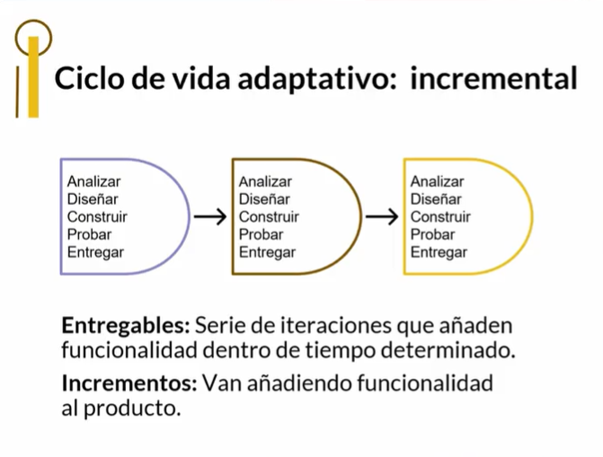
-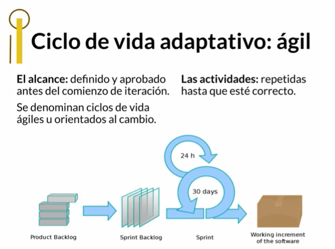
-

## Clase 4: Beneficios de los ciclos de vida

1.- Predictivo:
- Entrega final unica 
- Entrega final debe ser igual al que se planeo 

2.Adaptativo 
    - Iteractivo
        - Incremental se ve iterando hasta que el cliente valide que este correcto 
        - Hay corrección constante 
    - Incremental 
        - Mayor velocidad de entregas 
        - desarrollo continuo se entrega por etapas o fases 
    - Agil 
        - Entregas frecuentes pequeñas pero mejores 
        - Participación con el cliente y grado de satisfacción 

**Ventajas** 
- Se revisan los puntos de revisión para ayudar a tomar decisiones para los siguientes proyectos 
- Un error corregido a tiempo en la tapa de gerencial cuesta menos resolverlo 
- Evaluar desempeño ayuda mucho para tomar decisiones

## Clase 5: Aprende y analiza estratégicamente

## Clase 6: Presentación del proyecto

**Concepto**
- Para este caso se generá un acta constitutiva para generar un proyecto 
- Excel -> [Descargar](../23_CursoAnalisisDatosparaGestionProyectos/info/Acta_Constitutiva.xlsx)

## Clase 7: ¿Qué es el monitoreo y control de un proyecto?

**Concepto**
>  es un conjuntos  de actividades de gestion tiene como proposito validar si el proyecto va de acuerdo con lo planificado, si hay desvios se puede tomar acciones necesarias para volver a los planificado.

**Consideraciones Previas** 
- Acta Constitutiva aprobada
- Plan Dirección de Proyecto elaborado
- Lineas bases del proyecto 
- Inicio ejecución 

**Se controla:**

- Integrado de Cambios
- Alance
- Cronograma
- Costos
- Calidad
- Recursos
- Adquisiciones

**Se monitorea:**
- Comunicaciones
- Riesgos
- Involucramiento de los Interesados

**Herramienta**
-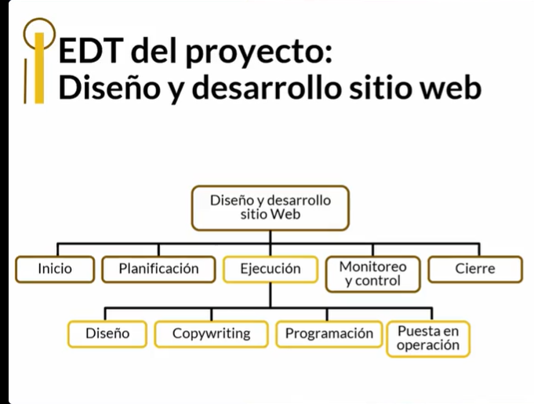

## Clase 8: Herramientas para el análisis de datos

**Metodo de valor Ganado** 
> Herramientas de analisis de datos, mide desempeño a nivel del cronograma, alcance y costos, procesos donde se aplican controlar, cronograma y costos.

**Metodo análisis de causa raíz** 
> El análisis de causa raíz  realizamos una lluvia de ideas para empezar a listar las posibles causas raíces de una situación particular, la idea es resolver el problema desde la raiz 

**Metodo Histograma**
> Es una representación gráfica, representa frecuencias de los valores, procesos donde se aplican: controlar RRHH y la calidad. 

**Metodo Diagrama de control**
> Nos ayuda a validar sin un proceso es estable en el tiempo, en caso que suceda una perdida o desfase esto nos indica que debemos tomar acciones, para lograr su estabilidad, proceso donde se aplica es en proceso de calidad

**Metodo Diagrama de Dispersión** 
> Análisis gráfico que se utiliza para ver la relación posible entre dos variables númericas, proceso donde se aplica: controlar la calidad. 

**Metodo Matriz probabilidad/impacto de riesgos** 
> Es un análisis cualitativo que se utiliza para establecer si un riesgo es: bajo, intermedio o elevado; atraves de la relacion entre la probabilidaid de que suceda y su impacto a los objetivos del proyectos, proceso sonde se aplica; control de riesgos.  

## Clase 9:¿Qué es el método del valor ganado?

**Método del valor ganado**

> Permite medir el desempeño del proyecto en cuanto a costos, cronogramas y avances.

**¿Qué hace el método del valor ganado?**

> Compara las líneas base del cronograma y del costo, con respecto a los valores reales dados en la ejecución en un tiempo.

**3 valores del método del valor ganado:**

1. Valor planificado (PV)
- Es el valor estimado del trabajo que estableciste en el cronograma cuando estabas planificando para un tiempo X

2. Costo actual (AC)
- Costo real del trabajo realizado en el tiempo X

3. Valor ganada (EV)
- Valor del trabajo que realmente se ha realizado en el tiempo X

**Como se calcula el EV: **
1. Recopilar información sobre % de avance de cada actividad 
2. Convertir % de avance en un valor monetario al multiplicarlo por el costo total presupuestado de cada actividad.


**Nota**
> Es este ejemplo que pone la maestra podemos ver que al finalizar la segunda semana del proyecto, aunque se había planificado unos costes por 340 dólares, la realidad es que se han gastado 435 (más de lo planificado), sin embargo, se ha avanzado lo equivalente a 333 dólares del presupuesto. Por lo que podemos determinar que se ha gastado más dinero de lo presupuestado y se ha avanzado menos de lo esperado. De seguro que habrá que tomar acciones correctivas.


## Clase 10:  Indicadores de Valor Ganado

**Análisis de la variación**
- Revisar las diferencias entre el desempeño planificado y real.
- Variación del cronograma (SV) Determina en que medida el desempeño está adelantado o retrasado. SV= EV - PV
- Negativo: Trabajó menos de lo planificado (retraso en el proyecto)
- Variación del costo (CV) Déficit o superávit del costo en un momento dado (mide los desvíos del costo o su desempeño) CV= EV - AC
- Negativo: Se ha gastado mas dinero de lo trabajado (Costo mas alto)
- Índice del costo (CPI) Déficit o superávit del costo en un momento dado (desempeño del costo). CPI= EV / AC

<1 indica por cada unidad monetaria invertida se recibe menos (deficiencia)

Índice del cronograma (SPI) Eficiencia / deficiencia del equipo de desarrollo en cómo está utilizando el tiempo. SPI= EV / PV

<1 está ejecutando mas lento de lo planificado

**Nota**
Valor ganado: $500*90%= $450 Indice del costo: cpi =$450/$300=$1.5, >1 buen desempeño, superávit Indice del cronograma: spi = $450/ $500= $0.9 < 1, más lento de lo planificado Variaciones del costo: cv=$450-$300=$150, ha gastado menos dinero del presupuesto Variaciones del cronograma: sv= $450-$500= -$50, <0, trabajó menos de lo planificado hay retraso.


**Herramienta**
-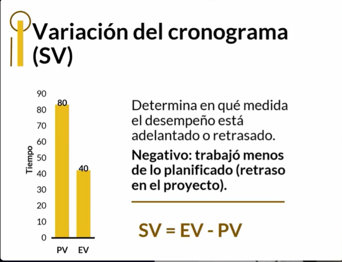

-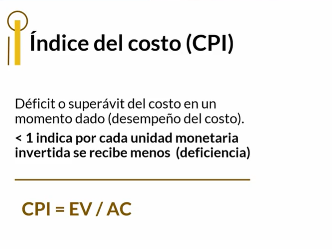

-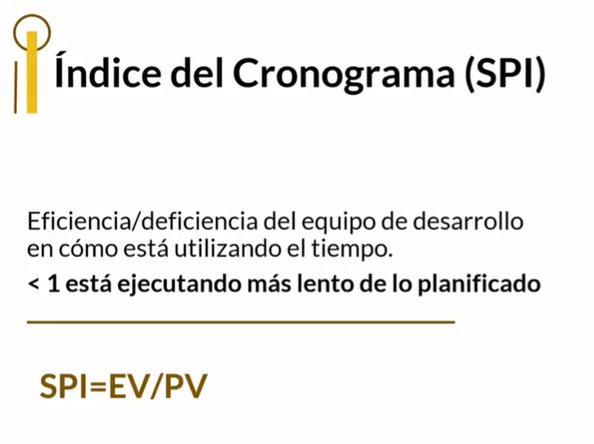

-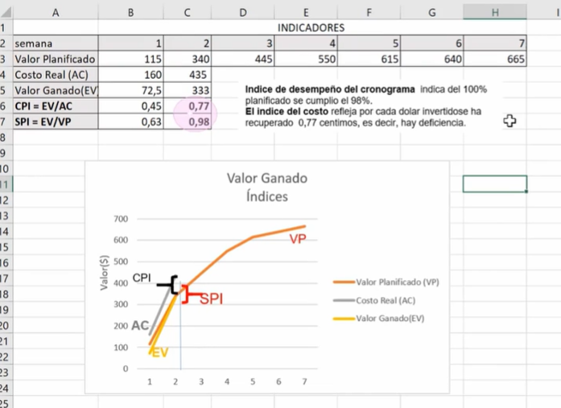

-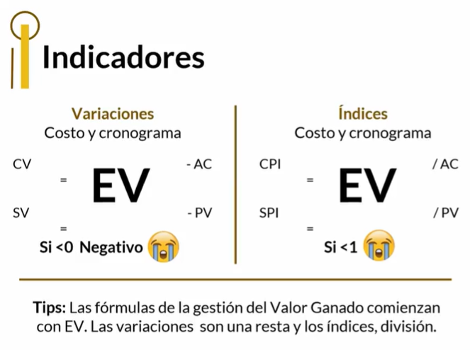

-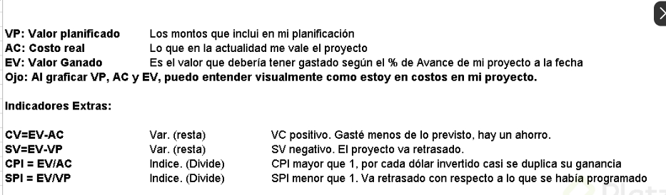

## clase 11: Análisis de tendencias

**Beneficios del valor ganado**

- Informa como va el progreso del proyecto en un tiempo X
- Pronostica resultados del desempeño futuro, y costos de la conclusión del proyecto (análisis de las tendencias)

**Análisis de tendencias**
- Pronosticar el desempeño futuro del proyecto, teniendo como referencia los resultados pasados.

**Valores a considerar**
- Presupuesto hasta la conclusión (BAC) Valor planificado total del proyecto (línea base del presupuesto total)
- Estimación del costo a la conclusión (EAC) Costo Final: 
 - basado en cómo se ha gastado hasta el tiempo X. Presunción: Qué pasará si el plan inicial no es válido. EAC= AC+ETC
 - Estimación de costo hasta la conclusión (ETC)
 - EAC vs BAC
 - EAC puede diferir del BAC, pues depende del desempeño que haya tenido el proyecto.

**Variaciones del EAC**
1. Si se mantiene CPI actual: Los desembolsos futuros mantendrán mismo nivel de eficiencia/ineficiencia que lo ocurrido hasta el momento X. EAC= BAC/CPI

2. Según presupuesto original Independiente de la eficiencia/ineficiencia de lo gastado, el costo del trabajo a la conclusión se mantendrá según presupuestado en la línea base. EAC= AC+ (BAC - EV)

3. Según CPI y SPI Los costos futuros dependen de la ineficiencia/eficiencia actual del CPI y el SPI. Los retrasos en el cronograma afectarán los costos. EAC= AC + ((BAC - EV) / (CPI x SPI))

## Clase 12: Análisis de tendencias

- Estimación Hasta el Término (Estimate to Complete): es una estimación de los recursos necesarios para completar el trabajo restante en un proyecto. Es una métrica importante de Earned Value Management (EVM), que se utiliza para pronosticar el dinero necesario para el trabajo restante del proyecto.

- Estimación básica: El equipo del proyecto determina, después de analizar el desempeño pasado del proyecto, que el desempeño pasado no tiene relación con el desempeño futuro.

```
$ETC=EAC-AC$
```

- El equipo del proyecto determina, después de analizar el desempeño pasado del proyecto, que el trabajo restante se completará con la rentabilidad actual del proyecto.
```
$ETC = (BAC – EV) / CPI$
```

**Notas**
- El proyecto va atrasado y generando más gastos de lo previsto. Dar prioridad a agilizar ya que tenemos más control directo sobre eso. Desconocemos si los costos han incrementado debido al atraso o a incremento de proveedores (fuera de nuestro control directo)

- Estimate to Complete is the expected cost to finish all the remaining project work.

- Considero que en este punto y con los datos que tenemos, podemos realizar la ruta crìtica y su análisis presentarlo como propuesta al cliente, esto para poder culminar en tiempo y costo. También se le debería de presentar las variaciones del presupuesto inicial si se decide no tomar en cuenta la ruta crítica.

## Clase 13: Análisis Causa-Raíz

**Conceptos**
- Inventado por Quimico Ishikagua 
- Químico Industrial Japonés 1943.
- Herramienta de análisis causal de problemas. 
- Representa relación entre efecto (problema) y posibles causas.
- Identificar posibles causas de los problemas que se encuentran en el monitoreo y control.

**Procesos donde se aplica**
- Trabajo del proyecto
- Control integrado de cambios
- En involucramiento de los interesados
- Costos
- Cronograma
- Riesgos
- Recursos
- Alcance
- Calidad
- Adquisiciones
- Agrupa las causas en 4 categorías

1. Métodos (procesos) 
2. Maquinarias / herramientas 
3. Mano de obra (personas) 
4. Medio ambiente (entorno)

El análisis se hace en equipo, ¡todos deben aportar ideas!

**Evalúa más cada causa**

1. ¿Realmente ocasiona el problema? 
2. Si se elimina la causa ¿desaparece o disminuye el problema? 
3. ¿Hay una solución factible para la causa? 4- ¿La solución es de bajo costo?

**Nota**
- Indica una calificación del 1 a 3 a cada causa, se le coloca peso a cada causa con el fin de escoger la mas importante 


**Herramienta**
- 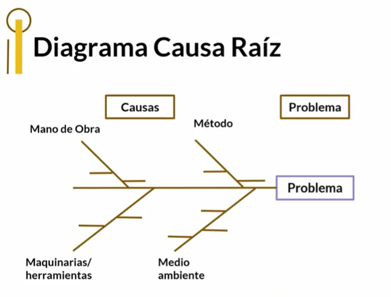
- 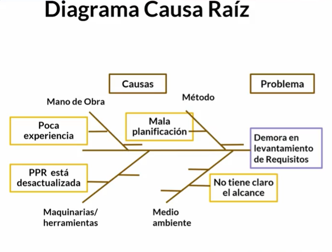

## Clase 14: Análisis de datos Histograma

- Representación gráfica en barras, sin un orden preestablecido, que se utiliza para describir la frecuencia.
- No toma en cuenta la influencia del tiempo en la variación existente en la distribución.

**Área recursos**

- Planificación: mostrar cantidad necesaria de recursos por fase.
- Ventaja: tomar decisiones a tiempo e incluirlas en la planificación.
- Ejecución: mostrar frecuencia de ocurrencia de un tipo de datos.
- Ejemplo: % de trabajo ejecutado del recurso humano para un tiempo X

**Área de control de calidad**

- Ver cuáles son los problemas de mayor importancia o los que impiden que se logren los requisitos de calidad.
- Ejemplo: frecuencia que aparezca una falla X

**Como construir un histograma**

- Tabla de dos columnas; indicar variable y frecuencia de la misma.
- Hacer un grafico donde: el eje horizontal (X) represente la variable y el eje vertical (Y) represente la frecuencia absoluta o porcentuales.
- "LA ALTURA DE CADA BARRA ES IGUAL A LA FRECUENCIA"

## Clase 15: Diagramas de control

**Concepto**
- Los resultados de un proceso se encuentran dentro de los limites aceptables Aplica para el control de calidad.

**Elementos del diagrama de control**

- Media (promedio): mitad del rango aceptable de variación.
- Límite de especificaciones: expectativa del cliente.
- Limite de control (superior e inferior): rango aceptable de variación de los resultados de un proceso. (Deben ser límites mas estrictos que los del cliente)

**Pasos para realizar un diagrama de control**

- Seleccionar la característica que se va a evaluar.
- Recoger datos de esa característica por un período de tiempo.
- Establecer en una hoja de cálculo la media/promedio, la desviación estándar y los límites de control.
- Representar los datos gráficamente.

**Notas**
- Cuando un dato esta fuera de control se debe investigar 
- En excel la desviacion estandar es un metodo llamado DESVEST(D5:D10)

**Herramienta**
- 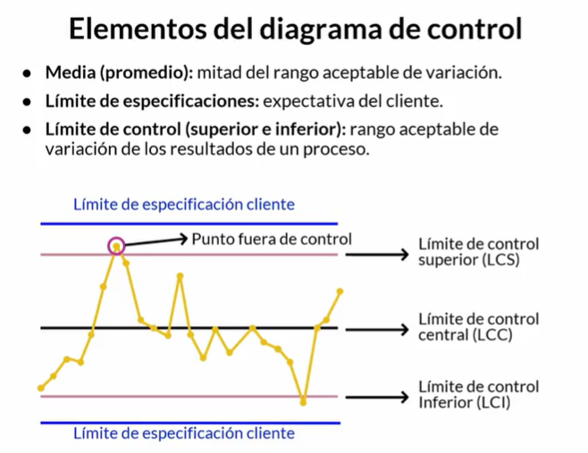
- 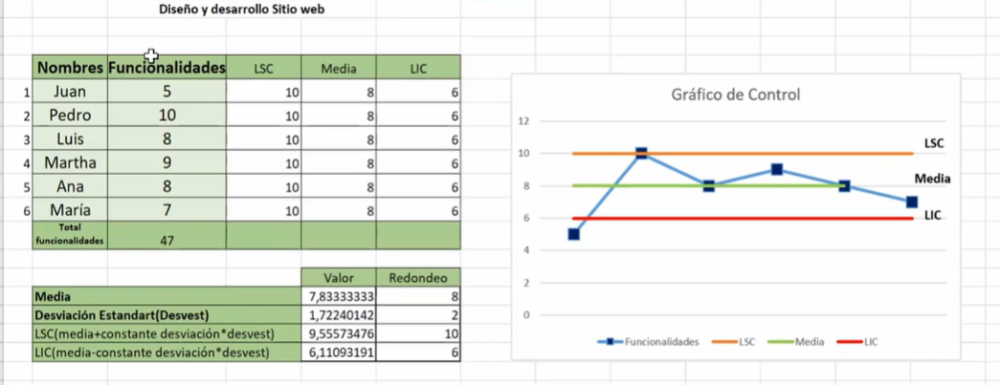

## clase 16:Diagramas de dispersión

**Concepto**
- Analizar la relación entre dos variables: como es afectada una respecto a la otra.
- Analizar si un cambio en la variable dependiente Y se afecta con un cambio observado en la variable independiente X.

**¿Cómo hacer un diagrama de dispersión**

- Paso 1: Seleccionar las 2 variables.
- Paso 2:Definir el objetivo de relacionarlas.
- Paso 3:Recopilar datos de las 2 variables.
- Paso 4:Realizar tabla en hoja de cálculo con los datos de las dos variables.
- Paso 5:Realizar gráfico y trazar línea de tendencia.
- Paso 6:Ver coeficiente de correlación y fórmula.
- Paso 7:Interpretar los resultados.
- Paso 8:Línea de tendencia

**Nota**
- Negativa: si crece la variable X, y disminuye la variable Y o viceversa.
- Positiva: si crece la variable X y crece la variable Y.
- Sin correlación: hay una dispersión de datos.
- Coeficiente de correlación
- R°2= +1; variables están perfectamente alineados. Cuando X crece, Y crecerá en la misma proporción. 
- °2= -1; estaría perfectamente alineado, si X crece, Y decrece en la misma proporción. R°2= 0; no hay correlación.
- Ejemplo: R°2 = entre 0 y 1; variables tienden a agruparse, existe correlación entre éstas.


**Herramienta**
- 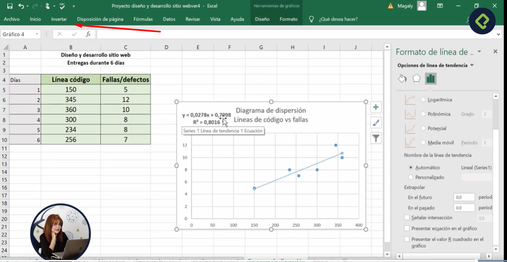

## Clase 17: Análisis de riesgos: matriz de Probabilidad e Impacto.

**Conceptos importantes a considerar:**
- Riesgo: algo desconocido que impacta de modo negativo o positivo un proyecto.
- Probabilidad: que ocurra un riesgo, tomando en cuenta los controles actuales y su efectividad.
- Impacto: consecuencias que originan un riesgo si llega a presentarse.

**Pasos para crear la matriz de probabilidad e impacto**

- Identificar los riesgos del proyecto.
- Establecer una escala para estimar probabilidad de ocurrencia de cada riesgo.
- Establecer una escala para estimar impacto de cada riesgo.
- Realizar la matriz. Cada intersección es el resultado de multiplicar la probabilidad por impacto.

**Probabilidad de ocurrencia:**
- Me sorprende que no ocurra - 90%
- Mas probable que ocurra a que no ocurra - 70%
- Tan probable que ocurra como que no ocurra - 50%
- Más probable que no ocurra - 30%
- Me sorprende que ocurra - 10%

**Nivel de impacto del riesgo**

- Muy bajo - No tendrá mayor repercusión si sucede 
- 5% Bajo  - De impactar el proyecto atrasaría el costo - tiempo 
- 10% Moderado - Tendrá repercusión en el proyecto más no en la empresa 
- 20% **Alto **- Tendrá repercusión en el proyecto y la empresa 
- 60% Muy alto - Podrá ocasionar cierre del proyecto y empresa 
- 90% Te jodiste 

**Nota*
- Estos análisis se hacen durante la planificación 
- el riesgo de colocar un baño de oro es dimensionar un proyecto irreal, nos arriesgamos a aumentar las expectativas de los interesados y al final podria ser un desastre


**Herramienta**
- 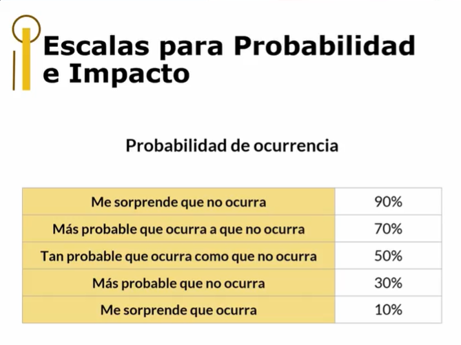
- 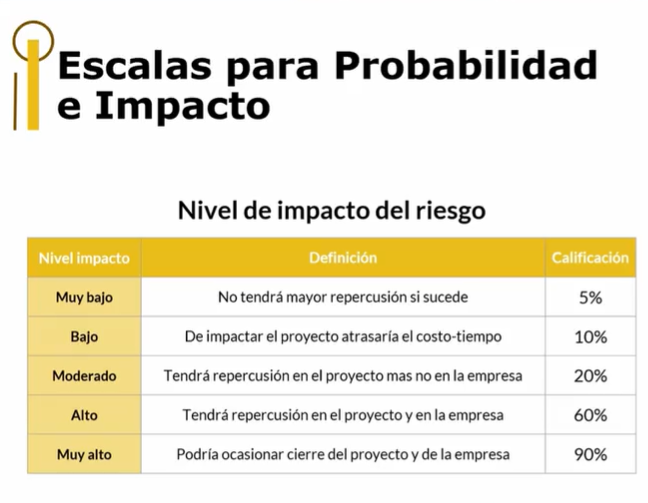
- 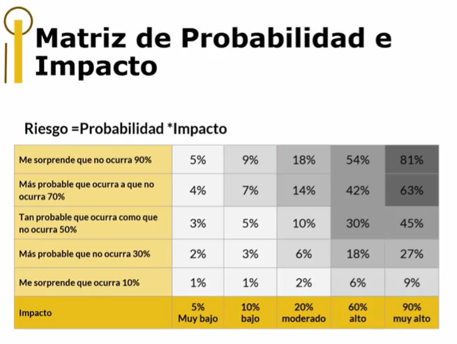


1.
Entre las herramientas de análisis de datos vistas en el curso están:
Método del valor ganado, diagrama de dispersión y matriz causa raíz.

2.
¿Qué es la gerencia de proyectos?
Aplicación de conocimientos, habilidades, herramientas y técnicas a un proyecto.

3.
Según el PMI, ningún proyecto tiene conceptos similares:
Falso

4.
Uno de los beneficios de hacer puntos de revisión es evaluar y tomar decisiones a tiempo.
Verdadero

5.
¿El plan de dirección de proyectos solo incluye línea base de cronograma?
FALSO 

6.
El presupuesto al finalizar tu proyecto asciende a $68.000. De acuerdo al cronograma de actividades, hoy deberías estar en un nivel de avance del 75%, pero sólo estás a un 50% ¿Cuál es el valor ganado del proyecto?
$34,000

7.
¿Un análisis de tendencia es lo mismo que pronosticar el desempeño futuro del proyecto?
Verdadero

8.
Una forma simple y rápida para calcular la estimación hasta la conclusión (EAC) del proyecto, sería tomar el presupuesto hasta la conclusión (BAC) y luego dividirlo por:
Índice de desempeño del costo.

9.
¿Cuál es uno de los beneficios del análisis causa raíz?
Busca por cada causa cuál es el problema.
Repasar

10.
¿Tú como gerente de proyectos en el monitoreo y control qué buscas principalmente?
Definir los recursos y equipo de trabajo.
Definir el alcance del proyecto.
Repasar

11.
En análisis de datos, ¿qué se compara?
Situación planificada con real.

12.
¿Cuál es la diferencia entre un ciclo de vida predictivo y uno adaptativo?
En el ciclo de vida predictivo los requisitos son fijos. Y en el adaptativo, son dinámicos.

13.
¿Cuáles consideraciones previas se requieren para el monitoreo y control?
Determinar riesgos, equipo de trabajo y ejecución.
Acta aprobada, riesgos evaluados y terreno limpio.
Repasar

14.
¿El análisis causa raíz solo se aplica en el proceso control de riesgos?
FALSO 

15.
¿Qué es el método del valor ganado?
Herramienta de análisis de datos para medir el desempeño de un proyecto.

16.
Un integrante de tu equipo afirma que no es importante considerar la línea base del cronograma para el análisis del valor ganado. Esa afirmación es:
Falso

17.
Un proyecto de desarrollo de software tiene un valor planificado (PV) de $1000, un valor ganado (EV) de $700 y un costo real (AC) de $1300. El índice de desempeño del costo (CPI) asciende a:
1,2
0,83
REPASAR CLASE 

18.
Se encontró en el proyecto que tienes a tu cargo un problema de costos ¿Cuál herramienta podrías usar para encontrar las causas?
Análisis causa raíz.

19.
El director de proyecto y su equipo de trabajo finalizaron el cronograma del proyecto. Sin embargo, al observar el histograma de recursos descubren que no cuentan con los trabajadores suficientes para cumplir el alcance de la forma planificada ¿Fue acertado usar un histograma para el análisis?
Verdadero

20.
¿Durante la gestión de calidad es pertinente usar el método del valor ganado?
FALSO

21.
Tú como gerente de proyecto quieres determinar qué es lo que está causando la mortandad de ciertas plantaciones en un proyecto agrícola. Haz logrado aislar dos variables a partir de la información disponible ¿Cuál de los siguientes diagramas ayudará a verificar si existe correlación entre estas variables?
Diagrama de dispersión.

22.
Estás preocupado por las quejas de los clientes respecto a la entrega de productos defectuosos. Y quieres determinar si tendrá relación con la poca habilidad del personal en el manejo de las máquinas ¿Qué herramienta de análisis de datos debes utilizar para evaluar relación de dos variables?
Diagrama de dispersión.

23.
Para definir el nivel de un riesgo determinado, ¿qué herramienta deberías usar?
Matriz de probabilidad e impacto.

24.
Una mala práctica para indicar la probabilidad e impacto a cada riesgo es reunirse con el equipo, los interesados y expertos
Falso

25.
¿Las herramientas de análisis de datos se usan para el monitoreo y control?
Verdadero

26. 
Como buen gerente, en un proyecto de tipo predictivo después de estructurar el acta constitutiva y la planificación: ¿qué sigue?
Iniciar la ejecución.

27. 
¿El histograma representa gráficamente la distribución de frecuencias agrupadas en distintas clases o categorías?
Verdadero


28. 
El proyecto tiene un valor planificado (PV) de $1000, un valor ganado (EV) de $700 y un costo real (AC) de $1300. Un integrante del equipo afirma que está retrasado ¿Apoyarías esta afirmación?
Verdadero


29.
¿En cuáles procesos de monitoreo y control se aplica el método del valor ganado?
En todos los procesos de monitoreo y control.
REPASAR CLASE

