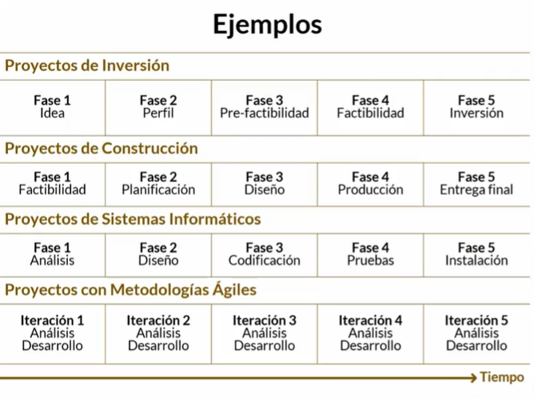

## Curso de Análisis de Datos para la Gestión de Proyectos

## Clase 1: Visión general del curso

**¿Por qué los proyectos fallan?**
- Objetivos pocos claros
- Planificación casi nula
- No se hace seguimiento
- Control débil
- Inadecuado administración de los riesgos
- Otros

**Análisis de datos**
- Objetivo: "Mejorar el desempeño"
- ¿Cómo? : "Comparar lo planificado con lo real".

**En ejecución..**
- Recursos, me permiten completar las tareas.
- Registrar datos del progreso
- De la calidad de los datos dependerá la validez y la efectividad del análisis.

**Monitoreo y Control**

- Buscar datos y convertirlos en información a través de análisis.
- Project Management Institute PMI > La forma de llevar a cabo los proyectos tiene un alineamiento estandarizado a nivel mundial.

**Herramientas de Análisis de Datos**
- Método de valor ganado
- Análisis Histograma
- El diagrama de control
- El Análisis Causa Raíz
- Diagrama de Dispersión
- Matriz probabilidad Impacto

**Herramienta**
-
- Las acciones a tiempo te ayudan a tener un mayor valor y menor costo. 

## Clase 2 ¿Qué es la gerencia de proyectos?

Es la aplicación de conocomientos, habilidades, herramientas y tecnicas a las actividades de un proyecto para satisfacer los requerimientos dle mismo. 

**Habilidades de un Director de Proyectos**
- Personas: habilidad de dirigir equipo. 
- Entorno del negocio: Conexion proyectos y estrategia 
- Procesos: Aspecto tencicos para dirigir. 

**Un gerente de proyectos debe saber de muchas áreas** 
- cronogramas
- costos
- recursos
- tratar con el cliente
- riesgos
- contratos 

## Clase 3: Ciclos de vida de un proyecto

1.- Predictivo:
    - Cierra la mayor parte de los requisitos al principio
    - Avanza por fases secuenciales
    - Entrega el producto final
    - Metodologias cascada y metodo clásico.  
2.- Adaptativo:
    - Iterativo: Scrum & Agil 
        - Alcance se determina inicialmente 
        - Tiempo y costo se modifican periodicamente 
        - Actividades se repiten
    - Incremental: 
        - Entregables: Serie de iteraciciones que añaden funcionalidad dentro de tiempo determinado. 
        - Incrementos: van aladiendo funcionalidad al producto. 
    - Agil:
        - Alcance: definido y aprobado antes del comienzo de iteración.
        - Las actividades se repiten hasta que este correcto
        - Se denominan ciclos de vida agiles u orientados al cambio. 

**Herramienta**
-
-
-

