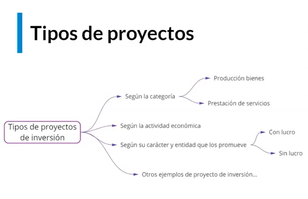

## Curso de Evaluación Financiera de Proyectos

## Clase 1: Definición proyecto de inversión

**¿Qué es un proyecto de inversión?:**
> Es un Plan si le agregamos un monto de capital determinado y una serie de recursos nos va a permitir producir un bien o servicio útil. 

**Caracteristicas**
- Proyecto: propuesta de inversión que responde a una necesidad.

- Tipos de proyectos de inversión:
    - Según categoría: producción de bienes o producción de servicios.
    - Según actividad económica
    - Según carácter y entidad que los promueve: con lucro o sin lucro. Ciclo de un proyecto:

- **La idea**: Identificación de problemas y oportunidad de negocio
- **Estudio previo**: Formulación y evaluación del proyecto. Determina si el proyecto generará recursos suficientes
- **Preinversión**: Estudios de perfil, prefactibilidad y factibilidad
- **Inversión**: Se concretan acciones para la entrega de producto o servicio que resuelve la necesidad durante un periodo determinado. Ha diferentes tipos de inversión, en activos tangibles o intangibles.
- **Operación**: El plan se convierte en hechos mediante recursos humanos, financieros y logísticos.

**Material**
- 
