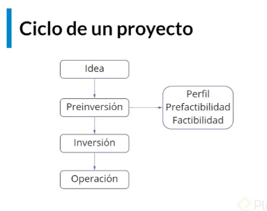

# Curso de Evaluación Financiera de Proyectos

# Clase 1: Definición proyecto de inversión

**¿Qué es un proyecto de inversión?** 
> Plan al cual si le agregamos un monto de capital determinado y una serie de recursos nos va a permitir producir un bien o servicio útil. 

>Proyecto: propuesta de inversión que responde a una necesidad. Tipos de proyectos de inversión:

## Caracteristicas
- Según categoría: producción de bienes o producción de servicios.
- Según actividad económica
- Según carácter y entidad que los promueve: con lucro o sin lucro. 

## Ciclo de un proyecto:
- ++La idea++: identificación de problemas y oportunidad de negocio
- ++Estudio previo++: formulación y evaluación del proyecto. Determina si el proyecto generará recursos suficientes
- ++Preinversión++: estudios de perfil, prefactibilidad y factibilidad
- ++Inversión++: se concretan acciones para la entrega de producto o servicio que resuelve la necesidad durante un periodo determinado. Ha diferentes tipos de inversión, en activos tangibles o intangibles.
- ++Operación++: el plan se convierte en hechos mediante recursos humanos, financieros y logísticos.

**Ejemplo**
- 

# Clase 3: Estudio de prefactibilidad y/o factibilidad

## Estudio de Mercado.
- Estudio de la demanda, oferta y precios que recoge toda la información del producto o servicio.

**Aspectos fundamentales del Estudio de Mercado.**
- Caracterización del bien o servicio.
- Segmento de mercado o cobertura.
- Diagnóstico y pronóstico de oferta y demanda.
- Demanda insatisfecha.
- Canales, comercialización.
- Políticas de marketing, 4Ps. (Producto, Precio, Plaza y Promoción)
- Estudio Técnico.
- Viabilidad técnica relacionada con el funcionamiento y operatividad.
- A dónde, cuándo, cómo y con qué producir la idea proyectada.
- Aspectos fundamentales del Estudio Técnico
- Localización del proyecto: logística, costos, insumos, limitaciones tecnológicas, políticas.
- Determinación tamaño óptimo: capacidad diseñada, instalada y utilizada.
- Ingeniería del proyecto: selección de la tecnología adecuada.
- Clase de tecnología: mano de obra, proceso mecanizado o automatizado.
- Producción: equipos, personal, proceso.


**Se puede definir esta etapa en pasos**
- Paso 1: Evaluar la oferta y demanda
- Paso 2: Conocer tu competencia conocer costos para evaluar 
- Paso 3: Caracterizar bien o servicio, conocer para la elaboracion y produccion cuales son tus insumos conocer las herramientas. 
- Paso 4: Segmento de mercado y la cobertura validar si hay que hacer alianzas estrategicas o podemos solos alcanzar la satisfacción del mercado.
- Paso 5: Cual va ser el pronosticos durante los 5 a 10 años, validar si el proyecto se convierte en una empresa, recuerda los proyectos tiene inicio y fin las emrpesas si perduran en el tiempo  
- Paso 6: Validar la demanda insastisfecha, buscar esa oportunidad para el negocio 
- Paso 7: Validar los aspectos del marketing (Por definir)
- Paso 8: validar los estudios tecnicos validar se debe responder las siguiente cuestión: 
    - A donde 
    - Cuando 
    - Que producir 
- paso 9: Localización del proyecto, validar la logistica validar los costos si los insumos son faciles de consumir o la logistica es complicada que debemos solicitar apoyo de terceros 
- Paso 10: Validar las Limitaciones tecnologicas 
- Paso 11: Validar las Políticas en el estudio del mercado 
- Paso 12: validar la capacidad máxima del proyecto que pasa si la capacidad máxima llega a su limite 

## clase 4: Estudio organizacional y financiero

**Estudio organizacional**

> Define la forma de organización y la estructura organizacional que requiere el proyecto con base en necesidades funcionales y presupuestales

**Objetivos de la estructura organizacional**

- Mostrar los principales cargos: Se derivan de los objetivos específicos tiene que estar fundamentadas a las funciones para lograr el objetivo de la empresa. 
- Canales de comunicación: Definir el medio de como se difunde la información. 
- Niveles jerárquicos: Definirlo por funcionales es generar las diferentes áreas
- Áreas y funciones: Regularizar los procesos 

**Estudio financiero**

- Cuantifica la información de los estudios previos.
- Evalúa el monto de las inversiones necesarias para la operación, definiendo los ingresos y costos.
- No es malo plantear metas altas pero siempre hay que validar si es viable 

**Aspectos del estudio financiero**

- Inversiones: requerimientos para arrancar y operar.
- Beneficios: ingresos derivados de ejecución.
- Proyecciones financieras: ingresos y egresos.
- Fuentes de financiamiento: recursos disponibles y potenciales para financiar inversión.
- Flujo de caja: sistematización de inversión inicial, ingresos y egresos.

## Clase 5: Evaluación financiera de una inversión

**Caracteristicas**
- Una inversión en términos financieros
- Una inversión desde el punto de vista financiero es la asignación de recursos en el presente con el fin de obtener unos beneficios en el futuro.
- Una inversión genera retorno y un gasto no genera retorno.

**¿Cuándo conviene una inversión?**
- Recuperar inversión inicial + obtener beneficios (rendimiento o rentabilidad)
- Tasa de interés (costo de oportunidad), es lo que renuncia el inversionista por invertir en el proyecto.
- Evaluar si la inversión se recupera y rinde por lo menos a la tasa referida.

**Métodos de evaluación financiera**
- VPN. Valor Presente Neto, se relaciona con el flujo de caja vamos a tener una entrada y salida con el flujo de inversión que vamos a tener a futuro los tenemos que traer a valor presente. Esos recursos que a futuro vamos a desembolsar o recibir no van a ser los mismos que tenemos actualmente.

- TIR. Tasa Interna de Retorno, es el rendimiento o ganancia que espera recibir como retorno el inversionista a cambio de la inversión.

**¿Y cuándo VPN o TIR no funcionan?**
- CAUE (Costo Anual Uniforme Equivalente), nos permite ponderar los valores dentro de la proyección para tener un análisis objetivo y claro con respecto a la inversión.

## Clase 6: Tasa de descuento

> El costo de oportunidad asumido por elegir entre alternativas de inversión.

> Traslada los beneficios de una inversión al momento cero en comparación con los costos.

> Es el precio de la inversión independientemente de la fuente de financiación.

- Costo de las fuentes de financiación
- Con recursos propios: mayor rentabilidad que deja de obtener por invertir.
- Con pasivos: tasa de interés del préstamo.
- Mezcla de recursos propios y pasivos: la tasa de interés promedio ponderada entre la tasa de oportunidad y el costo del préstamo.

## Clase 7: Valor Presente Neto (VPN)

> son un conjunto de valores que nos indican si podemos invertir en un proyecto no.
> VPN => valor presente neto

**Caracteristicas**
- VPN: Valor presente neto
- VF: Valor futuro 
- VP: Valor presente
- Nper: Plazo
- VPI: Valor presente de los ingresos
- VPE: Valor presente de los egresos

**Notas**
- Valor resultante de: Valor presente de los ingresos - Valor presente de los egresosVPN = VPI - VPE
- Inversion: salida de recursos
- Retornos: ingresos de recursos
- El flujo de recursos debemos traer a valor presente para poder evaluar
- Tasa de oportunidad: rendimiento esperado del inversionistaVP = ((VF)/(1+i)**^**n)
- Donde:VP: valor presenteVF: valor futuro i: tasa de oportunidadn: tiempo o plaza

**ejemplo**
```
**Lo que pasa es que lo debes comparar con relación a la Tasa de Oportunidad, la cual te indica que si inviertes esos 1000 en otra cosa diferente al proyecto del ejemplo, recibirás un retorno del 18%, mientras que en el proyecto recibirás un 1,69% o 4,35% (dependiendo del dato ingresado), por eso no se considera rentable.

Ahora bien el ejemplo está dado con Tasas de Oportunidad altísimas, lo que hace creer que nunca será rentable. Pero imagina que tu Tasa de Oportunidad sólo depende de que tu dinero esté quieto o sea sin invertir en nada, ya con sólo la inflación anual, tu dinero está perdiendo valor y tu Tasa de Oportunidad será negativa, entonces invertirlo en cualquier cosa que dé una Tasa de Rentabilidad Positiva será rentable.

Si tienes dos opciones como un CDT que te dé un 3% anual, esa es tu Tasa de Oportunidad, frente a un negocio que te da 4% anual (sin tener en cuenta los riesgos), entonces el negocio es rentable para el inversionista.**
```

## Clase 8: VPN con diferentes tasas de oportunidad

- El VPN (valor presente neto) o
- VAN (valor actual neto)
- es la diferencia de los ingresos futuros traidos al presente menos la inversión (egresos), lo que significa que es mi ganancia en un periodo de tiempo.

**Notas**
```
Con esto uno se puede hacer la pregunta ¿Vale la pena invertir en el proyecto? 
Voy a ganar tanto dinero (1200 dolares por ejemplo) en tanto tiempo (1 año por ejemplo), 
significa que en un año he ganado mensualmente 1000 soles que representan un 8.3 de ganancia mensual 
- ¿Cuanto ganaría poniendo mi dinero en un banco? 
- ¿Es mejor ponerlo en un banco? 
- Quizás gane mas en otro proyecto con otras proyecciones 
- ¿Que hago para mejorar mi porcentaje de ganancia? 
- ¿Invierto en mas productos? 
- ¿Necesito implementar un extra para generar mas ganancia para que me sea rentable? 
Esas son las preguntas que te permite responder, saber actuar o proyectarte
```


## Clase 9:  VPN con valor presente, sin pagos periódicos y retorno final

- VA = Valor Actual
- VNA = Valor Neto Actual

Diferencia?

- **VA** te sirve para comparar el retorno real de solo ese mes o año,
- es bueno usarlo cuando el retorno de la inversión sea de solo un pago.
- También puedes hacerlo para cada mes cuando hay muchos meses y luego sumarlos pero no es recomendable.

- **VNA** se usa cuando el retorno de la inversión será por muchos pagos, sabrán cuanto será tu retorno real después de transcurrido todo los pagos.

- Ambos otorgan lo que será el VPI.

Eso es la diferencia. Pero si aún tienes dudas con gusto te ayudo a absolverlas.

## Clase 10: VPN con recuperación periódica

