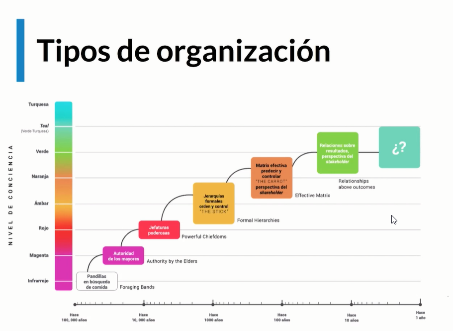
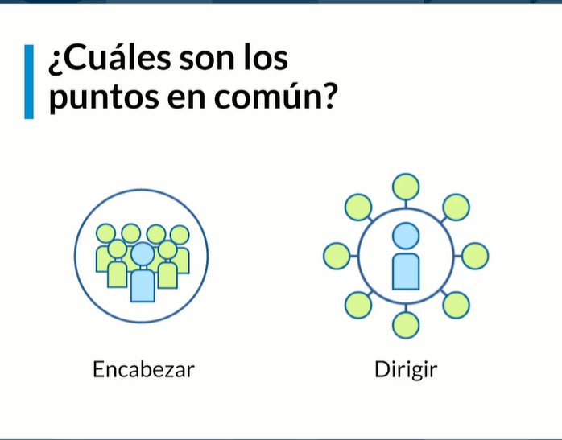
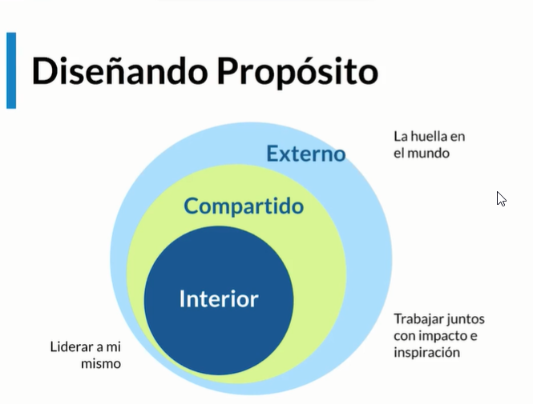
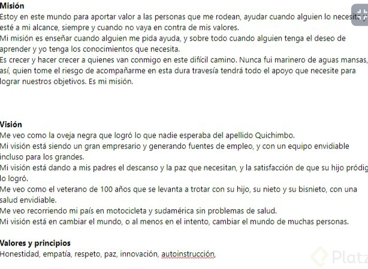
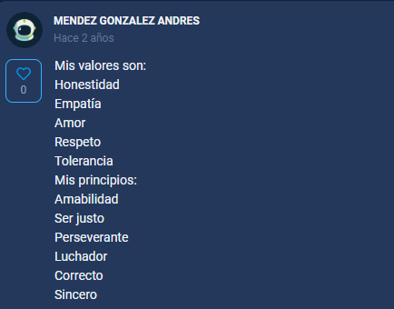

## Curso de Liderazgo Creativo 

**Profesor**
> 

## Clase 01: Las organizaciones hoy

**Las organizaciones hoy**

'Desde la revolución cognitiva de los sapiens - la realidad dual (Yuval Noah) las corporaciones forman parte de la realidad imaginaria. 
Las organizaciones construyen mensajes ficticios, que ayudan a las personas a unirse a ellas.'

**Organización:** 
- Grupo social formado por personas, tareas y administración, que interactúan en el marco de una estructura para cumplir con sus objetivos.
- Las organizaciones modernas han traído progreso a la humanidad en tan solo dos siglos. Son el vehículo de la colaboración humana.

**Impacto**
- 💔 Por alguna razón, el modelo actual de organización se está rompiendo:
- 💔 Estamos desilusionados
- 💔 Engagement muy bajo (15%)
- 💔´Management frustrado
- Con las organizaciones de hoy, las personas no tienen el mismo nivel de enganche, y los líderes están frustrados porque no logran cambiar esto para que se sientan valoradas, inspiradas, y quieran dejar el máximo en las organizaciones a las que pertenecen.
- “El mayor peligro en tiempos turbulentos no es la turbulencia; es actuar con la misma lógica que antes” - Peter Drucker.
- Esto se debe a que estamos enfrentándonos a nuevos problemas, tratando de resolverlos con las mismas reglas del pasado; y estamos en un punto en el que necesitamos cambiar por completo el entendimiento que tenemos de cómo interactuamos.


> 📘 Frederic Laloux - Reinventar las Organizaciones

**Tipos de Organizaciones**

- 🐺 IMPULSIVAS (rojas)
- 🐺 Autoridad de mando
- 🐺 Ejercicio de poder constante
- 🐺 Se agrupan por miedo
- 🐺 Reactivas
- 🐺 Poca planeación / muchas adaptabilidad


**CONFORMISTAS (ámbar)**
- Paternalista - Autoritario
- Roles formales y jerárquicos (de arriba hacia abajo)
- Control Top-Down
- Estabilidad y rigor (procesos - eficiencia y resultados)
- Ejemplo: colegios e incluso empresas familiares.


** POR LOGROS (naranjas)**
- 🎖 Orientadas a tareas y logros (ego - líder todopoderoso en el que radica todo el impacto)
- 🎖 Enfocadas en crecer y ganar
- 🎖 Gestión por objetivos
- 🎖 Innovación
- 🎖 Meritocracia

**Notas**
- 👁‍🗨 Estamos viviendo en un momento en el que no podemos hablar (todavía) de organizaciones que van a crecer siempre y sin medida
- Estamos entrando a nuevos retos a nivel planetario y como sociedad; 
- Cuando tratamos entender cuál debería ser el siguiente esquema por el cual nos organizamos, simplemente no podemos porque no estamos preparados para imaginar un modelo nuevo.


**Ejemplo**



> ¿Puede ser que nuestra visión actual del mundo limita la manera en la que pensamos en organizaciones?

Si, pero todo depende del nivel educativo que tengas como base, me explico hay muchas organizaciones 
exitosas porque están en constante desarrollo e inversión en mejorar sus procesos, como también 
la contra parte y lo triste es la gran mayoría organizaciones retrógradas, herencia de padres u 
organizaciones públicas que ya sabemos es difícil implementar mecanismos modernos.  


## Clase 02: Relación colaborador-organización-líder

**Apuntes Relación - Empleado - Organización- Lider.**
- El éxito se mide con el modelo de engagement.
- Solo el 15% de los empleados del mundo están enganchados en el trabajo.
- La relacion que tienen los empleados con las organizaciones modernas han cambiado.

**Engagement tiene que ver con la felicidad y la satisfacción con nuestro trabajo.**

- Ahora estamos entrando al esquema de la Experiencia.
- Donde la persona se involucra debido a los valores que tenga la empresa.
- Para que la persona se entregue como realmente es, con sus valores y experiencia.
- La relación que tiene el empleado con la empresa es 70% responsabilidad del lider.
- Estamos en tiempo de transición.

**Tipos de Organizaciones**

- Organizaciones Pluralistas
- Organizaciones jerárquicas, de distribuir responsabilidades, orientada a motivar los empleados.

**Las organizaciones Evolutivas**
- Organización sin jefes, una organización donde todos son lideres.
- Con propósito evolutivo.
- Tenemos que cambiar las personas para cambiar.

**EL EGO ES EL ENEMIGO**
- Estamos en una crisis de valores y principios. 
- Estamos trabajando con propósitos egoistas.

> ¿Qué aspectos en tu vida hoy ya no te funcionan y deberían ser modificados?
Wuapo

``` wuao, pregunta profunda en el ámbito de ser líder, me gustaría perder el miedo, siento que puedo ser un buen líder tengo valores, principios y esa motivación de sacar adelante algún proyecto, pero me falta esa oportunidad de aplicar ciertos conocimientos, cometer esos errores para afianzar más mi confianza y desempeño, la base de un buen líder es que sí fallamos, fallamos todos y si triunfamos fue gracias a todos. Quiero ser un Líder y no un Jefe y a veces todos olvidamos eso.  ```

## Clase 3: Estilos de liderazgo

**Características**
- Tiene conciencia de si mismo e identidad
- Piensa en si mismo pero también piensa en el contexto en el colectivo 
- Camina a un grupo con intensión y virtud 
- Siempre agrega un propósito en común 
- El Líder de hoy tiene que asegurarse que se persigue un propósito común 
- Tiene la capacidad de producir un efecto positivo 


**Nuevos estilos de liderazgo emergentes:**

**El líder transformacional** 
- Es aquel que interactúa y vincula a otros para crear conexiones que incrementen el nivel de motivación. 
- Es un líder que se concentra en inspirar, en la moral del grupo.

**Líder auténtico** 
- Es el que se concentra en el acto en sí mismo de liderar desde su propia identidad. 
- Es un líder enfocado en el autoconocimiento, autoconciencia y autodefinición moral sobre lo que quiere conseguir y cuales son sus habilidades individuales, su autenticidad.

**Líder Al servicio** 
- Es aquel que se concentra en modificar los ejercicios de poder, 
- Emigrar de un modelo vertical a un modelo mucho más distribuido de poder y responsabilidad. 
- Un líder que pone las responsabilidades distribuidas entre todos, que piensa en otros antes de pensar en sí mismo.


> ¿Con cuales de estos estilos emergentes de liderazgo te identificas?

Sinceramente, mas que yo me defina son mis compañeros, amigos y familiares que me definen el tipo de lider y soy de tipo servicial 
motivo con el ejemplo y buenas acciones demostrando que si se puede y que no hay pena con ayudar a los demas sin pensar en uno mismo 





## Clase 4: Liderazgo transformacional -> Es Emergente

> El líder transformacional se concentra en promover intencionalmente un propósito y visión en común para un grupo, regidos por valores morales.


**Características**
- Son personas que visiones bien definida
- Tienen personalidad carismática 
- Tienen la habilidad de inspirar a otros 
- Se asegura que los grupos lleguen a resultados en común
- Ayuda a desarrollar las habilidades necesarias individuales para que puedan llegar al objetivo común
- Motiva el desarrollo intelectual 
- Incentiva pasión y motivación para lograr las metas
- Lideran con el ejemplo ya que son congruentes con sus acciones
- Motiva al empoderamiento para que pueda crear confianza 


**Como ser un lider transformacional**
1.- Visión clara y positiva 
2.- Pasión e impacto colectivo


**Habilidades del líder transformacional**
- Checar tu ego      -> Es mantener tu ego en constante revisión, tiene que estar alineado con tus valores entender que lo que estas haciendo es al impacto colectivo, cuidar los ejercicios de poder.
- Auto-inspiración   -> Tiene que tener la habilidad de poder inspirarse así mismo 
- Tomar riesgo       -> Es intuitivo y confía en su conocimientos para tomar riesgos
- Tomar decisiones   -> Toma buenas o complejas decisiones que siempre Esten alineada a los valores y al propósito colectivo al bien común 
- Buscar bien Común  -> Siempre buscan el bien para el colectivo
- Inspirar a otros   -> Siempre inspira a otros con el ejemplo y asesoramiento individual de desarrollar habilidades a cada integrante del grupo
- Promover new ideas -> Están actualizados leyendo buscando mejoras por y para el colectivo 
- Ser adaptable      -> Se adapta a las nuevas necesidades y a los cambios 
- Ser proactivo      -> Ayuda siempre que el colectivo siempre crezca 
- Líder con visión   -> Inspira siempre con el enfoque de alcanzar el propósito, meta del colectivo 


## Clase 5: Liderazgo Auténtico  -> Es Emergente

> No existe un concepto que lo describa, pero en si el líder auténtico trata de maximizar las habilidades de las personas, para convertirlo en una cualidad positiva. 

**Características**
- Apunta comprometerse con el auto desarrollo de las personas 
- Ayuda a otros a desarrollarse
- Se remonta en la antigua Grecia, ya que se fundamenta en es estado de tener el control de nuestra propia vida y el conocimiento de nosotros mismos. 
- Tienen rasgos fundamentales de su propia esencia.  
- Es una persona que se muestra entera no esta actuando. 
- Ser auto-consientes y genuinas
- Conocen muy bien sus fortalezas y sus limitaciones 
- Enfocados en proposito y en el bien común. 
- Además de usas sus mentes usan sus emociones 
- Se enfocan en el valor compartido
- No buscan la salida rápida 
- Siempre hacen lo correcto

**Tres principios**
- Ética             -> Buscan siempre el bien común en valores de honestidad y justicia 
- Poder distribuido -> Todos los lideres tiene poder y este aprenden a distribuirlos 
- Comunicación en todas las direcciones -> Pueden crear comunicaciones bidimensional 

## Clase 6: Liderazgo Al Servicio -> Es Emergente

> Es aquel líder presta el servicio para satisfacer las necesidades de otras personas. 

**Características**
- Aquel líder es aquel que sirve primero
- Sirve a los demás y da liderando sirviendo a los demás
- Servir ante que cualquier otra cosa
- Asegurarse que las necesidades de otros es principal 
- Se enfocan en el impacto de las personas menos privilegiadas 
- Buscan el bien común 
- Retan el modelo jerárquico 
- Se aseguran que las otras personas tengan habilidades o poder para que logren los objetivos 
- Escucha Activa
- Empatía 
- Seguridad
- Autoconocimiento
- Promueve que todas las personas se sientan valoradas 
- Consenso -> Indica que todos tengan propiedad con el objetivo 
- Pensamiento Prospectivo  -> promover la actitud de pensar en el pasado, presente y futuro para generar esa reflexión de mejora.   
- Construir comunidad -> Asegurarse que crezcan todas las personas en el ámbito profesional y personal 

## Clase 7: ¿Qué es el liderazgo creativo?
> Es la progresión de los mas recientes estilos de liderazgos, incorpora valores morales, influencia inspiracional y proposito de impacto social.  

**Características**
- El Lider Creativo siempre explora
- 

**Elementos esenciales del líder creativo:**

- Autoconocimiento (desde nuestra perspectiva y desde la de los demás, para saber si nos estamos enfocando en lo que de verdad es importante).
- Creatividad (la habilidad que tenemos como especie para resolver problemas).
- Pensamiento sistémico y prospectivo (cómo entendemos el contexto, cómo imaginamos el futuro y cuál es nuestro modelo de racionamiento, cuáles son las creencias que de alguna manera nos limitan).
- Resiliencia (cómo afrontamos las situaciones).

**¿Cómo ser un líder creativo?**

- Son exploradores: poner parte de tu atención en la exploración, en aprender de nuevo y observar las circunstancias y situaciones desde múltiples perspectivas. Es importante recabar hallazgos y que te permitan retarte.
- Paul Graham, uno de los fundadores de YCombinator responde a cómo tener ideas para nuevos negocios con lo siguiente: “Live in the future, then build what’s missing” (vive en el futuro, luego construye lo que hace falta)
- Se anticipan: el pensamiento prospectivo, es una habilidad de los modelos de liderazgo emergente; te mantienes siempre alerta a las señales de cambio tendencias o incertidumbres, no importa si son muy ligeras aún. Estar al pendiente de lo sucesos te permite anticipar y planear hacia adelante.
- Tienen un propósito generoso y actúan con pasión: enfocándose en un impacto amplio. Su sensibilidad a las necesidades de la sociedad y al contexto sistémico, entendido que todo está conectado. Tu verdadera pasión debe estar en crear e impactar algo más grande que solo lo que te beneficia a ti y a tu equipo.
- Inspiran y experimentan: trabajan a través de diversos procesos de resolución de problemas, esto incluye trabajar con principios como diversidad, inclusión desde la perspectiva social y aprendizaje continuo. Toma de riesgos y optimismo, desde la perspectiva cultural del equipo.
- El líder creativo debe tener la habilidad de contar historias superpoderosas y vivir estas experiencias con el grupo para impulsar la proactividad de todos sus miembros.


Nota del Roming 

1.- Validar que posición van 1 3 1, 2 2 1 
2.- Se recomienda primero el Rojo y luego oso 
3.- Valida que jungla es para validar si debes ayudar-> if(si){Pues ayuda sin quitarle nada y corre a dar luz para la lechuga}  else {Dar luz para ayudar que gane la lechuga}
4.- Valida Azul del oponente solo dar luz -> Siempre trata de ubicar o predecir donde esta el jungla enemigo -> Molestar jungla enemiga  
5.- Gankear tortuga -> Validar arbustos -> molestar jungla azul 
6.- Si vas ganando ejemplo marcador 8-1 3min, se recomienda jugar agresivo ->  que es jugar agresivo -> invidades sutilmente la jungla del enemigo bien sea azul o rojo 
7.- Siempre controla los arbutos -> Arbusto Azul Arriba, Arbusto Lechuga superior, Arbusto al frente de tortuga, Arbutos al lado de escarabajo 
8.- Avanzado -> Trata de predecir que lado juega el enemigo jungla -> Para estar en esa zona y poder molestarle, dar visión, proteger el ADC 
9.- Avanzado -> Invadir buff -> estar pendiente del reloj de los buff 
10.- Avanzado -> Valida si tu jungla y el jungla de tu enemigo es -> Early - Late 


## Clase 8: ¿Qué podría impedirte ser un líder creativo?

No conocernos, no conocer a nuestras limitaciones y no conocer nuestros paradigmas.

"Para transformar a las organizaciones, primeros nos tenemos que transformar a nosotros mismos."
Para transformarnos a nosotros mismos tenemos que entender qué es lo que limita nuestra transformación.


**🚫Creencias limitantes**: Es un juicio sobre nosotros mismo o el mundo que nos rodea.

Hay creencias que son positivas y nos mantienen proactivos, pero hay otras que nos limitan. Las creencias se construyen a lo largo de nuestra vida, la experiencia y la influencia de otros.

Las creencias y las experiencias pueden estar en un 👍 círculo virtuoso o en un 👎 círculo vicioso; por ejemplo: la predisposición que tenemos a buscar y encontrar bondad en las personas… o la predisposición que tenemos a buscar en las personas una intención malévola oculta, lo cual generaría desconfianza. Depende de cómo nos programemos.


**Tres tipos diferentes de creencias limitantes más comunes**

- Desesperanza (creer que el objetivo no se puede alcanzar nunca)
- Impotencia (creer que el objetivo es alcanzable, pero creer que yo no pueda alcanzarlo)
- Ausencia de mérito (crees que no merezco abordar ese objetivo)
.
El reto está en entender de dónde vienen estas creencias limitantes, para ellos existe un ejercicio:

**👨‍💻 Reframing - Reenmarcamiento.** 
- La meta de esta herramienta radica en preguntarnos ¿estos pensamientos negativos de dónde vienen y cuál es el soporte de los mismos?

**¿Cuántas veces al día tienes pensamientos negativos sobre ti mismo, tu trabajo o tus capacidades? ¿Qué cosas negativas te dices? ¿Qué cosas no puedes lograr hoy en función de esas cosas negativas que te dices?**

👁‍🗨 Ojo con la disonancia cognitiva: ¿en dónde dices tener una creencia y te encuentras actuando de una forma contraria? ¿En dónde hay esa tención o incomodidad?

**El canva de reenmarcamiento es un diagrama de 5 casillas, en ella se hace lo siguiente:**

- Paso 1: Identificar creencia limitante → redactar diversas creencias negativas personales o de la organizaciones que consideres limitan u obstaculizan.
- Paso 2: Priorizar → elige una de esas creencias y colócala en el centro del cavas.
- Paso 3: Profundizar → formula creencias adicionales que le den soporte a la creencia limitante, ¿por qué creo en esto? ¿qué hace que esta creencia sea verdadera?
- Paso 4: Transformarlas → redacta el radical opuesto de cada una de ellas. Mientras más extremo sea el opuesto mejor. No importa que den risa, la idea es salir de esa línea de pensamiento que no contribuye positivamente.
- Paso 5: Reprogramar → redacta la creencia central y llévala a su nuevo opuesto.

Vamos a darnos cuenta que muchas de las creencias están conectadas a miedos o emociones; lo que debemos hacer es postular oportunidades, dándole la vuelta a las creencias de soporte negativas (ejemplo: mi organización es resiliente a la crisis y siempre encontraremos nuevas formas de entregar valor).

## Clase 9: Pensamiento sistémico


- Es una habilidad del abordaje holistico de analisis que se enfoca en como todas las cosas funcionan.
- Un sistema es un conjunto de elementos que es más que la suma de las partes.

**Se dividen en tres**
- Elementos 
- Interconecciones
- Propósitos


**¿Cómo pensar en sistemas?**
- Para que sirve cada pieza y como se interrelaciona.
- El pensamiento Sistémica que se utiliza para entender sistemas, predecir sus comportamientos, e idear
modificaciones que produzcan los efectos deseados.

**Habilidades**
- Explorar limites, entender todos los involucrados en el sistema.
- Incorportar multiples perspectivas
- Identificar interrelaciones.
- Una herramienta es un mapa mental, ya que sirve para identificar las caracteristicas e influencias.
- Entender todas las piezas que se interrelacionan. Entre si.

Mapa Mental de situación  profesional. 

## Clase 10:Pensamiento prospectivo


> La capacidad prospectiva nos permite anticiparnos a las cosas. El problema radica en tener todos los elementos a nuestro alrededor y no saber aprovecharlas, no tener visión.

**Entorno VUCA**
- Volátil 
- Incierto (Uncertain) 
- Complejo 
- Ambiguo

> El acrónimo se usó por primera vez en ‘‘teoría del liderazgo’’ de Warren Bennis y Burt Nanus en 1987.


La observación del entorno a largo plazo con la intención de identificar anticipadamente aquellos aspectos que tendrán un gran impacto en nuestro entorno, ya sea social, tecnológico o económico.

**🌄 Horizon Scanning**

- Escanear el horizonte es un método sistemático que nos permite identificar potenciales causas de lo incierto, asegurar la preparación para el cambio, capitalizar las oportunidades emergentes y sobrevivir amenazas.
1. definir el marco dentro del cual vamos a actuar (cuál es el problema), y es importante explorar sin límites al principio, aunque en bueno limitarla para evitar el exceso de información y entender realmente lo que queremos aprender.
2. construir una tabla básica en donde se definen los ejes en los cuáles se explorará. Recomienda el formato STEEPLE (señales desde perspectivas ambientales, tecnológicas, sociales, políticas, económicas, legales y éticas).
3. agrupar las señales e información emergente es tópicos que sean transversales, crear grupos de información según lo que tengan en común (interconexiones).
4. postular los nuevos conocimientos en hallazgos: incertidumbres, situaciones emergentes o en tendencias.


**🏗 Construcción de Escenarios**
- Aprovechar el escaneo de horizontes es poder construir escenarios.
- La construcción de escenarios sirve para dibujar alternativas posibles e identificar los acontecimientos en el tiempo con el objetivo de entender cuál de todas esas alternativas se va convirtiendo en más probable.
- La construcción de escenarios permite tomar decisiones, medir los efectos de las tendencias o cuestiones emergentes para tomar una decisión o corregir el rumbo, la intención es acercarse al escenario más favorable.
- El proceso debe seguir cuatro grandes actividades.

**Que se logra con el scaneo del horizonte**
- Identificar fuerzas de influencia o cambio, (lo cual inicia en el escaneo de horizonte).
- Identificar principales incertidumbres, (con ello empezamos a imaginar).
- Diseñar posibles escenarios.
- Discutir las implicaciones en el tiempo.

## Clase 11:Pensamiento crítico

**Concepto**
- Es la practica de entender como pensamos. 
- Implica como un proceso intelectual  ya que es activo y disciplinado
- Con el proposito de conceptualizar, sintetizar, evaluar, aplicar información 

**Habilidades**
- Capacidad de Reflexión
- Flexibilidad
- Lógica y detección de sesgos
- Capacidad de duda de las cosas
- Motivación y curiosidad

**Cómo ponerlo en práctica**
- Hacerse preguntas
- Recopilas, analizas e interpretas efectivamente
- Piensas de forma abierta e inclusiva
- Te comunicas efectivamente
- El pensamiento critico permite afrontar con valentia y convicción los diferentes dilemas de la vida.

## Clase 12: ¿Quién soy y por qué hago lo que hago?

**Tips**
- Debemos entender cuales son nuestro valores y principios 
- Todas las personas somos una casa con 4 habitaciones 
	- Fisico
	- Mental
	- Emocional
	- Espiritual
	
- Hay que conocernos de forma 	objetiva -> depende de los comentarios de otros 
- Cuales son sus valores y principios 
- Redactar proposito de vida



## Clase 13: Tus valores y principios

APUNTES: TUS VALORES Y PRINCIPIOS

¿Cuales son tus valores?
Son las creencias centrales que dirigen tu comportamiento.
`Tomando esta premisa, Yo no creo en Dios yo pienzo en Dios, por lo que siento que somos energia y de alguna manera todos estamos conectados asi que hagamos bien sin mirar a quien, Nankurenaisa!!!`

¿Cuáles son tus principios?
Son las reglas con las que regimos nuestro comportamiento.
- Dedicación sacrificio y fe es mi credo 
- Siempre buscando el equilibrio 
- Siempre ser la mejor version de uno mismo 





**Resultado examen**
1.
¿Cuál es la característica común de las organizaciones rojas, ámbar y naranjas?
Poder en una sola persona.
2.
¿Qué son las organizaciones?
Grupos de personas que buscan un propósito común.
3.
¿Qué es el liderazgo creativo?
La progresión de los más recientes estilos de liderazgo, que incorpora además de valores morales, influencia inspiracional y propósito de impacto social.
4.
¿Qué es el liderazgo transformacional?
Aquel en donde el líder interactúa y se vincula con otros para crear conexiones que incrementen el nivel de motivación.
5.
¿Cuál es uno de los principios que rigen al líder auténtico?
Ética
6.
Principal característica del liderazgo al servicio:
Poder distribuido
7.
¿Cuál es uno de los elementos esenciales del líder creativo?
Autoconocimiento
8.
¿Cuál es un tipo de creencia limitante?
Desesperanza
9.
¿Por qué un líder creativo debe pensar en sistemas?
Entender el contexto amplio de un problema.
10.
¿Para qué sirve el horizon scanning?
Identificar potenciales causas de lo incierto.
11.
¿Cuál es punto de partida del pensamiento crítico?
Hacernos preguntas
12.
¿Cuál es la intención interior de la declaración de propósito personal?
Liderarme a mí mismo
13.
¿Qué son los valores?
Creencias centrales
14.
¿Cuántas preguntas incluye el proceso de retroalimentación al líder?
7
15.
¿Qué es el liderazgo perfecto?
Grupo de líderes cumpliendo un propósito.
