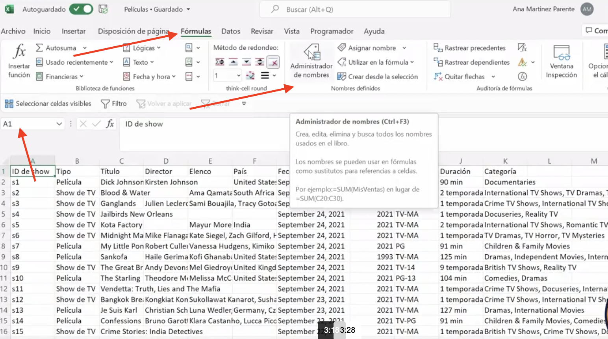
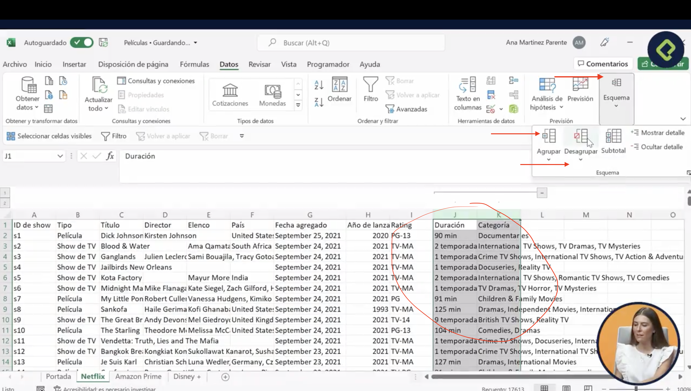
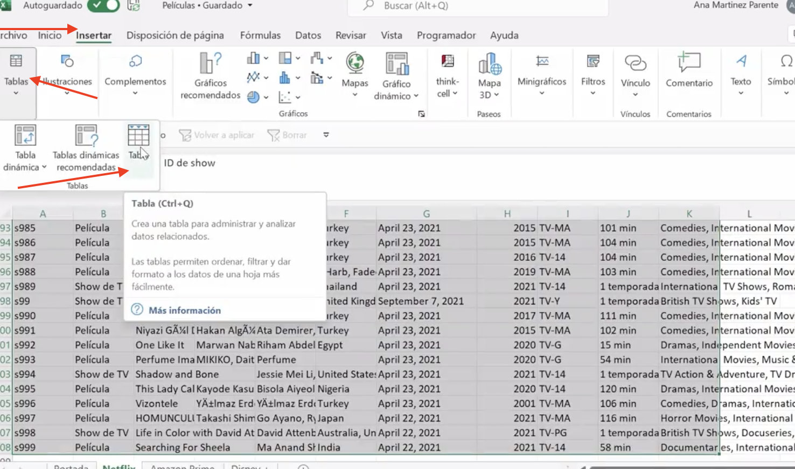
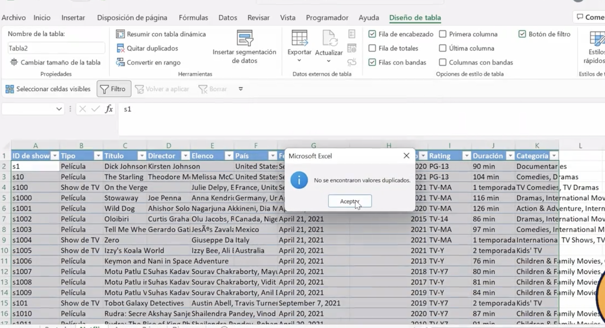
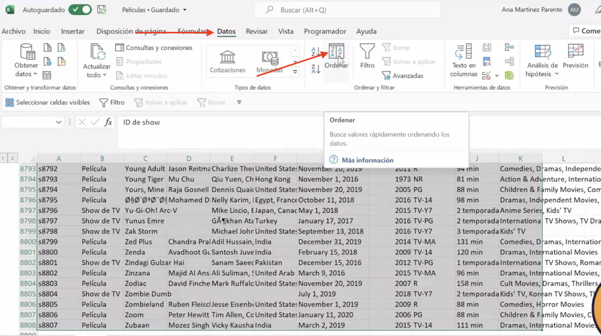
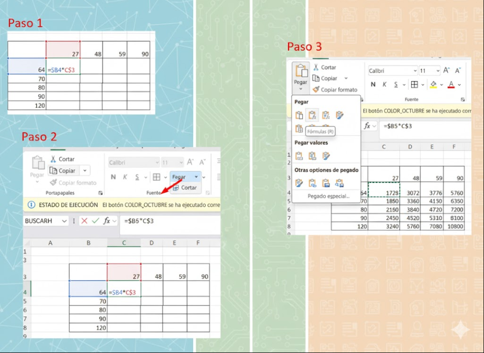

# Curso de Excel Básico: Tablas y Fórmulas para la Gestión de Datos

- Profesora: Ana Martinez Parente 
> Aprende a utilizar Microsoft Excel desde cero y descubre cómo digitalizar y agilizar tareas cotidianas. Domina la creación de tablas y el uso de fórmulas para organizar y procesar datos de manera eficiente con hojas de cálculo. Este curso básico te proporcionará las habilidades fundamentales para gestionar información en Excel, el programa de hojas de cálculo más utilizado en el mundo.

## Clase 1 - 2: Atajos en Excel

- ⚡ Al principio usar atajos puede ser tedioso, pero con la práctica nos ahorran mucho tiempo.

**Lista**
- Ctrl + E, para seleccionar un rango de datos
- Ctrl + Q, para convertir el rango seleccionado en tabla
- Ctrl + (flechas arriba, abajo, izq., der.), para moverme por la tabla
- Ctrl + Shift + (flechas), para seleccionar un rango de datos.
- Ctrl + F1, para ocultar / mostrar la cinta de opciones cuando me hace falta mas espacio de trabajo
- Ctrl + C: Copiar
- Ctrl + X: Cortar
- Ctrl + V: Pegar
- Ctrl + Z: Deshacer
- Ctrl + Y: Rehacer
- Ctrl + S: Guardar
- Ctrl + P: Imprimir
- Ctrl + F: Buscar
- Ctrl + B: Negrita
- Ctrl + I: Cursiva
- Ctrl + U: Subrayado
- PUEDES SELECCIONAR TODA LA TABLA T + F5 Y TE PUEDE DAR LAS OPCIONES DE ELIMINAR FILAS VACIAS COLUMNAS ETC
- PUEDES SELECCIONAR TODA LA TABLA T + F5 ESPECIAL/CELDAS CON FORMULAS / ERRORES => PAR ACEPTAR LOS CAMBIOS CONTROL + ENTER 

**FORMULAS**
- MAYUSCULAS =>    ´=MAYUSC(CELDA)´ => ENGLISH  => PROPER
- MINUSCULAS =>    ´=MINUSC(CELDA)´ => ENGLISH => LOWER
- NOMBRE PROPIO => ´=NOMPROPIO(CELDA)´ => ENGLISH  => UPPER
- Para obtener el N comercial se pudo hacer: =IZQUIERDA(E5;4)
- para el nombre y apellido: =DERECHA(E5;LARGO(E5)-4)
- CONTAR DUPLICADOS ´=CONTAR.SI(Tabla1[FACTURA],Tabla1[@FACTURA])´ = =CONTAR.SI(COLUMA_COMPLETA,PRIMERA CELDA DE LA COLUMNA COMPLETA) luego desplazar hacia abajo para repetir 
- =SUMAR.SI.CONJUNTO => =SUMAR.SI.CONJUNTO('Base de datos'!M4:M371,'Base de datos'!G4:G371,"pantalones",'Base de datos'!C4:C371,"Enero")
- =PROMEDIO.SI.CONJUNTO => =PROMEDIO.SI.CONJUNTO('Base de datos'!$M$4:$M$371, 'Base de datos'!$C$4:$C$371,Analisis!K$17,'Base de datos'!G4:G371,Analisis!$J18) =>  PROMEDIO.SI.CONJUNTO(VALOR MONETARIO TODA LA COLUMNA, VALOR A COMPARAR MES COLUMNA, "Enero", VALOR ITEM COLUMNA, "PANTALONES")
- =CONTAR.SI.CONJUNTO => ´=CONTAR.SI.CONJUNTO('Base de datos'!$G$4:$G$371,Analisis!$J3,'Base de datos'!$C$4:$C$371,Analisis!K$2)´ => CONTAR.SI.CONJUNTO(COLUMNA A CONTAR ITEM, "PANTALONES", COLUMNA A CONTAR MES , "ENERO") 
- Que trucazo ese del "Alt + Shift + '=' " => PERMITE GENERAR LA SUMA DE LOS EXTREMOS DE UNA TABLA 
**PDF con listado **
- [Listado](../02_Curso_Excel_Basico/info/Atajos_xlsx_Hoja1.pdf)

## Clase 3: Importar datos en excel

> Importar datos en Excel es una tarea fundamental para aquellos que deseen analizar y gestionar información de manera eficiente. Excel es una potente herramienta de hoja de cálculo que permite organizar y manipular datos de diversas fuentes

Paso 1: Abre Microsoft Excel en tu computadora y crea un nuevo libro de trabajo o abre uno existente donde desees importar los datos.

Paso 2: Haz clic en la pestaña “Datos” en la barra de menú superior de Excel.

Paso 3: En la sección “Obtener datos externos”, elige la opción “Desde otras fuentes” y selecciona el tipo de archivo o fuente de datos desde la cual deseas importar. Puedes importar desde un archivo de texto, una base de datos, una página web u otras fuentes.

**Paso 4: **Si seleccionas un archivo de texto o una base de datos, Excel te guiará a través de un asistente para importar. Sigue las instrucciones en pantalla para especificar la ubicación del archivo o la conexión a la base de datos y selecciona las opciones de importación que desees.
**
Paso 5: **Si importas datos desde una página web, Excel te permitirá especificar la URL de la página y te mostrará una vista previa de los datos disponibles para importar. Selecciona las tablas o elementos que desees importar y sigue las instrucciones en pantalla para completar el proceso.

Paso 6: Una vez que hayas especificado las opciones de importación y seleccionado los datos a importar, Excel te mostrará una vista previa de los datos. Revisa la vista previa para asegurarte de que los datos se importen correctamente.

Paso 7: Haz clic en el botón “Cargar” o “Importar” para importar los datos en Excel. Dependiendo de la cantidad de datos y la complejidad de la importación, puede llevar un tiempo completar el proceso.

## Clase 4:  Insertar fotos, figuras e íconos

> Pues eso lo sabemos hacer 

## Clase 5: Rangos

> Son un conjuntos de celdas que podemos asignar y en segmento de excel 

- Paso 1: Como lo señala la imagen podemos usar el rango para definir nombre en celdas y estas puedan ser usadas en tambien en formular podemos hacerlo del lado superior derecho o ir a Formular / Administrador de Nombre  

## Clase 6: Ocultar y mostrar columnas, filas y hojas 

Primero nos aseguramos de seleccionar la hoja completa dando clic en el triangulo de la esquina superior izquierda, entre la columna A y la fila 1 u oprimiendo CTRL+E

Después utilizamos los atajos de teclado requeridos:
- CTRL+0 Ocultar Columnas seleccionadas
- CTRL+SHIFT+9 Mostrar Columnas ocultas seleccionadas .
- CTRL+9 Ocultar Filas seleccionadas
- CTRL+SHIFT+8 Mostrar Filas ocultas seleccionadas

## Clase 7: Agrupar y desagrupar filas y columnas

## ¿Cómo agrupar y desagrupar filas y columnas en tus documentos?
Bienvenido a una nueva guía para potenciar tus habilidades organizacionales con herramientas digitales. Hoy descubriremos las funciones de agrupar y desagrupar filas y columnas, una técnica que transformará la forma en que gestionas la información en tus documentos. Estas funciones son esenciales cuando necesitas ordenar datos para analizarlos rápidamente o establecer jerarquías claras dentro de tu hoja de cálculo.

## ¿Cómo agrupar columnas en un documento?
Agrupar columnas puede simplificar tu visión general, permitiéndote concentrarte en la información más relevante sin eliminar detalles. Aquí te explicamos cómo hacerlo:

- Selecciona las columnas deseadas: Por ejemplo, si trabajas con la duración y la categoría de unas películas, selecciona ambas columnas.
Accede a la ficha de datos: Dentro de tu herramienta de hoja de cálculo, ve a la sección de "esquema".
- Agrupa: Haz clic en "agrupar" a través del menú desplegable y notarás que aparece un nuevo cuadro en la parte superior. Un signo de menos indicará que la agrupación está extendida, y al hacer clic en él, las columnas se ocultarán.

- Este procedimiento no solo organiza tu documento, sino que también te permite una fácil navegación a través de grandes volúmenes de datos.

## Clase 8: Tablas 

> Las tablas en Excel son una herramienta fundamental para quienes buscan ordenar y trabajar de manera eficiente con grandes volúmenes de información. A través de las tablas, se define un conjunto de datos relacionados, lo que permite que Excel ofrezca diversas facilidades para manejarlos, como el formato automático, la filtración rápida de información y la eliminación de datos duplicados. Usar tablas en lugar de hojas de cálculo no estructuradas te ayuda a mejorar la legibilidad y el análisis de datos.

## clase 9 Ordenar datos
> Ordenar datos en Excel es una habilidad esencial que maximiza la utilidad de nuestras hojas de cálculo,

## Clase 10: Filtros 

Los filtros son la herramienta que nos permite poner un menú desplegable en el encabezado, para poder seleccionar de manera mucho más rápida el contenido o los datos dentro de nuestra base de información. Al aplicar los filtros podemos ver de forma más sencilla la información que estamos buscando. . En la ficha de Datos, sección Ordenar y Filtrar, opción Filtro, así se nos generará en cada columna un pequeño botón desplegable que es nuestro menú. Ahí podemos ordenar la información, cambiar la vista de hoja, hacer filtros de texto dependiendo del valor que seleccionemos. . Recordemos que al modificar la información que hemos filtrado esta puede no seguir mostrándose dentro del filtro. Debemos estar atentos. . Podemos filtrar columnas distintas al mismo tiempo pero esto permanecerá con una jerarquía, primero respetara las condiciones del primer filtro y luego la segunda.

## Clase 11: Buscar y reemplazar 

- Las funciones de Buscar y reemplazar son sumamente útiles para encontrar un dato exacto en el documento cuando desconocemos en qué fila o columna se encuentra. O sustituir algún dato dónde nos hayamos equivocado. . Podemos usar el atajo Ctrl+B así se despliega la ventana de buscar y reemplazar. .

- Para Buscar: Ahí agregamos nuestro dato y seleccionamos Buscar Todos, y se nos mostrará todas las celdas donde se encuentra ubicado nuestro dato. En Opciones también nos permite realizar la búsqueda de nuestro dato por libro u hoja, fila o columna, fórmulas, valores, notas o comentarios. .

- Para Reemplazar: Seleccionamos el valor que queremos reemplazar, abrimos el menú, y agregamos el dato que queremos reemplazar (ä) y luego el dato por el cual será reemplazado (á). Y desmarcamos la opción “Coincidir con el contenido de toda la celda” antes de aplicar el reemplazo.

## Clase 12: Formulas y estructuras 

> En la ficha de fórmulas podremos ver una biblioteca
- Tendremos las fórmulas categorizadas (lógicas, matemáticas, fechas, etc.)
- Siempre comienzan con el signo =

## Clase 13: formular ariméticas 

## Las fórmulas aritméticas básicas en Excel son esenciales para realizar cálculos simples. Las principales son:

- Suma: =SUMA(rango) o usando el signo +.
- Resta: =A1 - A2.
- Multiplicación: =A1 * A2.
- División: =A1 / A2.

Estas fórmulas te permiten gestionar y procesar datos de manera eficiente, facilitando tareas cotidianas en Excel.

## clase 14: Otras Formulas Artiméticas 

## CONTAR

- CONTAR(a : b): Sirve para contar cuantos datos numéricos hay de tal celda a tal otra, sirve en caso de que quieras contar cuantas celdas tienen un dato numérico
- CONTAR.BLANCO(a : b): Te dice cuantas celdas están en blanco (Vacías)

## PROMEDIO

- PROMEDIO(a : b): Calcula el promedio de varios dígitos numéricos

## REDONDEO

- REDONDEAR(a : num_decimales): Redondea con el número de decimales que nosotros le especifiquemos. EJ: (3.45, 0) = 3
- REDONDEAR.MENOS(a : num_decimales): Redondea con el número de decimales que nosotros le especifiquemos hacia abajo. EJ: (3.45, 0) = 3
- REDONDEAR.MAS(a : num_decimales): Redondea con el número de decimales que nosotros le especifiquemos hacia arriba. EJ: (3.45, 0) = 4

##SUMA

- SUMAPRODUCTO(a : b, c : d): Multiplica un rango que le asignemos por otro rango, en caso de que necesitamos las dos sumas de dos columnas y las deseemos multiplicar.

## Clase 15: Subtotal

> La función Subtotal en Excel se utiliza para calcular el subtotal de un conjunto de datos en una hoja de cálculo. Esta función es especialmente útil cuando necesitas calcular totales parciales en una lista de datos.

> La función Subtotal realiza operaciones de suma, promedio, máximo, mínimo, entre otras, en un rango de celdas especificado. Además, también puede ignorar los valores ocultos en la lista de datos.

## Aquí te presentamos los pasos para utilizar la función Subtotal en Excel:

- Selecciona el rango de celdas que deseas calcular.
- En la pestaña "Datos" de la cinta de opciones de Excel, haz clic en "Subtotal".
- En el cuadro de diálogo "Subtotal", selecciona la columna en la que deseas calcular los subtotales y la función que deseas utilizar.
- En el cuadro de diálogo "Subtotal", asegúrate de que la opción "Reemplazar subtotales actuales" esté seleccionada si ya se han calculado subtotales previamente en la hoja de cálculo.
- Haz clic en "Aceptar" para aplicar la función Subtotal.
- La función Subtotal insertará filas adicionales en la hoja de cálculo con los subtotales calculados. También puedes utilizar la función Subtotal para calcular varios subtotales en una sola hoja de cálculo.

Recuerda que la función Subtotal en Excel es una herramienta útil para calcular totales parciales en una lista de datos. Con esta función, puedes ahorrar tiempo y realizar cálculos precisos en tus hojas de cálculo.

## Clases 16: Formulas Fecha 

> Si tienen Excel en inglés aquí están las formulas:

=DAY(B3) =MONTH(B3) =WEEKDAY(B3,2) =DATE(G3,F3,E3)

=DIA(B3) =MES(B3) =diasem(B3,2) =AÑO(G3,F3,E3)

=TODAY()
=hoy()
=fecha()

> Fecha en texto 
Si se quiere saber que día fue en cierta fecha o el nombre del mes se puede usar lo siguiente: Ejemplo, si la Celda 1 tiene una fecha 1/01/2022 se tendría:

TEXTO(A1;"D") = 1
TEXTO(A1;"DD") = 01
TEXTO(A1;"DDD") = sáb
TEXTO(A1;"DDDD") = sábado
Para el caso del mes, usando la misma fecha anterior se tendría:

TEXTO(A1;"M") = 1
TEXTO(A1;"MM") = 01
TEXTO(A1;"MMM") = ene
TEXTO(A1;"MMMM") = enero
Adicionalmente algunos otros tips rápidos:

Ctrl + ; = Te arroja la fecha actual. Cumple la misma función de HOY()
Ctrl + SHIFT + : = Te arroja la hora en ese momento.

## clases 17: Formulas de Texto 

Las fórmulas de texto en Excel son esenciales para quienes trabajan con datos en formato de texto en lugar de números.

- =NOMPROPIO( a ): Lo que hace esta función es que la primera letra de cualquier nombre pase de minúscula a mayúscula: EJ: andrés rodríguez = Andrés Rodríguez.

- =ESPACIOS( a ): Elimina los espacios de al final y al principio de un texto, no quita los espacios intermedios.

- =EXTRAE(texto; posicion_inicial_caracter, num_caracteres): Extrae una parte de un texto, tomando como argumentos la posición del texto y la posición inicial y número de caracteres que se desea extraer.

- =TEXTO(valor, “formato”): recibe un valor y podemos modificar este formato mediante un String con las características que deseamos que tenga.

- =CONCAT( texto; “-”; … ): Concatena distintas celdas, también puede concatenar Strings directamente.
    - Se puede hacer directamente en &, EJ: =C4&”-”&E4&"-".

## clase 18 Fórmula aleatorio

> Las fórmulas 'ALEATORIO' y 'ALEATORIO.ENTRE' en Excel son herramientas valiosas cuando buscamos introducir aleatoriedad en nuestras tareas sin intervención humana

## ejemplo 

- ALEATORIO() Nos retorna un decimal aleatorio entre 0 y 1

- ALEATORIO(a,b) Nos retorna un entero aleatorio entre a y b. OJO si lo arrastramos se imprimiran valores diferentes.

Usso de Elementos  
- Relativos:  A1 
- absolutos: $A$1 
- Mixto: $A1 ó A$1   

Reto Solucionado 

## clase 19: Las fórmulas lógicas 

> Las fórmulas lógicas son herramientas fundamentales en Excel que pueden transformar tus hojas de cálculo en potentes plataformas de análisis de datos. Entender cómo funcionan los operadores lógicos I (AND) y O (OR)

¿Cómo usar el operador lógico 'I' para múltiples condiciones?
Para escalar tus comparaciones y evaluar varias condiciones a la vez, utiliza el operador lógico I (AND en inglés). Este operador comprueba si todas las condiciones especificadas son verdaderas.

Uso del operador I:
Sirve para verificar que múltiples afirmaciones sean verdaderas al mismo tiempo.
Estructura: =Y(condición1, condición2, ...).
Ejemplo: Si deseas verificar que B2 sea igual a B3 y que B3 sea igual a B4, Excel retornará "VERDADERO" solo si ambas afirmaciones son verdaderas.
Este método es efectivo si necesitas asegurar que todos los elementos de un rango cumplan ciertas condiciones.

¿Cómo implementar el operador lógico 'O' para condiciones excluyentes?
El operador lógico O (OR) permite una mayor flexibilidad al requerir que solo una de varias condiciones evaluadas sea verdadera para retornar "VERDADERO".

Uso del operador O:
Ideal para verificar si al menos una condición en una lista es verdadera.
Estructura: =O(condición1, condición2, ...).
Ejemplo: Evaluar si B2 es igual a B3 o si B3 es igual a B4. Excel retornará "VERDADERO" si al menos una de estas condiciones es verdadera.

--- 

## Formulas a preguntas e hipotesis 

1.
Los atajos en Excel son iguales en Mac, o si manejas Office en inglés o en Español.
Falso

2.
Se pueden importar datos a Excel en formatos distintos a .xls como .csv.
Falso
Repasar

3.
¿Desde dónde se pueden insertar imágenes?
Desde el dispositivo, imágenes de archivo e imágenes en línea.

4.
¿En donde se puede dar nombre a un rango?
En el cuadro de nombres o en la ficha fórmulas.

5.
¿Cómo se oculta una hoja?
Haciendo click derecho sobre el nombre de la hoja.

6.
¿Cuál de las siguientes afirmaciones es falsa?
Al insertar una tabla aparece un cuadro de texto para asignar el nombre.

7.
¿Cómo se pueden ordenar datos de manera personalizada?
Desde la ficha datos - > ordenar. Se selecciona la columna, el criterio para ordenar y los niveles.

8.
¿Qué criterios se pueden utilizar para filtrar información?
Por color, por texto o seleccionando manualmente.

9.
La función buscar se debe utilizar antes de la reemplazar.
Falso

10.
¿Qué operación se realiza con SUMAPRODUCTO?
Se toman los valores del primer rango, se multiplican por los del segundo y se suman los resultados.

11.
La función “Subtotales” nos ayuda a obtener información DINÁMICA, cuando utilizamos filtros. El resultado se modificará de acuerdo a la información que filtramos.
VERDADERO

12.
Cuando se utiliza la fórmula =HOY(), se cierra el documento y se abre algunos días después, ¿Qué valor se observa?
La fecha del día.

13.
Con la fórmula =TEXTO(25,"000"),¿Qué resultado obtenemos?
025

14.
La fórmula Y será verdadero si todos los argumentos son verdaderos, mientras que la fórmula O será verdadero cuando al menos uno de los argumentos sea verdadero.
Verdadero

15.
Los datos se pueden ordenar directamente desde los filtros
Verdadero

¿Cuál de las siguientes afirmaciones es falsa?
En la parte superior izquierda de la hoja se pueden abrir o cerrar las agrupaciones.
REPASAR

1.
¿Qué opción es falsa sobre la función formulario?

Es una función de pago.
2.
¿Cuándo se desvincula un Excel?
Cuando cambiar el nombre o la ubicación del Excel vinculado.
3.
Para importar datos desde un PDF. ¿A cuál sección se debe de ir?

Datos -> Obtener datos -> Desde un archivo -> De PDF

4.
¿Cuál fórmula se usa para capitalizar un nombre y apellido?

=NOMPROPIO
5.
¿Con qué fórmula/función no podemos extraer texto?

=EXTRACCION
6.
¿A dónde iremos para eliminar errores de cálculo de nuestra base de datos?
F5 -> Especial -> Celdas con fórmulas -> Errores

7.
¿Cómo podemos prevenir la realización de errores al llenar una tabla?
Listas de validación
8.
¿Cuántas condiciones podemos poner a la fórmula CONTAR.SI?

1 condición

9.
¿Cuántas condiciones podemos poner a la fórmula CONTAR.SI.CONJUNTO?
Más de 1 condición
10.
¿Para qué sirven los minigráficos?
Representar los datos de forma visual en una celda.
11.
Completa la siguiente frase: “La escala de tiempo sirve para _____”

Crear un filtro de fechas
12.
Completa la siguiente frase: "Si protegemos el Dashboard _______ "

Se podrá seguir analizando datos mediante filtros, pero no se podrá mover los gráficos.

13.
¿Con qué función/complemento se puede completar una base de datos?

Power Pivot
14.
En el formato condicional. ¿Qué formato nos permite agregar un tono diferente dependiendo del valor que contenga una celda a una lista de datos?

Escala de color

