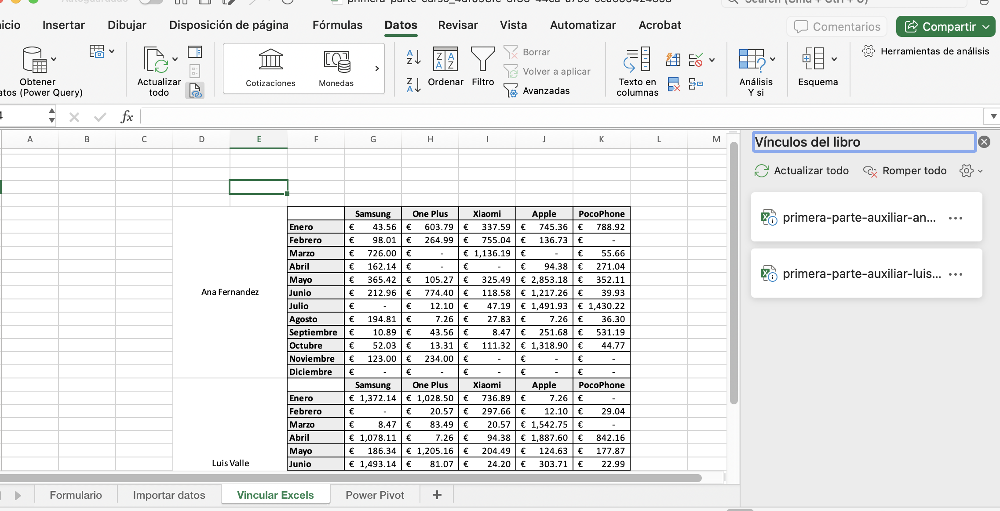

## Curso de Excel Avanzado para Análisis de Datos
> Domina Excel avanzado aplicando fórmulas complejas para análisis de datos, vinculando hojas, creando dashboards y visualizando resultados con gráficos. Aprende a limpiar, importar y segmentar datos para tomar decisiones efectivas.

## Clase 1: ¿Por qué utilizar Excel?

## ¿Qué aprenderás en este curso de Excel avanzado?
Sumérgete en el fascinante mundo del análisis de datos con Excel, una herramienta imprescindible en cualquier empresa actual, desde las startups más pequeñas hasta las grandes corporaciones. Este curso está diseñado para ofrecerte las habilidades necesarias para manejar y analizar enormes volúmenes de información, permitiéndote tomar decisiones rápidas y efectivas.

## ¿Por qué Excel es una herramienta crucial para el análisis de datos?
Excel destaca por ser versátil, fácil de usar y asequible. Estas características lo han consolidado como la herramienta preferida de muchas empresas, incluyendo el sector financiero, como en el caso de la empresa de la instructora Oksana Yakymchuk. Ella nos muestra que, aunque las firmas de trading poseen acceso a múltiples programas, Excel sigue siendo su opción principal debido a sus infinitas capacidades.

- Versatilidad: Permite adaptar su uso a diversas necesidades, ya sea para elaborar gráficas, cálculos complicados o incluso importar información desde diferentes bases de datos.

- Facilidad de uso: Su interfaz amigable facilita la curva de aprendizaje, permitiendo que usuarios de cualquier nivel de experiencia lo manejen eficazmente.

- Accesibilidad: Al ser parte del paquete de Microsoft Office, su disponibilidad es enorme, lo cual lo hace una opción económica y muy extendida en el mercado.

## ¿Cómo enfrentar datos desordenados?
Uno de los mayores retos al comenzar a trabajar con datos es enfrentarse con información dispersa y sin estructura. Aquí te ofrecemos algunas recomendaciones para abordar este desafío:

- Consolidación de datos: Aprende a importar y unificar información de diversas fuentes para comenzar a trabajar con un conjunto homogéneo de datos.
- Organización: Utiliza hojas de cálculo para estructurar la información de manera lógica, facilitando su análisis posterior.
- Uso de fórmulas avanzadas: Excel incluye un arsenal de funciones que te permitirán manipular tus datos y extraer la información relevante de manera eficiente.

## ¿Cómo crear un dashboard efectivo?
Uno de los puntos culminantes de este curso es aprender a construir dashboards en Excel, una habilidad que te permitirá visualizar datos clave de un vistazo. Un buen dashboard debe ser intuitivo, clave en la toma de decisiones rápidas y debe tener todas las métricas relevantes en un mismo lugar.

Selección de métricas: Identifica cuáles son las métricas más relevantes para tu análisis.
Visualización de datos: Aprende a crear gráficos y tablas que reflejen claramente el estado de los KPI seleccionados.
Interactividad: Diseña dashboards que permitan a los usuarios interactuar con los datos para profundizar en áreas específicas según sus necesidades.

## ¿Cómo asegurar el éxito en el aprendizaje del Excel?
Para sacar el máximo provecho de este curso, es esencial enfrentarte con entusiasmo y dedicación a cada lección. Oksana Yakymchuk, con su amplia experiencia en diseño de estrategias bursátiles, te guiará paso a paso para que cada técnica aprendida se convierta en una victoria personal.

Mentalidad abierta: No temas al Excel; en cambio, aprovéchate de sus capacidades.
Complementa tu aprendizaje: Revisa otros cursos de Excel en Platzi para obtener una comprensión más profunda y variada.
Práctica continua: La clave del aprendizaje es la práctica diaria. Intenta replicar lo aprendido en contextos y ejemplos reales.

## Clase 02: Vincular Excels
> Les aconsejo a todos los que participamos en este curso que tengan la ultima versión de Microsoft Office 2021 o como ahora lo llaman Microsoft 360. Hay alternartivas legales por la misma Microsoft para poder usar el programa.

## Pasos para vincular hojas de cálculo:

- Identificar los datos que deseamos vincular: Determine qué datos específicos del Excel de origen desea que se muestren en el Excel de destino.

- Ubicar la celda de destino: Seleccione la celda del Excel de destino donde desea que aparezcan los datos vinculados.
- Escribir la fórmula de vinculación: En la celda de destino, escriba la siguiente fórmula: = [Nombre del archivo de origen]![Hoja de cálculo de origen]![[Rango de celdas de origen]].
- Ejemplo: =C:\Users\Usuario\Desktop\Ventas_Ana_Fernandez.xlsx!Enero!B2
- Presionar Enter: Presione la tecla Enter para que la fórmula se ejecute y se muestren los datos vinculados.
- Desbloquear las referencias (opcional): Si desea que los datos vinculados se actualicen automáticamente al realizar  cambios en el Excel de origen, desbloquee las referencias de la fórmula. Para ello, seleccione la celda con la fórmula, presione F4 tres veces o haga clic en el botón "Desbloquear referencias" en la pestaña "Fórmulas".
- Copiar la fórmula (opcional): Si desea vincular datos en varias celdas, puede copiar la fórmula original y pegarla en las celdas siguientes. Excel ajustará automáticamente las referencias de las celdas en la fórmula pegada.

## Consideraciones importantes:

- Ubicación de los archivos: Para que los vínculos funcionen correctamente, los archivos de Excel deben estar ubicados en la misma red o unidad de disco.
- Nombres y ubicaciones de archivos: No modifique los nombres ni las ubicaciones de los archivos de Excel vinculados, ya - que esto romperá los vínculos.
- Actualización manual de vínculos: Si realiza cambios en el Excel de origen y desea que se reflejen inmediatamente en el - Excel de destino, puede actualizar los vínculos manualmente. Para ello, vaya a la pestaña "Datos", seleccione el grupo "Vínculos" y haga clic en "Actualizar vínculos".

## Pasos 
- Datos / vinculos del libro / 
- Del lado derecho se abre un sidebar derecho para validar los datos 

## Clase 3: Crear un formulario

Resumen

Los formularios en Excel: cómo facilitan la gestión de datos        

En el mundo del análisis de datos y la gestión de información, los formularios en Excel son herramientas cruciales que simplifican la captura y organización de datos. Aunque esta funcionalidad puede pasar inadvertida por estar oculta, una vez revelada y bien utilizada, permite no solo recopilar datos de manera eficiente sino también realizar búsquedas y eliminar registros de forma precisa. El proceso para crear un formulario en Excel es bastante sencillo, pero requiere de una serie de pasos que, al seguirlos adecuadamente, garantizarán un resultado óptimo. A continuación, te mostraré cómo desbloquear esta función y la manera de estructurar tus datos para sacar el máximo provecho de los formularios en Excel.

¿Cómo activamos la función de formulario en Excel?
Para comenzar a utilizar los formularios en Excel, primero necesitamos hacerlos visibles en nuestra interfaz. El proceso es sencillo:

Abre Excel y dirígete a "Archivo".
Ve a "Opciones" y selecciona la opción "Personalizar Cinta de opciones".
En el menú de "Comandos disponibles en:", elige "Todos los comandos".
Busca la función "Formulario". Para facilitar esto, puedes presionar la letra 'F' y localizarla rápidamente.
Antes de agregarla, debes crear un nuevo grupo. Esto se puede hacer en cualquier pestaña, como por ejemplo "Inicio".
Añade un nuevo grupo y nombralo, por ejemplo, "Base de datos".
Agrega la función formulario al nuevo grupo creado.
Confirma los cambios y observa que el formulario está ahora disponible en la pestaña "Inicio".
¿Qué estructura deben tener nuestros datos para usar formularios?
Es vital que tus datos estén correctamente organizados en una tabla de Excel oficial para que el formulario funcione debidamente.

Asegúrate de que tus encabezados estén claramente definidos.
Formatea las celdas según el tipo de datos que contendrán (por ejemplo, las fechas con formato de fecha y los montos con formato de moneda).
Utiliza fórmulas para automatizar cálculos, como el del IVA o total a pagar.
¿Cómo creamos un formulario con la información organizada?
Con los datos ya estructurados en formato de tabla, puedes proceder a crear tu formulario.

Selecciona los encabezados y una fila adicional debajo de ellos.
Inserta una tabla desde la pestaña "Insertar".
Con la tabla creada, selecciona cualquier celda dentro de esta y abre el formulario desde la pestaña "Inicio".
¿Qué más podemos hacer con los formularios en Excel?
La funcionalidad de los formularios no se limita a la introducción de datos. También cuentan con:

Capacidad para realizar búsquedas específicas dentro de la base de datos usando uno o varios criterios.
Navegación entre registros encontrados.
Opción para eliminar registros, aunque se debe tener en cuenta que esta acción es irreversible.
La poderosa herramienta de formularios de Excel te permitirá manejar tus bases de datos de una manera más ágil y organizada. A través de la aplicación de estos formularios, podrás aumentar significativamente la eficiencia en tus tareas de captura y gestión de datos. Te invito a descargar el archivo de práctica proporcionado y empezar a experimentar con la creación de tus propios formularios. ¡El manejo de datos nunca había sido tan sencillo!

