# Curso de Excel Intermedio 🚀

> Aprende a generar análisis precisos, automatizar tareas con Power Query, construir dashboards con controles interactivos y aplicar funciones avanzadas para limpiar y analizar grandes volúmenes de datos. Toma decisiones ágiles y confiables basadas en información bien estructurada.

| Detalle | Información |
| :--- | :--- |
| **Publicado el** | Publicado el 09 de octubre de 2025 |
| **Profesor** | Daniela Tellez |
| **Fecha de Inicio** | 06/10/2025 |
| **Fecha de Fin** | 30/10/2025 |

## CLASE 01: Tablas dinámicas y dashboards interactivos en Excel

**¿Qué aprenderás en Excel para análisis de datos profesional?**
Este entrenamiento te enfoca en resultados concretos: convertir datos en decisiones. Verás cómo pasar de lo básico a un uso estratégico de Excel con técnicas que conectan análisis, visualización y automatización.

- Convertir archivos desordenados en tablas estructuradas listas para análisis.
- Usar tablas dinámicas para responder preguntas de negocio reales.
- Identificar productos que están creciendo y dónde se pierde dinero.
- Crear rankings por márgenes y crecimiento.
- Construir un dashboard interactivo con segmentadores y escalas de tiempo.
- Ejecutar simulaciones con Solver para tomar decisiones informadas.
- Implementar automatizaciones con Power Query para actualizar en segundos.

## CLASE 02:  Cómo importar archivos CSV, texto y web en Excel


**PASOS**
- Paso 1: Desde la pestaña de datos podemos acceder las funcionalidades de obtener y transformar datos 
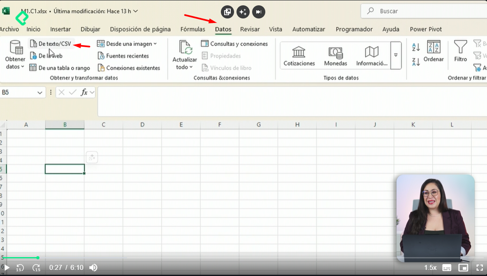

- Paso 2: Podemos indicar que datos podemos establecer  

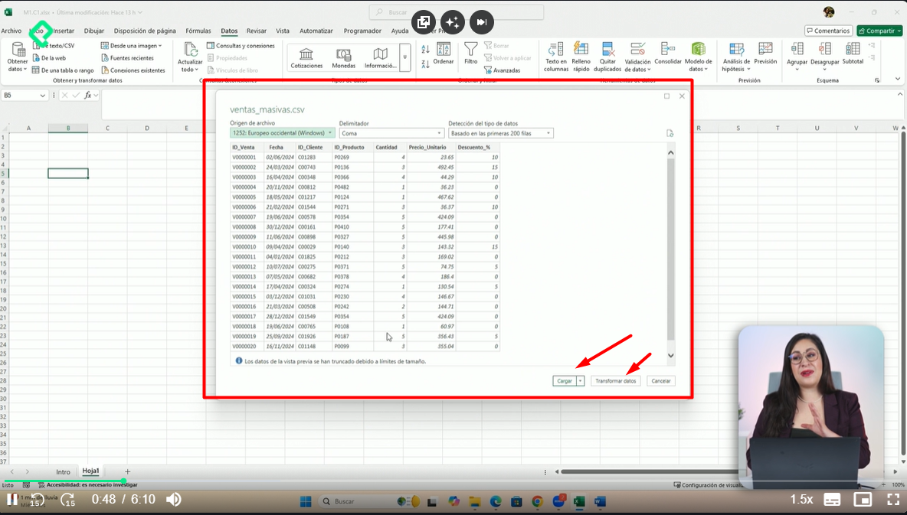

- Paso 3: Aceptar y tenemos los datos en nuestra hoja de manera ordenado ya que la podemos validar previamente 


**¿Qué palabras clave y habilidades fortaleces?**
- Obtener y transformar datos: conectar orígenes y actualizar datos.
- Texto/CSV: importar con delimitador y validar vista previa.
- Texto en columnas: separar datos con delimitados o ancho fijo.
- Atajos: control E, control A, control C para seleccionar y copiar rápido.
- De la web y URL: traer tablas específicas y mantenerlas al día.

>[!NOTE]
> Podemos usar Pestaña Datos / De la Web / Establercer el enlace y nos traera de manera opcional que queremos usar de esa web 
> PD: si la web es privada es decir usa credenciales podemos indicarselas y nos dara acceso al portal que necesitamos  obtener los datos que se especifiquen  

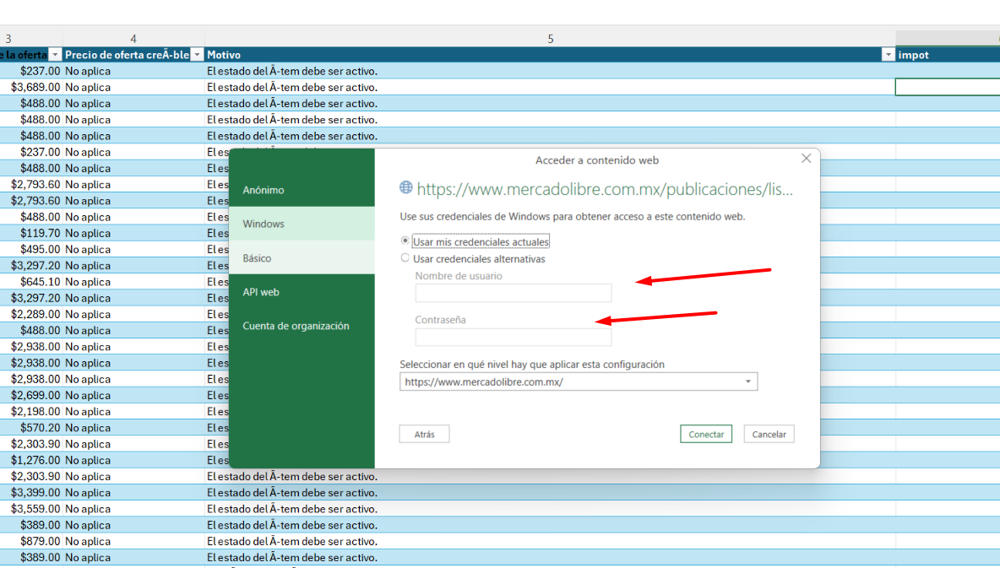

## CLASE 03: Referencias dinámicas en tablas de Excel con nombres de columna
> Convierte tus datos en una tabla de Excel y acelera cálculos y actualizaciones. Aquí verás cómo crearla con Ctrl+T, activar encabezados, usar referencias dinámicas con arroba (@), nombrar la tabla como ventas y sumar columnas como importe. Además, aprenderás a traer toda la tabla o una columna específica con corchetes y a preparar el reto del IVA.


**¿Cómo crear formato de tabla con ctrl+t y encabezados?**

Transforma tu rango en una tabla para ganar velocidad y claridad. Selecciona los datos y usa Ctrl+T. En “crear tabla”, marca la tabla tiene encabezados y acepta. No es solo estética: la tabla habilita funciones prácticas y hace que las actualizaciones de archivo sean más rápidas cuando recibes nuevos datos.

- Selecciona el rango y presiona Ctrl+T.
- Marca la casilla la tabla tiene encabezados.
- Acepta para aplicar formato de tabla.
- Obtén estructura, filtros y estilos automáticos.
- Facilita actualizaciones al llegar nuevos archivos.

**Como cambiar el nombre de tabla**

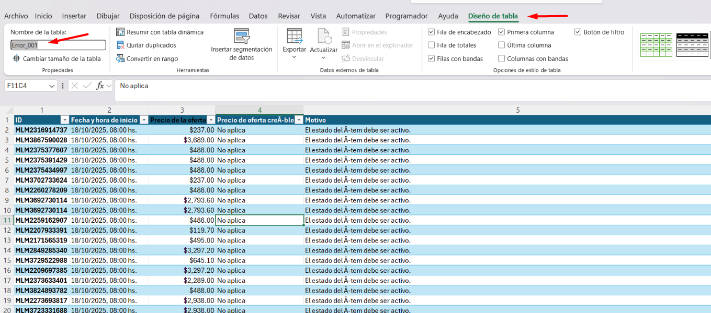

>[!NOTE]
> Nomeclatura luego de transformar una hoja en una tabla usando el insertar podemos usar la siguiente nomeclatura para acceder a nuesteos valores en nuestras formular ejemplo 1 :  NombreTabla[@campo] =>´Ventas[@cliente]´
> Usando Nomeclatura podemos importar los datos existentes en una tabla con esta formular ´=Error_001[#Datos]´ viene ya con un mini menu desplegable para que podemos elegir 
> Usando Nomeclatura podemos traer los valores de una columna ´=Error_001[[#Datos], [Precio de la oferta]]´

## CLASE 04: Limpieza avanzada de datos en Excel con funciones anidadas

> Impulsa la calidad de tus datos en Excel con técnicas de limpieza avanzadas y fórmulas anidadas. Aquí verás cómo estandarizar texto, validar correos, marcar duplicados, unir campos y contar con comodines para tu dashboard actualizado de forma automática. Todo con referencias de tabla para trabajar con precisión y velocidad.


## CLASE 04: Limpieza avanzada de datos en Excel con funciones anidadas
> Impulsa la calidad de tus datos en Excel con técnicas de limpieza avanzadas y fórmulas anidadas. Aquí verás cómo estandarizar texto, validar correos, marcar duplicados, unir campos y contar con comodines para tu dashboard actualizado de forma automática. Todo con referencias de tabla para trabajar con precisión y velocidad.

**FORMULAS**
- HALLAR            => ´=HALLAR("@",Tabla1[@Correo])´ Siempre devuelve un número 
- valida dubplicado => ´=SI(CONTAR.SI(Tabla1[Correo],Tabla1[@Correo])>1,"DUPLICADO","OK")´
- UNIR CADENAS      => ´=UNIRCADENAS("-",VERDADERO,Tabla1[@[ID_Cliente]],Tabla1[@Nombre],Tabla1[@Segmento],Tabla1[@País])´
- CONTAR PALABRAS usando comodin   => ´=CONTAR.SI(Tabla1[Correo],"*.mx")´ * (Comodines )
- CONTAR PALABRAS usando comodin   => ´=CONTAR.SI(Tabla1[Nombre],"G*")´ * (Comodines ) que empiece con G
- CONTAR PALABRAS usando comodin   => ´=CONTAR.SI(Tabla1[Correo],"*gmail*")´ * (Comodines ) que tenga gmail 
- sustituir   => ´=SUSTITUIR(Tabla1[@Correo],",",".")´  

**RETO**
👉 Crea una columna que combine el Nombre_Limpio y el Correo_Limpio en un solo campo. => ´=LIMPIAR(UNIRCADENAS("-", ,ESPACIOS([@Nombre]), ESPACIOS([@Correo])))´
👉 Usa CONTAR.SI para saber cuántos correos terminan en Hotmail => ´=CONTAR.SI([NombreYCorreo], "*hotmail*")´
---
👉 Encuentra en la tabla un correo que no tenga “@” y corrígelo con SUSTITUIR agregando la arroba antes del dominio. => 

Aplique dos pasos YA QUE EL PROBLEMA ES GRANDE Y APLIQUE DIVIDE Y VENCERAS
- Paso 1: primero queria realizar LA FORMULA BÁSICA ´=SI(ESNUMERO(HALLAR("@",[@Correo])),"SI",SUSTITUIR([@NombreYCorreo],"yahoo", "@yahoo"))´ Me funciono con los yahoo 
- Paso 2: Luego de validar y ver las clase de nuevo pues sustituir no acepta multiples textos por lo que es valido hacer condicionales anidados y quedo la formula así, en las secciones del NO del condicional =SI reaplique la formula para los distintos casos encontrados quedando así 

´=SI(ESNUMERO(HALLAR("@",[@Correo])),[@Correo]
,SI(ESNUMERO(HALLAR("yahoo",[@Correo])),SUSTITUIR([@Correo],"yahoo","@yahoo")
,SI(ESNUMERO(HALLAR("hotmail",[@Correo])),SUSTITUIR([@Correo],"hotmail","@hotmail")
,SI(ESNUMERO(HALLAR("gmail",[@Correo])),SUSTITUIR([@Correo],"gmail","@gmail"),[@Correo])))
)´

- Paso 3: aplique formula antes de saber cuales no tenian arroba y estudiar el patrón para luego sustituirlo 
´=SI(ESNUMERO(HALLAR("@",[@Correo])),"SI","NO")´

## CLASE 05: Filtros avanzados y funciones SUMAR.SI.CONJUNTO en Excel

**¿Cómo aplicar filtros avanzados de forma rápida?**
Aplicar un filtro es inmediato: control l, luego menú de inicio > ordenar y filtrar > filtro. También puedes usar el atajo control shift l. Verás el ícono de embudo en las columnas con filtros activos, útil para reconocer si alguien más ya filtró la hoja.

Filtra por varios criterios. Ejemplo: segmento PYME y país México o España.
Usa filtro personalizado para combinar reglas en una misma columna.
Aplica filtros en una o varias columnas al mismo tiempo.

**¿Cómo sumar si conjunto y contar si conjunto para múltiples criterios?**
Cuando necesitas sumar o contar con varios criterios simultáneos, usa estas funciones. Ejemplo típico: país México, segmento retail y una categoría específica al mismo tiempo.

**¿Qué significan rango suma y rango de criterios?**
En sumar si conjunto:

- Escribe “= sumar si conjunto”.
- Define el rango suma: los datos a sumar, por ejemplo, el campo de importe.
- Usa F4 para fijar el rango si es un rango matriz.
- Elige rango de criterios 1: donde es posible encontrar “México” (por ejemplo, la columna país).
- Especifica criterio 1: “México” entre comillas.
- Elige rango de criterios 2: donde es posible encontrar “retail” (por ejemplo, la columna segmento).
- Especifica criterio 2: “retail”, también entre comillas.
- Repite el patrón para más criterios si los necesitas.
- Consejo práctico: aplica control shift cuatro para formato moneda después de obtener el resultado.

**¿Cuál es la diferencia entre sumar si conjunto y contar si conjunto?**

sumar si conjunto: devuelve la suma del importe que cumple los criterios.
contar si conjunto: devuelve el número de transacciones que cumple los criterios. No requiere “rango suma”, solo rangos de criterios y sus criterios.

**¿Cómo ordenar con orden personalizado y varios niveles?**
El orden personalizado te ayuda a presentar datos con estructura clara. Ve a orden personalizado, amplia la selección y agrega niveles para ordenar por varias columnas a la vez.

Ordena por país de a a z si es texto.
Agrega un nivel por importe de mayor a menor o de menor a mayor.
Verás cada país agrupado y, dentro, los importes ordenados de más a menos (o al revés).
Atajos clave para agilizar:

control shift l: activar/desactivar filtros.
f4: fijar rangos en fórmulas.
control shift cuatro: formato moneda.
control shift + flechas: seleccionar rangos rápidamente.


```Formulas
#Formula es RangoSuma, RangoCriterior1, "CaracterComparar",RangoCriterior2, "CaracterComparar2", RangoCriterior3, "CaracterComparar3"

=SUMAR.SI.CONJUNTO($T$2:$T$20001,$J$2:$J$20001,"Pyme",P2:P20001,"Gorra")
=SUMAR.SI.CONJUNTO(T2:T20001, F2:F20001, 3, K2:K20001, "México")
``` 

## CLASE 06: Listas desplegables anidadas en Excel con índice y coincidir

¿Qué es una lista desplegable anidada y por qué mejora tu reporte?
Una lista anidada conecta dos menús: eliges una categoría y, automáticamente, el segundo menú muestra sus subcategorías. Por ejemplo: hogar, moda u oficina activan opciones distintas. Esto evita mostrar todo a la vez y facilita el análisis.

Reduce el ruido visual y el error humano.
Acelera la selección al mostrar solo opciones válidas.
Hace tu reporte más interactivo y usable.


¿Qué hace coincidir y por qué devuelve 5?
Coincidir busca un valor dentro de un encabezado y regresa su posición. Ejemplo: buscar “software” en la fila de cabeceras con coincidencia exacta (0) devuelve 5 porque es la quinta columna. Ese resultado reemplaza el número de columna en índice, volviéndolo dinámico.

Valor buscado: la categoría elegida en la primera lista, como “moda” o “software”.
Rango de búsqueda: solo las cabeceras, fijadas con F4.
Tipo de coincidencia: 0 para coincidencia exacta.
Integración práctica: índice usa la matriz completa; coincidir calcula la columna según la categoría seleccionada. Si cambias de “software” a “moda”, las subcategorías cambian en automático.

¿Cómo convertirlo en una lista desplegable?
Copia la fórmula dinámica que devuelve la columna de subcategorías.
Selecciona la celda donde irá la segunda lista.
Abre validación de datos y elige lista.
En origen, pega la fórmula y confirma.
Prueba: al elegir “oficina”, verás opciones como “cuaderno”; si cambias a “moda”, aparecerá “jeans”.

## CLASE 07:Agrupaciones de fecha, texto y número en tablas dinámicas

¿Cómo agrupar por fecha, texto y número en Excel?
La clave está en el tipo de dato: fecha, texto o número. Cada uno permite agrupaciones distintas y complementarias para análisis más profundos.

¿Cómo agrupar por fecha en meses, trimestres o años?
Arrastra un campo con formato de fecha a la tabla dinámica y haz clic derecho > Agrupar. Verás opciones como comenzar en y terminar en, que representan el periodo disponible, y podrás elegir meses, trimestres o años. También están horas, minutos y segundos para granularidad fina.

Prácticas rápidas: - Si solo necesitas años, selecciónalos y acepta: verás el total del periodo seleccionado. - Para quitar días y quedarte con meses, marca meses y desmarca días. - Agrega Importe al área de valores para obtener totales por periodo.

Beneficio: obtienes una visión temporal clara, útil para tendencias, estacionalidad y cortes ejecutivos sin fórmulas adicionales.

¿Cómo agrupar por texto con grupos personalizados?
Cuando el campo es texto (por ejemplo, “Nombre de producto”), puedes crear grupos manuales: - Copia la tabla dinámica para mantener la anterior intacta. - Selecciona varios ítems, clic derecho > Agrupar. - Renombra el grupo (ejemplo: “Hogar”) para hacerlo más legible.

Ventajas: - Consolidas ítems dispersos en categorías hechas a tu medida. - Obtienes totales por grupo para comparar familias de productos o segmentos.

¿Cómo agrupar números en rangos fijos?
Con campos numéricos (por ejemplo, “Importe”), puedes definir rangos: - Coloca el número en filas y/o valores. - Clic derecho > Agrupar. - Define: comenzar en, terminar en y por cada (tamaño del intervalo, por ejemplo, 5000).

Qué obtienes: - Rangos como 5–5000, 10000–15000, 15000–20000, con el total de ventas o conteos en cada segmento. - Detección rápida de concentraciones y outliers.

Aplicaciones directas: - Rangos de edades para análisis demográfico. - Rangos salariales para compensaciones. - Años en la empresa para rotación o antigüedad. - Errores en líneas de producción para medir volumen por severidad.

Tip operativo: si necesitas rehacer el criterio, usa Desagrupar y vuelve a definir los rangos.

>[!NOTE]
> Recuerda podemos generar grupos durante las tablas dinamicas, el tipo de agrupado depende del tipo de datos 
> Si es fecha tiene un formato
> si tiene numeros tiene un formato 
> si tienes texto tiene im formato 

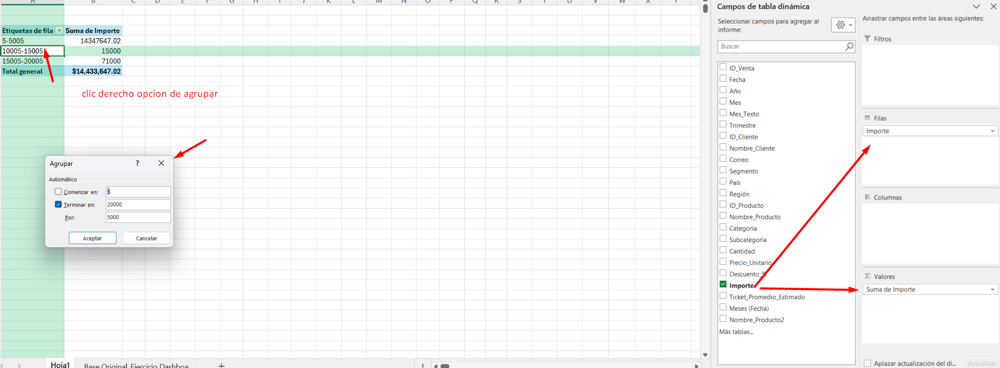

## CLASE 08:  Creación de tops y KPIs con tablas dinámicas en Excel


>[!NOTE]
> Podemos copiar y pegar el mismo valor cuantas veces queramos y darle otro tipo de resumenes checa imagen 
> CLIC normal buscar [Configuración de campo valor ] sobre el tablero dinamico 
> CLIC derecho buscar [Resumir valores por > ] sobre la celda 
> CLIC derecho buscar [Mostrar valores como  > ] sobre la celda - Me Permite saber el pocentaje  
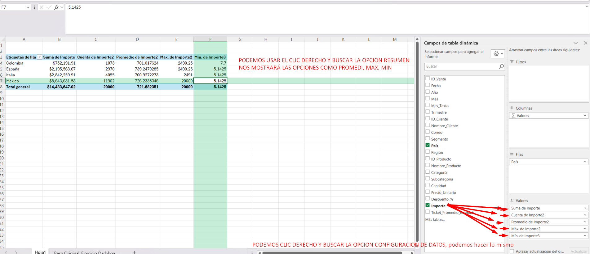


## CLASE 09: Campos calculados y gráficos dinámicos para comparar periodos 

¿Cómo preparar la tabla dinámica para comparar por periodo?
Configura la estructura antes de calcular diferencias. La orientación define la lectura del reporte.

Inserta una tabla dinámica en nueva hoja o hoja existente. Selecciona la ubicación y Aceptar.
Coloca nombre del producto en filas. Coloca fecha en columnas para ver meses.
Asegúrate de que la fecha esté agrupada en mes. También puedes agrupar por día o año según la comparación que busques.
Agrega importe a Valores. Aplica formato de moneda con Control + Shift + 4.
Selecciona rápido el rango: Control + Shift + Flecha abajo y derecha, o Control + E.
Tip clave: puedes arrastrar el mismo importe varias veces a Valores para calcular métricas distintas.
¿Cómo organizar horizontal o vertical?
Horizontal: meses en columnas y productos en filas. Útil para comparar periodos lado a lado.
Vertical: meses en filas y productos en columnas. Ideal si prefieres leer de arriba hacia abajo.
Copia y pega tu tabla dinámica para crear variantes sin empezar desde cero.
¿Cómo obtener la diferencia y el porcentaje vs mes anterior?
El cálculo se logra desde “Mostrar valores como”, sin escribir fórmulas.

Duplica el campo importe en Valores. Clic derecho > Configuración de campo de valor.
Ve a Mostrar valores como > Diferencia de.
Define campo base: fecha (agrupada en mes si comparas por mes).
Define elemento base: anterior para comparar contra el mes previo. También existe “siguiente”.
Cambia el nombre del campo para identificarlo, por ejemplo: “diferencia vs mes anterior”.
Observa que el primer periodo no muestra dato porque no tiene periodo anterior.


>[!NOTE]
> CLIC normal buscar [Configuración de campo valor ] sobre el tablero dinamico 
> Apuntes MOSTRAR VALORES COMO > 
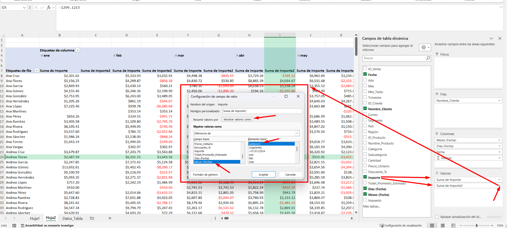
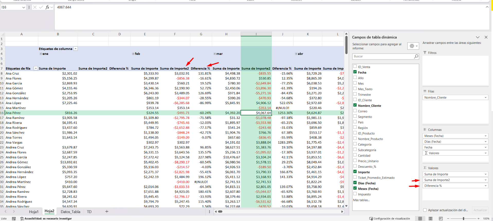
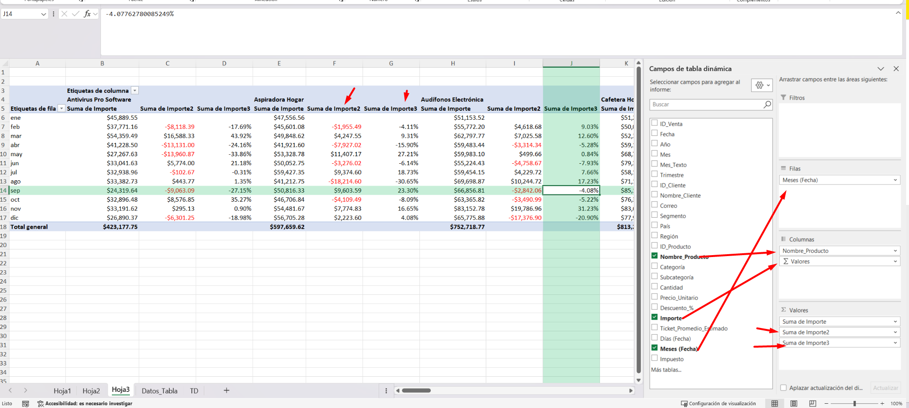

## CLASE 10: Creación de gráficos avanzados para tableros de control

¿Cómo preparar datos con tablas dinámicas para gráficos?
Antes de graficar, organiza la base y crea rangos limpios a partir de tus tablas dinámicas. Así evitas choques y habilitas gráficos que no salen directo desde la tabla dinámica.

Duplica tu tabla dinámica y ubícala en vertical u horizontal según tamaño para que no choquen entre sí.
Limpia campos y conserva solo lo necesario: por ejemplo, país y ventas para el mapa coroplético.
Escribe = y selecciona el dato en la tabla dinámica para activar importar datos dinámicos. Trae el valor correcto del campo.
Evita valores fijos: sustituye “Colombia” por la celda con el país y arrastra la fórmula para que sea dinámico.
Aplica formato de moneda y agrega cabeceras: país y venta.
Recuerda: algunos gráficos requieren este paso intermedio, no salen directo desde “gráfico dinámico”.
¿Cómo crear gráficos potentes en Excel?
Con los datos preparados, construye visualizaciones que respondan preguntas del negocio. Prioriza claridad, proporciones y lectura rápida para tu dashboard.

¿Cómo construir un mapa coroplético desde tabla dinámica?
Selecciona el rango limpio con país y venta generado con importar datos dinámicos.
Ve a insertar > mapas > mapa coroplético.
Si trabajas con varios países, el mapa se verá global; si es un país específico, se concentrará esa región.
Úsalo cuando necesites resaltar distribución geográfica de ventas.
¿Cuándo usar un gráfico de dona para proporciones?
Copia la tabla dinámica y selecciona los datos relevantes.
Analizar tabla dinámica > gráfico dinámico > circular > gráfico de dona.
Mejora lectura de proporciones: procura no más de ocho categorías.
Ideal para mostrar distribución por categoría de forma clara.
¿Cómo armar un velocímetro con dona y porcentaje?
Cambia la dimensión a segmento y muestra valores como porcentaje sobre total general.
Crea un rango con importar datos dinámicos para el valor del segmento seleccionado.
Calcula el complementario: 1 menos ese porcentaje, debe sumar 100 con el valor principal.
Inserta un gráfico de dona con ambas series: valor y complementario.
Ajusta el ángulo inicial a 270 para rotar el arco.
Oculta la parte baja: sin relleno y sin contorno para crear el arco del velocímetro.
Ajusta el tamaño del agujero del anillo para el grosor deseado.
¿Cómo dejar lista la estructura de tu dashboard?
Prepara una tarjeta de resultados y organiza las hojas para que el armado final sea ágil, coherente y fácil de mantener.

¿Cómo crear una tarjeta de resultados con importe?
Toma una tabla dinámica sencilla con solo importe.
Vincula el valor con = a una celda limpia para usarlo como tarjeta.
Mantén solo el dato necesario para el diseño final.
¿Qué estructura mínima debe tener el dashboard?
Hoja 1: fuente de origen en formato tabla.
Hoja 2: tablas dinámicas y rangos intermedios que responden preguntas del reporte.
Hoja 3: vista del dashboard que integra todo lo anterior.
En esta etapa no importa el diseño final: prioriza que los datos respondan las preguntas clave.


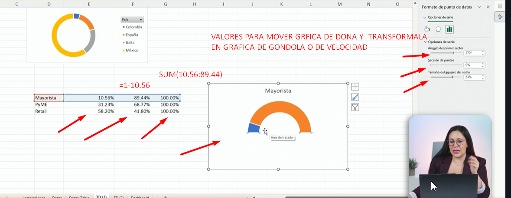

## CLASE 11: Diseño de dashboards profesionales en Excel

¿Cómo preparar el lienzo del dashboard en Excel?
Antes de diseñar, ordena el espacio visual. Duplicar la hoja, aplicar un fondo y añadir contenedores transparentes te ayuda a jerarquizar la información desde el inicio y a lograr un estilo consistente.

¿Cómo duplicar hoja y aplicar fondo desde disposición de página?
Crea una nueva hoja y nómbrala “Dashboard 2”.
Ve a disposición de página > fondo > desde un archivo.
Elige uno de los cuatro fondos disponibles en los recursos.
Quita las líneas para que se aprecie el fondo.
Limita el área útil para que solo quede el dashboard visual.
¿Cómo crear contenedores con formas y transparencia?
Inserta formas > cuadrado o rectángulo.
Asigna relleno negro para resaltar secciones.
Clic derecho > formato de forma > ajusta la transparencia según se necesite.
Copia y pega para replicar contenedores de manera uniforme.
¿Cómo dar estilo y formato profesional a tus gráficos?
Trae todos los gráficos desde tus tablas dinámicas, acomódalos y luego aplícales un formato limpio: sin relleno, sin contorno, tipografía consistente y etiquetas legibles. Esto mejora la lectura y la coherencia visual.

¿Cómo importar y acomodar gráficos del modelo?
Copia gráficos con control C desde tus tablas dinámicas.
Pégalos en el dashboard con control V.
Acomódalos de forma estratégica según tu narrativa visual.
Ajusta tamaños más adelante; ahora solo define espacios.
¿Cómo limpiar y dar formato a cada gráfico?
Clic derecho > ocultar todos los botones de campos en gráfico.
Quita líneas y bordes: sin relleno y sin contorno.
Usa color de fuente blanco para contraste sobre fondos oscuros.
Si aplica, usa contorno blanco para destacar el gráfico.
Agrega etiquetas de datos para mostrar valores.
Aplica formato de número personalizado para cantidades compactas: “signo de pesos, gato, coma, gato, gato, gato, coma”.
Cambia la tipografía a IBM Flex Sans u otra consistente.
Activa línea suavizada en opciones de serie para un efecto más fluido.
¿Qué excepciones aplicar según el tipo de gráfico?
Mapa: selecciona la serie > color de la serie. Ajusta el gradiente de más a menos. Define 2 o 3 secuencias; en el ejemplo se usan tres.
Combinado: oculta botones. Ve a diseño > diseño rápido > opción 2. Ajusta relleno y contorno blanco. Reaplica sin relleno, sin contorno y letra blanca.
Pie: agrega etiquetas de datos. En opciones de etiqueta, usa porcentaje y quita valor. Mantén la paleta y limpieza general.
¿Cómo integrar íconos, logos, tarjetas y segmentadores?
Los detalles visuales claros elevan la lectura. Íconos coherentes, un logo bien colocado y tarjetas de resultados enlazadas a celdas hacen que el tablero comunique mejor. Los segmentadores dan control para filtrar por variables clave.

¿Cómo insertar y estandarizar íconos?
Ve a Insertar > íconos.
Elige íconos útiles: venta, gráfico en crecimiento, trofeo.
Inserta varios a la vez para controlar magnitud uniforme.
Cambia el color a blanco para alto contraste.
Redimensiona seleccionando todos para mantener proporcionalidad.
Acomódalos junto a métricas o secciones clave.
¿Cómo agregar el logo desde imágenes?
Ve a Insertar > imágenes > colocar sobre celda > este dispositivo.
Selecciona el archivo de logo de los recursos.
Ajusta tamaño y posición hasta integrarlo al diseño.
¿Cómo crear tarjetas de resultados y segmentadores?
Inserta un cuadro de texto para la métrica principal.
No escribas dentro: selecciona el borde, ve a la barra de fórmulas y enlaza la celda con el dato dinámico.
Da formato con negritas y tamaño grande para dar peso visual.
Repite el proceso para porcentajes u otros KPIs.
Agrega segmentadores para filtrar por país, categoría y región.
Úsalos para responder preguntas del reporte de forma dinámica.


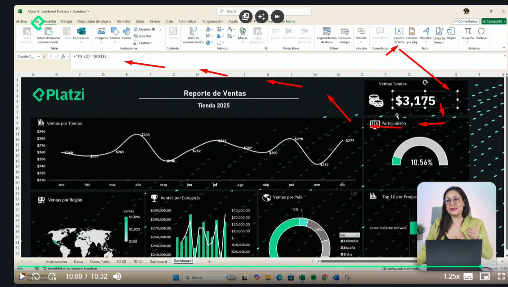


## CLASE 12: Creación de segmentadores dinámicos en reportes de Excel


¿Cómo activar segmentación de datos en un gráfico dinámico?
Primero, confirma que seleccionas un gráfico dinámico (no uno estático). Luego ve a la pestaña Análisis de gráfico dinámico y elige Insertar segmentación de datos. Selecciona los campos: Nombre producto, País y Categoría. Acepta y organiza los segmentadores donde prefieras.

Ajusta columnas del segmentador desde Segmentación: por ejemplo, en tres columnas para ver más elementos a la vez.
Reubica cada segmentador: país a la izquierda, categoría a la derecha, según convenga.
Selecciona varios segmentadores a la vez para aplicar ajustes comunes.
¿Cómo dar estilo a los segmentadores con tu paleta corporativa?
Desde Segmentación puedes aplicar estilos rápidos, incluido el diseño de Platzi. Si necesitas una paleta específica, usa nuevo estilo de segmentación de datos:

Cambia colores, tipo y tamaño de letra, negritas y bordes.
En relleno, entra a más colores y define HEX o RGB para tu paleta.
Guarda el estilo y aplícalo a todos tus segmentadores.
¿Cómo seleccionar varias opciones y limpiar rápido el filtro?
Aprovecha los controles del segmentador en la parte superior:

Activa la selección múltiple para combinar varios países o categorías.
Usa el filtro de limpieza para quitar todas las selecciones al instante.
¿Cómo conectar segmentadores y controlar tablas dinámicas con conexiones de informes?
Para que todo cambie al mismo tiempo, conecta cada segmentador a las tablas dinámicas que debe gobernar. Selecciona un solo segmentador, clic derecho y entra a Conexiones de informes.

Marca las tablas dinámicas que correspondan, por ejemplo, todas las que estén en la hoja TD2 o las que se llamen Tabla dinámica 2.
Desmarca las que no quieras controlar desde ese segmentador.
Repite el proceso con cada segmentador.
Así, al filtrar por un país como España, todos los elementos vinculados se actualizan: tarjetas, top diez, ventas por país y ventas por región. Si algún gráfico no cambia, revisa su conexión.

¿Qué buenas prácticas aseguran control total?
Nombra y agrupa tus tablas dinámicas en una pestaña clara, como TD2.
Verifica conexiones después de mover o copiar elementos.
Usa un orden lógico: país, categoría y producto para filtrar de lo general a lo específico.
¿Cómo añadir y personalizar una escala de tiempo por fecha?
Colócate en un gráfico dinámico y elige Insertar escala de tiempo. Solo aparecerán campos que sean fecha válida. Si la fecha no tiene formato correcto, no se mostrará ninguna opción.

Acepta y posiciona la escala de tiempo donde aporte claridad.
Aplica el diseño de Platzi u otro estilo. Personaliza:
Encabezado, tipografía, negritas e itálicas.
Tamaños, rellenos y bordes.
Colores con HEX o RGB si necesitas coherencia de marca.
¿Cómo conectar y usar periodos con precisión?
Al igual que con los segmentadores, usa clic derecho y Revisar conexiones de informes para vincular la escala de tiempo a todas las tablas dinámicas relevantes.

Juega con periodos: meses, trimestres o rangos específicos.
Combina con categoría para ver, por ejemplo, moda o solo software en un rango concreto.
Si un periodo no tiene datos, ajusta o limpia el filtro rápidamente.

>[!NOTE]
> Aclaración que acabo de notar, los segmentadores no se conectan a las gráficas, se conectan a las tablas dinámicas y las tablas a los gráficos. Por lo tanto para saber a que tabla se están conectando podemos cambiar el nombre a las tablas.

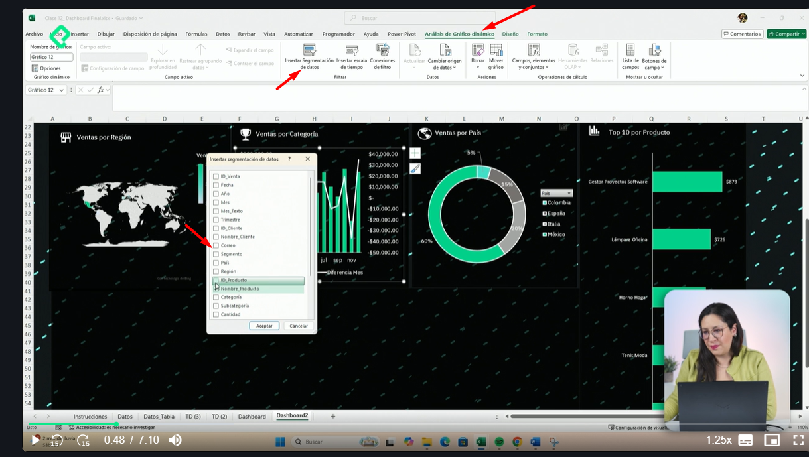

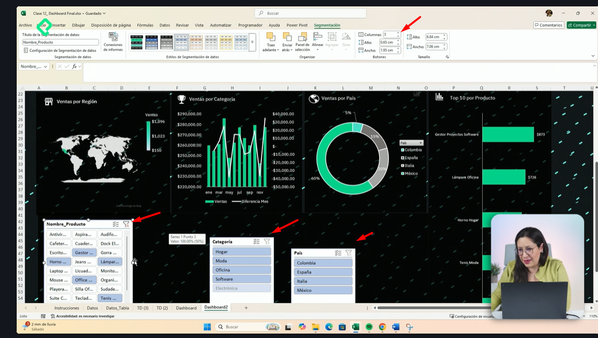


> vALIDAR QUE TABLAS DINAMICAS PODEMOS VALIDAR 
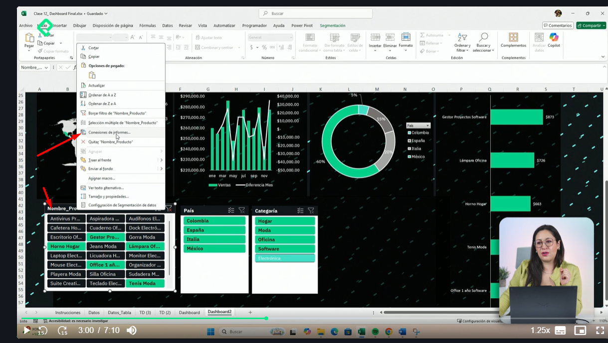

> Insertar Escala de Tiempo 
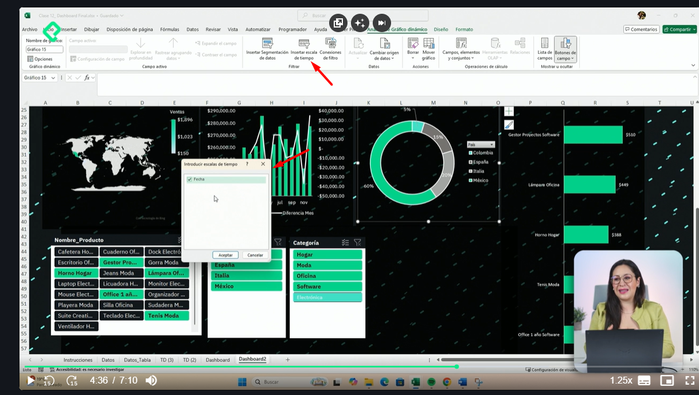


> Ejemplo me gusto esta forma 

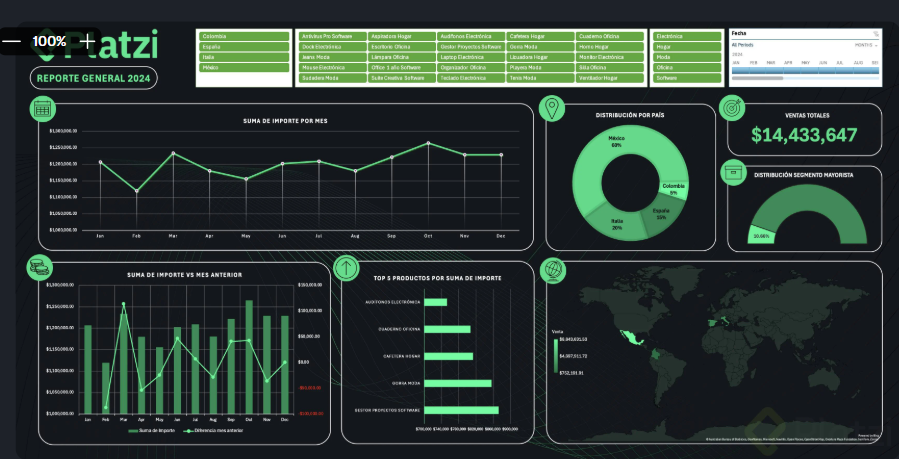


## CLASE 13: Automatización de actualizaciones de datos en Excel 

¿Qué rol cumple el formato de tabla?
Asegura que el origen se expanda al pegar datos nuevos.
Evita redefinir manualmente el rango en cada actualización.
Permite que “Actualizar” funcione con un clic.
¿Dónde usar actualizar y actualizar todo?
En “Analizar tabla dinámica” tienes ambas opciones.
Actualizar: refresca la tabla dinámica activa.
Actualizar todo: refresca todas las fuentes y tablas dinámicas del libro.
Atajo útil: Alt F5 para acelerar el flujo.
¿Cómo automatizar con macros la actualización de tablas dinámicas?
Una macro es código que ejecuta por ti una acción repetitiva. Aquí, refrescará tu tabla dinámica cada vez que se active la hoja, sin que tengas que presionar actualizar.

¿Qué es una macro y qué necesitas nombrar?
Cambia el nombre de la tabla dinámica: en “Analizar tabla dinámica” → “Nombre de la tabla dinámica”. Ejemplo: Ventas.
Identifica el nombre de la hoja donde está la tabla dinámica. En el editor, el nombre entre paréntesis (p. ej., TD3) es el que importa.
Clic derecho en la hoja → Ver código para abrir Visual Basic.
En el módulo de la hoja, elige Worksheet y el evento Activate.
¿Qué código VBA usar para refrescar?
Pega este snippet y ajusta el nombre de tu tabla dinámica entre comillas.

Private Sub Worksheet_Activate()
    ActiveSheet.PivotTables("Ventas").PivotCache.Refresh
End Sub
Cierra el editor y prueba: al activar la hoja, se actualiza la tabla dinámica automáticamente.
¿Tienes varias tablas dinámicas? Duplica la línea cambiando el nombre: “Ventas”, “Vendedores”, “Agentes”.
Guarda como Libro de Excel habilitado para macros (.xlsm). Al abrir, autoriza las macros. Si ves advertencia de autoguardado, es porque debes habilitar macros.
¿Cómo optimizar el dashboard y el archivo?
Fondos que se repiten en celdas vacías consumen memoria y vuelven lento el archivo. Delimita tu área de trabajo ocultando lo que no usas.

¿Cómo delimitar filas y columnas sin borrar?
Selecciona desde la columna límite → Ctrl + Shift + Flecha derecha → clic derecho → Ocultar.
Repite hacia abajo: Ctrl + Shift + Flecha abajo → clic derecho → Ocultar.
Beneficios: área limpia, navegación clara y archivo más optimizado.

> Paso Sencillo para macro 
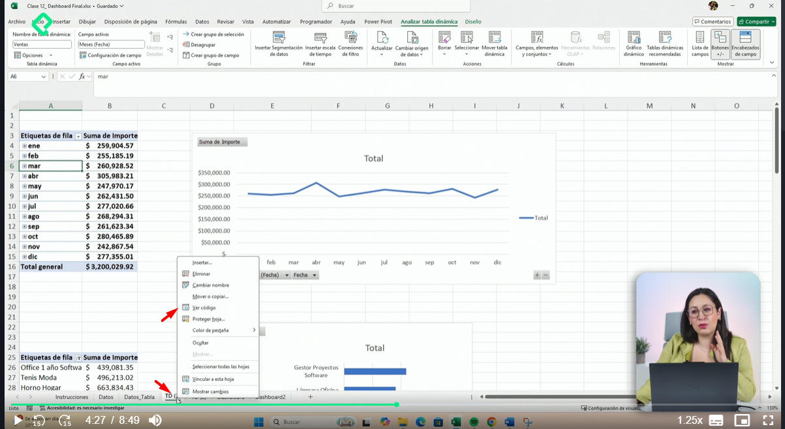

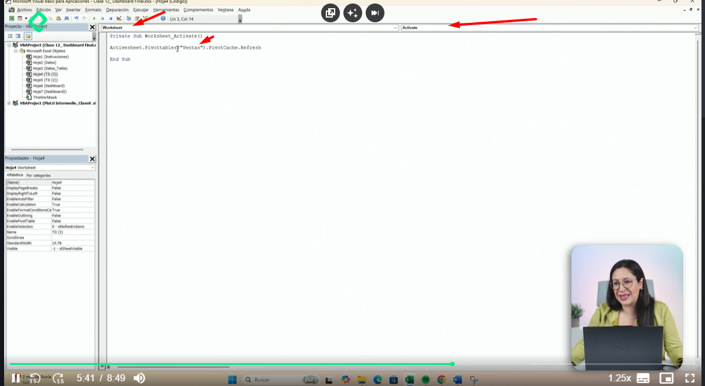

> VERSION DE MACROS 

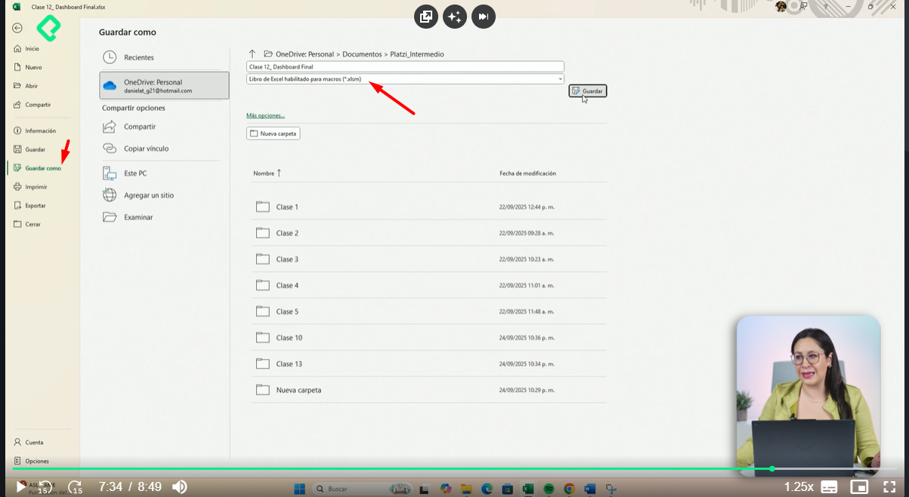

## CLASE 14: Relacionar múltiples archivos Excel con PowerPivot para dashboards 
¿Cómo habilitar PowerPivot en Excel?
Para comenzar, es clave activar el complemento correcto. La habilitación se hace desde las opciones de Excel.

Abre archivo > opciones > complementos.
En administrar, elige Complementos COM y haz clic en ir.
Marca PowerPivot for Excel (y si quieres, Power Map for Excel). Acepta.
Si no aparece la pestaña: cierra y abre Excel, o reinicia el equipo.
¿Dónde encuentro otros orígenes de datos?
En la pestaña PowerPivot, haz clic en administrar.
En la ventana de PowerPivot, elige de otros orígenes.
Puedes conectar archivos de Excel y también sistemas como SAP u Oracle cuando lo requiera tu trabajo.
¿Cómo importar y preparar datos con PowerPivot?
El flujo de importación desde Excel garantiza encabezados correctos y una estructura limpia para relacionar datos.

Selecciona archivo de Excel y haz clic en siguiente.
Define la ruta de acceso con examinar y elige tus archivos (ejemplo: clientes).
Activa usar primera fila como encabezados de columna. Es clave para nombrar campos correctamente.
Finaliza y repite para cada archivo. Verás una pestaña por archivo en la parte inferior.
¿Qué es la vista de datos y cómo validarla?
La vista de datos muestra las tablas importadas con sus columnas tal como fueron cargadas.
Revisa que no aparezcan rótulos genéricos como “columna F” o “columna H”.
Si ves columnas sin nombre: elimina la tabla y vuelve a cargarla activando la opción de encabezados.
¿Cómo relacionar tablas y crear dashboards con tablas dinámicas y segmentadores?
La vista de diagrama facilita unir tablas con campos comunes y construir reportes sin fórmulas como buscarv.

Cambia a vista de diagrama: verás cada tabla como una caja con sus campos.
Identifica un campo llave (por ejemplo, ID cliente) que se repite entre tablas.
Arrastra para crear relaciones. Verás un 1 hacia una tabla y una estrella hacia la otra: es una relación de uno a muchos.
Puedes usar varios campos llave según el caso: ID país, ID transacción, etc.
¿Cómo generar tablas y gráficos dinámicos integrados?
Inserta tabla dinámica desde PowerPivot y elige la plantilla de cuatro gráficos.
Crea visualizaciones cruzando tablas: por ejemplo, ventas por segmento, ventas por preferencias o suma de compras.
Cambia el tipo de visual: gráfico circular, gráfico de anillos u otros formatos según el análisis.
¿Cómo usar segmentadores y controlar conexiones?
Agrega segmentadores de datos desde análisis del gráfico o diseño.
Usa segmentadores en distintos niveles para filtrar varias tablas a la vez.
Ajusta conexiones de informes para que los segmentadores controlen todos los gráficos que necesites.
¿Qué ventajas ofrece PowerPivot al rendimiento?
PowerPivot actúa como un espejo de la información: concentra lo necesario sin duplicar archivos pesados.
Tus libros de Excel se vuelven más ligeros y rápidos, incluso con múltiples fuentes.
Ideal cuando un reporte de ventas o compras se compone de varios archivos y necesitas relacionar datos sin procesos manuales.

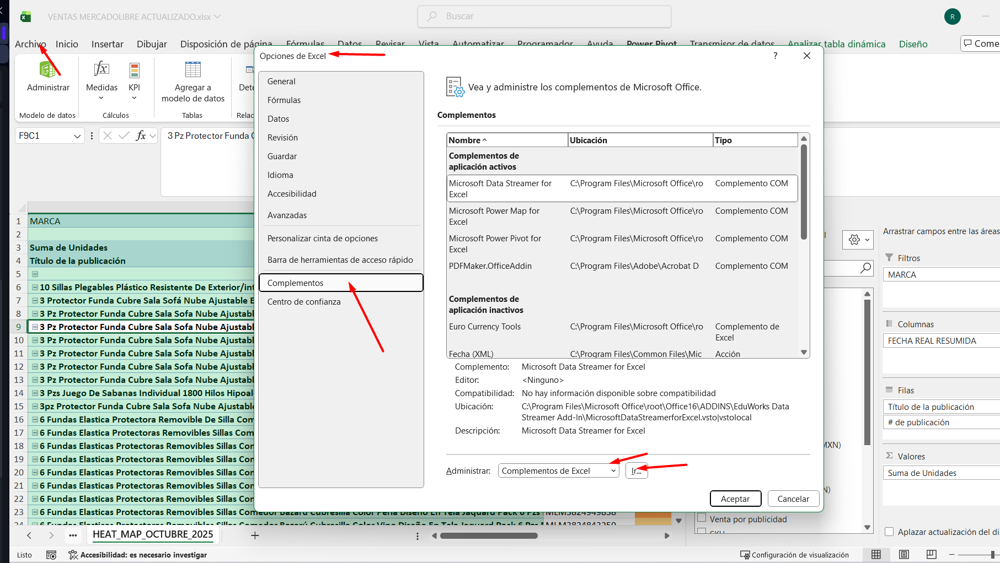
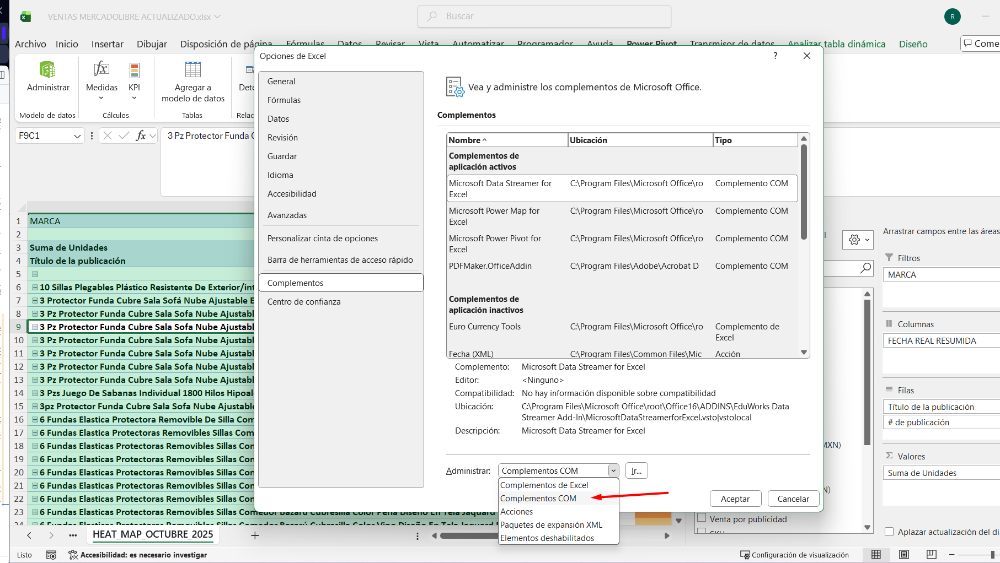


[DASHBOARD](dashboard-final_intermedio.xlsx)


## CLASE 15: Funciones de búsqueda BUSCARV, BUSCARH y BUSCARX en Excel


**¿Cómo aplicar BUSCARV con coincidencia exacta y aproximada?**
La base es identificar el campo llave: un dato que se repite en ambas tablas. Con BUSCARV traes información a partir de ese vínculo y controlas el comportamiento con el último argumento: 0 para coincidencia exacta y 1 para coincidencia aproximada.

Valor buscado: el dato común entre tablas.
Rango o matriz: la tabla donde se busca, fijada con F4.
Indicador de columnas: empieza en 1 desde el inicio del rango.
Coincidencia: 0 exacta, 1 aproximada.
Ejemplos clave:

Búsqueda exacta para producto por referencia: devuelve “gorra” al buscar R003.
=BUSCARV(Referencia, Tabla, 2, 0)
Tramos de impuestos con coincidencia aproximada: trae porcentaje y categoría según monto.
=BUSCARV(Monto, TablaRangos, 2, 1)
=BUSCARV(Monto, TablaRangos, 3, 1)
Consejo práctico: en BUSCARV, el campo llave debe estar a la izquierda del dato que quieres traer. Usa F4 para fijar rangos y poder arrastrar la fórmula sin perder referencias.

**¿Qué es el campo llave y cómo fijar con F4?**
El campo llave es el identificador común entre tablas. Fija el rango con F4 para bloquear filas y columnas, evitar desplazamientos y “correr” la fórmula con confianza.

**¿Cómo traer varias columnas a la vez con BUSCARV?**
Ahorra tiempo devolviendo varias columnas en una sola fórmula usando una matriz constante entre llaves.

>[!NOTE]
> SUPER IMPORTANTE 
ARCHIVO ADJUNTO -> [EJEMPLO DE FORMULAS EXCEL ](FORMULAS_BUSQUEDA.xlsx)  
```
=BUSCARV(ID, Tabla, {2,3,4,9}, 0)

=BUSCARV(L65,$B$65:$I$101,{2,3,4,5},0)

=SUMA(BUSCARV(F109,$B$109:$D$112,{2,3},0))

=BUSCARV(H118&I118,$D$117:$E$170,2,0) => BUSCAR VARIOS CRITERIOS USAMOS EL ´&´
```
Devuelve: apellido, nombre, departamento y tarifa de pago al mismo tiempo.
Ventaja: evitas repetir BUSCARV columna por columna.

**¿Cómo funcionan rangos para impuestos con coincidencia aproximada?**

Cuando el valor exacto no existe en la tabla, BUSCARV con 1 busca el intervalo más cercano por debajo. Úsalo para criterios de impuestos u otros tramos numéricos.

**¿Cómo sumar y usar múltiples criterios con BUSCARV?**
Además de buscar, BUSCARV puede participar en cálculos y búsquedas con más de un criterio. El secreto: anidar funciones y unir criterios con una columna de ayuda.

**¿Cómo anidar SUMA con BUSCARV por columnas específicas?**
Suma varias columnas devueltas por BUSCARV usando una matriz de índices.

```
=SUMA(BUSCARV("laptop", Tabla, {2,3}, 0))
```

Resultado mencionado: 35.400 para “laptop” en 2024 y 2025.
Clave: coincidencia exacta para que encuentre exactamente “laptop”.

**¿Cómo unir criterios con concatenar o ampersand?**
Para buscar por nombre y departamento a la vez, crea una columna de ayuda que concatene ambos criterios con & o CONCATENAR.

```
=BUSCARV(Nombre&Departamento, ColumnaAyuda:Salario, 2, 0)
```
Uso típico: encontrar a Nate Harris en Recursos Humanos y traer el salario.
Resultado mencionado: 70.556.

**¿Cuándo usar BUSCARX y BUSCARH para mayor flexibilidad?**

BUSCARX elimina limitaciones de BUSCARV: ya no exige que el campo llave esté a la izquierda y ofrece manejos de error y modos de coincidencia y búsqueda. BUSCARH aplica la misma lógica de búsqueda, pero con datos en horizontal.

**¿Qué resuelve BUSCARX frente a BUSCARV?**

Con BUSCARX eliges la matriz buscada (donde está el campo llave) y la matriz de vuelta (lo que quieres traer) en cualquier orden. Requiere Excel 365 o versión 2016 o superior.

```
=BUSCARX(Valor, MatrizBuscada, MatrizDeVuelta)

=BUSCARX(M178,$D$178:$D$268,$B$178:$B$268,"NO HAY",0,1) => LAS TRES ULTIMAS SON OCCIONALES YA QUE ESTAN EN [] 
```

No importa si el campo llave está a la derecha o izquierda.
Más robusta, con parámetros opcionales entre corchetes.

**¿Cómo configurar if_not_found, match_mode y search_mode?**

Personaliza el comportamiento sin fórmulas adicionales:

```
=BUSCARX(Valor, MatrizBuscada, MatrizDeVuelta, "no hay dato", 0, 1)

```
if_not_found: texto si no encuentra coincidencias.
match_mode: 0 exacta, opciones para siguiente menor o mayor.
search_mode: desde el primero al último, del último al primero, ascendente o descendente.

**¿Cómo recuperar datos en horizontal con BUSCARH?**
Si los encabezados están en filas, usa BUSCARH. Cambia “indicador de columnas” por indicador de filas.

```
=BUSCARH("fila cuatro", RangoHorizontal, 2, 0)

```

Caso típico: buscar “fila cuatro” y devolver la “meta”.
Igual que BUSCARV: fija el rango con F4 y define coincidencia exacta o aproximada.


## CLASE 16: Función Coincidir para obtener posiciones automáticas en Excel 

**¿Qué resuelve coincidir en búsquedas verticales y horizontales?**

Coincidir devuelve la posición del elemento buscado dentro de un rango, tanto de forma vertical como horizontal. Con el tipo de coincidencia exacta (0), identifica el valor exacto, por ejemplo PQR o un encabezado como ID empleado.

Valor buscado: PQR, ID empleado, ID inventario.
Rango matriz: seleccionar toda la "matricita" donde buscar y fijar con F4.
Coincidencia exacta (0): garantiza que el resultado sea el encabezado o dato exacto.
Resultado: la posición, como 6 al buscar PQR en columnas, u 8 al buscar v, w, x en filas.

**¿Cómo configurar el rango matriz y la coincidencia exacta?**

Selecciona el rango completo donde existan los encabezados o valores objetivo.
Fija el rango: evita que se mueva al copiar la fórmula.
Usa 0 para coincidencia exacta: asegura el match correcto.

**¿Cómo interpretar el resultado de posición?**

Un retorno 6 significa: uno, dos, tres, cuatro, cinco, seis dentro del rango.
En horizontal, un retorno 8 ubica la columna/posición para extraer datos.
Coincidir casi nunca va sola: suele anidarse para informar el número de fila o columna a otra función de búsqueda.

**¿Cómo se integra coincidir con índice para coordenadas dinámicas?**

Índice recibe una matriz de datos (tu “carnita” sin encabezados) y requiere dos números: número de fila y número de columna. Coincidir entrega ambos, como si fuera una coordenada de ajedrez: vertical para el mes y horizontal para la tienda.

Matriz: seleccionar solo los datos, sin encabezados verticales ni horizontales.
Número de fila (mes): Coincidir con "abril" y coincidencia exacta.
Número de columna (tienda): Coincidir con "tienda siete" y coincidencia exacta.
Funciones anidadas: colocar cada Coincidir directamente dentro de Índice para que todo sea dinámico.

**¿Cómo crear la coordenada con dos coincidir?**

Coincidir del mes devuelve la fila exacta.
Coincidir de la tienda devuelve la columna exacta.
Índice usa ambos resultados y regresa el valor correcto que cambia al seleccionar otro mes o tienda.

**¿Cómo aplicarlo con buscar v y validación de datos?**

El flujo completo parte de listas, pasa por Coincidir y termina en buscar V o Índice, según prefieras. La clave es que el número de columna dependa de Coincidir, o que Índice reciba fila y columna desde dos Coincidir.

**¿Cómo crear listas con validación de datos?**

Ir a datos > validación de datos > lista.
En origen, seleccionar todos los productos (tiendas) y aceptar.
Repetir para los meses.
Con esto, elegir tienda cinco o cualquier tienda y cualquier mes hará que los datos cambien de forma dinámica.

**¿Cómo comparar buscar v + coincidir vs índice + coincidir?**

buscar V + Coincidir: Coincidir define el número de columna según el mes seleccionado; buscar V usa 0 para coincidencia exacta y el rango con F4.
Índice + Coincidir: la matriz es la “carnita” sin encabezados; un Coincidir define la fila (mes) y otro la columna (tienda), ambos con 0.
Ambos devuelven la misma cantidad al elegir, por ejemplo, tienda tres y abril, y cambian al modificar las listas.

Consejos prácticos.

Fija rangos con F4 para evitar desplazamientos.
Excluye encabezados al definir la matriz de Índice.
Usa coincidencia exacta (0) en todos los Coincidir de este escenario.
Anida Coincidir para automatizar fila y columna sin conteos manuales.

## CLASE 17: Funciones SI avanzadas: conjunto, anidado y combinaciones Y/O
¿Qué resuelven las funciones lógicas avanzadas en Excel?
Estas funciones permiten asignar una categoría o cálculo según un criterio. La base es la prueba lógica: comparar con signos >, <, >=, <=, = o <>. Con esto defines rangos y devuelves un valor si verdadero claro, como “super estrella”, “cumplido” o “en riesgo”.

¿Cómo funciona la prueba lógica y el valor si verdadero?
Usa comparaciones como mayor o igual a 1.2 (120%), 1 (100%) y 0.8 (80%).
Si el valor es >= 1.2: devuelve “super estrella”. Si es >= 1: “cumplido”. Si es >= 0.8: “en riesgo”.
Datos fuera de rango pueden generar ND (valor no disponible) cuando no cumplen ninguna condición.
Para evitar ND, agrega al final una condición con verdadero y devuelve “incumplido”.
El valor si verdadero puede ser texto o un cálculo: por ejemplo, sumar, multiplicar o ajustar metas.
¿Por qué el orden importa en estas funciones?
Excel evalúa en secuencia: si no entra en la primera condición, pasa a la siguiente.
El orden define qué condición gana cuando varias podrían aplicar.
Diseña de mayor a menor prioridad para resultados consistentes.
¿Cómo usar si conjunto para clasificar por criterios múltiples?
Con si conjunto aplicas varias reglas en una sola fórmula. Ejemplo de clasificación por cumplimiento: >= 120% “super estrella”, >= 100% “cumplido”, >= 80% “en riesgo”. Cierra siempre tus paréntesis para evitar errores.

¿Cómo manejar casos fuera de rango y errores ND?
Si hay valores como 79% o 67%, no entran en ninguna regla y aparece ND.
Solución directa: añade al final la condición verdadero y devuelve “incumplido”.
Así cubres todos los casos posibles y evitas errores visibles al usuario.
¿Qué diferencia hay frente a un si anidado?
Si anidado replica la lógica de si conjunto, pero encadenando un SI dentro de otro en cada caso contrario.
Ofrece el mismo resultado, pero suele ser más largo y complejo de leer.
Recomendación práctica: usa si conjunto si hay muchas opciones; con hasta tres condiciones, un si anidado es viable.
¿Cuándo elegir si con y u o para comisiones?
Cuando necesitas evaluar ventas y antigüedad, elige entre y (todas las condiciones a la vez) u o (basta una). En inglés: and y or. El caso mostrado usa ventas > 10,000 y meses en la empresa > 4 para definir “comisión mayor” o “comisión menor”.

¿Cómo construir si con y para una comisión mayor o menor?
Estructura: si(y(condición_ventas, condición_meses), “comisión mayor”, “comisión menor”).
Solo si se cumplen todas las condiciones regresa “comisión mayor”. De lo contrario, “comisión menor”.
Puedes devolver cálculo en lugar de texto: monto de ventas por porcentaje de comisión mayor; de lo contrario, monto por comisión menor.
Si usas referencias a porcentajes fijos, recuerda fijarlas para que no cambien al replicar la fórmula.
¿Cómo cambia si con o cuando basta una condición?
Estructura: si(o(condición_ventas, condición_meses), “comisión mayor”, “comisión menor”).
Con o, basta que se cumpla una condición para obtener la comisión mayor.
La diferencia es clara al arrastrar la fórmula: con y hay menos casos con comisión mayor; con o aparecen más porque el umbral es más flexible.

>[!NOTE]
> Hoja de Ejemplo
> 

[Conjunto](CONJUNTO_ANIDADO_CONBINADOS.xlsx)

## CLASE 18: Manejo de errores en Excel con SI.ERROR y SI.ND

**¿Qué errores de Excel y por qué aparecen?**
Comprender el motivo evita diagnósticos erróneos. No es que Excel “esté mal”: el mensaje indica una condición específica que debes revisar.

- #DIV/0!: división entre cero o celda vacía en el denominador. Revisa la referencia del divisor.
- #N/D!: no hay un valor disponible. Sucede en cruces o búsquedas como BUSCARV cuando el dato no existe en la tabla.
- #REF!: referencia eliminada. Borraste celdas usadas en la fórmula y Excel “pierde” el origen.
- #VALOR!: tipos incompatibles en una operación. Ejemplo: multiplicar un texto por un número o números con formato de texto.
- #NOMBRE?: nombre de función mal escrito. Si pones “SUMAR.SI.CON” en lugar de “SUMAR.SI.CONJUNTO”, falla aunque la estructura sea correcta.
- #NUM!: cálculo inválido. Ejemplo: raíz de un número negativo.
- Nulo: intersección no válida entre rangos.
- Desbordamiento: una fórmula matricial devuelve más celdas de las disponibles o se cruza con otros datos.
- Signos de gato (####): no es un error. La celda no tiene ancho suficiente para mostrar el número o la fecha completa.


**como**
- =SI.ERROR(BUSCARV(B10,$H$10:$I$24,2,0),"Dato no encontrado")
- =SI.ND(BUSCARV(B10,$H$10:$I$24,2,0),"Error ND")

## CLASE 19: Instalación y uso de Solver en Excel para optimización

**¿Para qué usar Solver de Excel en optimización con restricciones?**

Solver es ideal cuando necesitas maximizar una ganancia, minimizar costos o alcanzar un valor específico, siempre con límites que no puedes violar. En el ejemplo, se busca la mejor combinación de pasteles de plátano y zarzamora con restricciones de producción diaria, masa disponible y tope por tipo.

- Problemas típicos: capacidad, inventario, presupuesto o crédito.
- Objetivos posibles: maximizar, minimizar o igualar a un valor.
- Beneficio clave: encuentra el número óptimo respetando todas las restricciones.


**¿Cómo instalar y activar el complemento Solver en Excel?**

Antes de usarlo, hay que activar el complemento para que aparezca en la pestaña Datos.

- Ve a archivo > opciones > complementos.
- En administrar, elige complementos de Excel y pulsa ir.
- Marca la casilla Solver y acepta.
- Revisa en datos: debe aparecer Solver en el bloque de análisis.
- Si no aparece: cierra Excel, reinicia si hace falta y vuelve a abrir.

**¿Cómo configurar el modelo en Solver para maximizar la ganancia?**

El caso: dos pasteles, plátano y zarzamora. Datos clave: plátano usa 0.250 kg de masa y gana 100 pesos; zarzamora usa 0.500 kg y gana 130 pesos. Restricciones: máximo 150 pasteles al día, como tope adicional 90 por tipo, y masa total disponible de 50 kg. Además, las cantidades deben ser enteras.

**¿Cuál es el objetivo de optimización?**

- Objetivo: maximizar la ganancia.
- Fórmula: ganancia plátano por cantidad de plátano + ganancia zarzamora por cantidad de zarzamora.
- Clave: la celda objetivo debe tener la fórmula ya escrita para que Solver pueda evaluarla.
- Alternativas: puedes seleccionar minimizar o establecer igual a un valor específico si el problema lo requiere.

**¿Qué celdas varían como variables de decisión?**

- Variables: cantidades a producir de cada pastel (por ejemplo, X para plátano y Y para zarzamora).
- En el modelo, Solver cambia esas celdas para cumplir restricciones y optimizar el objetivo.

**¿Qué restricciones deben cumplirse?**

- Capacidad diaria: total de pasteles ≤ 150.
- Límite por tipo: plátano ≤ 90 y zarzamora ≤ 90.
- Masa máxima: 0.250 × plátano + 0.500 × zarzamora ≤ 50 kg.
- Naturaleza de la decisión: variables deben ser enteras (no se producen fracciones de pastel).
- En la ventana de restricciones puedes usar: mayor que, menor que, igual. También tipos: entero, binario o diferente.
- Para agregar restricciones: pulsa agregar, selecciona la celda y elige la condición adecuada.

**¿Qué método y qué solución entrega Solver?**

- Modelo: con nonlinear funciona bien para este planteamiento.
- Proceso: define el objetivo, señala las celdas variables, agrega restricciones y pulsa resolver.
- Resultados: se muestra la ventana de resultados de Solver y puedes aceptar para escribir los valores óptimos.
- Interpretación del óptimo: produce el máximo de plátano permitido y 55 de zarzamora para alcanzar la ganancia máxima.
- Restricciones activas: la masa llega al tope de 50 kg y el total de pasteles queda en 145 unidades. La masa es la limitante principal.
- Mejora del escenario: si aumentas la masa disponible, la siguiente limitante puede ser el total de pasteles diarios.


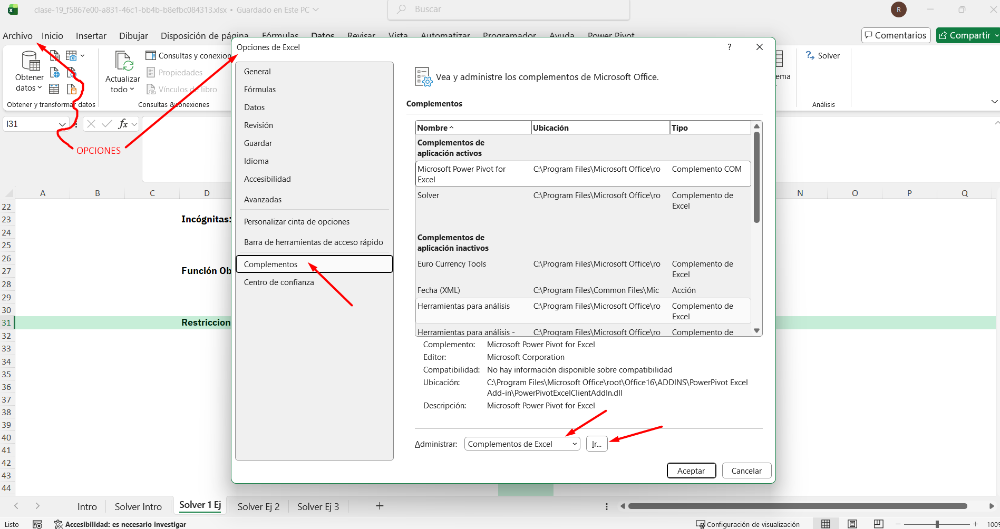

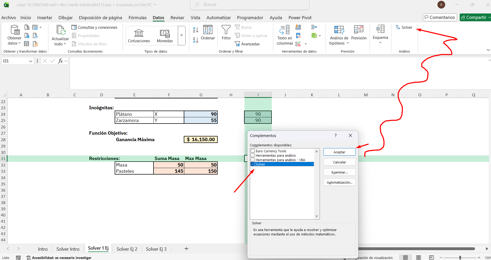


## CLASE 20: Consolidación automática de archivos con Power Query

**¿Qué es Power Query y por qué ahorra tiempo?**
Power Query es una herramienta de automatización y limpieza de datos integrada en Excel, y también disponible en Power BI. Permite conectarte a diversas fuentes, aplicar pasos de transformación y cargar resultados sin repetir procesos manuales. El valor está en la conexión: piénsalo como un “tubito” desde tu fuente de origen hacia Excel, siempre listo para actualizar.

Escenario típico: recibes archivos con registros similares y necesitas concentrarlos para un reporte. Antes tomaba horas; con Power Query, basta usar el menú de datos > obtener datos > de un archivo > de una carpeta. Al combinar, se genera una vista previa y luego se puede cargar en una tabla, tabla dinámica o gráfico dinámico en una hoja nueva. En el ejemplo, se integraron ventas del 2024 desde el mes uno hasta el mes cinco y se mostraron ocho mil ciento setenta y dos filas consolidadas.

Habilidades y conceptos clave que practicas: - Automatización de procesos: un flujo que se repite sin rehacer pasos. - Limpieza y combinación de datos: unificar archivos con las mismas columnas. - Conexión desde carpeta: mantener una ruta única para agregar nuevos archivos. - Carga eficiente: elegir entre tabla, tabla dinámica o gráfico dinámico. - Actualización de consultas: reflejar cambios con el botón actualizar.

**¿Cómo combinar archivos desde una carpeta en Excel?**
Sigue este flujo para unir archivos con las mismas columnas y ahorrar tiempo.

Ir a datos > obtener datos > de un archivo > de una carpeta.
Seleccionar la carpeta con los archivos a combinar.
Elegir combinar y cargar o combinar y cargar en.
Revisar la vista previa y dar aceptar.
Decidir dónde cargar: tabla, tabla dinámica, gráfico dinámico o hoja nueva.
Verificar el resultado: se muestran todas las filas consolidadas de los meses integrados.
Detalles importantes para no fallar: - Los archivos deben tener exactamente las mismas columnas. - Mantén todos los archivos en la misma carpeta. - Observa el panel lateral: indica cuántas filas se cargaron para comprobar consistencia.

**¿Qué buenas prácticas aseguran datos actualizados?**
La clave es la conexión desde una carpeta. Cuando agregues el mes seis, siete u ocho en esa misma ruta, solo presiona actualizar en Power Query y los datos nuevos aparecerán en tu Excel. Este enfoque asegura que cada cambio en la fuente se refleje en tu reporte, sin importar la frecuencia.

Buenas prácticas recomendadas: - Usar una carpeta exclusiva para los archivos del proceso. - Nombrar archivos con un patrón consistente por mes o periodo. - Validar el conteo de filas tras actualizar (ejemplo: ocho mil ciento setenta y dos filas cargadas). - Elegir el tipo de carga adecuado según el análisis: tabla para detalle, tabla o gráfico dinámico para análisis.

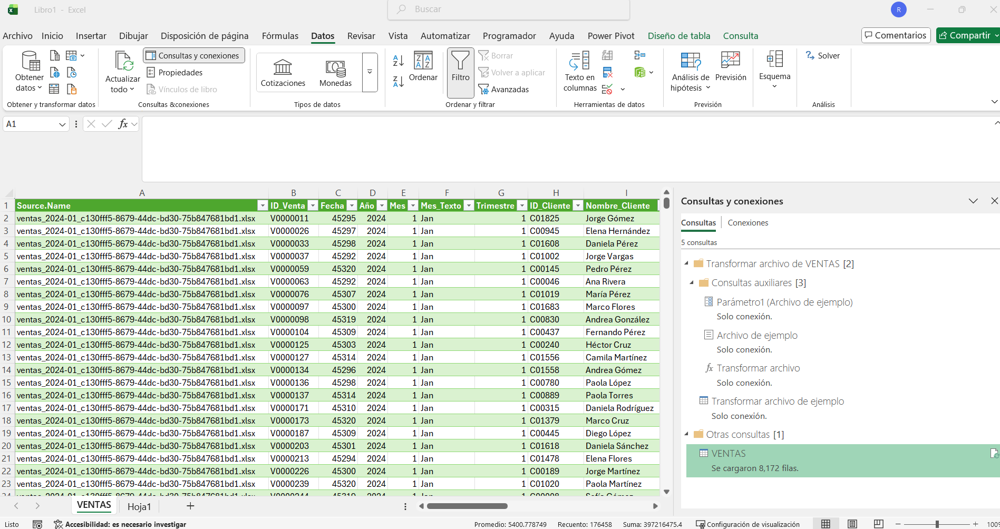


## CLASE 21: Limpieza automática de datos con Power Query desde carpetas

¿Cómo automatizar la limpieza con Power Query desde una carpeta?
Conecta la carpeta que contiene los archivos por año para unificar y transformar todo en un flujo reproducible. El ejemplo usa 2017 y 2018, dejando 2019 y 2020 para probar la actualización automática.

Ir a Excel: datos > obtener datos > desde archivo > desde una carpeta.
Seleccionar la carpeta con 2017 y 2018. Abrir.
Elegir combinar y transformar en para editar antes de cargar.
En el editor, revisar los pasos aplicados: cada acción queda registrada como una “receta”.
La estructura de carpeta importa: nuevos años heredarán la misma limpieza de datos.
¿Qué diferencias hay entre transformar y agregar columna?
Transformar: edita sobre la misma columna. Ideal para dividir, cambiar tipo o limpiar texto.
Agregar columna: crea un nuevo resultado sin alterar el original. Útil para cálculos y derivados.
Ejemplos: extraer el nombre con columna a partir de ejemplos (agregar). Dividir por delimitador (transformar). Multiplicar campos (agregar).
¿Por qué importan el orden y la vista previa?
En operaciones con fechas, el orden de selección es clave: primero fecha de entrega, luego fecha de orden para restar días correctamente.
La vista previa muestra ~mil filas: sirve para validar la transformación sin cargar todo.
¿Qué transformaciones limpian cabeceras y texto de forma rápida?
Cuando las cabeceras llegan en dos filas, Power Query permite arreglarlo sin fórmulas complejas.

Quitar el paso automático de encabezados promovidos si las cabeceras están mal.
Transponer, combinar las columnas 1 y 2 con separador espacio para un solo encabezado, y transponer de nuevo.
Usar usar la primera fila como encabezados para fijar las cabeceras correctas.
Dividir columna por delimitador personalizado en “modo de envío - contenedor”: usar espacio - guion - espacio.
Renombrar: “modo de envío” y “contenedor”.
Filtrar los valores no válidos: “not specified” o “no hay dato específico”.
Si aparece error por nombres cambiados, quitar el paso tipo cambiado y aplicar al final detectar tipo de datos.
Verifica iconos ABC/123. Ajusta “porcentaje de descuento” a porcentaje si se marcó como número.
¿Cómo extraer solo el nombre con columna a partir de ejemplos?
Seleccionar la columna de nombre completo.
Ir a agregar columna > columna a partir de ejemplos.
Escribir solo el nombre, por ejemplo “Robert”, y confirmar la sugerencia automática.
Aceptar y renombrar la columna. Evitas múltiples funciones de texto.
¿Cómo calcular métricas y cargar datos para análisis en Excel?
Calcula indicadores clave y deja todo listo para tablas dinámicas o dashboards.

Importe venta: seleccionar “cantidad” y “precio por unidad” con Ctrl > agregar columna > estándar > multiplicar. Renombrar.
Días de entrega: seleccionar “fecha de entrega”, luego Ctrl “fecha de orden” > fecha > restar días. Renombrar.
Detectar tipo de datos: seleccionar todas las columnas > transformar > detectar tipo de datos.
Ajustar formatos: cambiar descuento a porcentaje y sustituir la actual.
Cerrar y cargar en: cargar como tabla en Excel para analizar y refrescar con un clic.
Agregar 2019 y 2020 a la misma carpeta: la actualización automática aplicará todos los pasos de limpieza y actualizará tus tablas dinámicas o dashboard.


## CLASE 22:  Integración de Power Query con tablas dinámicas y dashboards
¿Cómo crear una tabla dinámica y gráfico dinámico para tu dashboard?
Comienza estructurando la vista de análisis con campos clave y un visual simple. Esto te da claridad inmediata y base para automatizar después.

Ir a insertar: tabla dinámica en nueva hoja de cálculo.
Poner fecha de orden en filas.
Poner modo de envío en columnas.
Poner importe de venta en valores.
Aplicar formato para que los números sean legibles.
Agregar un gráfico dinámico sencillo para comparar por periodo y envío.
¿Qué campos y visuales importan para el análisis?
Fecha de orden: permite comparar periodos y ver tendencias.
Modo de envío: segmenta resultados por canal logístico.
Importe de venta: concentra el indicador financiero prioritario.
Gráfico dinámico: comunica variaciones de forma inmediata.
¿Qué hace la magia de Power Query al actualizar datos?
La magia de Power Query está en que, al agregar archivos nuevos a la carpeta origen, todos pasan por el mismo proceso de limpieza diseñado al inicio. Así, los datos se integran a tu modelo sin repetir trabajo manual y se reflejan en tus visuales tras actualizar.

Copiar a la carpeta los archivos del periodo que necesites.
Ir a Excel y pulsar actualizar.
Verificar cómo aumenta el volumen: de cerca de 3,000 filas a 6,727 tras integrar nuevos años.
Actualizar la tabla dinámica y el gráfico dinámico para ver los nuevos periodos.
¿Qué problemas resuelve el proceso de limpieza?
Cabeceras inconsistentes: estandariza nombres como importe total.
Cálculos faltantes: incorpora la diferencia de los días u otros campos derivados.
Consolidación: une múltiples archivos con mismo esquema en una sola tabla confiable.
Automatización: cada archivo agregado repite la limpieza en segundos.
¿Cómo integrar Power Query con tu dashboard interactivo?
Cada visual del tablero puede venir de una tabla dinámica conectada a una tabla que, a su vez, se alimenta de Power Query. En lugar de depender de un solo archivo estático, conectas directamente a la carpeta con tus fuentes. Luego, solo das actualizar en las tablas dinámicas y el cambio se refleja en el dashboard.

Flujo recomendado: carpeta de archivos → Power Query con limpieza → tablas → tablas dinámicas → dashboard.
Beneficios clave: consistencia de columnas, cálculo de campos faltantes, unión de periodos, actualización centralizada.
Resultado práctico: integrar dos años adicionales u otros periodos sin rehacer pasos.


## Resumen 

1.
Una cadena de tiendas configura una tabla dinámica con las sucursales en las columnas ('Centro', 'Norte', 'Sur') y los productos en las filas. Si el objetivo es identificar qué producto es relativamente más importante para las ventas *dentro de la sucursal Norte específicamente*, ¿qué cálculo de porcentaje es el más adecuado?
Diferencia con respecto al valor anterior.
**REPASAR**

2.
Un analista intenta agrupar datos de ventas por mes en una tabla dinámica, pero la opción 'Agrupar Campo' está deshabilitada (en gris). ¿Cuál es la causa más probable de este problema?
La tabla dinámica necesita ser actualizada porque se agregaron nuevos datos de ventas.
**REPASAR**

3.
Un gerente desea comparar las ventas mensuales de 2023 con las de 2022. Al crear la tabla dinámica, Excel agrupa automáticamente las fechas por Años, Trimestres y Meses. ¿Cuál es el diseño más efectivo en la tabla dinámica para facilitar esta comparación directa?
Usar el campo 'Años' como Filtro de Informe y seleccionar un año a la vez para verlo.
Colocar tanto 'Años' como 'Meses' en el área de Filas, con 'Años' encima de 'Meses'.

**REPASAR**

4.
Estás diseñando un dashboard y has añadido un segmentador para una lista de 20 productos, lo que resulta en una larga lista vertical que ocupa mucho espacio en la pantalla. ¿Cuál es la estrategia de personalización más efectiva para presentar estos botones de forma profesional y compacta?
Ajustar la configuración de columnas del segmentador a 4 o 5 para crear una cuadrícula ordenada en lugar de una lista.

5.
¿Cuál es la ventaja principal de utilizar segmentadores de datos en un informe de Excel en lugar de los filtros tradicionales del menú desplegable?
Facilitan un filtrado visual e interactivo, convirtiendo los filtros ocultos en controles accesibles.

6.
¿Cuál es la ventaja principal de utilizar una escala de tiempo en lugar de un segmentador de datos tradicional al analizar datos por fechas en Excel?
Se especializa en el filtrado por períodos temporales, ofreciendo niveles integrados como años, trimestres, meses y días.

7.
Un analista ha creado un dashboard con dos tablas dinámicas y un gráfico dinámico que provienen de la misma fuente de datos. ¿Qué acción debe realizar para que una única escala de tiempo filtre los datos de los tres elementos de manera sincronizada?
Hacer clic derecho en la escala de tiempo y usar la opción "Conexiones de informe" para vincularla a ambas tablas dinámicas.

8.
Un gerente te pide un análisis del rendimiento de ventas durante el verano de 2023 (junio a agosto). Usando un dashboard que ya tiene una escala de tiempo conectada, ¿cuál es el método más eficiente para aislar y presentar estos datos?
En la vista de 'Meses' de la escala de tiempo, hacer clic en 'Junio' y arrastrar el control de rango hasta 'Agosto'.


9.
Un analista de datos utiliza la fórmula =BUSCARV(A5; Productos!A:D; 3; FALSO) para traer el precio de un producto. Sin embargo, para varios códigos de producto que sabe que existen en la tabla 'Productos', la fórmula devuelve el error #N/A. ¿Cuál es la causa más probable de este error si la sintaxis de la fórmula es correcta?
Existen inconsistencias en los datos, como espacios adicionales o diferencias de mayúsculas y minúsculas entre el código buscado y el catálogo.


10.
Un analista recibe informes de ventas mensuales en archivos CSV separados por región. ¿Cómo facilitaría Power Query la tarea de consolidar y limpiar estos datos para un informe anual de manera eficiente?

Permitiendo automatizar los pasos de conexión, combinación y limpieza, que se pueden reutilizar cada mes.

11.
Una empresa utiliza tanto Microsoft Excel como Power BI. ¿En cuál de estos entornos es posible acceder y utilizar el Editor de Power Query y con qué propósito?
En ambos; en Excel para preparar datos para hojas de cálculo y en Power BI para preparar datos para los modelos y visualizaciones.


12.
Un gerente de ventas quiere analizar el desempeño de su equipo. Necesita identificar rápidamente qué vendedores están por debajo de la meta de 5,000 euros (alerta roja), quiénes están cerca de la meta entre 5,000 y 7,000 euros (alerta amarilla), y quiénes la han superado ampliamente con más de 7,000 euros (señal verde). ¿Qué herramienta de formato condicional es la más adecuada para esta categorización específica?

- Un conjunto de reglas "Mayor que" y "Menor que" para definir los tres umbrales de color (rojo, amarillo, verde).

13.
Si el objetivo principal es identificar patrones y concentraciones de valores altos o bajos en un gran conjunto de datos, como temperaturas registradas durante un mes en un mapa de una región, ¿por qué serían las "Escalas de color" una opción más efectiva que las "Barras de datos"?

- Porque las escalas de color crean un "mapa de calor" que permite al cerebro detectar tendencias y zonas de concentración visualmente, mientras que las barras de datos se centran en la magnitud individual de cada celda.


14.
Usted está creando un dashboard para la dirección que debe comunicar el estado de las ventas regionales de un vistazo. Las ventas por debajo de 50,000 pesos deben ser evidentes de inmediato como un problema crítico. ¿Qué enfoque de formato condicional comunica esta información de la manera más directa e instantánea?
Aplicar una regla "Menor que 50,000" para colorear las celdas correspondientes con un fondo rojo sólido.

15.
Para configurar un dashboard que será utilizado por 50 vendedores, se requiere que solo puedan modificar la celda B5 y usar los segmentadores de datos, pero no alterar nada más. ¿Cuál es la secuencia correcta de pasos para lograr esta configuración de seguridad?
Proteger la hoja, luego desbloquear la celda B5 y finalmente habilitar el uso de tablas y gráficos dinámicos.

**REPASAR**

16.
¿Cuál es el propósito principal de proteger una hoja de Excel sin establecer una contraseña?

- Funciona como una barrera para prevenir cambios accidentales, pero permite a los usuarios autorizados hacer modificaciones intencionadas fácilmente.

17.
¿Por qué el método de 'Obtener datos' > 'De una carpeta' en Power Query es considerado una forma poderosa de automatización, según los principios demostrados en la clase?

Porque convierte automáticamente los datos en un informe de tabla dinámica como paso final obligatorio.
Porque limpia los datos automáticamente, eliminando todas las filas duplicadas y celdas vacías sin intervención del usuario.

**REPASAR**

18.
Dentro de una tabla de Excel, ¿qué indica el uso del símbolo de arroba (`@`) en una fórmula como `=[@cantidad]*[@precio_unitario]`?

- Indica que la operación utiliza los valores de las columnas especificadas (`cantidad` y `precio_unitario`) únicamente de la fila actual.

19.
Al anidar la función COINCIDIR dentro de BUSCARV, como en la fórmula `BUSCARV(valor, matriz, COINCIDIR(...), 0)`, ¿qué problema específico se está resolviendo?
Se obliga a BUSCARV a buscar por fila en lugar de por columna.

**REPASAR**

20.
Un analista necesita crear un reporte en Excel que extraiga un valor de ventas específico de una gran tabla. El reporte debe permitir al usuario seleccionar dinámicamente tanto el mes (criterio de fila) como la tienda (criterio de columna) desde listas desplegables. ¿Qué combinación de funciones, según lo visto en clase, es la más flexible y adecuada para esta búsqueda bidireccional?

La función ÍNDICE anidada con dos funciones COINCIDIR.


21. Has conectado una escala de tiempo a dos tablas dinámicas: una muestra las ventas por mes y la otra las ventas por categoría de producto. Al seleccionar 'Diciembre 2023', la tabla de ventas por mes se actualiza correctamente, pero la de categorías sigue mostrando el total de todos los años. ¿Qué debes verificar primero para solucionar este problema de sincronización?

Las 'Conexiones de informe' de la escala de tiempo para asegurarse de que ambas tablas dinámicas estén seleccionadas.

22. Has construido un dashboard con una tabla dinámica y dos gráficos. Al usar el segmentador de 'Producto', notas que solo la tabla dinámica se actualiza, mientras que los gráficos permanecen estáticos. ¿Cuál es la causa más probable de este problema?

Los gráficos no están vinculados al segmentador a través de la opción 'Conexiones de informe'.

23. ¿Cuál es el propósito fundamental de utilizar el formato condicional para crear un "semáforo de datos" en una hoja de cálculo?

- Facilitar un análisis visual instantáneo de los datos, permitiendo una rápida interpretación sin cálculos mentales.


24. Una tienda minorista observa que el 45% de sus ingresos anuales se genera en el cuarto trimestre (octubre-diciembre). Basándose en este análisis temporal, ¿cuál es la decisión de negocio más lógica y directa a tomar?

- Aumentar la inversión en marketing y gestionar los niveles de inventario en los meses previos al cuarto trimestre.

25. Un analista protege una hoja de trabajo y recibe un reporte de que nadie puede usar los filtros de una tabla dinámica. Al revisar, confirma que la casilla 'Usar tablas y gráficos dinámicos' está activada. ¿Qué otra opción de permiso, si está desactivada, podría impedir el uso de los filtros?

- 'Seleccionar celdas bloqueadas'

26. Si el objetivo es preparar datos para un análisis posterior, ¿qué define a Power Query como una herramienta de ETL?

- Su capacidad para Extraer datos de fuentes, Transformarlos mediante limpieza y combinación, y Cargarlos en un modelo de datos o una hoja de cálculo.

27. ¿Cuál es el propósito principal de la función "Mostrar valores como" en una tabla dinámica, según lo descrito en la clase?

- Transformar la visualización de datos numéricos, como sumas, en diferentes perspectivas, como porcentajes, sin alterar los datos originales.


28. Un analista de inventario establece una regla de formato condicional para colorear de amarillo las celdas con menos de 
20 unidades de un producto. Si posteriormente cambia manualmente el color de una celda que contiene "15" a verde, ¿qué ocurrirá si el valor de esa misma celda se actualiza a "12"?

La celda volverá a ser amarilla porque la regla de formato condicional se reevalúa y tiene prioridad sobre el formato manual.

29. Un gerente desea un KPI que muestre las ventas totales en un período específico, pero únicamente de la categoría 'Electrónica' y realizadas por el vendedor 'Juan'. La estructura de datos contiene columnas para Fecha, Vendedor, Categoría y Monto. ¿Qué fórmula permitiría este cálculo de forma directa?

- =SUMAR.SI.CONJUNTO(Monto, Fecha, '>='&D1, Fecha, '<='&D2, Vendedor, 'Juan', Categoría, 'Electrónica')

30. Un analista de ventas necesita responder la siguiente pregunta de negocio: "¿Cuál fue el total de ventas para cada categoría de producto en cada región?". Si su tabla de datos contiene las columnas 'Producto', 'Categoría', 'Región' y 'Ventas', ¿cuál es la configuración correcta de áreas en la tabla dinámica para responder a esta pregunta?

'Categoría' en el área de Filas, 'Región' en el área de Columnas, y 'Suma de Ventas' en el área de Valores.

31. ¿Cuál es la ventaja más significativa de basar una tabla dinámica en una 'Tabla de Excel' (creada con Ctrl+T) en lugar de un rango de celdas estático?

El rango de origen se vuelve dinámico, expandiéndose automáticamente para incluir nuevas filas o columnas que se añadan a la tabla.


32. Has creado un dashboard con una tabla dinámica de ventas por producto y un gráfico dinámico de ventas por región. ¿Cómo puedes configurar el dashboard para que un solo segmentador de 'Año' actúe como un 'control maestro' que filtre ambos elementos simultáneamente?

- Haciendo clic derecho en el segmentador de 'Año' y usando la opción 'Conexiones de informe' para vincularlo tanto a la tabla como al gráfico.

33. Un gerente de ventas reporta que, tras proteger un nuevo dashboard, los segmentadores de datos (slicers) han dejado de funcionar, pero aún puede editar la celda B5 que se dejó habilitada para ingresar una tasa de crecimiento. ¿Cuál es la causa más probable de este fallo específico?


**REPASAR**

 34. Un analista de datos ha configurado una macro para actualizar automáticamente una tabla dinámica llamada "VentasRegionales" cada vez que se activa su hoja. Sin embargo, al probarla, la tabla dinámica no refleja los datos nuevos que se han añadido a la fuente de origen. Sabiendo que los datos de origen ya están en formato de tabla y que el archivo está guardado como .xlsm, ¿cuál de las siguientes opciones representa la causa más probable de este problema según lo visto en la clase?

La opción "Actualizar al abrir el archivo" está deshabilitada en las opciones de la tabla dinámica.
 **REPASAR**

 35. ¿Cuál es el propósito principal de utilizar una tabla dinámica en Excel?

- Resumir, agrupar y analizar grandes volúmenes de datos para obtener insights sin necesidad de usar fórmulas complejas.

 36. ¿Cuál es el propósito principal de la función COINCIDIR en Excel, según lo explicado en la clase?
Devolver la posición numérica de un valor dentro de un rango de celdas.

- 

 37. ¿Cuál es la principal ventaja de utilizar un KPI independiente en lugar de una tabla dinámica para un informe ejecutivo de ventas, según la analogía del 'velocímetro de un coche'?

- Ofrece un valor único, enfocado y de rápida interpretación para facilitar decisiones gerenciales inmediatas.

38. ¿Cuál es la función principal de las celdas auxiliares D1 y D2 en la creación de un KPI de ventas mensuales dinámico?
Servir como un puente dinámico que recibe las fechas de inicio y fin del segmentador de períodos y las pasa a la fórmula.


39. Un usuario crea un dashboard con un gráfico de ventas por región y una tabla de ventas por vendedor, ambos derivados de la misma tabla de datos. Inserta un segmentador de 'Producto' pero observa que solo filtra el gráfico. ¿Qué acción específica debe realizar para que el segmentador también filtre la tabla?

- Hacer clic derecho en el segmentador, seleccionar 'Conexiones de informe' y activar la casilla de la tabla dinámica de ventas por vendedor.


40. ¿Por qué se describe la escala de tiempo como un "control maestro" en el contexto de un dashboard de análisis temporal?

- Porque centraliza el filtrado de fechas para múltiples elementos (tablas y gráficos), permitiendo una exploración sincronizada.

41. Un gerente te pide un informe de ventas que incluye el nombre del vendedor, pero tu tabla de transacciones solo tiene el ID del vendedor. ¿Qué combinación de funciones es la más robusta para presentar un informe limpio y profesional que muestre un mensaje claro si un ID de vendedor no se encuentra en el catálogo?

- Anidar la función BUSCARV dentro de una función SI.ERROR para reemplazar los errores #N/A con un texto personalizado.

42. Un analista ha creado un dashboard con tres tablas dinámicas y dos gráficos dinámicos. ¿Cómo puede configurar un único segmentador de 'Región' para que filtre simultáneamente todos estos cinco elementos y cree una experiencia unificada?

- Usando la opción 'Conexiones de informe' del segmentador para vincularlo a todas las tablas y gráficos deseados.

43. ¿Cuál es el propósito principal de la funcionalidad "Conexiones de informe" en un dashboard de Excel?

- Sincronizar múltiples tablas y gráficos dinámicos para que sean controlados por un único segmentador.

44. ¿Cuál es el beneficio principal de usar la función de agrupar por fechas en las tablas dinámicas de Excel para el análisis de negocios?

- Resumir rápidamente grandes volúmenes de datos en períodos temporales (como meses o trimestres) para identificar patrones.

45. ¿Qué función cumple un segmentador al ser configurado como un 'control maestro' en un dashboard?

Actúa como el filtro principal, sobreescribiendo cualquier otro filtro aplicado en las tablas dinámicas.
**REPASAR**

46. ¿Cuál es el estado de bloqueo predeterminado de todas las celdas en una hoja de cálculo de Excel y en qué momento se vuelve efectiva dicha protección?

Las celdas están desbloqueadas por defecto y se deben bloquear manualmente antes de proteger la hoja.
**REPASAR**

47. Comparando la fórmula `ÍNDICE(matriz, COINCIDIR(...), COINCIDIR(...))` con `BUSCARV(valor, matriz, COINCIDIR(...), 0)`, ¿cuál es la ventaja estructural clave del método con ÍNDICE para crear reportes interactivos?
- Permite que tanto la fila como la columna sean dinámicas, sin estar restringido a buscar en la primera columna.

48. Un analista de inventario establece una regla de formato condicional para colorear de amarillo las celdas con menos de 20 unidades de un producto. Si posteriormente cambia manualmente el color de una celda que contiene "15" a verde, ¿qué ocurrirá si el valor de esa misma celda se actualiza a "12"?

- La celda volverá a ser amarilla porque la regla de formato condicional se reevalúa y tiene prioridad sobre el formato manual.

49. Se quiere crear un KPI para contar el número de transacciones superiores a $1,000 en la región 'Norte'. ¿Cuál de las siguientes funciones y configuraciones es la más adecuada para lograr un KPI independiente y eficiente?
 - Una tabla dinámica filtrada por región y luego un filtro de valor para montos superiores a $1,000.

**REPASAR**

50. ¿Cuál es la relación correcta entre el "Editor de Power Query", los "Conectores de datos" y las "Consultas"?

- El Editor es la interfaz donde se usan Conectores para acceder a las fuentes y se crean Consultas que registran los pasos de transformación.

51. Al insertar segmentadores de datos en un reporte, ¿cuál de los siguientes ajustes mencionados en la clase permite organizar una larga lista de elementos en un formato más compacto y legible?

- Ajustar el número de columnas desde la pestaña 'Segmentación'.
52. Estás presentando un dashboard de ventas en una reunión y un director te pide ver el rendimiento combinado de las regiones 'Norte' y 'Este' inmediatamente. ¿Cuál es el método más eficiente para mostrar esta información utilizando un segmentador de datos ya existente?

- Hacer clic en 'Norte' y, manteniendo presionada la tecla Ctrl, hacer clic en 'Este'.


