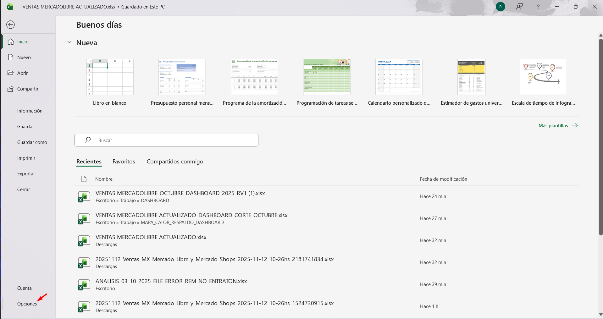
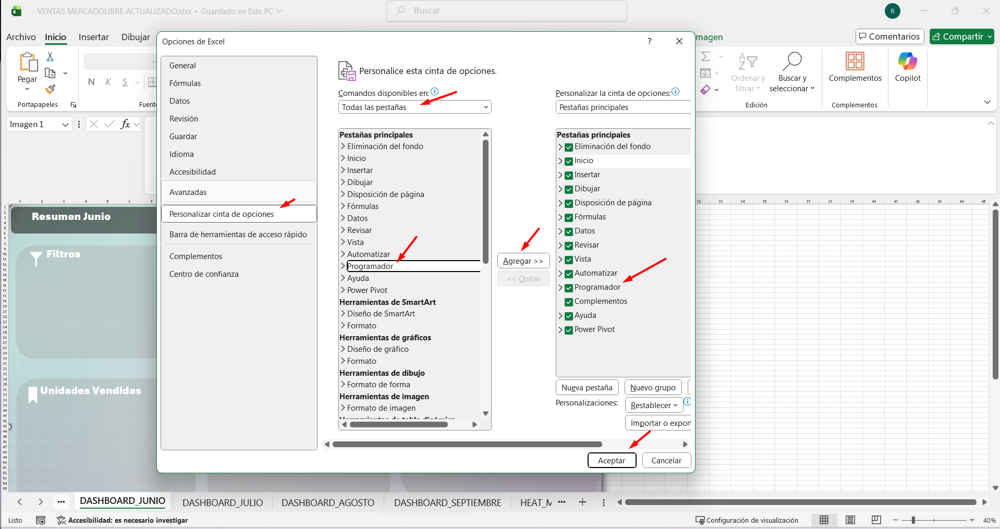
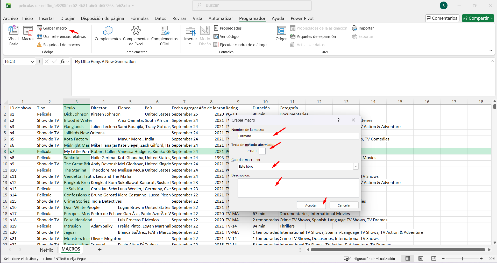
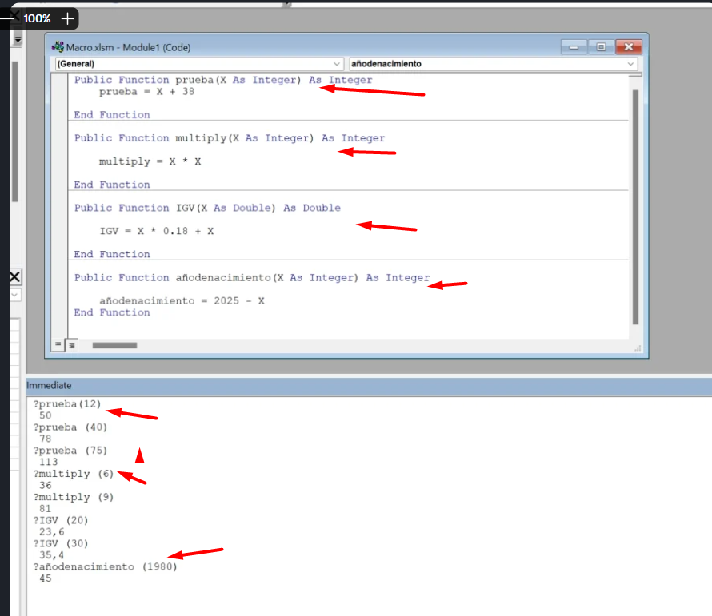
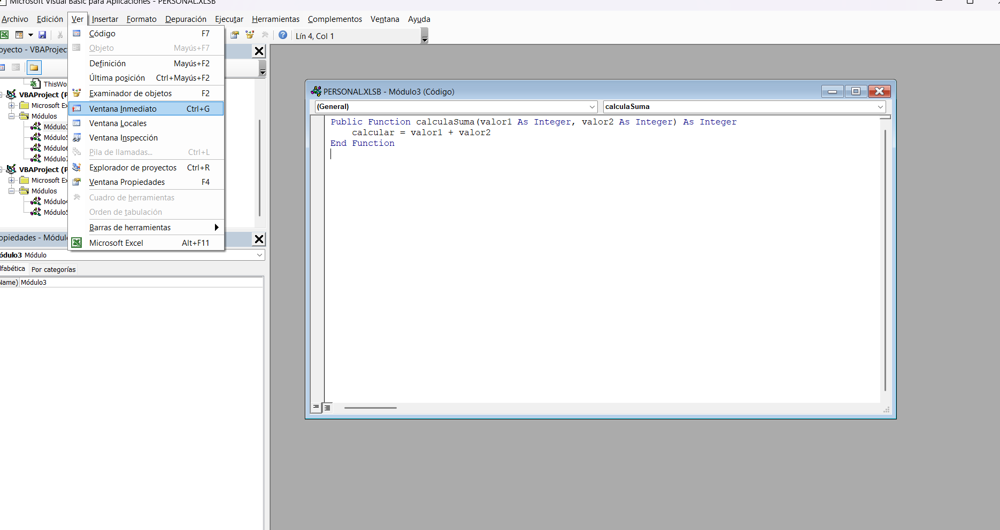

# Curso de Excel Avanzado con Macros 🚀

> Automatiza tareas avanzadas en Excel con el poder de las macros y Visual Basic. Desde crear funciones y subrutinas hasta utilizar ciclos y condicionales, optimiza tus hojas de cálculo y multiplica tu productividad.

| Detalle | Información |
| :--- | :--- |
| **Publicado el** | Publicado el 19 de octubre de 2022 |
| **Profesor** | Annie Parente Dodero |
| **Fecha de Inicio** | 06/11/2025 |
| **Fecha de Fin** |  |

## CLASE 01: Macros y Visual Basic en Excel Avanzado

**¿Qué son las macros y cómo pueden revolucionar tu uso de Excel?**

Las macros son secuencias de acciones automatizadas que puedes ejecutar tantas veces como lo necesites. ¿Te imaginas tener que dar el mismo formato, eliminar columnas, o agregar fórmulas repetidamente cada día? Con macros, estas tareas repetitivas se automatizan, acelerando significativamente tu productividad y reduciendo los errores humanos.


- Aprender macros: una inversión de tiempo que transforma tu día a día
- Ahorro de tiempo: Al automatizar tareas tediosas, los profesionales pueden enfocarse en análisis más complejos y decisiones estratégicas.
- Reducción de errores: Al realizar tareas automáticamente, la probabilidad de errores humanos disminuye.
- Consistencia: Garantiza que las tareas se realicen del mismo modo cada vez, manteniendo la calidad y el formato del trabajo.


**¿Qué es Visual Basic for Applications (VBA) y por qué es fundamental?**

Visual Basic for Applications (VBA) es el lenguaje de programación utilizado por Microsoft para personalizar y automatizar tareas en sus aplicaciones, incluyendo Excel. Es mediante este entorno que se pueden crear macros, subrutinas y funciones, personalizando Excel más allá de sus capacidades por defecto.

- Conociendo el entorno VBA: ¿Cómo empezar?
- Grabación de macros: Permite capturar secuencias de acciones exactas en Excel sin necesidad de conocer código.
- Creación desde cero: Programar desde cero permite personalizar hasta el más mínimo detalle.
- Subrutinas y funciones: Con el conocimiento de VBA, se pueden crear potentes subrutinas (secuencias de comandos que ejecutan tareas específicas) y funciones para manipular y analizar datos de maneras más sofisticadas.


## CLASE 02: 


## CLASE 03: 


## CLASE 04: 


## CLASE 05: 


## CLASE 06: Automatización de Tareas con Macros en Excel


**¿Qué es grabar y correr macros en Excel?**
Grabar macros en Excel es una manera efectiva de automatizar tareas repetitivas, ahorrando tiempo y esfuerzo considerable. Al grabar una macro, registras una secuencia de acciones que posteriormente puedes repetir con un simple comando. Esto es especialmente útil para tareas como descargar archivos regularmente y darles un formato, realizar operaciones matemáticas, o modificar celdas y columnas.

**¿Cómo iniciar con las macros?**
Para empezar a trabajar con macros, necesitas un documento de Excel que esté habilitado para macros (.xslm). Este formato permite que tus macros se ejecuten correctamente. Al abrir el documento, asegúrate de que el formato es amigable y cómodo para trabajar. Si trabajarás frecuentemente con este archivo, considera grabar una macro para facilitar el proceso de formateo.

**¿Cómo grabar una macro?**
Sigue estos pasos para grabar una macro en Excel:

Duplicar la hoja: Antes de comenzar, haz una copia de tu hoja de trabajo. Esto te permitirá mantener la información original e intentar nuevamente si es necesario.
Acceder a la ficha Programador: Dirígete al menú 'Inicio' y selecciona 'Programador'. Aquí encontrarás el botón 'Grabar Macro'.
Asignar nombre y atajo: Al darle clic a 'Grabar Macro', se abrirá una ventana para que asignes un nombre, como "Formato". Puedes también establecer un atajo para ejecutar la macro rápidamente.
Elegir dónde guardar: Decide el libro donde se guardará tu macro. Es recomendable elegir el mismo libro en el que estás trabajando.
Descripción de la macro: Asegúrate de añadir una descripción corta explicando la función de la macro. Esto es útil si deseas compartir o referenciar la macro más adelante.
Realizar acciones: Comienza a realizar las acciones que deseas automatizar. Por ejemplo, ajustar el ancho de las columnas, aplicar negritas a los encabezados, centrar texto, y ocultar información innecesaria.
Finalizar grabación: Una vez finalizadas las acciones, selecciona la celda final, ve a la ficha 'Programador' y selecciona 'Detener Grabación'.


**PRIMERO HABILITAMOS LA PESTAÑA DE PROGRAMDOR**
- PASO 1: 

- PASO 2: 

**segundo iniciamos esta macro para tareas repetitivas**
- PASO 1: -

- PASO 2: Lo curioso de las macros es podemos hacer nuestra actividad normal de manera cotidiana pegar, mover, crear celda cambiar formato etc y luego guardarla para luego ejecutarla en una hoja 

- PASO 3: 

**PRACTICA**

**GENERO Y VALIDO FORMULAS**
=IZQUIERDA(FC[-1], HALLAR(" ", FC[-1], HALLAR(":", FC[-1])-3)-1)
> 11 de noviembre de 2025 

=SUSTITUIR(IZQUIERDA(FC[-1], HALLAR(" ", FC[-1], HALLAR(":", FC[-1])-3)-1), " de ", " ")
> 11 noviembre 2025
=FECHANUMERO(SUSTITUIR(IZQUIERDA(FC[-1], HALLAR(" ", FC[-1], HALLAR(":", FC[-1])-3)-1), " de ", " "))
> 45972
=TEXTO(FECHANUMERO(SUSTITUIR(IZQUIERDA(FC[-1], HALLAR(" ", FC[-1], HALLAR(":", FC[-1])-3)-1), " de ", " ")), "dd/mm/yyyy")

**BUSCAR LIBRO ORIGINAL**
- C:\Users\GlenaCDNP-Leonard\AppData\Roaming\Microsoft\Excel\XLSTART
> AQUI ES DONDE SE GUARDAN TODAS LAS MACROS QUE SE GENERA SOLO SI LAS GUARDAS EN LIBRO PERSONAL AUNQUE LA PUEDES GUARDAR EN UN EXCEL PARTICULAR PERO SOLO SE VE EN ESE EXCEL ES MEJOR GUARDARLO EN EL SISTEMA 


**GENERALMENTE ESTA BLOQUEADO**
> VISTA > MOSTRAR TODO 


```BD
**CÓDIGO DE LA MACRO** 

Sub FORMATO_CELDA_FECHA_NUBE_V1()
'
' FORMATO_CELDA_FECHA_NUBE_V1 Macro
' FORMATO_CELDA_FECHA_NUBE_V1
'

'
    Rows("1:5").Select
    Selection.Delete Shift:=xlUp
    Columns("B:B").Select
    Columns("B:B").EntireColumn.AutoFit
    Columns("C:C").Select
    Selection.Insert Shift:=xlToRight, CopyOrigin:=xlFormatFromLeftOrAbove
    Range("C2").Select
    ActiveCell.FormulaR1C1 = _
        "=DATEVALUE(SUBSTITUTE(LEFT(RC[-1], SEARCH("" "", RC[-1], SEARCH("":"", RC[-1])-3)-1), "" de "", "" ""))"
    Range("C2").Select
    Selection.AutoFill Destination:=Range("C2:C751")
    Range("C2:C751").Select
    Columns("C:C").Select
    Selection.NumberFormat = "m/d/yyyy"
    Range("C2").Select
    ''' SELECCIONA Y ELIMINA
    Columns("Z:BM").Select
    Selection.Delete Shift:=xlToLeft

End Sub
```


## CLASE 07:  Sintaxis de Funciones y Subrutinas en Visual Basic

**¿Cuál es la diferencia entre funciones y subrutinas en VBA?**
- Las funciones y subrutinas son dos elementos fundamentales en VBA que sirven propósitos distintos:
- Las funciones están diseñadas para realizar cálculos y devolver un resultado específico
- Las subrutinas ejecutan acciones en el documento sin necesidad de retornar valores

**¿Cómo se define la accesibilidad de una función o subrutina?**
- La accesibilidad determina desde dónde se puede utilizar nuestro código:

- Public: permite que la función sea accesible desde cualquier módulo del documento
- Private: restringe el uso de la función al módulo donde fue creada
- Si no se especifica, por defecto será pública

**¿Cuáles son los elementos esenciales de la sintaxis?**
Para escribir correctamente una función o subrutina, debemos incluir:

- Declaración de accesibilidad (Public/Private)
- Tipo de procedimiento (Function/Sub)
- Nombre descriptivo que refleje su propósito
- Parámetros necesarios entre paréntesis
- Tipo de dato que devolverá (solo para funciones)
- Cierre con End Function o End Sub

**¿Qué buenas prácticas debemos seguir al programar en VBA?**
- La claridad y organización del código son esenciales para su mantenimiento:

**¿Cómo nombrar nuestras funciones y subrutinas?**
- Usar nombres descriptivos que reflejen la acción o resultado
- Evitar nombres genéricos o poco claros
- Mantener consistencia en el estilo de nombrado

**¿Cómo estructurar el código visualmente?**
- Utilizar la tecla Tab para crear sangrías lógicas
- Separar bloques de código relacionados
- Mantener un formato consistente en todo el proyecto


## CLASE 08:  Creación de Funciones en Visual Basic para Excel

**¿Cómo crear una función en Visual Basic?**

Crear una función en Visual Basic es un proceso metódico que empieza por la definición de un problema que necesitas resolver. Por ejemplo, calcular un año después de agregar un número fijo al año actual.

**¿Cuáles son los pasos para definir una función básica?**

Definir la función y sus parámetros: Declara una función pública en tu módulo que contemple un número entero como atributo de entrada y que devuelva un número entero.
Definir la operación: Realiza la operación deseada, como sumar un valor fijo al atributo de entrada.
Asegurar la corrección técnica: Comprueba que la función está correctamente configurada. Visual Basic proporciona señales visuales para posibles errores, como el subrayado en rojo.
Guardar el resultado: El resultado de la operación debe ser asignado al nombre de la función para retornar el valor esperado.

**¿Cómo se puede probar la función?**
Para verificar la funcionalidad correcta de tu función dentro de Visual Basic, usa la ventana "Inmediato" (disponible en el menú "Ver"). Allí:

Utiliza un signo de interrogación seguido del nombre de tu función.
Introduce un valor numérico que se ajusta al tipo de dato esperado.
Presiona Enter para ver el resultado calculado.
Este método es inmediato para verificar la función con diferentes parámetros, asegurando su correcto funcionamiento.

**¿Cómo usar la función en Excel?**
Una vez definida en Visual Basic, la función personalizada puede ser integrada en Excel. Esto te permite ampliar el potencial de tus hojas de cálculo al utilizar operaciones específicas no disponibles en las funciones estándar de Excel.

Implementar la función: Escribe igual ( = ) y el nombre de tu función en una celda de Excel, selecciona o ingresa el parámetro adecuado.
Verificación del resultado: Excel devolverá el cálculo basado en la lógica definida en Visual Basic, tal como lo verías en el entorno de desarrollo.

**¿Qué hacer en caso de ingresar datos incorrectos?**
Visual Basic maneja los errores redondeando valores erróneos al tipo esperado. Por ejemplo, si ingresas un decimal cuando se espera un entero, este se redondeará automáticamente. Esto garantiza que las funciones permanezcan robustas ante entradas inesperadas.

**¿Cuál es el siguiente paso en el aprendizaje de Visual Basic?**
Te animamos a aplicar lo aprendido creando una función propia, como calcular el cuadrado de un número. Este ejercicio te ayudará a familiarizarte más con la sintaxis y lógica del lenguaje. ¡Comparte tus resultados para seguir mejorando y compartir tus avances! Con práctica continua, te volverás cada vez más competente y eficiente en el uso de Visual Basic.

**PRACTICA**




```VB

Public Function calculaSuma(valor1 As Integer, valor2 As Integer) As Integer
    calculaSuma = valor1 + valor2
End Function


Public Function calculaResta(valor1 As Integer, valor2 As Integer) As Integer
    calculaResta = valor1 - valor2
End Function

Public Function calculaMulti(valor1 As Integer, valor2 As Integer) As Integer
    calculaMulti = valor1 * valor2
End Function

Public Function calculaDivision(valor1 As Integer, valor2 As Integer) As Integer
    If valor2 > 0 Then
        calculaDivision = valor1 / valor2
    Else
        calculaDivision = 0
    End If
End Function


?calculaSuma(10,10)
 20 
?calculaResta(100,30)
 70 
 ?calculaDivision(2,0) 
 0 

```
## CLASE 09:  Creación de Subrutinas en Visual Basic para Excel

**¿Cómo se crea una subrutina en Visual Basic para Excel?**

El manejo de subrutinas en Visual Basic para Excel es una habilidad que diferencia a un usuario casual de uno avanzado. Las subrutinas permiten automatizar tareas repetitivas y mejorar la eficiencia en la gestión de datos. En esta guía, aprenderás a crear tu primera subrutina y a entender las bases que te permitirán expandir tus habilidades en programación dentro del ecosistema de Excel.

**¿Qué es una subrutina y cómo se diferencia de una función?**

Una subrutina es un bloque de código que ejecuta una serie de instrucciones en Excel sin devolver un resultado directo, a diferencia de las funciones que sí lo hacen. En su lugar, el impacto de una subrutina se ve reflejado en las acciones que realiza, tales como manipular celdas, hojas o rangos dentro del libro de Excel.

Ventajas de las Subrutinas:
No consumen recursos devolviendo un resultado innecesario.
Son ideales para tareas automáticas y procedimientos de manejo de datos dentro del documento.

**¿Cómo iniciar un archivo para trabajar con subrutinas?**
Para empezar a trabajar con subrutinas, necesitas abrir un archivo de Excel habilitado para macros. Esto es crucial para asegurarse de que todo el trabajo quede guardado y pueda ser ejecutado sin problemas futuros. En el entorno de Visual Basic, las subrutinas se encuentran dentro de módulos, donde puedes organizarlas según tus necesidades.

Consejos para la organización de módulos:
Uso de Comentarios: Incluir comentarios en tu código es una buena práctica que te ayudará a documentar lo que hace cada segmento de tu programación, facilitando la comprensión futura del código.
Modularización: Crear varios módulos si la carga de subrutinas y funciones lo justifica, así mejorarás el orden y legibilidad del código.


**¿Cómo redactar una subrutina básica?**
Para comenzar a escribir una subrutina, lo primero es definir si será pública o privada. Las subrutinas públicas pueden ser llamadas desde diferentes lugares del proyecto, mientras que las privadas están limitadas al módulo donde se encuentran.
```VB
Public Sub prueba2()
    ' Subrutina básica sin argumentos.
End Sub
```

**¿Cómo trabajar con celdas y rangos en subrutinas?**
Una de las tareas fundamentales de las subrutinas es la manipulación de celdas y rangos. Esto implica hacer referencia a celdas específicas, manipular rangos de datos o realizar cálculos dentro del libro.

Referenciar una Celda:
```VB
Cells(1, 1).Value = "Hola, mundo"
Manipular un Rango:

Range("B2:C3").Value = "Platzi es lo mejor"
```
Es importante recordar que los nombres de celdas en Visual Basic usan un formato numérico, donde las filas y columnas tienen números asociados.

**¿Cómo especificar la hoja en la que se ejecutará la subrutina?**
En muchas ocasiones, necesitarás que las acciones de la subrutina se ejecuten en hojas específicas, especialmente cuando trabajas con documentos de Excel que contienen múltiples hojas.

Seleccionar una hoja específica:
Sheets("Hoja2").Select
Este ejemplo asegura que la subrutina se ejecute en la hoja "Hoja2", incluso si estás visualizando otra hoja al momento de ejecutar el código.

**¿Cómo ejecutar y probar una subrutina?**
Finalmente, una parte esencial del desarrollo de subrutinas es la validación y ejecución del código. Puedes correr tu subrutina desde el entorno de Visual Basic utilizando el botón de "Correr" o mediante la tecla F5.

Al finalizar estos pasos, deberías tener una comprensión básica y la habilidad para crear subrutinas efectivas en Visual Basic para Excel. Te invito a que pruebes lo aprendido, experimentando y perfeccionando estas técnicas. Expande tus conocimientos y comparte tus resultados para seguir aprendiendo. ¡El mundo de la programación en Excel te espera!


**PRACTICA**
```VB
'GENERACIÓN DE SUBRUTINAS'

Public Sub tareaSub()
    Sheets("Hoja1").Select
    Cells(1, 1) = "Hola mundo"
    Range(Cells(2, 6), Cells(3, 6)) = "Hola mundo con un rango de (2,3)(3,6)"
    Range("A3:A6") = "Excel"
End Sub

```
## CLASE 10: Uso de MessageBox en Visual Basic para Mostrar Resultados

**¿Cómo implementar message box en Visual Basic?**
> La implementación de message box en Visual Basic requiere una estructura específica que permite mostrar mensajes personalizados al usuario. El proceso comienza con la creación de una función básica:

- Definir una función pública
- Establecer los argumentos necesarios
- Implementar la lógica de la función
- Agregar el message box

**¿Cuál es la sintaxis correcta para crear un message box?**
Para implementar un message box efectivo, es necesario seguir estos pasos:

- Declarar una variable utilizando "dim"
- Asignar el message box a la variable declarada
- Utilizar la estructura: MsgBox(prompt, buttons, title)
- El prompt es el mensaje principal, buttons define el tipo de botones a mostrar, y title establece el encabezado de la ventana emergente.

**¿Cómo personalizar el contenido del message box?**
La personalización del message box permite crear mensajes más informativos y profesionales:

- Combinar texto y variables utilizando el operador ampersand (&)
- Seleccionar diferentes tipos de botones según la necesidad
- Agregar títulos descriptivos para contextualizar el mensaje
- Incluir información dinámica basada en los resultados de la función

**¿Cuáles son las aplicaciones prácticas del message box?**
El message box es una herramienta versátil que puede utilizarse en diversos escenarios:

- Mostrar resultados de operaciones matemáticas
- Presentar mensajes de error
- Proporcionar información de estado
- Solicitar confirmación del usuario

```VB
Public Function calculaDivision(Numerador As Integer, Denominador As Integer) As Double
    Dim a
    Sheets("Hoja1").Select
    If Denominador > 0 Then
        calculaDivision = Numerador / Denominador
    Else
        a = MsgBox("El resultado de la division no puede ser cero", , "Division")
    End If
End Function
```

## CLASE 11:  Input Box en Visual Basic: Solicitar Datos al Usuario

**¿Qué es un Input Box y cómo se utiliza?**
Un Input Box es una ventana emergente que permite solicitar al usuario que ingrese un valor o dato específico.

Para implementarlo:

Se recomienda definir una variable para almacenar el valor que el usuario proporcionará.
Esta variable debe declararse utilizando Dim seguido del nombre de la variable y su tipo de dato, como por ejemplo, Dim numerador As Integer.
Se emplea la función InputBox, que abre la caja de texto emergente.
Ejemplo de sintaxis básica:

Dim numerador As Integer
numerador = InputBox("Escribe el numerador", "División")

**¿Cómo alojamos el resultado de un Input Box?**
Es crucial almacenar el dato ingresado por el usuario en una variable adecuada.

Antes de la llamada a InputBox, declaramos nuestra variable.
Usamos un signo de igualdad (=) antes de la función InputBox para asignar el valor ingresado por el usuario.
Por ejemplo:

numerador = InputBox("Escribe el numerador", "División")

**¿Por qué usar Input Boxes en subrutinas?**
Cuando desarrollamos subrutinas, estas no admiten argumentos como las funciones. Por tanto, el Input Box juega un papel clave pidiendo directamente al usuario los datos necesarios:

Declarar las variables necesarias para la operación.
Solicitar los datos a través del InputBox.
Realizar operaciones y mostrar resultados utilizando estas entradas.
Ejemplo de una subrutina para divisiones:

Public Sub DivS()
    Dim num As Integer
    Dim den As Integer
    
    num = InputBox("Ingrese el numerador", "División")
    den = InputBox("Ingrese el denominador", "División")
    
    MessageBox.Show "El resultado de la división es " & (num / den), "División"
    
End Sub

Promoviendo la interacción: Beneficios de las ventanas emergentes
El uso de ventanas emergentes, como el Input Box, no solo personaliza la experiencia del usuario, sino que también asegura que las operaciones se basen en datos relevantes y específicos introducidos por el mismo. Esta técnica es particularmente beneficiosa en:

Automatización de tareas: Cuando se requiere repetir una acción con distintos datos, reduciendo así el margen de error.
Acercamiento educativo: En contextos académicos, donde se necesita la entrada del usuario para operaciones matemáticas, científicas o administrativas.

**PRACTICA**
```VB
Public Function Divf() As Double

    Dim a
    Dim num As Integer
    Dim den As Integer
    
    num = InputBox("Ingrese el numerador", "División")
    den = InputBox("Ingrese el denominador", "División")
    Divf = num / den
    a = MsgBox("El resultado de la división es " & Divf, "División")
    
End Function


Public Sub DivS()
    Dim a
    Dim num As Integer
    Dim den As Integer

    num = InputBox("Ingrese el numerador", "División")
    den = InputBox("Ingrese el denominador", "División")
    
    a = MsgBox("El resultado de la división es " & num / dev, , "División")
    
End Sub
```
## CLASE 12:  Uso de Select Case en Visual Basic para Condicionales

**¿Qué es Select Case y cómo se utiliza?**
En el mundo de la programación, ser capaz de manejar diferentes casos o escenarios es esencial. Aquí es donde el uso de Select Case se convierte en una herramienta poderosa en tus funciones y subrutinas dentro de Visual Basic. Este bloque de control permite especificar múltiples condiciones para una variable, otorgándote el control de qué instrucciones ejecutar con base en el valor de dicha variable. Al realizar un análisis exhaustivo de todos los posibles casos que pueda tomar una variable dentro de tu función, puedes asegurar un flujo lógico y sin errores en tu código.

**¿Cómo se estructura una función con Select Case?**

Para comenzar a implementar Select Case, es necesario definir una función que reciba argumentos y devuelva un resultado. Un ejemplo común es el uso de una función llamada sc, que debe recibir tres números enteros, sumarlos y determinar si la suma es negativa, cero o positiva. Este es el proceso detallado para configurarla:

Definición de la función: Escribe Public Function sc con tres parámetros: a, b y c.
Variable de suma: Define a través de Dim suma as Integer una variable que almacenará la suma de a, b y c.
Uso de Select Case: Implementa Select Case suma para evaluar el valor de la suma y escribe los diferentes cases:
Case Is < 0: Significa que la suma es negativa.
Case Is = 0: Indica que la suma resulta en cero.
Case Else: Captura los casos en que la suma es positiva, siendo exhaustivos en todos los posibles resultados.

**¿Cuáles son las mejores prácticas para utilizar Select Case?**
Utilizar Select Case adecuadamente implica seguir algunas prácticas recomendadas que asegurarán que tu código sea claro y eficiente:

Exhaustividad en casos: Asegúrate de considerar todos los posibles valores y situaciones en los cases. Utiliza Case Else para cubrir cualquier valor que no haya sido contemplado previamente.
Comentarios claros: Incluye comentarios en el código que expliquen cada sección de los cases, lo que resulta útil para el mantenimiento y comprensión del código a largo plazo.
Validación de datos: Antes de ingresar los datos en la función, es importante validarlos para evitar resultados inesperados.

**¿Cómo puedo probar la función Select Case?**
Una vez que has creado tu función, la prueba es clave para asegurarse de que todos los casos se ejecutan correctamente. Esto se puede hacer utilizando la ventana inmediata de Visual Basic:

- Prueba para valores negativos: Probar con CondicionalSC(-8, 5, 0) debería devolver "negativo".
- Prueba para suma igual a cero: Con CondicionalSC(2, -1, -1) debe regresar "cero".- 
- Prueba para valores positivos: Al usar CondicionalSC(3, 4, 5), la función debería dar como resultado "positivo".

**PRACTICA**
```VB
'GENERACIÓN DE CONDICIONALES Select Case'

Public Function CondicionalSC(numA As Integer, numB As Integer, numC As Integer) As String
    Dim suma As Integer
    
    suma = numA + numB + numC
    
    Select Case suma
        Case Is < 0
            CondicionalSC = "Negativo"
        Case Is = 0
            CondicionalSC = "Cero"
        Case Is > 0
            CondicionalSC = "Positivo"
        Case Else
            CondicionalSC = "Ni Idea que demonios metiste"
    End Select
End Function


Public Sub ClasificarEdad()

    Dim edad As Integer
    
    edad = InputBox("Ingresa tu edad:", "Clasificación de Edad")
    
    Select Case edad
    
    Case 0 To 12
    
    MsgBox "Eres un niño"
    
    Case 13 To 17
    
    MsgBox "Eres un adolescente"
    
    Case 18 To 59
    
    MsgBox "Eres un adulto"
    
    Case 60 To 99
    
    MsgBox "Eres un adulto mayor"
    
    Case Else
    
    MsgBox "Edad inválida"
    
    End Select

End Sub

```
## CLASE 13: Condicionales IF-THEN en Visual Basic: Funciones y Ejercicios Prácticos

**¿Qué es la instrucción if-then y cómo se utiliza?**

La instrucción IF-THEN es una herramienta fundamental en la programación que permite ejecutar acciones específicas si se cumple una determinada condición. En esencia, se estructura como: "si ocurre esto, entonces haz aquello". Esta instrucción es clave para implementar condicionales y tomar decisiones en función de los datos disponibles, permitiendo mayor control y flexibilidad en los programas.

En Visual Basic, por ejemplo, puedes emplear IF-THEN para decidir si el valor de un dado es par o impar. Esto se hace utilizando funciones y variables que determinan el valor y, posteriormente, evalúan la condición para ejecutar la acción correspondiente.

**¿Cómo crear una función para un dado en Visual Basic?**
La creación de una función en Visual Basic requiere definir claramente los pasos y decisiones que deseas implementar. Aquí te brindamos una guía para programar una función que simule el lanzamiento de un dado y determine su resultado como par o impar.

Definir la función y las variables:

Crea una función llamada "dado" que no requiere argumentos ya que los lanzamientos de un dado son aleatorios.
Define la variable para almacenar el valor del dado, por ejemplo, usa vd como dim vd as integer.
Generar el valor aleatorio:

Visual Basic tiene una función random para obtener un número aleatorio entre 0 y 1.
Ajusta este valor multiplicándolo por 6 y sumando 1 para que resulte en un número entero entre 1 y 6: int(random * 6 + 1).
Implementar la condición IF-THEN:

Utiliza IF-THEN para comprobar si el valor del dado es par. Por ejemplo, comprueba si vd es igual a 2, 4 o 6 para considerarlo par: if vd = 2 or vd = 4 or vd = 6 then dado = "par".
Usa else para otros valores y considera que el dado es impar: else dado = "impar".
Probar y visualizar el resultado:

Prueba la función en el entorno de desarrollo para verificar su correcto funcionamiento.
Usa un message box para mostrar el valor del dado.

**¿Cómo optimizar las condiciones con else if?**

El uso de else if optimiza el código al detener la evaluación una vez que una condición se cumple, lo cual es crucial en programas complejos o con grandes volúmenes de datos.

Reducir evaluación innecesaria:

Al usar solo if, cada condición se evalúa independientemente, lo que puede ser ineficiente. Else if asegura que no se sigan evaluando las condiciones una vez que se encuentra la correcta.
Estructurar cuidadosamente las condiciones:

Asegúrate de que las condiciones estén bien definidas para maximizar la eficiencia y claridad del código.
Buenas prácticas:

Indentar las acciones dentro de las estructuras condicionales para mejorar la legibilidad y mantenimiento.


**PRACTICA**

```VB
'GENERACIÓN DE CONDICIONALES IF THEN '

Public Function dado() As String

    Dim VD As Integer
    Dim a
    VD = Int((Rnd * 6) + 1)
    
    If VD = 2 Then
            dado = "Par"
        ElseIf VD = 4 Then
            dado = "Par"
        ElseIf VD = 6 Then
            dado = "Par"
        Else
            dado = "ImPar"
    End If
    a = MsgBox(VD, , "Dado")
End Function
```
## CLASE 14: Ciclos For Next en Visual Basic para Excel: Fibonacci Automático

**¿Cómo se utiliza el ciclo For Next en Visual Basic?**

El ciclo For Next en Visual Basic permite ejecutar una serie de instrucciones repetidamente mientras un contador se encuentra dentro de un rango determinado. Esto es crucial cuando necesitas automatizar tareas repetitivas, como llenar múltiples celdas en Excel con valores específicos o realizar un conteo hasta cierto número.

**¿Qué es la sucesión de Fibonacci y cómo se implementa con Visual Basic?**
La sucesión de Fibonacci es una serie de números que comienza con 1, seguida por otro 1, y cada número subsecuente es la suma de los dos anteriores. Implementar esta sucesión en Excel usando Visual Basic es una excelente manera de poner en práctica el ciclo For Next.

Definir Subrutinas y Variables:

Comienza definiendo una subrutina sin argumentos ni valores de retorno.
Establece variables, como un contador (Dim i As Integer) y el número de términos que quieres calcular (Dim n As Integer).
Crear un Input Box:

Utiliza un Input Box para solicitar al usuario cuántos términos de la sucesión desea calcular:
n = InputBox("Elementos de la sucesión", "Fibonacci")
Configurar el Documento y Asignar Valores Iniciales:

Decide desde dónde comenzarás a vaciar la información en tu hoja activa, generalmente desde la celda A1.
Las primeras dos entradas deberán ser asignadas manualmente, ya que siempre son 1s:
Cells(1, 1) = 1
Cells(2, 1) = 1
Implementar el Ciclo For Next:

Iniciar el ciclo desde 3, puesto que los dos primeros valores están definidos:
For i = 3 To n
Calcula cada elemento como la suma de los dos anteriores:
Cells(i, 1) = Cells(i - 1, 1) + Cells(i - 2, 1)
Finaliza el ciclo con Next i para pasar al siguiente término.

**¿Cómo verificar el funcionamiento correcto de la subrutina?**

Puedes ejecutar la subrutina y recibirás un prompt preguntando cuántos términos de la sucesión deseas realizar. Ingresando, por ejemplo, 20 te permitirá confirmar visualmente en Excel que los números aparecen correctamente. Incluso puedes verificar manualmente sumando los dos números anteriores y compararlos con el resultado.

**¿Cuándo es útil utilizar ciclos For Next?**
El ciclo For Next es extremadamente valioso cuando se trata de:

Poner formato: Aplicar estilos o formatos específicos en rangos definidos.
Manipulación masiva de datos: Insertar, modificar o eliminar grandes cantidades de datos de manera organizada.
Automatización: Realizar acciones repetitivas sin intervención manual, ahorrando tiempo y minimizando errores.

**¿Cómo iniciar tu propio proyecto usando ciclos For Next?**
Te invito a practicar implementando tus propias soluciones. Piensa en actividades diarias realizadas en Excel que se podrían simplificar mediante estos ciclos. Compártelas o reflexiona sobre sus beneficios en los comentarios, y sigue explorando la programación para seguir ampliando tus habilidades.


**PRACTICA**
```VB
'sub rutina'

Public Sub Fibonacci()
    Dim i As Integer
    Dim n As Integer
    
    n = InputBox("Elementos a iterar", "Fibonacci")
    
    Sheets("Hoja1").Select
    Cells(1, 1) = 1
    Cells(2, 1) = 1
    
    For i = 3 To n
        Cells(i, 1) = Cells(i - 1, 1) + Cells(i - 2, 1)
    Next i
End Sub
```

## CLASE 15:  Ciclos Do-While en Visual Basic: Suma de Dados hasta 100


**¿Qué es un ciclo do-while loop y cómo puedo usarlo?**
Un ciclo do-while loop es una estructura de control utilizada en programación para repetir una serie de instrucciones mientras se cumpla una determinada condición. Este tipo de bucle resulta muy útil en situaciones donde se necesita ejecutar un bloque de código al menos una vez, porque la condición se evalúa después de ejecutar el bloque. En este contexto, exploraremos cómo usar el ciclo do-while loop en Visual Basic para resolver un problema interesante: determinar cuántos tiros de un dado son necesarios para alcanzar una suma de 100 puntos.

**¿Cómo defino la función en Visual Basic?**
Antes de implementar el ciclo do-while loop, es crucial definir correctamente la función en Visual Basic. Para ello, se utiliza public function w como punto de partida. Esta función no toma argumentos y devuelve un número entero, lo que representa el número de tiros necesarios para alcanzar la suma deseada. Este enfoque inicial sienta las bases para abordar problemas complejos de manera ordenada.

**¿Qué variables necesito para el proceso?**
Las variables son el corazón de cualquier programa. En este caso, se identifican tres variables esenciales:

Dado: Representa el valor de cada tiro, definido como un número entero entre 1 y 6.
Contador (i): Rastreará cuántas veces se ha tirado el dado.
Suma (s): Almacena la suma acumulada de los resultados de los dados.
Definir estas variables adecuadamente asegura una implementación fluida y precisa del ciclo.

**¿Cómo implementar el ciclo do-while loop en Visual Basic?**
El ciclo do-while se inicia con la instrucción do while s < 100, donde s es la suma acumulada. Esta estructura permite a los programadores ejecutar bloques de código hasta que la suma alcance o supere el valor de 100. Cada iteración incluye un paso fundamental: sumar el resultado del dado actual a la suma total y aumentar el contador.

Una característica valiosa del ciclo do-while loop es su capacidad para repetir instrucciones sin necesidad de numerosos bloques de código manual, lo que simplifica significativamente la cantidad de trabajo y reduce errores.

**¿Cómo asignar valores aleatorios al dado?**
Para simular un dado, se usa la función worksheet function.random between(1, 6), que genera un número aleatorio entre 1 y 6. Este método se integra de manera eficiente en Visual Basic y otorga un valor auténtico a cada tiro de dado. Al emplear esta función, se garantiza que cada ronda de tiro sea única, lo que realza el carácter aleatorio del juego.

**¿Por qué es importante devolver el resultado del contador?**
El valor final del contador indica cuántas veces fue necesario lanzar el dado para alcanzar la suma de 100 puntos. Este es un aspecto crítico que se devuelve al final de la función, y se logra a través de la instrucción dw = i. Los usuarios pueden experimentar esta función directamente en Visual Basic, observando resultados que varían dinámicamente debido a la naturaleza aleatoria de los tiros de dados.

**¿Cómo probar y personalizar la función con diferentes objetivos?**
Probar la función en la ventana de inmediato de Visual Basic permite verificar la precisión y eficacia de la implementación. Realiza un reto adicional: adapta el código para que el usuario pueda elegir la suma objetivo, permitiendo un grado de personalización y análisis más profundo para distintos escenarios.

Ahora, te invitamos a que pongas a prueba este código en tu computadora y explores otras aplicaciones de los ciclos do-while loop. ¿Cómo adaptarías este enfoque para otros desafíos de programación? Comparte tus experiencias y descubrimientos en los comentarios, y sigue aprendiendo y ampliando tus habilidades de codificación.


**PRACTICA**
```VB
'sub rutina'

Public Sub Fibonacci()
    Dim i As Integer
    Dim n As Integer
    
    n = InputBox("Elementos a iterar", "Fibonacci")
    
    Sheets("Hoja1").Select
    Cells(1, 1) = 1
    Cells(2, 1) = 1
    
    For i = 3 To n
        Cells(i, 1) = Cells(i - 1, 1) + Cells(i - 2, 1)
    Next i
End Sub
```

## CLASE 16:

Una macro es una acción o un conjunto de acciones que se pueden ejecutar todas las veces que desees.
Verdadero
2.
¿Desde cuál pestaña se puede acceder al espacio de VBA?
Desde la pestaña Desarrollador, que no aparece por default en Excel, sino que se debe activar.
3.
¿Cuál de las siguientes afirmaciones es falsa?
Cuando se hace un diagrama de flujo, es importante que cuando se pone una condición, los posibles resultados sean exhaustivos.
**Repasar**

4.
¿Cuál de los siguientes NO es un tipo de dato?
Text
5.
¿Cuál de las siguientes afirmaciones es cierta para las funciones pero no para las subrutinas?
Tiene un valor de retorno.


6.
¿Cuál es la sintaxis correcta de una función?
Public/Private - Function - Nombre - (parámetros) - as Tipo de dato

7.
Al escribir " Function [nombre] (parámetros)" y dar enter, aparece automáticamente la línea de cierre que dice “End Function”

Verdadero
8.
Al crear una subrutina es necesario agregar argumentos.
Falso

9.
¿Qué es Message Box?
Es una función que muestra un mensaje en un cuadro de diálogo.

10.
Hablando de Input Box, ¿Cuál de las siguientes afirmaciones es falsa?
Se escribe Input.Box

11.
¿Cuándo utilizarías Select Case?
Cuando se ejecuta una acción o conjunto de acciones dependiendo el caso en el que corresponda el argumento.

12.
¿Cuándo utilizarías If - Then?
Cuando se necesita ejecutar una acción o conjunto de acciones dependiendo de si la expresión cumple con una condición.

13.
¿Cuándo utilizarías Ciclos For - Next?

Cuando se busca repetir una instrucción un número específico de veces.

14.
¿Cuándo utilizarías Ciclos Do While - Loop?

Cuando se busca que un ciclo se siga repitiendo mientras que una condición se cumple.

15.  Qué es Message Box?
Es una función que muestra un mensaje en un cuadro de diálogo.

16. ¿Para qué sirve la segmentación de datos?
Crear botones interactivos para filtrar datos.

17. ¿Cuál es la ventaja fundamental de usar referencias dinámicas como `ventas[importe]` en lugar de rangos fijos como `F2:F50` al realizar cálculos en Excel?
- Las referencias dinámicas hacen que las fórmulas sean más cortas y fáciles de leer.
**REPASAR** 


18. Si un informe de Excel es demasiado ancho para caber en una página al imprimirlo en orientación vertical, ¿cuál sería la combinación de ajustes más eficaz para presentarlo correctamente sin perder información?
- Utilizar la vista 'Ver saltos de página' para arrastrar manualmente el límite de la página hacia la derecha.
**REPASAR** 

19. Camila quiere crear una alerta que identifique cualquier gasto clasificado como 'prescindible' O como 'imprevisto' para marcarlo como 'Recortar gasto'. Si ninguna de estas dos condiciones se cumple, debe marcarse como 'Ok'. ¿Qué fórmula anidada debe usar para lograr esto correctamente?
- SI(Y(A2="prescindible"; B2="imprevisto"); "Recortar gasto"; "Ok")
**REPASAR** 


20. Al usar la función ÍNDICE, ¿por qué es crucial que la matriz de datos seleccionada excluya los encabezados de fila y columna?

Porque los encabezados suelen ser texto y la función ÍNDICE solo puede devolver valores numéricos.

**REPASAR** 
